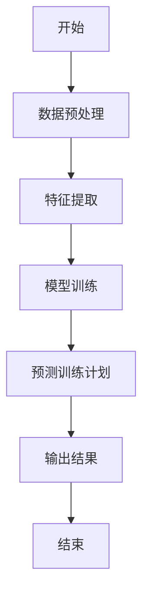
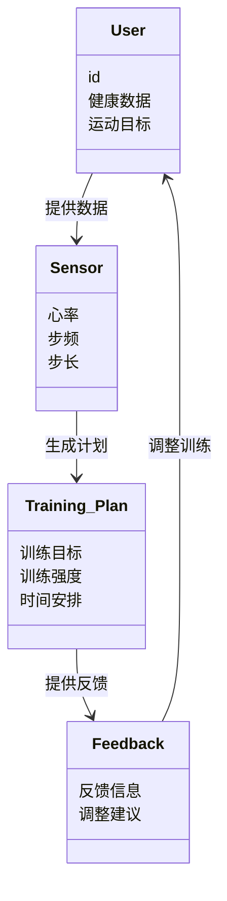
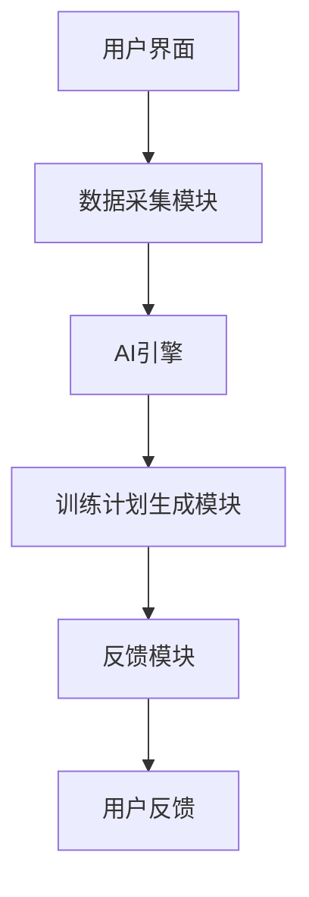

                 


# 智能跑步机：AI Agent的个性化训练计划生成器

> 关键词：智能跑步机，AI Agent，个性化训练计划，机器学习，运动数据分析，实时反馈

> 摘要：本文探讨了如何利用AI Agent技术，通过数据分析和机器学习算法，为用户提供个性化的跑步训练计划。文章详细介绍了AI Agent的核心原理，分析了系统架构，展示了如何通过传感器数据和用户输入生成动态调整的训练计划。通过实际案例分析和代码实现，本文为智能跑步机的设计和实现提供了理论支持和技术指导。

---

## 第一部分: 智能跑步机与AI Agent的背景与概念

### 第1章: 背景介绍

#### 1.1 问题背景
- **传统跑步机的局限性**：传统跑步机功能单一，无法根据用户的实时数据调整训练计划，难以满足个性化需求。
- **现代用户需求的变化**：现代用户希望训练计划能够根据个人健康状况、运动目标和实时反馈动态调整。
- **AI技术的潜力**：AI技术能够通过数据分析和机器学习，为用户提供个性化的运动建议，提升训练效果。

#### 1.2 问题描述
- **用户需求多样性**：不同用户的健康状况、运动目标和运动能力各不相同，统一的训练计划难以满足个性化需求。
- **传统训练计划的不足**：传统训练计划通常是静态的，无法根据用户的实时反馈和环境变化进行调整。
- **如何通过AI实现个性化**：AI Agent可以通过实时数据分析和机器学习算法，动态生成个性化训练计划，提升用户体验。

#### 1.3 问题解决
- **AI Agent的核心作用**：AI Agent能够实时采集用户数据，分析运动表现和健康状况，生成个性化训练计划。
- **数据驱动的个性化训练计划**：通过收集和分析用户的运动数据，AI Agent可以为用户提供科学的训练建议。
- **实时反馈与调整机制**：AI Agent能够根据用户的实时反馈动态调整训练计划，确保训练效果最大化。

#### 1.4 边界与外延
- **系统的输入与输出边界**：输入包括用户的运动数据、健康状况和目标，输出包括个性化训练计划和实时反馈。
- **相关领域的联系与区别**：与智能健身设备、运动数据分析和个性化健康管理等领域密切相关，但更专注于AI驱动的个性化训练计划生成。
- **技术实现的可行性分析**：AI Agent结合物联网技术，通过传感器数据和用户输入，实现个性化训练计划的动态生成。

#### 1.5 核心要素组成
- **用户数据采集**：包括心率、步频、步长、运动时间和运动强度等数据。
- **AI算法实现**：通过机器学习算法分析数据，生成个性化训练计划。
- **个性化训练计划输出**：包括训练目标、训练强度、训练时间和训练内容等。

---

## 第2章: 核心概念与联系

### 2.1 核心概念原理
- **AI Agent的基本原理**：AI Agent通过感知环境、分析数据、制定策略和执行动作，帮助用户实现训练目标。
- **个性化训练计划的核心要素**：基于用户数据、运动目标和实时反馈，动态调整训练计划。
- **实时反馈机制**：通过传感器数据和用户输入，实时调整训练计划，确保训练效果和安全性。

### 2.2 实体关系图
```mermaid
erDiagram
    user [用户] 
    sensor [传感器数据] 
    training_plan [训练计划] 
    feedback [反馈机制]
    user --> sensor : 提供数据
    sensor --> training_plan : 生成计划
    training_plan --> feedback : 提供反馈
    feedback --> user : 调整训练
```

### 2.3 概念属性对比
| 概念 | 属性 | 描述 |
|------|------|------|
| 用户数据 | 输入类型 | 心率、步频、步长等 |
| 训练计划 | 输出类型 | 训练目标、强度、时间等 |
| 反馈机制 | 调整方式 | 实时反馈、动态调整 |
| AI Agent | 核心功能 | 数据分析、计划生成、反馈优化 |

---

## 第3章: 算法原理

### 3.1 算法选择与原理
- **基于K近邻算法的个性化训练计划生成**：通过分析用户的运动数据和健康状况，找到与之相似的用户群体，生成个性化的训练计划。

### 3.2 算法流程图


### 3.3 数学模型与公式
- **距离计算公式**：
  $$ distance = \sqrt{(x2 - x1)^2 + (y2 - y1)^2} $$
- **相似度计算公式**：
  $$ similarity = 1 - \frac{distance}{max\_distance} $$

---

## 第4章: 系统分析与架构设计

### 4.1 问题场景介绍
- **用户需求**：用户希望通过智能跑步机获得个性化的训练计划。
- **系统目标**：设计一个基于AI Agent的智能跑步机系统，能够实时采集用户数据，生成个性化训练计划。

### 4.2 系统功能设计


### 4.3 系统架构设计


---

## 第5章: 项目实战

### 5.1 环境安装
- **Python环境**：安装Python 3.8以上版本。
- **库的安装**：安装numpy、pandas、scikit-learn等库。

### 5.2 核心代码实现
```python
import numpy as np
import pandas as pd
from sklearn.neighbors import KNeighborsRegressor

# 数据预处理
data = pd.read_csv('training_data.csv')
X = data[['heart_rate', 'step_frequency', 'step_length']]
y = data['training_plan']

# 模型训练
model = KNeighborsRegressor(n_neighbors=3)
model.fit(X, y)

# 预测新的训练计划
new_user_data = np.array([[80, 140, 0.7]])
predicted_plan = model.predict(new_user_data)
print(predicted_plan)
```

### 5.3 代码解读
- **数据预处理**：读取CSV文件中的用户数据，并提取特征变量和目标变量。
- **模型训练**：使用K近邻回归模型训练模型，生成训练计划。
- **预测与输出**：输入新的用户数据，模型生成预测的训练计划。

### 5.4 实际案例分析
- **案例分析**：通过具体案例展示如何通过AI Agent生成个性化训练计划，并根据反馈动态调整。

---

## 第6章: 总结与展望

### 6.1 项目小结
- **核心内容回顾**：通过AI Agent和机器学习算法，实现个性化训练计划的生成和实时反馈。
- **系统优势**：能够根据用户的实时数据动态调整训练计划，提升用户体验。

### 6.2 注意事项
- **数据隐私**：用户数据的安全性和隐私保护是系统设计的重要考虑因素。
- **系统稳定性**：确保系统在高并发和复杂环境下的稳定性。

### 6.3 拓展阅读
- **相关技术**：进一步研究强化学习在训练计划生成中的应用。
- **未来研究方向**：探索多模态数据融合，提升训练计划的个性化和科学性。

---

作者：AI天才研究院/AI Genius Institute & 禅与计算机程序设计艺术/Zen And The Art of Computer Programming

