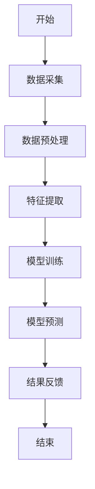

                 

# 第一部分: 智能运动服与AI Agent的背景与概念

## 第1章: 智能运动服的发展历程与应用场景

### 1.1 智能运动服的发展历程

#### 1.1.1 传统运动服的功能与局限
传统的运动服主要以提供基本的运动保护和舒适性为主，例如吸汗、透气等功能。然而，这些运动服缺乏智能化功能，无法实时监测用户的生理指标，也无法提供个性化的运动建议。其局限性主要体现在以下几个方面：
- 数据采集能力有限，无法实时监测心率、体温等关键生理指标。
- 缺乏智能化的分析能力，无法根据用户的运动状态提供实时反馈。
- 无法与其他智能设备联动，难以实现全面的运动健康管理。

#### 1.1.2 智能化技术的引入
随着物联网、人工智能和传感器技术的快速发展，智能运动服开始逐步引入智能化技术。这些技术包括：
- 多传感器融合：通过集成心率传感器、体温传感器、加速度传感器等多种传感器，实现对用户生理指标的全面监测。
- 无线数据传输：通过蓝牙、Wi-Fi等无线通信技术，将监测数据实时传输到手机、电脑等终端设备。
- 智能算法分析：通过机器学习和深度学习算法，对采集到的生理数据进行分析，提供个性化的运动建议和风险预警。

#### 1.1.3 当前智能运动服的发展现状
当前，智能运动服已经在市场上出现了一些商业化产品，主要集中在以下几个方面：
- 市场上出现了多种智能运动服，例如智能跑步服、智能游泳衣、智能瑜伽服等。
- 这些智能运动服通常集成了心率监测、体温监测、运动轨迹追踪等功能。
- 部分高端产品还能够与智能手环、智能手表等设备联动，实现全面的运动健康监测。

### 1.2 智能运动服的应用场景

#### 1.2.1 运动训练中的实时监测
智能运动服在运动训练中的应用主要体现在以下几个方面：
- 实时监测用户的生理指标，如心率、体温、运动强度等，帮助教练制定个性化的训练计划。
- 根据用户的生理数据，实时调整训练强度，避免运动过度或不足。
- 在运动过程中，通过AI Agent提供实时反馈，指导用户调整姿势、呼吸频率等。

#### 1.2.2 医疗健康领域的应用
智能运动服在医疗健康领域的应用主要体现在以下几个方面：
- 对于心脏病患者、高血压患者等特殊群体，智能运动服可以实时监测他们的生理指标，及时发现异常情况。
- 在康复训练中，智能运动服可以监测患者的运动状态，帮助医生制定个性化的康复计划。
- 在远程医疗中，智能运动服可以将患者的生理数据实时传输到医院，实现远程诊断和治疗。

#### 1.2.3 智能运动服在日常生活中的便利性
智能运动服不仅仅局限于运动场景，在日常生活中也有广泛的应用：
- 在日常锻炼中，用户可以使用智能运动服实时监测自己的运动数据，确保锻炼的安全性和有效性。
- 在日常生活中，智能运动服可以监测用户的体温、心率等生理指标，帮助用户了解自己的健康状况。
- 在特殊环境（如高原、寒冷地区）中，智能运动服可以实时监测用户的生理指标，确保用户的安全。

## 第2章: AI Agent在智能运动服中的核心作用

### 2.1 AI Agent的基本概念

#### 2.1.1 什么是AI Agent
AI Agent（人工智能代理）是指能够感知环境、自主决策并执行任务的智能实体。AI Agent在智能运动服中的作用是通过感知用户的生理指标和运动环境，自主决策并提供实时反馈。

#### 2.1.2 AI Agent的核心功能与特点
AI Agent在智能运动服中的核心功能包括：
- 数据采集与处理：通过集成多种传感器，实时采集用户的生理指标数据。
- 数据分析与决策：通过机器学习和深度学习算法，对采集到的数据进行分析，提供个性化的运动建议和风险预警。
- 自主决策与执行：根据分析结果，自主调整运动计划或提醒用户采取相应的措施。

AI Agent的特点包括：
- 智能性：能够自主感知和决策。
- 实时性：能够实时采集和分析数据。
- 个性化：能够根据用户的需求提供个性化的服务。

#### 2.1.3 AI Agent与传统传感器的区别
AI Agent与传统传感器的主要区别在于智能化程度和功能扩展性。传统传感器只能采集数据，无法进行数据分析和决策。而AI Agent不仅可以采集数据，还可以对数据进行分析和决策，并提供实时反馈。

### 2.2 AI Agent在智能运动服中的应用场景

#### 2.2.1 实时生理指标监测
AI Agent通过集成多种传感器，实时监测用户的生理指标，如心率、体温、运动强度等。这些数据可以用于评估用户的运动状态和健康状况。

#### 2.2.2 个性化运动建议
AI Agent可以根据用户的生理数据和运动目标，提供个性化的运动建议。例如，根据用户的心率和运动强度，调整训练计划，避免运动过度或不足。

#### 2.2.3 运动风险预警
AI Agent可以通过分析用户的生理数据，及时发现异常情况，并发出风险预警。例如，当用户的某项生理指标超出正常范围时，AI Agent可以立即提醒用户采取相应的措施。

## 第3章: 智能运动服的核心技术与实现原理

### 3.1 智能运动服的核心技术

#### 3.1.1 生理指标监测技术
生理指标监测技术是智能运动服的核心技术之一。通过集成心率传感器、体温传感器、加速度传感器等多种传感器，智能运动服可以实时监测用户的生理指标。

#### 3.1.2 AI Agent的智能分析与反馈
AI Agent通过机器学习和深度学习算法，对采集到的生理数据进行分析，并根据分析结果提供实时反馈。例如，AI Agent可以根据用户的心率和运动强度，调整训练计划。

#### 3.1.3 无线数据传输技术
无线数据传输技术是智能运动服的另一个核心技术。通过蓝牙、Wi-Fi等无线通信技术，智能运动服可以将监测数据实时传输到手机、电脑等终端设备。

### 3.2 智能运动服的实现原理

#### 3.2.1 数据采集与处理流程
智能运动服的数据采集与处理流程主要包括以下几个步骤：
1. 数据采集：通过传感器实时采集用户的生理指标数据。
2. 数据预处理：对采集到的数据进行清洗和特征提取。
3. 数据分析：通过机器学习和深度学习算法对数据进行分析，提取有用的信息。
4. 实时反馈：根据分析结果，提供实时反馈，如调整训练计划或发出风险预警。

#### 3.2.2 AI Agent的决策机制
AI Agent的决策机制主要包括以下几个步骤：
1. 数据输入：接收来自传感器的生理数据。
2. 数据分析：通过算法对数据进行分析，识别用户的运动状态和健康状况。
3. 决策制定：根据分析结果，制定相应的决策，如调整训练计划或发出预警。
4. 反馈执行：将决策结果反馈给用户或系统，执行相应的操作。

#### 3.2.3 用户界面与反馈设计
智能运动服的用户界面设计需要简洁直观，便于用户操作。通常包括以下几个部分：
- 显示屏：实时显示用户的生理指标和运动数据。
- 操作按钮：用户可以通过按钮进行操作，如开始/停止监测、调整设置等。
- 音频反馈：通过语音提示，实时反馈用户的运动状态和健康状况。

### 3.3 系统架构设计

#### 3.3.1 系统功能模块划分
智能运动服的系统功能模块主要包括以下几个部分：
- 数据采集模块：负责采集用户的生理指标数据。
- 数据处理模块：对采集到的数据进行预处理和分析。
- 决策模块：根据分析结果，制定相应的决策。
- 用户反馈模块：将决策结果反馈给用户。

#### 3.3.2 系统架构设计
智能运动服的系统架构设计采用了分层架构，主要包括以下几个层次：
- 传感器层：负责采集生理数据。
- 数据处理层：对数据进行预处理和分析。
- 决策层：根据分析结果，制定决策。
- 用户界面层：将决策结果反馈给用户。

#### 3.3.3 系统的可扩展性设计
智能运动服的系统设计具有良好的可扩展性，可以通过增加新的传感器或算法来扩展功能。例如，未来可以增加更多的传感器，如血氧传感器、血压传感器等，进一步提升系统的监测能力。

---

# 第二部分: 智能运动服的系统架构与算法原理

## 第4章: 智能运动服的系统架构设计

### 4.1 系统功能模块划分

#### 4.1.1 数据采集模块
数据采集模块是智能运动服的核心模块之一，负责采集用户的生理指标数据。主要包括以下几个部分：
- 心率传感器：用于监测用户的心率。
- 体温传感器：用于监测用户的体温。
- 加速度传感器：用于监测用户的运动强度和方向。

#### 4.1.2 数据处理与分析模块
数据处理与分析模块负责对采集到的数据进行预处理和分析。主要包括以下几个部分：
- 数据清洗：去除噪声数据，确保数据的准确性。
- 数据特征提取：提取有用的数据特征，为后续分析提供依据。
- 数据分析：通过机器学习和深度学习算法，对数据进行分析，提取有用的信息。

#### 4.1.3 用户反馈模块
用户反馈模块负责将分析结果反馈给用户。主要包括以下几个部分：
- 显示屏：实时显示用户的生理指标和运动数据。
- 操作按钮：用户可以通过按钮进行操作，如开始/停止监测、调整设置等。
- 音频反馈：通过语音提示，实时反馈用户的运动状态和健康状况。

### 4.2 系统架构设计

#### 4.2.1 分层架构设计
智能运动服的系统架构设计采用了分层架构，主要包括以下几个层次：
- 传感器层：负责采集生理数据。
- 数据处理层：对数据进行预处理和分析。
- 决策层：根据分析结果，制定决策。
- 用户界面层：将决策结果反馈给用户。

#### 4.2.2 模块之间的交互关系
模块之间的交互关系主要体现在数据的流动和处理上。传感器层采集数据后，将数据传输到数据处理层进行处理。数据处理层将处理结果传输到决策层，决策层根据分析结果制定决策，并将决策结果反馈给用户界面层，用户界面层将反馈结果展示给用户。

#### 4.2.3 系统的可扩展性设计
系统的可扩展性设计体现在模块化设计和接口标准化上。每个模块都有清晰的功能定义和接口，方便未来进行功能扩展和升级。例如，未来可以增加新的传感器或算法，进一步提升系统的监测能力。

## 第5章: AI Agent的算法原理与实现

### 5.1 数据采集与预处理

#### 5.1.1 多传感器数据融合
多传感器数据融合是智能运动服数据处理的关键技术之一。通过融合心率传感器、体温传感器、加速度传感器等多种传感器的数据，可以提高数据的准确性和全面性。

#### 5.1.2 数据清洗与特征提取
数据清洗是数据预处理的重要步骤，主要是去除噪声数据，确保数据的准确性。特征提取则是从数据中提取有用的信息，为后续分析提供依据。

#### 5.1.3 数据标注与训练集构建
数据标注是机器学习和深度学习算法训练的基础。通过标注数据，可以为算法提供标签，帮助算法学习和识别模式。训练集的构建则是通过标注的数据，构建训练数据集，用于算法的训练和优化。

### 5.2 AI Agent的核心算法

#### 5.2.1 基于机器学习的实时监测算法
基于机器学习的实时监测算法是智能运动服的核心算法之一。通过机器学习算法，可以对用户的生理数据进行实时分析，识别用户的运动状态和健康状况。例如，可以通过支持向量机（SVM）或随机森林（Random Forest）等算法，对心率和运动强度进行分类，识别用户的运动状态。

#### 5.2.2 基于深度学习的运动状态识别
基于深度学习的运动状态识别是智能运动服的另一个核心算法。通过深度学习算法，可以对用户的运动状态进行更精准的识别。例如，可以通过卷积神经网络（CNN）或长短期记忆网络（LSTM）等算法，对用户的运动轨迹和运动模式进行分析，识别用户的运动状态。

#### 5.2.3 基于规则引擎的运动建议生成
基于规则引擎的运动建议生成是智能运动服的另一个重要算法。通过规则引擎，可以根据用户的生理数据和运动目标，生成个性化的运动建议。例如，可以根据用户的心率和运动强度，调整训练计划，避免运动过度或不足。

### 5.3 算法实现与优化

#### 5.3.1 算法实现流程图
以下是基于机器学习的实时监测算法的流程图：

#### 5.3.2 算法优

---

由于篇幅限制，以上内容是前三章的部分内容。如果需要完整的文章，可以继续按照目录大纲逐步完成后续章节的内容。每一章都需要详细讲解核心概念、算法原理、系统架构等，并使用Mermaid图表、数学公式和代码示例来增强内容的理解性。

