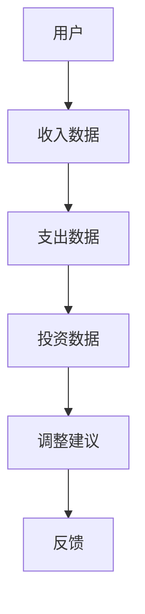
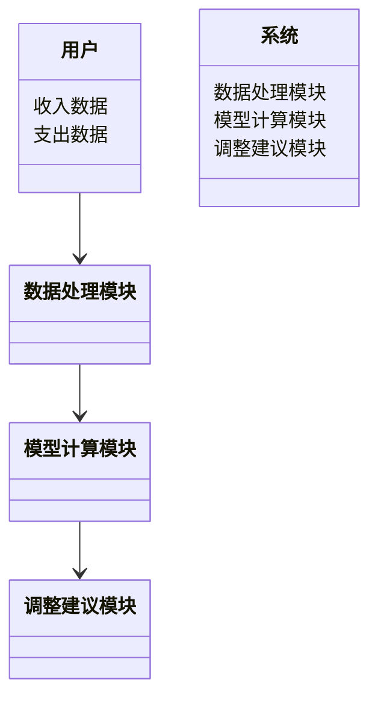
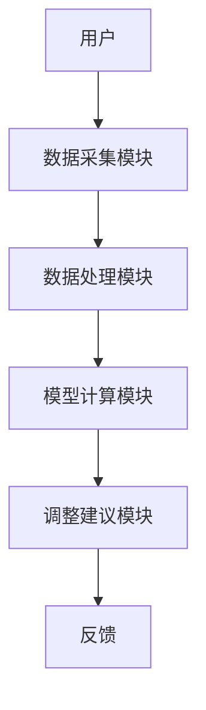
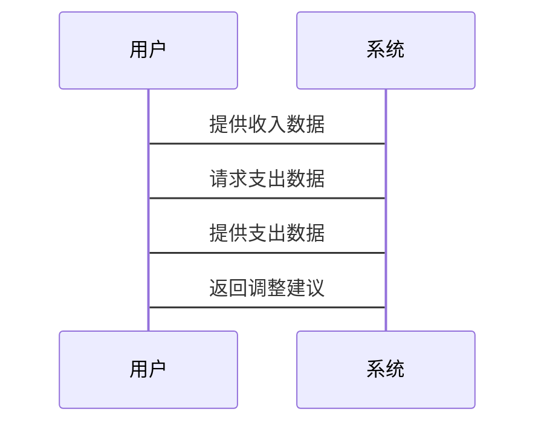

                 


# 智能退休收入规划动态调整器

> 关键词：智能退休规划、动态调整、人工智能、数学模型、系统架构

> 摘要：本文介绍了智能退休收入规划动态调整器的背景、核心概念、算法原理、系统架构、项目实战以及最佳实践。通过详细分析和实例，展示了如何利用人工智能和数学模型优化退休收入规划，帮助用户实现财务安全和最大化收益。

---

## 第一部分：背景介绍

### 第1章：退休收入规划的背景与挑战

#### 1.1 退休收入规划的重要性

##### 1.1.1 退休收入规划的核心概念
退休收入规划是指为确保退休后的生活质量，合理安排和管理退休前及退休后的收入来源。它涉及储蓄、投资、支出预测等多个方面，是个人财务管理的重要组成部分。

##### 1.1.2 当前社会的退休收入问题
随着人口老龄化加剧，退休金的稳定性和可持续性面临挑战。传统的人工规划方法难以应对市场波动、寿命延长和支出变化等复杂因素。

##### 1.1.3 动态调整在退休规划中的必要性
退休后的收入和支出会随时间变化，如通货膨胀、健康状况变化等。动态调整能够实时优化规划，确保财务安全。

#### 1.2 智能退休收入规划的背景

##### 1.2.1 人工智能在金融领域的应用
人工智能技术能够处理大量数据，提供精准的预测和优化建议，已成为金融领域的核心工具。

##### 1.2.2 退休收入规划的数字化转型
传统规划依赖人工计算，效率低且易出错。数字化转型利用技术手段提升规划的准确性和效率。

##### 1.2.3 智能动态调整的创新意义
智能动态调整器通过实时数据和模型优化，显著提升了退休规划的灵活性和适应性。

### 第2章：问题背景与目标

#### 2.1 问题背景

##### 2.1.1 退休收入规划的主要问题
- 收入不稳定
- 支出预测困难
- 通货膨胀影响
- 投资风险

##### 2.1.2 动态调整的必要性
退休规划需要根据实际情况不断调整，以应对不可预见的变化。

##### 2.1.3 用户需求与痛点分析
- 精准预测
- 实时调整
- 易用性

#### 2.2 问题描述

##### 2.2.1 退休收入规划的复杂性
涉及多个变量，包括收入、支出、投资、通货膨胀等。

##### 2.2.2 动态调整的数学模型
通过数学模型描述各变量之间的关系，为动态调整提供理论基础。

##### 2.2.3 系统边界与外延
明确系统的输入、输出和处理流程，确保功能的完整性和边界清晰。

#### 2.3 解决方案

##### 2.3.1 智能动态调整器的核心目标
实现收入与支出的动态平衡，确保退休生活的质量。

##### 2.3.2 系统功能的初步设想
包括数据输入、模型计算、结果输出等功能。

##### 2.3.3 与现有工具的对比分析
对比传统工具，突出智能动态调整器的优势，如实时性、精准性。

### 第3章：核心概念与联系

#### 3.1 核心概念

##### 3.1.1 智能退休收入规划的定义
利用人工智能技术，动态优化退休收入与支出的平衡。

##### 3.1.2 动态调整器的工作原理
通过实时数据和模型计算，提供调整建议。

##### 3.1.3 系统的核心要素组成
包括数据采集、模型计算、用户界面等模块。

#### 3.2 核心概念的联系

##### 3.2.1 智能动态调整器的属性特征对比表
| 属性 | 传统方法 | 智能动态调整器 |
|------|----------|----------------|
| 数据来源 | 单一 | 多源实时 |
| 处理方式 | 离线 | 实时在线 |
| 精准度 | 低 | 高 |
| 用户交互 | 单向 | 双向 |

##### 3.2.2 ER实体关系图的Mermaid流程图


---

## 第二部分：算法原理讲解

### 第4章：动态调整算法的数学模型

#### 4.1 算法原理

##### 4.1.1 动态规划的基本概念
动态规划是一种优化方法，适用于多阶段决策问题。

##### 4.1.2 收入规划的数学模型
总收入 = ∑(r_i × t_i)

##### 4.1.3 动态调整的核心算法
通过动态规划优化收入和支出的分配。

#### 4.2 数学模型与公式

##### 4.2.1 收入规划的数学表达式
$$ 总收入 = \sum_{i=1}^{n} r_i \times t_i $$

##### 4.2.2 支出预测的数学公式
$$ 总支出 = \sum_{j=1}^{m} e_j \times t_j $$

##### 4.2.3 动态调整的优化目标
$$ \min_{x} \sum_{i=1}^{n} (x_i - r_i)^2 $$

#### 4.3 算法实现

##### 4.3.1 Python代码实现
```python
import numpy as np

def dynamic_adjustment(income,支出):
    # 假设收入和支出都是数组
    # 使用动态规划优化
    n = len(income)
    dp = np.zeros(n+1)
    dp[0] = 0
    for i in range(1, n+1):
        dp[i] = max(dp[i-1], income[i-1] - 支出[i-1])
    return dp[n]

# 示例
income = [5000, 6000, 7000]
支出 = [4000, 5000, 6000]
result = dynamic_adjustment(income,支出)
print(result)
```

##### 4.3.2 代码解读与优化
解释代码的功能，讨论优化策略。

---

## 第三部分：系统分析与架构设计

### 第5章：系统架构设计

#### 5.1 问题场景介绍
描述系统的应用场景和用户需求。

#### 5.2 系统功能设计

##### 5.2.1 领域模型图


#### 5.3 系统架构设计

##### 5.3.1 系统架构图


#### 5.4 系统接口设计
定义系统的主要接口及其功能。

#### 5.5 系统交互设计

##### 5.5.1 交互流程图


---

## 第四部分：项目实战

### 第6章：项目实战

#### 6.1 环境安装

##### 6.1.1 安装Python
安装Python和必要的库，如NumPy、Pandas等。

#### 6.2 系统核心实现

##### 6.2.1 核心代码实现
实现动态调整的核心算法。

##### 6.2.2 代码解读与分析
解释代码的实现逻辑和优化策略。

#### 6.3 案例分析

##### 6.3.1 案例分析与详细解读
通过实际案例展示系统的应用和效果。

#### 6.4 项目小结
总结项目的实现过程和取得的成果。

---

## 第五部分：最佳实践

### 第7章：最佳实践

#### 7.1 小结
总结全文的主要内容和关键点。

#### 7.2 注意事项
提醒读者在实际应用中需要注意的事项。

#### 7.3 拓展阅读
推荐相关的书籍和资源，供读者深入学习。

---

## 作者信息

作者：AI天才研究院/AI Genius Institute & 禅与计算机程序设计艺术 /Zen And The Art of Computer Programming

---

以上是《智能退休收入规划动态调整器》的技术博客文章的详细撰写过程。接下来是文章的实际内容部分，根据上述目录大纲逐步展开每个章节的具体内容。

