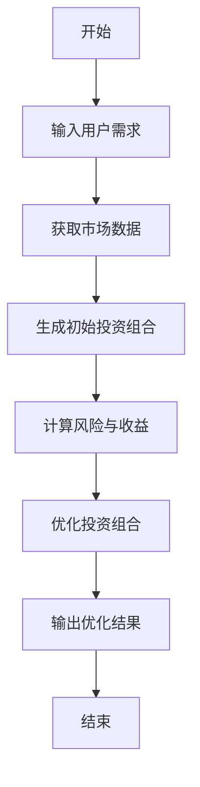
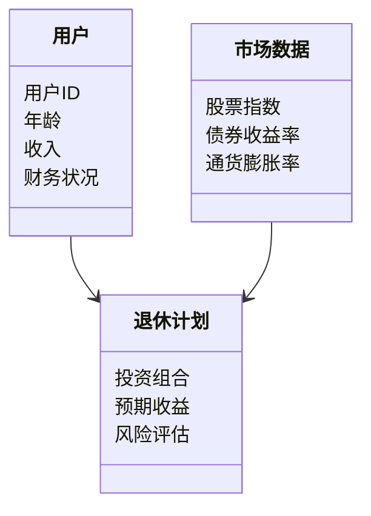
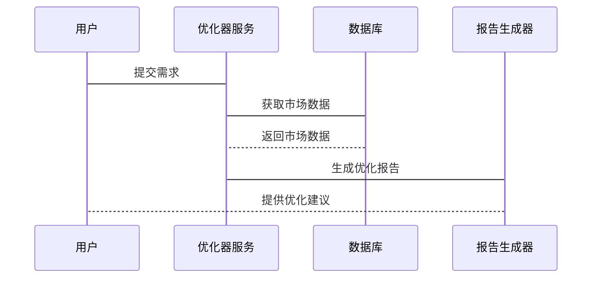

                 


# 智能退休计划优化器

> 关键词：智能退休计划，优化器，投资组合，人工智能，财务规划，退休资金

> 摘要：智能退休计划优化器通过人工智能技术，帮助用户制定个性化的退休财务计划，优化投资组合，确保退休生活质量。本文详细讲解了优化器的背景、核心概念、算法原理、系统架构、项目实战、最佳实践等，为读者提供全面的技术解读。

---

# 第一部分：背景介绍与核心概念

## 第1章：智能退休计划优化器的背景与问题背景

### 1.1 退休计划的重要性
#### 1.1.1 退休计划的定义与目标
退休计划是指为确保退休后生活质量而进行的财务规划，目标是在退休期间维持或提高生活水平。

#### 1.1.2 传统退休计划的局限性
传统退休计划依赖固定的投资组合和规则，难以适应市场波动和个人需求变化。

#### 1.1.3 智能优化器的必要性
智能优化器通过动态调整投资组合，实时应对市场变化，提供个性化建议。

### 1.2 问题背景与挑战
#### 1.2.1 退休资金规划的复杂性
涉及多因素，如通货膨胀、寿命预期、投资收益等。

#### 1.2.2 个人生命周期中的财务需求变化
不同生命周期阶段的财务需求不同，需动态调整。

#### 1.2.3 市场波动对退休计划的影响
市场波动可能导致投资收益不稳定，影响退休计划的实现。

### 1.3 智能退休计划优化器的定义与目标
#### 1.3.1 智能优化器的核心功能
动态调整投资组合，优化收益与风险。

#### 1.3.2 优化器的目标与边界
目标是最大化收益，边界是风险可控。

#### 1.3.3 优化器的预期效果与价值
提供个性化建议，提高退休生活质量。

---

## 第2章：核心概念与联系

### 2.1 核心概念的原理
#### 2.1.1 优化算法的基本原理
基于数学模型，寻找最优解。

#### 2.1.2 用户画像与需求分析
分析用户财务状况、风险承受能力等。

#### 2.1.3 投资组合优化的核心逻辑
通过优化算法，找到最佳投资组合。

### 2.2 核心概念的属性对比
| 比较维度 | 传统方法 | 智能优化器 |
|----------|----------|------------|
| 灵活性   | 低       | 高          |
| 定期调整 | 低频率   | 高频率     |
| 精准度   | 一般     | 高          |

### 2.3 ER实体关系图
```mermaid
er
  actor: 用户
  actor --> entity: 用户需求
  entity --> entity: 退休计划
  entity --> entity: 投资组合
  entity --> entity: 市场数据
  entity --> entity: 优化结果
```

---

# 第3章：算法原理讲解

## 3.1 优化算法的流程


## 3.2 数学模型与公式
### 3.2.1 目标函数
最大化收益：
$$ \text{最大化收益} = \sum_{i=1}^{n} w_i r_i $$
### 3.2.2 约束条件
$$ \sum_{i=1}^{n} w_i = 1 $$
$$ w_i \geq 0 \quad \forall i $$

## 3.3 算法实现
```python
def optimize_portfolio(weights, returns, risk_free_rate):
    # 计算当前投资组合的收益和风险
    current_return = sum(w * r for w, r in zip(weights, returns))
    current_risk = np.sqrt(sum((w * (r - risk_free_rate))**2 for w, r in zip(weights, returns)))

    # 计算优化后的权重
    new_weights = ...  # 使用优化算法计算
    return new_weights
```

---

## 第4章：系统架构设计方案

### 4.1 问题场景介绍
系统需处理用户需求、市场数据，生成优化结果。

### 4.2 项目介绍
开发一个智能优化器，帮助用户优化退休计划。

### 4.3 系统功能设计（领域模型）


### 4.4 系统架构设计（架构图）


### 4.5 系统接口设计和交互流程（序列图）


---

## 第5章：项目实战

### 5.1 环境安装
安装必要的库，如numpy、pandas、scipy等。

### 5.2 系统核心实现源代码
```python
import numpy as np
import pandas as pd
from scipy.optimize import minimize

def portfolio_return(weights, returns):
    return np.sum(weights * returns)

def portfolio_risk(weights, returns):
    return np.sqrt(np.dot(weights.T, np.dot(returns.cov(), weights)))

def optimize_min_variance(returns):
    n = len(returns.columns)
    def objective(weights):
        return portfolio_risk(weights, returns)
    constraints = [{'type': 'eq', 'fun': lambda w: sum(w) - 1.0}]
    bounds = [(0.0, 1.0) for _ in range(n)]
    result = minimize(objective, np.ones(n)/n, method='SLSQP', bounds=bounds, constraints=constraints)
    return result.x
```

### 5.3 代码应用解读与分析
解释代码功能，如计算投资组合的收益和风险，使用优化算法找到最优解。

### 5.4 实际案例分析
分析一个具体案例，展示优化器如何调整投资组合以降低风险。

### 5.5 项目小结
总结项目成果，讨论优化器的优势和可能的改进方向。

---

## 第6章：最佳实践与小结

### 6.1 最佳实践 tips
- 定期更新市场数据
- 保持模型的动态调整能力

### 6.2 小结
智能优化器为退休计划提供了高效解决方案，帮助用户实现财务目标。

### 6.3 注意事项
数据隐私和模型维护需谨慎处理。

### 6.4 拓展阅读
建议进一步阅读投资组合优化的相关文献。

---

作者：AI天才研究院/AI Genius Institute & 禅与计算机程序设计艺术 /Zen And The Art of Computer Programming

