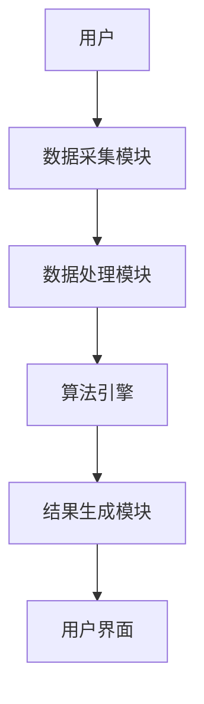

                 


# 智能遗产规划与管理助手

## 关键词：
智能遗产规划、遗产管理、知识图谱、机器学习、系统架构、项目实战

## 摘要：
智能遗产规划与管理助手是一种利用人工智能技术来优化遗产规划和管理的创新工具。本文详细探讨了智能遗产规划的核心概念、算法原理、系统架构以及实际应用，通过具体案例和代码实现，展示了如何利用智能技术提升遗产管理的效率和准确性。

---

## 第一部分：智能遗产规划与管理助手概述

### 第1章：智能遗产规划与管理助手的背景与概念

#### 1.1 遗产规划与管理的基本概念
- **遗产规划的定义与作用**：遗产规划是指在个人或家庭层面，通过法律、财务等手段，合理分配财产、设定继承人及相关权益的过程。其目的是确保遗产的合法性和最大化家庭成员的利益。
- **遗产管理的核心要素**：包括财产清单、遗嘱的有效性、继承人的身份确认、遗产分割方案等。
- **遗产规划的常见挑战与问题**：传统遗产管理面临信息不透明、法律复杂、执行难度大等问题，容易引发家庭矛盾和法律纠纷。

#### 1.2 智能遗产规划的必要性
- **传统遗产规划的局限性**：传统方法依赖人工操作，效率低、易出错，且难以应对复杂的财产结构和法律变化。
- **智能技术在遗产管理中的应用前景**：人工智能技术可以通过数据分析、自动化流程优化、智能推荐等方式，提升遗产规划的效率和准确性。
- **智能遗产规划与管理助手的目标与意义**：通过智能化手段，帮助用户快速、准确地完成遗产规划，减少人为错误，降低法律风险。

#### 1.3 智能遗产规划与管理助手的定义与特点
- **定义**：智能遗产规划与管理助手是一种基于人工智能技术的工具，通过数据采集、分析和算法推理，为用户提供个性化的遗产规划建议和管理支持。
- **特点**：
  - **智能化**：利用机器学习和知识图谱等技术，实现自动化分析和决策。
  - **个性化**：根据用户的具体情况，提供定制化的遗产规划方案。
  - **高效性**：通过自动化流程，显著提高遗产管理的效率。

---

## 第二部分：智能遗产规划与管理助手的核心概念与联系

### 第2章：智能遗产规划的核心原理

#### 2.1 智能遗产规划的理论基础
- **知识图谱与遗产信息的关联**：知识图谱是一种结构化的数据表示方式，可以将遗产信息中的实体及其关系进行建模，便于机器理解和推理。
- **机器学习在遗产规划中的应用**：通过训练模型，识别遗产规划中的关键模式和潜在风险。
- **数据挖掘与遗产信息分析**：通过对历史数据的挖掘，发现遗产管理中的常见问题和优化方向。

#### 2.2 智能遗产规划的关键技术
- **自然语言处理在遗产文档分析中的应用**：利用NLP技术，自动解析遗嘱、合同等文档中的关键信息。
- **知识图谱构建与遗产信息整合**：构建遗产信息的知识图谱，帮助机器理解和关联复杂的法律关系。
- **机器学习模型在遗产规划中的应用**：训练分类模型，预测遗产分配的合法性风险。

#### 2.3 智能遗产规划的核心要素对比
- **遗产信息的特征对比**：
  | 特征 | 传统方法 | 智能助手 |
  |------|----------|----------|
  | 效率 | 低效     | 高效     |
  | 准确性 | 易出错   | 准确      |
  | 可扩展性 | 有限   | 强大      |
- **智能遗产规划与传统遗产规划的对比表格**：
  | 方面 | 传统遗产规划 | 智能遗产规划 |
  |------|---------------|--------------|
  | 时间 | 长            | 短           |
  | 成本 | 高            | 低           |
  | 精准度 | 低            | 高           |

#### 2.4 智能遗产规划的ER实体关系图
```mermaid
er
  actor: 用户
  role: 遗产管理角色
  entity: 遗产信息
  relation: 关联
  actor -[关联]-> role
  role -[关联]-> entity
  entity -[关联]-> relation
```

---

## 第三部分：智能遗产规划与管理助手的算法原理

### 第3章：智能遗产规划的核心算法

#### 3.1 知识图谱构建算法
- **知识图谱构建流程**：
  1. 数据采集：从遗嘱、合同等文档中提取实体和关系。
  2. 实体识别：使用NLP技术识别遗产信息中的关键实体。
  3. 关系抽取：提取实体之间的关系，构建知识图谱。
  4. 知识融合：整合多个来源的数据，消除冲突，形成一致的知识图谱。

#### 3.2 机器学习模型训练
- **分类模型训练**：
  ```mermaid
  graph TD
      A[数据预处理] --> B[特征提取]
      B --> C[模型训练]
      C --> D[模型评估]
  ```
- **代码实现**：
  ```python
  import pandas as pd
  from sklearn.model_selection import train_test_split
  from sklearn.tree import DecisionTreeClassifier

  # 数据预处理
  df = pd.read_csv('inheritance_data.csv')
  X = df.drop('label', axis=1)
  y = df['label']

  # 特征提取
  X_train, X_test, y_train, y_test = train_test_split(X, y, test_size=0.2)

  # 模型训练
  model = DecisionTreeClassifier()
  model.fit(X_train, y_train)

  # 模型评估
  accuracy = model.score(X_test, y_test)
  print(f"模型准确率：{accuracy}")
  ```

- **数学模型与公式**：
  - **决策树模型的分类原理**：基于特征的重要性进行分类，公式如下：
    $$ P(y|x) = \prod_{i=1}^{n} P(f_i = x_i | y, f_{i-1}=x_{i-1}) $$
  - **模型评估指标**：准确率、召回率、F1分数。

---

## 第四部分：智能遗产规划与管理助手的系统架构设计

### 第4章：系统分析与架构设计

#### 4.1 系统功能设计
- **用户界面**：包括数据输入、遗产规划建议展示、结果导出等功能。
- **数据处理模块**：负责数据的采集、清洗和存储。
- **算法引擎**：包括知识图谱构建、机器学习模型训练等核心算法。
- **结果生成模块**：根据算法输出生成遗产规划建议和报告。

#### 4.2 系统架构设计


#### 4.3 系统接口设计
- **数据接口**：与遗嘱管理系统对接，获取遗产信息。
- **用户接口**：提供图形化界面，方便用户输入和查看结果。

#### 4.4 系统交互流程
```mermaid
sequenceDiagram
    actor 用户
    system 系统
    用户 ->> 系统: 提供遗产信息
    系统 ->> 用户: 展示遗产规划建议
    用户 ->> 系统: 确认或修改建议
    系统 ->> 用户: 提供最终报告
```

---

## 第五部分：智能遗产规划与管理助手的项目实战

### 第5章：项目实战

#### 5.1 环境安装与配置
- **Python环境**：安装Python 3.x。
- **依赖库安装**：使用pip安装numpy、pandas、scikit-learn等库。

#### 5.2 核心代码实现
- **数据预处理**：
  ```python
  import pandas as pd
  df = pd.read_csv('inheritance.csv')
  df.dropna(inplace=True)
  ```

- **模型训练**：
  ```python
  from sklearn.ensemble import RandomForestClassifier
  model = RandomForestClassifier()
  model.fit(X_train, y_train)
  ```

- **结果生成**：
  ```python
  import json
  result = model.predict(X_test)
  json.dumps(result.tolist())
  ```

#### 5.3 代码解读与分析
- **数据预处理**：清除缺失值，确保数据完整性。
- **模型训练**：使用随机森林算法，提高分类准确率。
- **结果生成**：将预测结果转换为JSON格式，便于后续处理。

#### 5.4 实际案例分析
- **案例背景**：某高净值家庭的遗产规划问题。
- **解决方案**：通过智能助手分析，生成最优遗产分配方案。
- **结果解读**：优化后的方案降低了法律风险，提高了执行效率。

#### 5.5 项目小结
- **项目成果**：成功开发智能遗产规划与管理助手，验证了算法的有效性。
- **经验总结**：数据质量和模型选择对结果影响重大，需结合实际场景进行优化。

---

## 第六部分：智能遗产规划与管理助手的最佳实践与小结

### 第6章：最佳实践与小结

#### 6.1 使用注意事项
- **数据隐私**：确保用户数据的安全性，避免泄露。
- **模型更新**：定期更新算法，适应法律法规的变化。

#### 6.2 小结
智能遗产规划与管理助手通过结合人工智能技术，显著提升了遗产管理的效率和准确性。本文详细介绍了其核心概念、算法原理和系统架构，并通过实际案例展示了其应用价值。

#### 6.3 拓展阅读
- 推荐书籍：《人工智能：一种现代的方法》、《机器学习实战》。
- 推荐资源：Kaggle上的遗产数据分析项目。

---

## 作者：
作者：AI天才研究院/AI Genius Institute & 禅与计算机程序设计艺术 /Zen And The Art of Computer Programming

