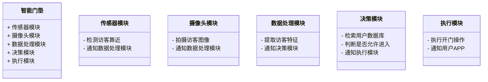
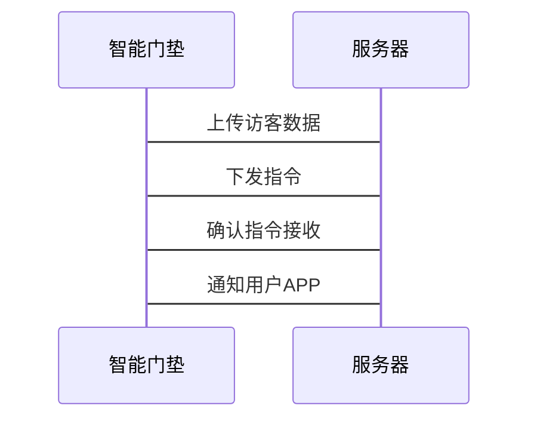

                 


# 智能门垫：AI Agent的访客识别系统

> 关键词：智能门垫、AI Agent、访客识别、物联网、计算机视觉、机器学习

> 摘要：智能门垫作为一种新兴的智能家居设备，结合AI Agent技术，能够实现高效的访客识别。本文将从背景介绍、核心概念、算法原理、系统架构、项目实战等多个方面详细分析智能门垫的访客识别系统，探讨其实现方法和应用场景。

---

# 第1章 智能门垫与AI Agent的概述

## 1.1 智能门垫的基本概念

### 1.1.1 智能门垫的定义与功能

智能门垫是一种结合了物联网（IoT）和人工智能（AI）技术的智能家居设备。它通过传感器和摄像头收集数据，并利用AI算法进行分析，从而实现访客识别、身份验证和安全监控等功能。智能门垫的主要功能包括：

1. **访客检测**：通过传感器检测是否有访客靠近门垫。
2. **人脸识别**：利用摄像头进行人脸检测和识别。
3. **身份验证**：通过比对数据库中的用户信息，确认访客身份。
4. **通知提醒**：通过手机APP或其他设备通知用户有访客到达。
5. **智能交互**：与智能家居设备联动，例如自动开门、播放欢迎音乐等。

### 1.1.2 AI Agent在智能门垫中的作用

AI Agent（智能代理）是一种能够感知环境、自主决策并执行任务的计算机程序。在智能门垫中，AI Agent主要负责以下任务：

1. **数据采集**：通过传感器和摄像头获取访客的相关数据。
2. **数据处理**：对采集到的数据进行预处理和特征提取。
3. **决策判断**：利用机器学习模型对访客进行分类和识别。
4. **执行操作**：根据识别结果执行相应的操作，例如开门或通知用户。

### 1.1.3 智能门垫与传统门禁系统的主要区别

传统门禁系统主要依赖于刷卡或密码输入，而智能门垫通过AI Agent实现了更加智能化的访客识别功能。具体区别如下：

| 特性                | 传统门禁系统              | 智能门垫                  |
|---------------------|--------------------------|--------------------------|
| 识别方式            | 刷卡、密码输入            | 人脸识别、行为分析        |
| 操作便捷性          | 需要用户主动刷卡或输入密码 | 自动识别，无需用户操作     |
| 安全性              | 依赖于物理卡片或密码      | 结合AI算法，安全性更高     |
| 可扩展性            | 功能相对固定              | 支持与智能家居联动，功能灵活 |

## 1.2 智能门垫的应用场景

### 1.2.1 家庭场景中的智能门垫

在家庭场景中，智能门垫可以作为智能家居的核心入口，帮助用户实现无感门禁。例如，当访客到达门前时，智能门垫会自动识别其身份，并通过手机APP通知主人是否允许访客进入。

### 1.2.2 商业场景中的智能门垫

在商业场景中，智能门垫可以应用于办公楼、酒店等场所。例如，酒店可以利用智能门垫实现无接触式入住，访客通过人脸识别即可完成身份验证并进入房间。

### 1.2.3 其他应用场景的潜力

智能门垫的应用场景远不止家庭和商业领域。例如，在公共场合，智能门垫可以用于人群流量统计；在医疗领域，可以用于患者身份识别和访客管理。

---

# 第2章 AI Agent的核心概念与原理

## 2.1 AI Agent的定义与特点

### 2.1.1 AI Agent的定义

AI Agent是一种能够感知环境、自主决策并执行任务的智能程序。它通过传感器获取信息，利用算法进行分析，并根据结果采取相应的行动。

### 2.1.2 AI Agent的核心特点

1. **自主性**：AI Agent能够在没有外部干预的情况下自主运行。
2. **反应性**：能够实时感知环境变化并做出反应。
3. **学习能力**：通过机器学习算法不断优化自身的识别和决策能力。
4. **可扩展性**：能够根据需求扩展功能和服务范围。

## 2.2 AI Agent的分类与应用场景

### 2.2.1 基于规则的AI Agent

基于规则的AI Agent通过预设的规则进行决策。例如，当检测到有人靠近门垫时，触发摄像头拍照并进行人脸识别。

### 2.2.2 基于模型的AI Agent

基于模型的AI Agent利用机器学习模型进行分析和决策。例如，使用卷积神经网络（CNN）对访客图像进行分类和识别。

### 2.2.3 基于学习的AI Agent

基于学习的AI Agent通过大量数据训练模型，从而实现更复杂的识别和决策任务。例如，利用深度学习模型进行实时人脸检测和识别。

## 2.3 AI Agent在智能门垫中的具体应用

### 2.3.1 AI Agent的感知能力

AI Agent通过传感器和摄像头感知环境信息。例如，重量传感器可以检测是否有访客踏上门垫，而摄像头可以捕捉访客的面部特征。

### 2.3.2 AI Agent的决策能力

AI Agent利用机器学习模型对感知到的信息进行分析，例如通过人脸识别模型判断访客的身份，并根据预设规则做出是否允许进入的决策。

### 2.3.3 AI Agent的执行能力

AI Agent根据决策结果执行相应的操作，例如通过智能门锁开启大门，或通过手机APP通知用户有访客到达。

## 2.4 本章小结

AI Agent作为智能门垫的核心技术，通过感知、决策和执行三个环节实现了访客识别和门禁控制功能。其基于规则、模型和学习的三种类型为智能门垫提供了灵活多样的应用场景。

---

# 第3章 智能门垫的访客识别算法原理

## 3.1 访客识别的核心算法

### 3.1.1 目标检测算法

目标检测算法用于检测图像中的目标物体，例如人脸。常用的算法包括YOLO、Faster R-CNN等。

#### YOLO算法的实现原理

YOLO（You Only Look Once）是一种单阶段目标检测算法，通过将图像划分为网格，并预测每个网格中的目标类别和位置。

$$ \text{YOLO的输出格式为：} [x1, y1, x2, y2, \text{confidence}] $$

其中，$(x1, y1)$是目标左上角的坐标，$(x2, y2)$是目标右下角的坐标，$\text{confidence}$是置信度。

### 3.1.2 图像识别算法

图像识别算法用于对检测到的目标进行分类，例如识别出特定的面部特征。常用的算法包括FaceNet、DeepFace等。

#### FaceNet算法的实现原理

FaceNet通过将人脸特征嵌入到一个低维空间中，从而实现快速的人脸匹配。

$$ \text{FaceNet的目标是将人脸图像映射到一个长度为512的向量} $$

### 3.1.3 特征提取算法

特征提取算法用于从图像中提取有助于识别的特征，例如LBP（局部二值模式）。

#### LBP算法的实现原理

LBP通过将图像中的每个像素与其周围像素进行比较，生成一个二进制模式。

$$ \text{LBP算子可以表示为：} \sum_{i=0}^{n-1} ( (-1)^i \cdot \text{round}( (I(x+i) - I(x)) / \sigma )) $$

其中，$I(x)$是中心像素的灰度值，$\sigma$是平滑参数。

## 3.2 算法的优化与实现

### 3.2.1 算法优化策略

1. **数据增强**：通过旋转、翻转、添加噪声等方法增加训练数据的多样性。
2. **模型优化**：使用批量归一化（Batch Normalization）和Dropout等技术防止过拟合。
3. **训练策略**：采用迁移学习，利用预训练模型提取特征，减少训练时间。

### 3.2.2 算法实现步骤

1. **数据采集**：收集访客的图像数据，包括正面和侧面的人脸图像。
2. **数据预处理**：将图像归一化到统一尺寸，并提取特征向量。
3. **模型训练**：使用训练数据训练目标检测和图像识别模型。
4. **模型测试**：在测试数据上验证模型的准确率和召回率。

## 3.3 算法的数学模型与公式

### 3.3.1 目标检测模型

目标检测模型通常使用损失函数来衡量预测结果与真实结果的差异。常用的损失函数包括：

$$ \text{总的损失} = \text{分类损失} + \text{定位损失} + \text{IOU损失} $$

其中，IOU（交并比）损失用于衡量预测框与真实框的重叠程度。

### 3.3.2 图像识别模型

图像识别模型通常使用交叉熵损失函数来衡量分类结果的误差：

$$ \text{损失} = -\sum_{i=1}^{n} y_i \log(p_i) + (1 - y_i) \log(1 - p_i) $$

其中，$y_i$是真实标签，$p_i$是预测概率。

---

# 第4章 智能门垫的系统架构设计

## 4.1 系统功能设计

智能门垫的系统功能设计包括以下几个方面：

1. **数据采集**：通过传感器和摄像头采集访客信息。
2. **数据处理**：对采集到的数据进行预处理和特征提取。
3. **数据存储**：将处理后的数据存储到数据库中。
4. **数据检索**：根据访客信息检索数据库中的用户记录。
5. **决策判断**：根据检索结果做出是否允许进入的决策。
6. **执行操作**：根据决策结果执行相应的操作，例如开门或通知用户。

### 系统功能模块的类图



## 4.2 系统架构设计

智能门垫的系统架构设计包括前端和后端两部分：

1. **前端**：智能门垫设备，包括传感器和摄像头。
2. **后端**：服务器，负责数据处理、决策判断和执行操作。

### 系统架构的架构图

```mermaid
server {
    classDiagram

    class 智能门垫 {
        + 传感器模块
        + 摄像头模块
        + 数据处理模块
        + 决策模块
        + 执行模块
    }

    class 服务器 {
        + 数据存储模块
        + 数据检索模块
        + 决策模块
        + 执行模块
    }

    智能门垫 --> 服务器: 上传数据
    服务器 --> 智能门垫: 下发指令
}
```

## 4.3 系统接口设计

智能门垫与服务器之间的接口设计包括以下几个步骤：

1. **数据上传**：智能门垫将采集到的数据上传到服务器。
2. **数据处理**：服务器对数据进行处理并做出决策。
3. **指令下发**：服务器根据决策结果向智能门垫下发指令。

### 系统接口的交互图



---

# 第5章 项目实战：智能门垫的实现

## 5.1 环境安装与配置

### 5.1.1 系统要求

1. **硬件要求**：
   - 摄像头：支持视频采集的摄像头。
   - 传感器：用于检测访客靠近的传感器。
   - 智能门锁：支持与智能门垫联动的门锁。

2. **软件要求**：
   - 操作系统：Linux或Windows。
   - 开发工具：Python、OpenCV、TensorFlow等。

### 5.1.2 环境安装

1. **安装Python**：
   ```bash
   # 下载并安装Python
   https://www.python.org/downloads/
   ```

2. **安装OpenCV**：
   ```bash
   pip install opencv-python
   ```

3. **安装TensorFlow**：
   ```bash
   pip install tensorflow
   ```

## 5.2 系统核心实现

### 5.2.1 数据采集模块的实现

```python
import cv2

# 初始化摄像头
cap = cv2.VideoCapture(0)

while True:
    # 读取视频流
    ret, frame = cap.read()
    if not ret:
        break

    # 显示视频流
    cv2.imshow('摄像头预览', frame)
    if cv2.waitKey(1) == ord('q'):
        break

# 释放资源
cap.release()
cv2.destroyAllWindows()
```

### 5.2.2 数据处理模块的实现

```python
import tensorflow as tf
from tensorflow.keras.models import load_model

# 加载预训练模型
model = load_model('face_recognition_model.h5')

# 提取特征向量
def extract_features(image):
    # 图像预处理
    image = cv2.resize(image, (160, 160))
    image = image / 255.0
    return image

# 进行人脸识别
def recognize_face(image):
    features = extract_features(image)
    predictions = model.predict(tf.expand_dims(features, axis=0))
    return predictions[0]
```

### 5.2.3 决策模块的实现

```python
import sqlite3

# 连接数据库
conn = sqlite3.connect('visitor.db')

# 查询访客信息
def check_visitor(features):
    cursor = conn.cursor()
    cursor.execute('SELECT id, name FROM visitors WHERE features=?', (features,))
    result = cursor.fetchone()
    if result:
        return {'id': result[0], 'name': result[1]}
    else:
        return None

# 执行操作
def execute_action(visitor_info):
    if visitor_info:
        print(f'允许{visitor_info['name']}进入')
        # 通知用户APP
        notify_user(visitor_info['name'])
    else:
        print('拒绝访客进入')

# 通知用户APP
def notify_user(name):
    # 实现与手机APP的通信逻辑
    pass
```

## 5.3 项目小结

通过以上代码示例，我们可以看到智能门垫的实现需要多个模块的协同工作，包括数据采集、数据处理、决策判断和执行操作。每个模块的具体实现可以根据实际需求进行调整和优化。

---

# 第6章 系统优化与扩展

## 6.1 系统优化策略

### 6.1.1 提高识别速度

1. **优化模型结构**：减少模型的深度和宽度，降低计算复杂度。
2. **使用轻量级算法**：例如使用MobileNet等轻量级模型。
3. **并行计算**：利用多核处理器或GPU加速计算。

### 6.1.2 提高识别准确率

1. **数据增强**：通过数据增强技术增加训练数据的多样性。
2. **迁移学习**：利用预训练模型提取特征，减少训练时间。
3. **模型融合**：结合多个模型的结果，提高识别准确率。

## 6.2 系统扩展方向

### 6.2.1 与智能家居联动

智能门垫可以与其他智能家居设备联动，例如智能灯、智能音箱等。当访客进入房间时，智能门垫可以通知智能灯打开欢迎灯光，智能音箱播放欢迎音乐。

### 6.2.2 支持更多识别方式

除了人脸识别，智能门垫还可以支持其他识别方式，例如虹膜识别、指纹识别等。通过多种识别方式的结合，可以提高系统的安全性。

### 6.2.3 支持远程访问

通过互联网，用户可以在任何地方远程查看访客信息，并通过手机APP进行开门操作。这为用户提供了更大的便利性。

---

# 第7章 总结与展望

## 7.1 本章总结

智能门垫作为一种新兴的智能家居设备，结合AI Agent技术，能够实现高效的访客识别和门禁控制。本文详细分析了智能门垫的核心概念、算法原理、系统架构和项目实现，为读者提供了全面的技术解读。

## 7.2 未来展望

随着AI技术的不断发展，智能门垫的功能将更加智能化和多样化。例如，未来的智能门垫可以支持更多的识别方式，与更多的智能家居设备联动，并通过互联网实现远程控制。此外，AI Agent技术也将不断优化，使得智能门垫的识别准确率和响应速度进一步提高。

## 7.3 最佳实践 Tips

1. **数据安全**：在设计智能门垫时，必须重视数据的安全性，防止数据泄露和被恶意攻击。
2. **用户体验**：在实现智能化的同时，不应忽视用户体验，例如在人脸识别失败时，应该提供备用的识别方式。
3. **系统维护**：定期更新系统软件和模型，确保系统的安全性和稳定性。

---

# 作者

作者：AI天才研究院/AI Genius Institute & 禅与计算机程序设计艺术/Zen And The Art of Computer Programming

