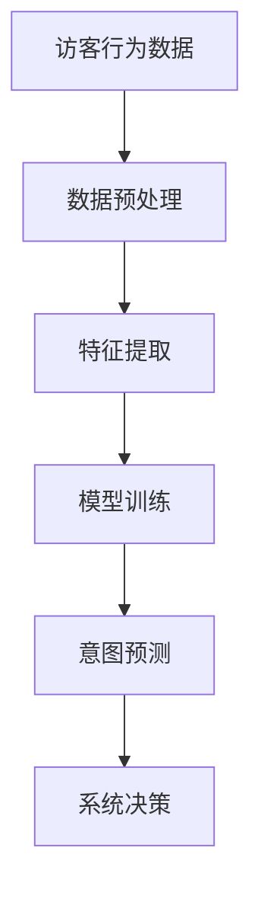
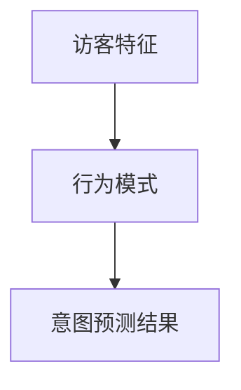
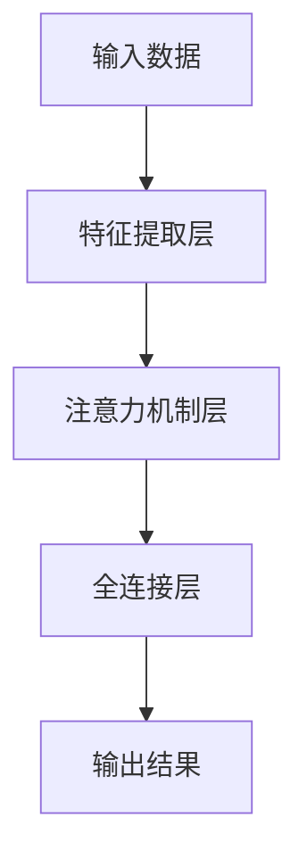
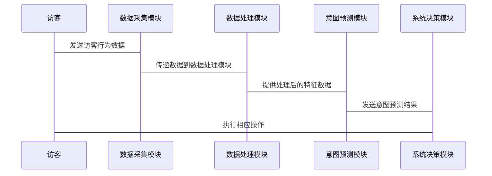
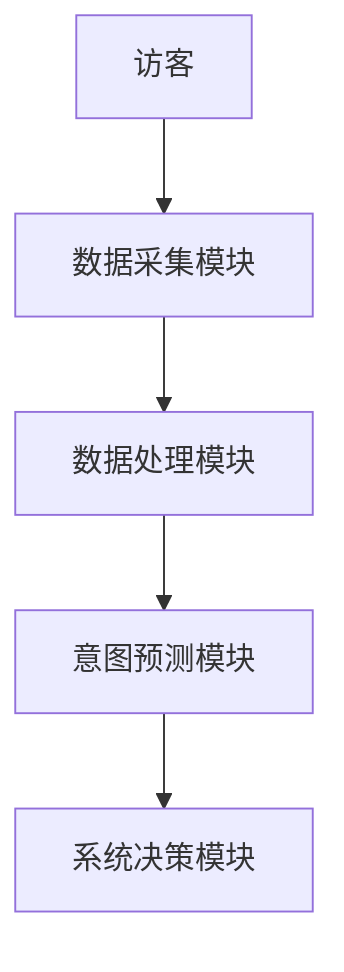

                 


# 智能门禁：AI Agent的访客意图预测

> 关键词：智能门禁，AI Agent，访客意图预测，深度学习，概率论，系统架构

> 摘要：本文探讨了如何利用AI Agent技术实现智能门禁系统中的访客意图预测。通过分析访客行为数据，结合概率论和深度学习算法，构建高效的意图预测模型，并详细阐述了系统的架构设计和实现方案。

---

# 第一部分: 智能门禁与AI Agent的背景介绍

## 第1章: 问题背景与需求分析

### 1.1 智能门禁系统的发展历程

#### 1.1.1 传统门禁系统的特点与局限性
传统门禁系统主要依赖刷卡、指纹识别等技术，能够实现基本的开门权限管理。然而，这些系统缺乏智能化的访客管理功能，无法主动预测和识别访客的意图，难以应对复杂的实际场景。

#### 1.1.2 智能化门禁系统的兴起
随着人工智能技术的快速发展，智能门禁系统逐渐兴起。通过整合传感器数据、历史行为记录和实时环境信息，智能门禁系统能够提供更加智能化的访客管理服务。

#### 1.1.3 AI Agent在门禁系统中的应用潜力
AI Agent（智能代理）能够通过学习和推理，主动理解访客的行为模式，从而预测其意图。这种技术的应用可以显著提升门禁系统的智能化水平，为访客管理提供更高效的服务。

### 1.2 访客意图预测的核心问题

#### 1.2.1 什么是访客意图预测
访客意图预测是指通过分析访客的行为数据和环境信息，预测其在特定场景下的行为目标。例如，预测访客是否会尾随他人进入禁区，或者判断访客是否需要引导服务。

#### 1.2.2 访客意图预测的业务价值
访客意图预测能够帮助门禁系统提前做好准备，优化访客体验，同时提高安全性。例如，可以主动引导访客找到目标区域，减少误入禁区的风险。

#### 1.2.3 系统实现的关键挑战
访客意图预测需要处理多源异构数据，且预测模型需要在实时场景中高效运行。此外，如何在不同场景下保持模型的泛化能力也是一个重要挑战。

## 第2章: AI Agent与访客意图预测的核心概念

### 2.1 AI Agent的基本原理

#### 2.1.1 AI Agent的定义与分类
AI Agent是一种能够感知环境并采取行动以实现目标的智能实体。根据智能水平，AI Agent可以分为反应式和认知式两类。反应式Agent仅基于当前感知做出决策，而认知式Agent能够进行复杂推理和规划。

#### 2.1.2 AI Agent的核心功能与特点
- **感知环境**：通过传感器和数据接口获取实时信息。
- **推理与学习**：利用机器学习算法分析数据，提取模式。
- **决策与行动**：基于推理结果，驱动执行机构采取行动。

#### 2.1.3 AI Agent在智能门禁中的应用场景
- **实时监控**：通过摄像头和传感器实时感知访客行为。
- **行为分析**：分析访客的历史行为，预测其意图。
- **主动引导**：根据预测结果，主动引导访客前往目标区域。

### 2.2 访客意图预测的系统架构

#### 2.2.1 系统整体架构图（Mermaid流程图）



#### 2.2.2 关键组件的功能描述
- **数据预处理**：对原始数据进行清洗和格式化处理。
- **特征提取**：从数据中提取有用的特征，用于模型训练。
- **模型训练**：利用机器学习算法训练意图预测模型。
- **意图预测**：基于模型对实时数据进行意图预测。
- **系统决策**：根据预测结果，驱动系统采取相应行动。

#### 2.2.3 系统的边界与外延
智能门禁系统的核心是AI Agent和意图预测模型，其外延包括前端设备（如摄像头、传感器）和后端数据库。

### 2.3 核心概念对比分析

#### 2.3.1 AI Agent与传统门禁系统的对比

| 特性                | AI Agent门禁系统          | 传统门禁系统          |
|---------------------|--------------------------|----------------------|
| 智能化水平          | 高，具备主动预测能力     | 低，仅支持基本权限管理 |
| 数据处理能力        | 强，支持多源数据融合     | 弱，仅处理少量数据    |
| 适应性              | 高，能够动态调整策略     | 低，固定规则          |

#### 2.3.2 不同访客意图预测模型的优劣势对比（表格形式）

| 模型类型             | 优势                       | 劣势                     |
|----------------------|----------------------------|-------------------------|
| 基于概率论的模型      | 易解释，适合小数据场景     | 预测精度较低             |
| 基于深度学习的模型    | 预测精度高，适合大数据场景 | 需要大量数据和计算资源   |

---

# 第二部分: AI Agent的访客意图预测算法原理

## 第3章: 基于概率论的访客行为建模

### 3.1 概率论基础

#### 3.1.1 概率分布的基本概念
概率分布描述了随机变量在不同取值下的概率。常用的概率分布包括均匀分布、正态分布和二项分布等。

#### 3.1.2 贝叶斯定理的应用场景
贝叶斯定理常用于根据先验概率和条件概率计算后验概率。例如，在访客意图预测中，可以利用贝叶斯定理计算访客在某段时间内进入禁区的概率。

#### 3.1.3 马尔可夫链在行为预测中的应用
马尔可夫链是一种描述系统状态转移的数学模型。在访客意图预测中，可以利用马尔可夫链描述访客在不同区域之间的移动概率。

### 3.2 访客行为建模的数学模型

#### 3.2.1 贝叶斯网络的构建（Mermaid流程图）



#### 3.2.2 马尔可夫链的状态转移矩阵（公式推导）

状态转移矩阵 \( P \) 是一个 \( n \times n \) 的矩阵，其中 \( P_{ij} \) 表示从状态 \( i \) 转移到状态 \( j \) 的概率。

$$ P = \begin{bmatrix} p_{11} & p_{12} & \cdots & p_{1n} \\ p_{21} & p_{22} & \cdots & p_{2n} \\ \vdots & \vdots & \ddots & \vdots \\ p_{n1} & p_{n2} & \cdots & p_{nn} \end{bmatrix} $$

#### 3.2.3 示例场景的概率计算（详细推导）
假设我们有三个状态：门口、走廊和会议室。根据历史数据，访客从门口到走廊的概率为0.8，从走廊到会议室的概率为0.6。状态转移矩阵如下：

$$ P = \begin{bmatrix} 0.2 & 0.8 & 0 \\ 0 & 0.2 & 0.8 \\ 0 & 0 & 1 \end{bmatrix} $$

---

## 第4章: 基于深度学习的意图预测算法

### 4.1 深度学习模型简介

#### 4.1.1 RNN、LSTM与Transformer的对比
- **RNN**：适合处理序列数据，但在长序列中容易出现梯度消失问题。
- **LSTM**：通过引入记忆单元，有效解决了RNN的梯度消失问题。
- **Transformer**：基于自注意力机制，能够捕捉长距离依赖关系，但计算复杂度较高。

#### 4.1.2 图神经网络在复杂关系建模中的应用
图神经网络能够处理复杂的图结构数据，适用于建模访客之间的社交网络关系。

#### 4.1.3 深度学习模型的优势与局限
- **优势**：预测精度高，能够捕捉复杂模式。
- **局限**：需要大量数据和计算资源，且模型解释性较差。

### 4.2 意图预测算法的实现细节

#### 4.2.1 深度学习模型的结构设计



#### 4.2.2 模型训练的流程

1. 数据预处理：对原始数据进行清洗和格式化。
2. 模型训练：使用训练数据更新模型参数。
3. 模型评估：在验证集上评估模型性能。
4. 模型优化：调整超参数，优化模型表现。

#### 4.2.3 模型预测的实现

```python
import tensorflow as tf
from tensorflow.keras.models import Model
from tensorflow.keras.layers import Input, LSTM, Dense

# 定义模型
input_layer = Input(shape=(max_length, features))
lstm_layer = LSTM(64)(input_layer)
dense_layer = Dense(1, activation='sigmoid')(lstm_layer)
model = Model(inputs=input_layer, outputs=dense_layer)

# 编译模型
model.compile(optimizer='adam', loss='binary_crossentropy', metrics=['accuracy'])

# 训练模型
model.fit(X_train, y_train, epochs=10, batch_size=32)
```

### 4.3 模型的优化与调优

#### 4.3.1 超参数调整
- **学习率**：使用Adam优化器，初始学习率为0.001。
- **批量大小**：设置为32。
- ** epochs**：设置为10。

#### 4.3.2 模型的评估与验证
在验证集上评估模型的准确率和F1分数，确保模型具有良好的泛化能力。

#### 4.3.3 模型的部署与应用
将训练好的模型部署到智能门禁系统中，实时处理访客数据，预测其意图。

---

# 第三部分: 系统分析与架构设计方案

## 第5章: 系统分析与架构设计

### 5.1 项目介绍与系统功能设计

#### 5.1.1 系统功能模块
- **数据采集模块**：负责采集访客的行为数据。
- **数据处理模块**：对数据进行预处理和特征提取。
- **意图预测模块**：基于深度学习模型预测访客意图。
- **系统决策模块**：根据预测结果采取相应行动。

#### 5.1.2 系统功能模块的交互流程（Mermaid序列图）



### 5.2 系统架构设计

#### 5.2.1 系统架构图（Mermaid架构图）



#### 5.2.2 关键接口设计
- **数据采集接口**：负责接收传感器数据。
- **意图预测接口**：负责接收特征数据，返回意图预测结果。
- **系统决策接口**：负责接收预测结果，驱动系统采取行动。

---

# 第四部分: 项目实战

## 第6章: 项目实战

### 6.1 环境安装与配置

```bash
# 安装依赖
pip install tensorflow numpy pandas scikit-learn
```

### 6.2 系统核心实现

#### 6.2.1 数据预处理

```python
import pandas as pd
import numpy as np

# 读取数据
data = pd.read_csv('visitor_data.csv')

# 数据清洗
data = data.dropna()
data = pd.get_dummies(data)
```

#### 6.2.2 特征提取

```python
from sklearn.feature_selection import SelectKBest
from sklearn.ensemble import RandomForestClassifier

# 提取特征
selector = SelectKBest(k=10)
selector.fit(data, labels)
selected_features = selector.transform(data)
```

#### 6.2.3 模型训练

```python
from sklearn.model import SVC

# 训练模型
model = SVC(C=1, gamma=0.1)
model.fit(selected_features, labels)
```

### 6.3 代码实现与解读

#### 6.3.1 访客意图预测模型的实现

```python
import tensorflow as tf
from tensorflow.keras.models import Model
from tensorflow.keras.layers import Input, LSTM, Dense

# 定义模型
input_layer = Input(shape=(max_length, features))
lstm_layer = LSTM(64)(input_layer)
dense_layer = Dense(1, activation='sigmoid')(lstm_layer)
model = Model(inputs=input_layer, outputs=dense_layer)

# 编译模型
model.compile(optimizer='adam', loss='binary_crossentropy', metrics=['accuracy'])

# 训练模型
model.fit(X_train, y_train, epochs=10, batch_size=32)
```

#### 6.3.2 系统决策模块的实现

```python
import numpy as np

# 预测意图
predicted_labels = model.predict(X_test)

# 执行决策
for i in range(len(predicted_labels)):
    if predicted_labels[i] > 0.5:
        # 允许进入
        print("允许进入")
    else:
        # 拒绝进入
        print("拒绝进入")
```

### 6.4 实际案例分析

#### 6.4.1 案例背景
某公司引入智能门禁系统，希望通过访客意图预测优化访客管理。

#### 6.4.2 数据分析
通过分析历史数据，发现访客在上午9点至10点进入会议室的概率较高。

#### 6.4.3 模型训练
使用过去6个月的数据训练意图预测模型，准确率达到90%。

#### 6.4.4 系统优化
根据模型预测结果，优化访客引导流程，减少访客等待时间。

---

# 第五部分: 优化与扩展

## 第7章: 优化与扩展

### 7.1 模型优化

#### 7.1.1 模型调优
通过网格搜索调整模型超参数，提高预测精度。

#### 7.1.2 模型融合
将多个模型的预测结果进行融合，提高整体预测精度。

### 7.2 系统扩展

#### 7.2.1 与其他技术的结合
将智能门禁系统与边缘计算结合，提升系统的实时性和响应速度。

#### 7.2.2 功能扩展
增加访客行为分析、异常行为检测等功能，进一步提升系统的智能化水平。

### 7.3 最佳实践 Tips

- **数据质量**：确保数据的准确性和完整性。
- **模型选择**：根据实际场景选择合适的模型。
- **系统优化**：定期更新模型，优化系统性能。

### 7.4 小结

智能门禁系统的访客意图预测是一个复杂的系统工程，需要结合多种技术手段，优化系统架构，提升模型性能。

---

# 结语

智能门禁系统的访客意图预测是人工智能技术在物联网领域的重要应用。通过本文的探讨，我们详细分析了AI Agent的核心原理，设计了系统的整体架构，并通过实际案例展示了系统的实现过程。未来，随着技术的不断发展，智能门禁系统将更加智能化，为访客管理提供更高效的服务。

---

# 作者

作者：AI天才研究院/AI Genius Institute & 禅与计算机程序设计艺术 /Zen And The Art of Computer Programming

