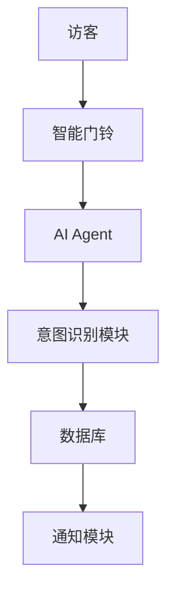
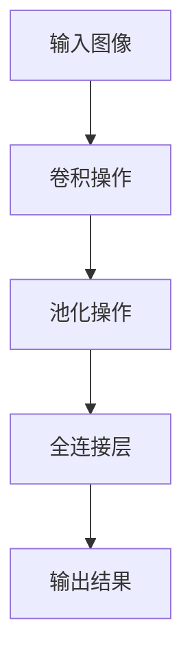
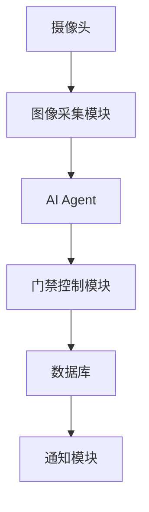

                 


# 智能门铃：AI Agent的访客意图识别系统

## 关键词
智能门铃, AI Agent, 访客意图识别, 图像识别, 语音识别, 机器学习, 物联网

## 摘要
本文深入探讨了智能门铃与AI Agent结合的访客意图识别系统，从系统架构、算法原理到项目实现进行了详细分析。文章首先介绍了背景与核心概念，随后详细讲解了基于卷积神经网络（CNN）的图像识别算法，通过Python代码和mermaid图展示了系统的实现过程。接着，从系统架构设计、接口设计到实际案例分析，进一步阐述了系统的具体实现。最后，文章讨论了系统的优化与扩展，展望了未来的发展方向。

---

## 第1章：智能门铃与AI Agent的背景介绍

### 1.1 问题背景与问题描述
#### 1.1.1 传统门禁系统的局限性
传统门禁系统依赖于钥匙或门禁卡，存在以下问题：
- **安全性**：钥匙或门禁卡容易丢失或被复制。
- **便利性**：访客需要手动输入密码或刷卡，操作繁琐。
- **智能化**：无法主动识别访客身份和意图。

#### 1.1.2 智能门铃的需求场景
智能门铃作为一种新兴的门禁解决方案，适用于以下场景：
- **家庭门禁**：通过手机或平板远程开门。
- **商业场景**：酒店、办公室等场所的访客管理。
- **社区管理**：智能社区的访客登记与门禁控制。

#### 1.1.3 访客意图识别的核心问题
访客意图识别的核心问题是通过AI技术实时识别访客的行为意图，例如：
- **识别身份**：判断访客是否为合法用户。
- **识别意图**：判断访客是否为送快递、拜访或非法入侵。

### 1.2 问题解决与边界定义
#### 1.2.1 AI Agent在访客意图识别中的作用
AI Agent（智能代理）通过以下方式实现访客意图识别：
- **数据采集**：采集访客的图像、声音等数据。
- **数据处理**：通过AI算法分析数据，识别访客意图。
- **决策与反馈**：根据识别结果，控制门禁系统或发出通知。

#### 1.2.2 系统的边界与外延
系统的边界包括：
- **输入**：访客图像、声音等数据。
- **输出**：门禁控制指令、通知信息。
- **外部依赖**：摄像头、麦克风等硬件设备。

系统的外延包括：
- **数据存储**：用户信息、访客记录等。
- **用户界面**：手机APP或网页界面。

#### 1.2.3 核心概念与系统架构
系统架构包括以下核心模块：
- **摄像头模块**：采集访客图像。
- **AI Agent模块**：处理数据并识别意图。
- **门禁控制模块**：根据识别结果控制门禁。

### 1.3 核心概念与系统组成
#### 1.3.1 AI Agent的定义与属性
AI Agent是一种智能代理，具有以下属性：
- **自主性**：能够自主决策。
- **反应性**：能够实时响应输入。
- **学习能力**：能够通过数据优化识别算法。

#### 1.3.2 智能门铃的功能模块
智能门铃的功能模块包括：
- **图像采集模块**：通过摄像头采集访客图像。
- **语音采集模块**：通过麦克风采集访客声音。
- **数据处理模块**：通过AI算法处理数据。
- **门禁控制模块**：根据识别结果控制门禁。

#### 1.3.3 访客意图识别的实现机制
访客意图识别的实现机制包括：
- **图像识别**：通过CNN识别访客身份。
- **语音识别**：通过ASR识别访客意图。
- **决策逻辑**：根据识别结果发出控制指令。

---

## 第2章：智能门铃与AI Agent的核心概念与联系

### 2.1 核心概念原理
#### 2.1.1 AI Agent的基本原理
AI Agent通过以下步骤实现访客意图识别：
1. **数据采集**：采集访客的图像和声音。
2. **数据处理**：通过CNN和ASR处理数据。
3. **决策与反馈**：根据识别结果发出控制指令。

#### 2.1.2 智能门铃的系统架构
智能门铃的系统架构包括以下模块：
- **摄像头模块**：采集访客图像。
- **AI Agent模块**：处理数据并识别意图。
- **门禁控制模块**：根据识别结果控制门禁。

#### 2.1.3 访客意图识别的实现流程
访客意图识别的实现流程如下：
1. **数据采集**：摄像头采集访客图像。
2. **图像识别**：通过CNN识别访客身份。
3. **决策与反馈**：根据识别结果发出控制指令。

### 2.2 核心概念对比表
以下是AI Agent与传统门铃的对比：

| 特性       | AI Agent                     | 传统门铃                   |
|------------|----------------------------|---------------------------|
| 功能       | 实时识别访客意图             | 仅提供门禁控制功能         |
| 智能性     | 具备学习和自主决策能力       | 无智能性，仅机械控制       |
| 便利性     | 提高访客管理效率             | 依赖手动操作，效率低       |

### 2.3 实体关系图
以下是系统实体关系图：



---

## 第3章：访客意图识别的算法原理

### 3.1 算法原理概述
访客意图识别的核心算法是基于卷积神经网络（CNN）的图像识别。

#### 3.1.1 CNN的基本原理
CNN通过以下步骤实现图像识别：
1. **卷积操作**：提取图像特征。
2. **池化操作**：降低计算复杂度。
3. **全连接层**：分类图像。

#### 3.1.2 CNN的数学模型
CNN的数学模型如下：
$$
y = f(Wx + b)
$$
其中，$W$ 是权重矩阵，$x$ 是输入向量，$b$ 是偏置，$f$ 是激活函数。

### 3.2 算法实现
以下是基于CNN的图像识别算法的Python代码：

```python
import tensorflow as tf
from tensorflow.keras import layers

# 定义模型
model = tf.keras.Sequential([
    layers.Conv2D(32, (3,3), activation='relu', input_shape=(64, 64, 3)),
    layers.MaxPooling2D((2,2)),
    layers.Conv2D(64, (3,3), activation='relu'),
    layers.MaxPooling2D((2,2)),
    layers.Flatten(),
    layers.Dense(128, activation='relu'),
    layers.Dense(1, activation='sigmoid')
])

# 编译模型
model.compile(optimizer='adam', loss='binary_crossentropy', metrics=['accuracy'])
```

### 3.3 算法流程图
以下是算法流程图：



---

## 第4章：智能门铃的系统架构设计

### 4.1 问题场景介绍
智能门铃的应用场景包括家庭门禁、商业场所门禁、智能社区门禁等。

### 4.2 系统功能设计
系统功能包括：
- **图像采集**：通过摄像头采集访客图像。
- **图像识别**：通过CNN识别访客意图。
- **门禁控制**：根据识别结果控制门禁。

### 4.3 系统架构设计
以下是系统架构图：



### 4.4 接口设计
系统接口包括：
- **摄像头接口**：采集访客图像。
- **门禁控制接口**：控制门禁系统。
- **通知接口**：发送通知信息。

---

## 第5章：智能门铃的项目实战

### 5.1 环境安装
安装必要的库：
```bash
pip install tensorflow numpy opencv-python
```

### 5.2 系统核心实现
以下是核心代码：

```python
import cv2
import numpy as np

# 图像采集
cap = cv2.VideoCapture(0)
while True:
    ret, frame = cap.read()
    cv2.imshow('摄像头', frame)
    if cv2.waitKey(1) & 0xFF == ord('q'):
        break

# 图像识别
model = tf.keras.Sequential([
    layers.Conv2D(32, (3,3), activation='relu', input_shape=(64, 64, 3)),
    layers.MaxPooling2D((2,2)),
    layers.Conv2D(64, (3,3), activation='relu'),
    layers.MaxPooling2D((2,2)),
    layers.Flatten(),
    layers.Dense(128, activation='relu'),
    layers.Dense(1, activation='sigmoid')
])

model.compile(optimizer='adam', loss='binary_crossentropy', metrics=['accuracy'])

# 门禁控制
def control_door(status):
    if status == 1:
        print("开门")
    else:
        print("不开门")

# 系统运行
while True:
    ret, frame = cap.read()
    cv2.imshow('摄像头', frame)
    if cv2.waitKey(1) & 0xFF == ord('q'):
        break
    prediction = model.predict(frame)
    control_door(prediction[0][0] > 0.5)
```

### 5.3 实际案例分析
实际案例分析包括：
- **快递员识别**：识别快递员并开门。
- **陌生访客识别**：识别陌生人并发出警报。

---

## 第6章：智能门铃的优化与扩展

### 6.1 模型优化
模型优化包括：
- **迁移学习**：利用预训练模型提升识别精度。
- **数据增强**：通过数据增强技术增加训练数据。

### 6.2 多模态数据融合
多模态数据融合包括：
- **图像与语音结合**：通过图像和语音双重识别提高准确率。
- **图像与行为结合**：通过图像和行为双重识别提高准确率。

### 6.3 边缘计算
边缘计算的应用包括：
- **降低延迟**：通过边缘计算减少识别延迟。
- **提高隐私**：通过边缘计算保护用户隐私。

---

## 第7章：总结与展望

### 7.1 总结
本文详细介绍了智能门铃与AI Agent结合的访客意图识别系统，从系统架构、算法原理到项目实现进行了全面分析。

### 7.2 展望
未来，随着AI技术的不断发展，智能门铃的访客意图识别系统将更加智能化和便捷化。

---

## 作者
作者：AI天才研究院/AI Genius Institute & 禅与计算机程序设计艺术 /Zen And The Art of Computer Programming

