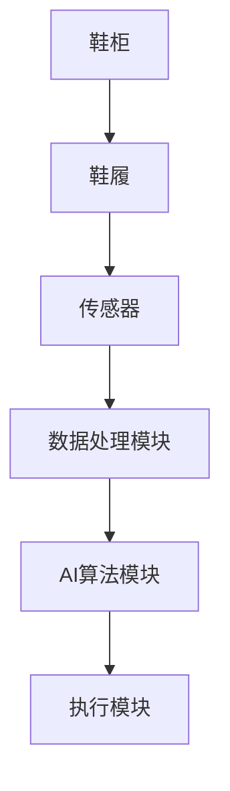
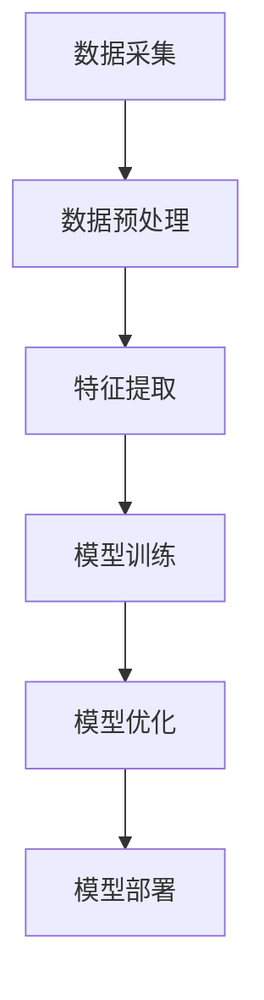
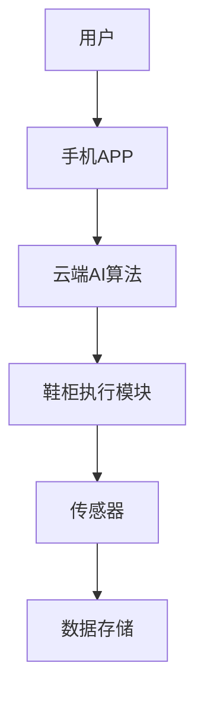

                 


# 智能鞋柜：AI Agent的鞋履除臭与保养指导

## 关键词：智能鞋柜，AI Agent，鞋履除臭，鞋履保养，智能家居

## 摘要：本文将详细介绍智能鞋柜的设计与实现，重点探讨AI Agent在鞋履除臭与保养中的应用。通过分析智能鞋柜的核心技术、算法原理及系统架构，结合实际项目案例，为读者提供深入的技术解读与实践指导。

---

# 第一部分: 智能鞋柜的背景与概念

## 第1章: 智能鞋柜的发展背景

### 1.1 智能鞋柜的定义与特点

智能鞋柜是一种结合了物联网（IoT）和人工智能（AI）技术的智能存储设备，用于鞋履的存放、除臭、保养和管理。其核心特点包括：

- **智能化**：通过AI算法实现自动除臭、智能推荐保养方案。
- **感知能力**：集成多种传感器，实时监测鞋履状态。
- **远程控制**：支持手机APP或语音助手远程操作。

### 1.2 智能鞋柜的市场现状

随着智能家居的普及，智能鞋柜逐渐成为家庭必备的智能设备。市场上的产品主要集中在以下方面：

- **技术优势**：AI算法的应用使得鞋柜能够主动感知鞋履状态。
- **用户需求**：消费者对鞋履的保养和除臭需求日益增长。
- **市场竞争**：各大品牌纷纷推出智能鞋柜产品，市场竞争激烈。

### 1.3 智能鞋柜的技术发展趋势

未来，智能鞋柜将朝着以下几个方向发展：

- **AI算法优化**：提升除臭和保养算法的准确性。
- **传感器升级**：引入更先进的传感器技术，提高监测精度。
- **智能交互**：增强人机交互体验，例如通过语音助手进行操作。

---

## 第2章: AI Agent的基本原理

### 2.1 AI Agent的定义与特点

AI Agent是一种能够感知环境、自主决策并执行任务的智能体。其特点包括：

- **自主性**：无需人工干预，自动完成任务。
- **反应性**：能够实时感知环境变化并做出反应。
- **学习能力**：通过数据不断优化自身的算法。

### 2.2 智能鞋柜中的AI Agent架构

智能鞋柜的AI Agent架构分为三个主要模块：

- **感知模块**：通过传感器采集鞋履的状态数据。
- **决策模块**：基于数据进行分析，生成除臭和保养方案。
- **执行模块**：根据决策结果执行相应的操作。

### 2.3 智能鞋柜中的实体关系分析

以下是智能鞋柜中的实体关系分析：



---

# 第三部分: 智能鞋柜的算法原理

## 第3章: 鞋履除臭算法原理

### 3.1 除臭算法的基本原理

除臭算法基于以下数学模型：

$$
\text{除臭效果} = f(\text{气味强度}, \text{环境湿度}, \text{温度})
$$

其中，$f$ 是AI算法的核心函数，通过学习数据优化模型参数。

### 3.2 除臭算法的实现步骤

以下是除臭算法的实现步骤：



以下是核心代码实现：

```python
def臭味强度计算：
    # 传感器数据
    气味强度 = 传感器读取数据()
    环境湿度 = 湿度传感器读取数据()
    温度 = 温度传感器读取数据()
    
    # 计算除臭效果
    除臭效果 = 1 - (气味强度 * 环境湿度 * 温度) / 1000
    return 除臭效果
```

### 3.3 除臭算法的数学模型

以下是除臭算法的数学模型：

$$
\text{除臭效果} = 1 - \frac{\text{气味强度} \times \text{环境湿度} \times \text{温度}}{1000}
$$

---

## 第4章: 鞋履保养推荐算法原理

### 4.1 保养推荐算法的基本原理

保养推荐算法基于以下数学模型：

$$
\text{保养建议} = g(\text{鞋履材质}, \text{使用频率}, \text{环境因素})
$$

其中，$g$ 是AI算法的核心函数，通过学习数据优化模型参数。

### 4.2 保养推荐算法的实现步骤

以下是保养推荐算法的实现步骤：


以下是核心代码实现：

```python
def保养建议推荐：
    # 传感器数据
    鞋履材质 = 读取材质信息()
    使用频率 = 统计使用频率()
    环境因素 = 读取环境数据()
    
    # 生成保养建议
    保养建议 = {
        "清洁频率": 使用频率 / 2,
        "除湿建议": 环境湿度 > 60 ? "建议除湿" : "无需除湿",
        "材质护理": 根据材质推荐护理方法
    }
    return 保养建议
```

---

# 第四部分: 智能鞋柜的系统分析与架构设计

## 第5章: 智能鞋柜系统功能设计

### 5.1 系统功能需求分析

智能鞋柜的主要功能包括：

- **鞋履存取**：支持鞋履的存入和取出。
- **除臭功能**：自动检测鞋履气味并进行除臭。
- **保养推荐**：根据鞋履状态推荐保养方案。
- **远程控制**：支持手机APP或语音助手远程操作。

### 5.2 系统架构设计

以下是智能鞋柜的系统架构图：



### 5.3 系统接口设计

智能鞋柜的主要接口包括：

- **传感器接口**：连接湿度、温度等传感器。
- **网络接口**：支持Wi-Fi或蓝牙连接。
- **用户接口**：手机APP或语音助手。

### 5.4 系统交互设计

以下是系统交互流程图：


---

## 第6章: 智能鞋柜的系统实现

### 6.1 环境安装

安装环境包括：

- **硬件**：智能鞋柜、传感器、Wi-Fi模块。
- **软件**：Python编程语言、AI算法框架（如TensorFlow）。

### 6.2 核心代码实现

以下是核心代码实现：

```python
class SmartShoeCabinet:
    def __init__(self):
        self.sensors = SensorModule()
        self.ai_agent = AIAgent()
        self.executor = ExecutorModule()

    def operate(self, command):
        # 根据命令执行操作
        if command == "除臭":
            self.ai_agent.run臭味算法()
        elif command == "保养":
            self.ai_agent.run保养算法()
```

### 6.3 项目实战案例分析

以下是实际案例分析：

- **案例1**：用户反馈鞋履有异味，系统自动启动除臭功能。
- **案例2**：用户频繁使用鞋履，系统推荐定期清洁保养。

---

## 第7章: 智能鞋柜的最佳实践

### 7.1 使用技巧

- 定期清洁鞋柜，确保传感器正常工作。
- 更新AI算法模型，提升除臭和保养效果。

### 7.2 维护建议

- 定期检查传感器和网络连接，确保系统正常运行。
- 及时更新软件版本，获取最新功能和优化。

### 7.3 安全注意事项

- 避免高温和潮湿环境，防止设备损坏。
- 确保电源供应稳定，防止断电导致数据丢失。

### 7.4 未来趋势

未来，智能鞋柜将更加智能化，AI算法将更加精准，功能也将更加多样化。

---

# 作者：AI天才研究院/AI Genius Institute & 禅与计算机程序设计艺术 /Zen And The Art of Computer Programming

---

**本文为技术博客文章，转载请注明出处。**

