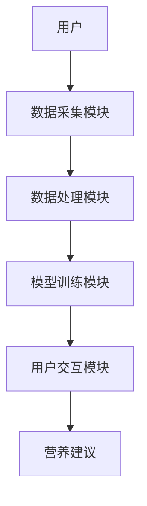

                 


# 智能餐桌：AI Agent的营养均衡建议

---

## 关键词：AI Agent, 营养均衡, 智能餐桌, 健康饮食, 数据分析

---

## 摘要：  
随着人工智能技术的快速发展，AI Agent在营养均衡建议领域的应用越来越广泛。本文将详细探讨AI Agent如何通过智能餐桌帮助用户实现健康饮食，从背景、概念、算法原理到系统架构设计，再到实际案例分析，全面解析智能餐桌的核心功能和实现方式。通过本文，读者可以深入了解AI在营养均衡建议中的应用，掌握如何利用AI技术优化饮食结构。

---

## 第一部分: 智能餐桌的背景与概念

### 第1章: 营养均衡与智能餐桌概述

#### 1.1 营养均衡的重要性
##### 1.1.1 营养失衡的现状与问题  
现代社会中，由于饮食习惯的改变和生活节奏的加快，营养失衡问题日益严重。许多人因为饮食不均衡而导致健康问题，如肥胖、糖尿病、高血压等。营养均衡是维持身体健康的基础，但如何实现个性化、科学化的营养均衡建议，是当前面临的重要挑战。

##### 1.1.2 营养均衡的核心原则  
营养均衡的核心在于合理搭配六大营养素（碳水化合物、蛋白质、脂肪、维生素、矿物质和水）的比例，确保人体摄入的营养素既能满足身体需求，又不会过量或不足。不同人群（如儿童、成年人、老年人）的营养需求有所不同，因此营养建议需要具备个性化和动态调整的特点。

##### 1.1.3 智能餐桌的定义与目标  
智能餐桌是一种结合人工智能技术的饮食解决方案，通过AI Agent实时分析用户的饮食数据，提供个性化的营养均衡建议。其目标是帮助用户在日常饮食中实现营养均衡，预防疾病，提升健康水平。

---

#### 1.2 AI Agent在营养建议中的应用
##### 1.2.1 AI Agent的基本概念  
AI Agent（人工智能代理）是一种能够感知环境、执行任务并做出决策的智能体。在营养建议领域，AI Agent可以通过分析用户的饮食数据，提供个性化的建议和推荐。

##### 1.2.2 AI Agent在营养均衡中的优势  
AI Agent能够快速处理大量数据，通过机器学习算法不断优化营养建议的准确性。与传统的营养建议方法相比，AI Agent具有以下优势：  
1. **个性化推荐**：根据用户的饮食习惯、健康状况和营养需求，提供个性化的建议。  
2. **实时反馈**：能够实时分析用户的饮食数据，提供即时反馈和调整建议。  
3. **动态优化**：通过持续学习用户的饮食行为，不断优化营养建议的准确性。

##### 1.2.3 智能餐桌的用户需求分析  
智能餐桌的目标用户包括普通用户、健身爱好者、慢性病患者等不同群体。用户的核心需求包括：  
1. **个性化营养建议**：根据个人情况推荐合适的饮食方案。  
2. **实时监测与反馈**：实时监测饮食情况并提供反馈。  
3. **便捷性**：操作简单，使用方便。  

---

#### 1.3 智能餐桌的核心功能与边界
##### 1.3.1 核心功能模块  
智能餐桌的核心功能包括：  
1. **数据采集**：收集用户的饮食数据，如摄入的热量、营养素种类和数量。  
2. **数据分析**：通过AI算法分析数据，识别营养失衡问题。  
3. **个性化建议**：根据分析结果，提供营养均衡的建议和推荐食谱。  
4. **用户交互**：通过用户友好的界面与用户互动，提供实时反馈。  

##### 1.3.2 边界与外延  
智能餐桌的边界在于其功能范围，主要集中在饮食建议和营养分析方面。其外延可以扩展到健康监测、疾病预防等领域，但本文将重点围绕营养均衡建议展开。

##### 1.3.3 用户体验与交互设计  
用户体验是智能餐桌成功的关键。界面设计需要简洁直观，功能操作需要便捷高效。交互设计应注重用户反馈的即时性和准确性，确保用户能够轻松理解和使用系统。

---

## 1.4 本章小结  
本章从营养均衡的重要性出发，介绍了AI Agent在营养建议中的应用，分析了智能餐桌的核心功能和用户需求，明确了智能餐桌的目标和边界。下一章将详细探讨AI Agent的核心概念与原理，以及如何通过算法实现营养均衡建议。

---

## 第二部分: AI Agent的核心概念与原理

### 第2章: AI Agent的基本原理

#### 2.1 AI Agent的核心概念  
AI Agent是一种能够感知环境、执行任务并做出决策的智能体。在营养建议领域，AI Agent通过分析用户的饮食数据，提供个性化的建议和推荐。

---

#### 2.2 营养均衡的数学模型  
营养均衡的核心在于合理搭配六大营养素的比例。通过数学模型可以量化用户的饮食情况，识别营养失衡问题，并提出优化建议。

##### 2.2.1 营养均衡的约束条件  
$$ \text{能量摄入} = \text{碳水化合物} \times 4 + \text{蛋白质} \times 4 + \text{脂肪} \times 9 $$  

##### 2.2.2 营养均衡的优化目标  
$$ \text{目标函数} = \min \sum_{i=1}^{n} (\text{实际摄入量}_i - \text{推荐摄入量}_i)^2 $$  

##### 2.2.3 数学模型的构建与求解  
通过线性规划等优化算法，可以找到满足营养均衡条件的最佳饮食方案。例如，使用Python中的`scipy.optimize`库进行优化计算。

---

#### 2.3 AI Agent的决策机制  
AI Agent可以通过规则引擎、机器学习和强化学习等多种方式实现决策。在营养建议中，基于机器学习的决策模型（如随机森林）可以更好地适应用户需求。

##### 2.3.1 基于规则的决策  
通过预定义的规则（如“每天摄入的蛋白质应占总热量的20%-30%”）进行简单的判断和推荐。

##### 2.3.2 基于机器学习的决策  
通过训练数据集，模型可以学习用户的饮食习惯和偏好，提供个性化的建议。

##### 2.3.3 基于强化学习的决策  
通过与用户的互动，模型可以不断调整建议策略，优化用户体验。

---

#### 2.4 本章小结  
本章从AI Agent的基本原理出发，详细介绍了营养均衡的数学模型和决策机制。下一章将探讨系统的架构设计和算法实现。

---

## 第三部分: 系统架构与算法实现

### 第3章: 系统架构设计

#### 3.1 系统功能模块划分  
智能餐桌系统主要包括以下功能模块：  
1. **数据采集模块**：收集用户的饮食数据。  
2. **数据处理模块**：对数据进行清洗和预处理。  
3. **模型训练模块**：基于数据训练营养均衡模型。  
4. **用户交互模块**：与用户进行互动，提供反馈和建议。  

##### 3.1.1 数据采集模块  
数据采集可以通过用户输入（如拍照识别食物、手动输入饮食记录）或连接智能设备（如智能秤、智能餐具）实现。

##### 3.1.2 数据处理模块  
数据处理包括数据清洗、特征提取和数据转换。例如，将食物的热量和营养成分转换为统一的单位。

##### 3.1.3 模型训练模块  
通过机器学习算法（如随机森林、支持向量机）对数据进行训练，构建营养均衡模型。

##### 3.1.4 用户交互模块  
通过图形界面或语音交互与用户进行互动，提供个性化的营养建议。

---

#### 3.2 系统架构图  
以下是系统的总体架构图：



---

#### 3.3 系统接口设计  
系统接口包括数据接口（与智能设备连接）、模型接口（与第三方服务对接）和用户接口（与用户交互）。

---

#### 3.4 本章小结  
本章详细介绍了智能餐桌系统的架构设计，包括功能模块划分和系统架构图。下一章将重点讲解算法原理与数学模型。

---

## 第四部分: 算法原理与数学模型

### 第4章: 营养均衡的数学模型

#### 4.1 营养均衡的优化目标  
营养均衡的核心是找到满足用户需求的最佳饮食方案。通过线性规划等优化算法，可以实现这一目标。

##### 4.1.1 营养均衡的约束条件  
$$ \text{总热量} \leq \text{每日推荐摄入量} $$  
$$ \text{蛋白质摄入量} \geq \text{最低需求量} $$  

##### 4.1.2 营养均衡的优化目标  
$$ \text{目标函数} = \min \sum_{i=1}^{n} (\text{实际摄入量}_i - \text{推荐摄入量}_i)^2 $$  

---

#### 4.2 AI Agent的决策算法  
AI Agent可以通过多种算法实现决策，其中基于随机森林的决策模型在营养建议中表现优异。

##### 4.2.1 线性规划模型  
通过线性规划可以找到满足营养均衡条件的最优解。例如，使用Python中的`pulp`库进行建模。

##### 4.2.2 随机森林模型  
随机森林是一种强大的机器学习算法，适用于分类和回归问题。在营养建议中，可以用于预测用户的营养需求。

##### 4.2.3 神经网络模型  
神经网络模型（如深度学习模型）可以处理复杂的饮食数据，提供个性化的建议。

---

#### 4.3 算法实现的数学公式  
以下是一个简单的线性规划模型：

$$ \text{最大化/最小化} \sum_{i=1}^{n} c_i x_i $$  
$$ \text{约束条件} $$  
$$ \sum_{i=1}^{n} a_i x_i = b $$  

其中，$c_i$ 是目标函数的系数，$x_i$ 是决策变量，$a_i$ 和 $b$ 是约束条件的系数。

---

## 第五部分: 项目实战

### 第5章: 项目实战

#### 5.1 环境安装与配置  
要运行智能餐桌系统，需要安装以下工具：  
1. Python 3.8+  
2. NumPy、Pandas、Scikit-learn等库  
3. Mermaid图生成工具  

#### 5.2 核心代码实现  
以下是营养均衡模型的核心代码示例：

```python
import numpy as np
from sklearn.ensemble import RandomForestRegressor

# 数据预处理
data = pd.read_csv('diet_data.csv')
X = data.drop('label', axis=1)
y = data['label']

# 训练模型
model = RandomForestRegressor(n_estimators=100)
model.fit(X, y)

# 预测
new_data = X.iloc[-1].values.reshape(1, -1)
prediction = model.predict(new_data)
```

---

#### 5.3 系统交互设计  
通过图形界面或语音交互，用户可以方便地输入饮食数据，系统实时生成营养建议。

---

## 第六部分: 最佳实践与总结

### 第6章: 最佳实践

#### 6.1 小结  
智能餐桌通过AI Agent实现了个性化的营养均衡建议，帮助用户实现健康饮食。

#### 6.2 注意事项  
1. 数据隐私保护至关重要。  
2. 系统需要不断优化，以适应用户的需求变化。  
3. 用户教育和培训有助于提高系统的使用效果。

#### 6.3 拓展阅读  
推荐阅读《机器学习实战》和《深度学习入门》等书籍，深入理解AI技术的应用。

---

## 作者：AI天才研究院/AI Genius Institute & 禅与计算机程序设计艺术 /Zen And The Art of Computer Programming  

---

以上是《智能餐桌：AI Agent的营养均衡建议》的技术博客文章的完整内容。

