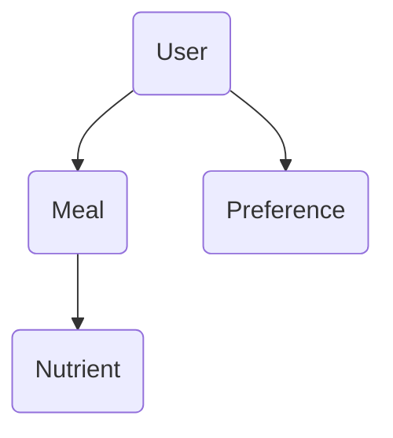
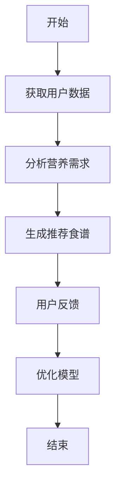
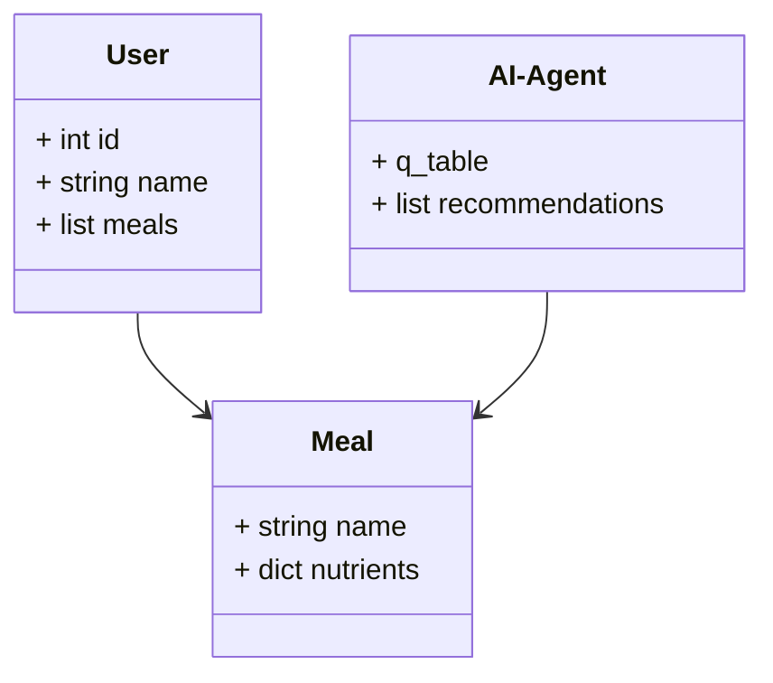
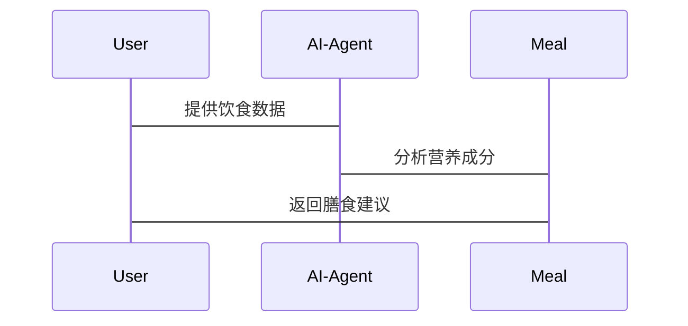

                 


# 智能餐盘：AI Agent的膳食均衡指导系统

## 关键词：AI Agent、膳食均衡、智能系统、健康管理、机器学习、推荐算法

## 摘要：  
智能餐盘是一个结合人工智能技术的膳食均衡指导系统，通过AI Agent分析用户的饮食习惯、营养需求和健康目标，提供个性化的膳食建议。本文详细探讨了AI Agent的核心原理、算法实现、系统架构设计，以及实际项目中的应用场景，旨在为读者提供一个全面的技术视角，帮助他们理解如何利用AI技术改善膳食管理。

---

## 第一部分：背景介绍

### 第1章：膳食均衡与AI技术的结合

#### 1.1 问题背景  
随着生活水平的提高，人们对健康的关注日益增加，但膳食不均衡的问题依然普遍存在。AI技术的快速发展为解决这一问题提供了新的可能性。

#### 1.2 问题描述  
膳食均衡是指摄入的食物中各类营养素的比例合理，以满足身体需求。然而，现代人由于饮食习惯、生活方式等因素，往往难以实现膳食均衡。

#### 1.3 问题解决  
AI Agent通过分析用户的饮食数据，提供个性化的膳食建议，帮助用户实现均衡饮食。

#### 1.4 边界与外延  
智能餐盘系统仅关注膳食建议，不涉及医疗诊断或其他健康领域。

#### 1.5 概念结构与核心要素  
系统包括用户数据、AI算法、膳食建议生成模块等核心组成部分。

---

## 第二部分：核心概念与联系

### 第2章：AI Agent的核心原理

#### 2.1 核心概念原理  
AI Agent通过强化学习和推荐算法，分析用户数据，优化膳食建议。

#### 2.2 概念属性对比表  
| 概念    | 描述                              |
|---------|----------------------------------|
| 用户    | 系统的服务对象                  |
| 餐盘    | 数据采集和显示设备              |
| 营养成分 | 食物中的基本营养单位            |

#### 2.3 ER实体关系图  


---

## 第三部分：算法原理讲解

### 第3章：AI Agent的算法实现

#### 3.1 算法流程图  


#### 3.2 Python代码实现  
```python
import numpy as np
import pandas as pd

# 示例代码：基于强化学习的AI Agent
class AI-Agent:
    def __init__(self):
        self.q_table = np.zeros((4, 2))

    def choose_action(self, state):
        # 简化版Q-learning选择动作
        if np.random.random() < 0.9:
            return np.argmax(self.q_table[state, :])
        else:
            return np.random.randint(0, 2)

    def update_q_table(self, state, action, reward, next_state):
        # 更新Q值表
        self.q_table[state, action] += 0.1 * (reward + np.max(self.q_table[next_state, :]))
```

#### 3.3 数学模型与公式  
强化学习的Q值更新公式：  
$$ Q(s, a) = Q(s, a) + \alpha \times [r + \max Q(s', a') - Q(s, a)] $$

---

## 第四部分：系统分析与架构设计

### 第4章：系统设计与架构

#### 4.1 问题场景介绍  
用户通过智能餐盘输入饮食数据，系统生成膳食建议。

#### 4.2 系统功能设计  
- 用户管理模块  
- 膳食建议生成模块  
- 数据采集模块  

#### 4.3 领域模型类图  


#### 4.4 系统架构设计  
分层架构：数据层、业务逻辑层、用户界面层。

#### 4.5 接口设计与交互流程图  


---

## 第五部分：项目实战

### 第5章：智能餐盘的实现

#### 5.1 环境安装  
安装Python和相关库，如TensorFlow、Keras。

#### 5.2 核心代码实现  
```python
def generate_recommendations(user_data):
    # 基于协同过滤的推荐算法
    user_preference = user_data['preference']
    recommended_meals = []
    for meal in meal_database:
        if meal.nutrients匹配用户需求：
            recommended_meals.append(meal)
    return recommended_meals
```

#### 5.3 案例分析  
根据用户数据，系统生成个性化的膳食建议，并解释推荐理由。

---

## 第六部分：最佳实践与小结

### 第6章：总结与展望

#### 6.1 最佳实践 tips  
- 数据隐私保护  
- 系统优化建议  

#### 6.2 小结  
智能餐盘通过AI技术实现膳食均衡指导，为用户提供了科学的饮食建议。

#### 6.3 注意事项  
确保数据准确性和系统安全性。

#### 6.4 拓展阅读  
推荐相关领域的书籍和论文。

---

## 作者：AI天才研究院 & 禅与计算机程序设计艺术

---

### 总结：  
《智能餐盘：AI Agent的膳食均衡指导系统》系统地介绍了AI技术在膳食指导中的应用，通过理论与实践相结合的方式，帮助读者理解如何利用AI改善饮食健康。

