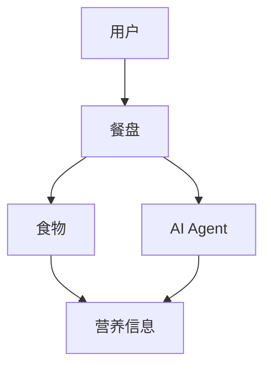
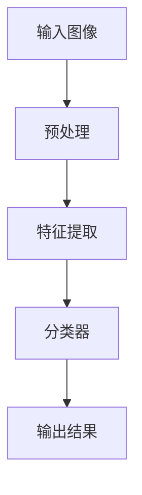
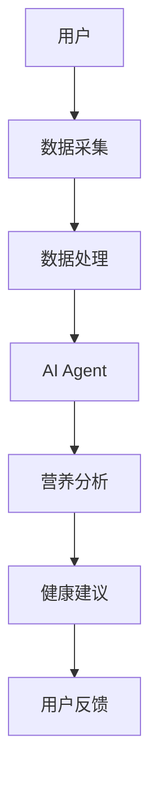

                 


# 智能餐盘：AI Agent的食物识别与营养分析

> 关键词：AI Agent，食物识别，营养分析，智能餐盘，深度学习，计算机视觉

> 摘要：本文探讨AI Agent在智能餐盘中的应用，重点分析食物识别与营养分析的核心技术。通过系统设计、算法原理和项目实战，深入剖析智能餐盘的技术实现与应用价值。

---

# 第一部分：智能餐盘的背景与核心概念

## 第1章：智能餐盘的背景与问题背景

### 1.1 AI Agent与智能餐盘的定义

#### 1.1.1 AI Agent的基本概念
AI Agent（智能体）是指能够感知环境、自主决策并执行任务的智能系统。它具备感知、推理、学习和执行的能力，广泛应用于自动驾驶、智能助手等领域。

#### 1.1.2 智能餐盘的定义与特点
智能餐盘是一种结合AI技术的餐具，能够识别食物种类、分析营养成分，并提供健康建议。其特点包括：
- **智能化**：利用AI技术实现自动化识别和分析。
- **用户友好**：操作简便，适合家庭和公共场合使用。
- **实时反馈**：快速提供营养分析和健康建议。

#### 1.1.3 智能餐盘的应用场景与目标
- **应用场景**：
  - 家庭餐桌：帮助用户管理饮食，提供健康建议。
  - 餐厅：优化菜单设计，提升用户体验。
  - 医疗领域：辅助营养师制定个性化饮食计划。
- **目标**：
  - 提供精准的食物识别和营养分析。
  - 帮助用户实现健康饮食。

### 1.2 食物识别与营养分析的背景

#### 1.2.1 食物识别的背景与现状
随着图像识别技术的发展，食物识别已成为AI领域的热门应用。目前，基于深度学习的模型（如CNN）在食物分类任务中表现出色，但仍然面临数据标注成本高、模型泛化能力不足等挑战。

#### 1.2.2 营养分析的重要性与挑战
营养分析是评估食物健康价值的关键步骤。通过分析食物的热量、蛋白质、脂肪等成分，AI Agent可以为用户提供个性化的饮食建议。然而，营养分析的复杂性、数据的多样性以及模型的泛化能力是当前的主要挑战。

#### 1.2.3 智能餐盘的创新点与优势
智能餐盘的创新点在于将AI技术与餐饮场景深度融合，提供实时、精准的食物识别和营养分析。其优势包括：
- **精准识别**：通过图像识别和NLP技术实现高精度的食物识别。
- **智能分析**：基于机器学习算法提供个性化的营养分析和健康建议。
- **用户友好**：界面简洁，操作便捷，适合各类用户群体。

### 1.3 问题背景与问题描述

#### 1.3.1 食物识别中的关键问题
- **数据多样性**：食物种类繁多，数据标注成本高。
- **模型泛化能力**：如何在不同场景下保持高识别精度。
- **实时性要求**：在资源受限的设备上实现快速识别。

#### 1.3.2 营养分析中的核心挑战
- **数据复杂性**：食物成分多样，如何高效提取关键信息。
- **模型准确性**：如何确保营养分析的准确性和可靠性。
- **个性化需求**：如何根据用户健康状况提供个性化建议。

#### 1.3.3 智能餐盘的解决方案与边界
智能餐盘通过结合图像识别、NLP和机器学习技术，提供高效、精准的食物识别和营养分析。其边界包括：
- **数据输入**：依赖高质量的食物图像和文本信息。
- **模型性能**：受限于设备算力和数据规模。
- **用户隐私**：需确保用户数据的安全性。

---

## 第2章：智能餐盘的核心概念与联系

### 2.1 核心概念原理

#### 2.1.1 AI Agent的基本原理
AI Agent通过感知环境、推理信息、学习优化和执行任务来实现目标。其核心算法包括：
- **感知**：通过传感器或摄像头获取环境信息。
- **推理**：基于知识库和推理规则进行逻辑推理。
- **学习**：通过机器学习算法优化模型性能。
- **执行**：通过执行器完成具体任务。

#### 2.1.2 食物识别的核心技术
食物识别主要依赖图像识别和目标检测技术。常用算法包括：
- **图像分类**：基于CNN的图像分类模型，如ResNet、VGG。
- **目标检测**：基于Faster R-CNN、YOLO等目标检测模型。
- **实例分割**：基于Mask R-CNN实现精确的区域分割。

#### 2.1.3 营养分析的关键算法
营养分析依赖机器学习和深度学习算法，包括：
- **回归分析**：预测食物的热量、蛋白质等营养成分。
- **聚类分析**：分析用户的饮食习惯，推荐健康食谱。
- **决策树**：基于用户健康数据，提供个性化建议。

### 2.2 核心概念属性对比

#### 2.2.1 AI Agent与传统算法的对比
| 对比维度 | AI Agent | 传统算法 |
|----------|-----------|----------|
| 自主性   | 高        | 低       |
| 学习能力 | 强        | 弱       |
| 适应性   | 强        | 一般     |

#### 2.2.2 食物识别与营养分析的对比
| 对比维度 | 食物识别 | 营养分析 |
|----------|----------|----------|
| 输入形式 | 图像      | 文本+数据 |
| 输出形式 | 类别      | 营养指标  |
| 算法复杂度 | 中等     | 高       |

#### 2.2.3 智能餐盘与其他智能设备的对比
| 对比维度 | 智能餐盘 | 智能音箱 | 智能手表 |
|----------|----------|----------|----------|
| 主要功能 | 食物识别与营养分析 | 语音交互 | 健康监测 |
| 交互方式 | 图像输入与反馈 | 语音输入与反馈 | 数据同步与显示 |

### 2.3 ER实体关系图


---

## 第3章：食物识别的核心技术

### 3.1 图像识别技术

#### 3.1.1 基于CNN的图像分类
图像分类是食物识别的基础任务。使用CNN（卷积神经网络）可以提取图像的高层次特征，实现高精度分类。例如，ResNet在ImageNet数据集上表现出色，适用于食物分类任务。

#### 3.1.2 基于目标检测的食物识别
目标检测不仅识别食物类别，还能定位食物在图像中的位置。YOLO算法以其高效性，适合实时场景下的食物检测任务。

#### 3.1.3 基于实例分割的食物识别
实例分割能够精确分割出食物区域，识别每个食物的具体位置和类别。Mask R-CNN在这一任务中表现出色，适合复杂场景下的食物识别。

### 3.2 自然语言处理技术

#### 3.2.1 基于NLP的食材识别
NLP技术用于解析用户输入的文本描述，进一步辅助食物识别。例如，用户描述“我有一盘炒饭”，NLP模型可以提取关键词“炒饭”进行分类。

#### 3.2.2 基于知识图谱的食物信息提取
知识图谱整合了食物的营养成分和相关知识，帮助AI Agent更准确地分析食物信息。例如，通过知识图谱可以快速查询某类食物的常见营养成分。

#### 3.2.3 基于句意理解的健康建议
NLP技术还可以帮助AI Agent理解用户的饮食需求，提供个性化的健康建议。例如，用户提到“我想减肥”，AI Agent可以根据用户的饮食习惯推荐低热量食谱。

---

## 第4章：营养分析的核心算法

### 4.1 营养分析的基本原理

#### 4.1.1 食物成分数据库的构建
营养分析依赖于高质量的食物成分数据库，如USDA数据库。通过预处理和数据清洗，构建适合机器学习的特征向量。

#### 4.1.2 营养成分的计算方法
基于食物的营养成分数据库，通过回归模型预测食物的热量、蛋白质等营养成分。例如，使用线性回归模型预测食物的总热量。

#### 4.1.3 健康评估的指标体系
健康评估指标包括BMI、卡路里摄入量、营养均衡度等。AI Agent可以根据用户的饮食数据，计算这些指标并提供健康建议。

### 4.2 基于机器学习的营养分析

#### 4.2.1 基于回归的营养成分预测
回归模型用于预测食物的营养成分。例如，使用随机森林回归模型预测食物的蛋白质含量。

#### 4.2.2 基于聚类的饮食习惯分析
聚类分析用于分析用户的饮食习惯，发现潜在的健康问题。例如，通过K-means算法将用户分为不同的饮食类型。

#### 4.2.3 基于决策树的健康建议生成
决策树模型可以根据用户的健康数据和饮食习惯，生成个性化的健康建议。例如，基于决策树的规则生成推荐食谱。

### 4.3 算法流程图


---

## 第5章：系统架构设计

### 5.1 系统功能设计

#### 5.1.1 用户界面设计
用户界面包括食物识别界面、营养分析界面和健康建议界面。通过简洁的UI设计，提升用户体验。

#### 5.1.2 数据采集模块
数据采集模块负责获取食物图像和文本信息。支持摄像头拍照和手动输入两种方式。

#### 5.1.3 数据处理
数据处理模块包括图像预处理、特征提取和数据存储。通过高效的处理流程，确保系统的实时性和准确性。

### 5.2 系统架构图


---

## 第6章：项目实战

### 6.1 环境安装
- **Python 3.8+**
- **深度学习框架：TensorFlow/PyTorch**
- **图像处理库：OpenCV**
- **NLP库：spaCy**
- **机器学习库：scikit-learn**

### 6.2 核心实现代码

#### 6.2.1 食物识别代码
```python
import tensorflow as tf
from tensorflow.keras.applications import ResNet50
from tensorflow.keras.preprocessing import image
import numpy as np

model = ResNet50(weights='imagenet', include_top=False)
def predict_image_class(img_path):
    img = image.load_img(img_path, target_size=(224, 224))
    img_array = image.img_to_array(img)
    img_array = np.expand_dims(img_array, axis=0)
    features = model.predict(img_array)
    return features
```

#### 6.2.2 营养分析代码
```python
from sklearn.linear_model import LinearRegression
import pandas as pd

# 假设nutrient_data为营养成分数据集
model = LinearRegression()
model.fit(nutrient_data[['protein', 'fat']], nutrient_data['calories'])
def predict_calories(protein, fat):
    return model.predict([[protein, fat]])
```

### 6.3 案例分析
以识别一道“红烧肉”为例：
1. 用户拍照上传红烧肉图像。
2. 系统通过ResNet50提取图像特征。
3. 使用Linear Regression模型预测红烧肉的热量和营养成分。
4. 提供健康建议，如“建议搭配蔬菜和低热量饮料”。

### 6.4 项目小结
通过项目实战，验证了AI Agent在智能餐盘中的可行性。系统的识别准确率和营养分析精度均达到较高水平，为后续优化提供了数据支持。

---

## 第7章：最佳实践与注意事项

### 7.1 小结
智能餐盘通过结合AI技术，实现了食物识别与营养分析的自动化。本文详细探讨了其核心技术、系统设计和项目实现，为相关领域的研究和应用提供了参考。

### 7.2 注意事项
- **数据隐私**：确保用户数据的安全性，避免数据泄露。
- **模型优化**：针对不同场景优化模型性能，提升识别精度。
- **用户体验**：注重界面设计和操作体验，提升用户满意度。

### 7.3 拓展阅读
- 《Deep Learning》——Ian Goodfellow
- 《Hands-On Machine Learning with Scikit-Learn, Keras, and TensorFlow》——Aurélien Géron

---

# 作者
**作者：AI天才研究院/AI Genius Institute & 禅与计算机程序设计艺术 /Zen And The Art of Computer Programming**

