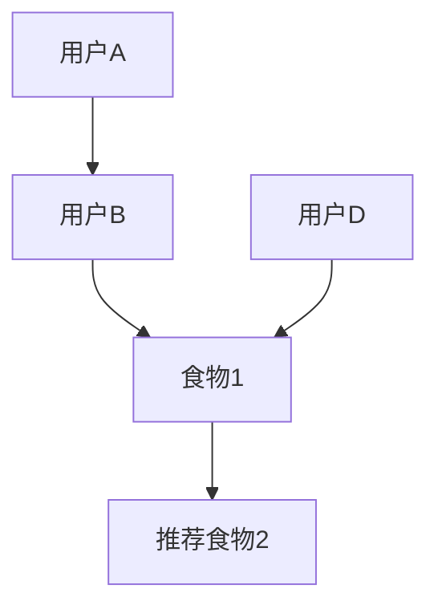
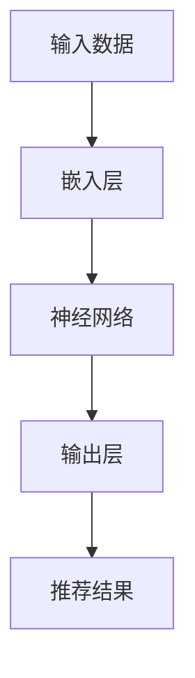
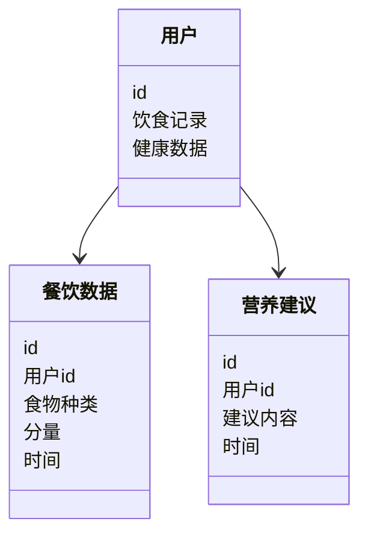

                 


# 智能餐盘：AI Agent的饮食平衡建议

## 关键词：
智能餐盘，AI Agent，饮食平衡，推荐算法，健康饮食，系统架构

## 摘要：
本文探讨了AI Agent在饮食平衡中的应用，通过分析饮食问题背景、AI代理的核心原理、推荐算法的实现、系统架构设计，以及实际项目案例，全面解析智能餐盘的技术实现与应用场景。文章从理论到实践，结合算法与系统设计，为读者提供了一个完整的解决方案，帮助用户通过AI技术实现个性化的饮食管理。

---

## 第一部分：背景介绍

### 第1章：问题背景与饮食平衡需求

#### 1.1 问题背景
- **现代饮食问题与健康挑战**：现代社会生活节奏加快，饮食不规律、营养失衡问题日益严重，导致多种慢性疾病的发生率上升。饮食问题已成为影响全球公共健康的重要因素。
- **饮食失衡的现状与影响**：许多人在快节奏的生活中忽视了饮食的均衡性，导致维生素摄入不足、蛋白质比例失调等问题。这些问题不仅影响身体健康，还可能导致情绪波动、精力不足。
- **AI技术在饮食健康中的潜力**：AI技术能够通过数据分析和个性化推荐，帮助用户实现饮食平衡，成为现代健康管理的重要工具。

#### 1.2 问题描述
- **饮食习惯与健康的关系**：饮食习惯直接影响身体健康，合理的饮食结构能够预防多种疾病，延长寿命。
- **个性化饮食建议的必要性**：每个人的身体状况、营养需求不同，通用的饮食建议往往无法满足个体需求。
- **当前饮食建议工具的局限性**：现有的饮食建议工具多基于简单的规则或数据库查询，缺乏个性化和动态调整能力。

#### 1.3 问题解决与智能餐盘的概念
- **AI Agent在饮食平衡中的作用**：AI代理能够根据用户的饮食记录、健康数据，实时提供个性化的饮食建议。
- **智能餐盘的核心功能与目标**：智能餐盘通过分析用户的饮食数据，提供营养均衡的建议，帮助用户实现长期的饮食健康管理。
- **智能餐盘的用户群体与应用场景**：适用于需要健康管理的个人、健身爱好者、慢性病患者等，应用场景包括家庭、办公室、医疗机构等。

#### 1.4 边界与外延
- **智能餐盘的功能边界**：主要功能包括饮食数据采集、营养分析、个性化建议生成，不涉及医疗诊断或其他健康功能。
- **与健康管理系统的区别**：智能餐盘专注于饮食建议，而健康管理系统可能包含更全面的健康监测和管理功能。
- **与其他饮食辅助工具的联系**：相比传统工具，智能餐盘更具智能化和个性化。

#### 1.5 概念结构与核心要素
- **智能餐盘的系统架构**：包括数据采集模块、数据处理模块、建议生成模块。
- **核心要素**：数据采集（用户饮食记录）、数据分析（营养计算）、建议生成（个性化推荐）。
- **系统的输入输出关系**：输入用户饮食数据，输出饮食建议。

---

## 第二部分：核心概念与联系

### 第2章：AI Agent与饮食平衡的核心原理

#### 2.1 AI Agent的基本原理
- **AI Agent的定义**：AI代理是一种能够感知环境、执行任务的智能实体，能够通过数据处理和决策提供服务。
- **AI Agent的核心功能**：数据处理、分析、推理、决策、反馈。
- **AI Agent在饮食平衡中的应用**：通过分析用户饮食数据，生成个性化建议，帮助用户调整饮食结构。

#### 2.2 智能餐盘的核心概念与属性
- **核心概念**：通过AI代理实现个性化饮食建议。
- **属性对比表**：

| 属性         | 描述                                                                 |
|--------------|----------------------------------------------------------------------|
| 数据来源     | 用户饮食记录、健康数据                                               |
| 处理方式     | 数据分析、模式识别                                                   |
| 输出形式     | 文本建议、可视化报告                                                 |
| 交互方式     | 用户输入饮食数据，系统输出建议                                       |

#### 2.3 智能餐盘的实体关系图
```mermaid
er
    %% 智能餐盘的实体关系图
    entity 用户 {
        key id
        string 姓名
        string 身份证号
        date 生日
        string 邮箱
    }
    entity 餐饮数据 {
        key id
        integer 用户id
        string 餐饮时间
        string 食物种类
        integer 食物分量
        date 餐饮日期
    }
    entity 营养建议 {
        key id
        integer 用户id
        string 建议内容
        date 建议生成时间
    }
    entity 用户与餐饮数据的关系 {
        integer 用户id
        integer 餐饮数据id
        --> 关联关系：用户-餐饮数据
    }
```

---

## 第三部分：算法原理讲解

### 第3章：推荐算法的实现原理

#### 3.1 协同过滤推荐算法
- **算法原理**：基于用户相似性计算，推荐用户可能喜欢的食物。
- **流程图**：

- **数学模型**：计算用户之间的相似度，使用余弦相似度：
$$ \text{相似度}(u_1, u_2) = \frac{\sum_{i} r_{u_1,i} r_{u_2,i}}{\sqrt{\sum_{i} r_{u_1,i}^2} \sqrt{\sum_{i} r_{u_2,i}^2}}}
$$
其中，$r_{u_1,i}$和$r_{u_2,i}$分别表示用户$u_1$和$u_2$对食物$i$的评分。

#### 3.2 基于深度学习的推荐算法
- **算法原理**：使用神经网络模型（如深度学习）进行推荐，考虑更多的隐含特征。
- **流程图**：

- **数学模型**：使用嵌入层将食物类别转换为向量，通过神经网络进行预测：
$$ \hat{y} = f(x) $$
其中，$x$是输入向量，$f$是神经网络模型。

---

## 第四部分：系统分析与架构设计

### 第4章：系统架构设计

#### 4.1 系统功能设计
- **功能模块**：数据采集、数据处理、建议生成、用户交互。
- **类图**：


#### 4.2 系统架构设计
- **架构图**：

- **系统交互**：用户输入饮食数据，后端处理并调用AI模型生成建议，返回前端显示。

---

## 第五部分：项目实战

### 第5章：项目实现与案例分析

#### 5.1 环境安装
- **Python环境**：安装Python 3.8以上版本。
- **依赖库**：安装numpy、pandas、scikit-learn、flask。

#### 5.2 核心代码实现
```python
from sklearn.metrics.pairwise import cosine_similarity

# 示例数据
users = ['User1', 'User2', 'User3']
foods = ['rice', 'chicken', 'vegetables']
preferences = {
    'User1': {'rice': 5, 'chicken': 3, 'vegetables': 4},
    'User2': {'rice': 4, 'chicken': 5, 'vegetables': 3},
    'User3': {'rice': 3, 'chicken': 4, 'vegetables': 5}
}

# 计算相似度矩阵
preference_matrix = [[preferences[user][food] for food in foods] for user in users]
similarity_matrix = cosine_similarity(preference_matrix)
```

#### 5.3 代码解读与分析
- **数据预处理**：将用户对食物的偏好数据转换为矩阵形式。
- **相似度计算**：使用余弦相似度计算用户之间的相似性。
- **推荐生成**：基于相似性矩阵生成推荐列表。

#### 5.4 案例分析
- **用户输入**：用户A的饮食记录。
- **系统处理**：计算相似用户，生成推荐食物。
- **结果输出**：显示推荐食物列表和营养建议。

#### 5.5 小结与改进建议
- **小结**：通过协同过滤算法实现个性化推荐，效果显著。
- **改进建议**：引入深度学习模型，提高推荐精度。

---

## 第六部分：最佳实践与小结

### 第6章：注意事项与拓展阅读

#### 6.1 注意事项
- 数据隐私保护：确保用户数据的安全性。
- 算法优化：定期更新模型，适应用户需求变化。

#### 6.2 小结
- 智能餐盘通过AI代理实现个性化饮食建议，帮助用户实现饮食平衡。
- 结合协同过滤和深度学习算法，系统具备较高的推荐精度。

#### 6.3 拓展阅读
- 推荐阅读相关领域的书籍和论文，深入了解AI在健康管理中的应用。

---

## 作者

作者：AI天才研究院/AI Genius Institute & 禅与计算机程序设计艺术 /Zen And The Art of Computer Programming

---

以上是《智能餐盘：AI Agent的饮食平衡建议》的完整目录和内容框架，涵盖了从理论到实践的各个方面，结合图表和代码示例，帮助读者全面理解智能餐盘的技术实现和应用。

