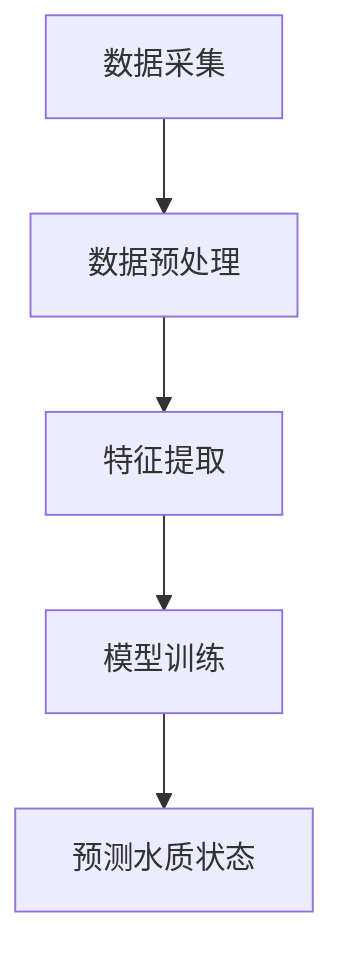
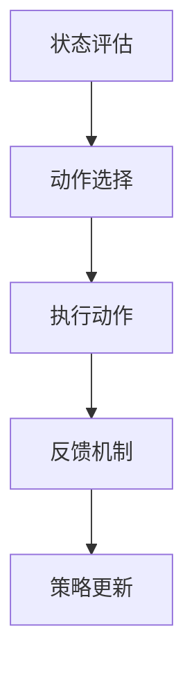
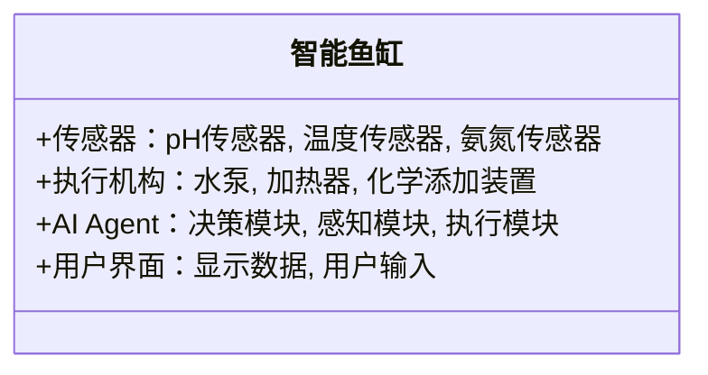
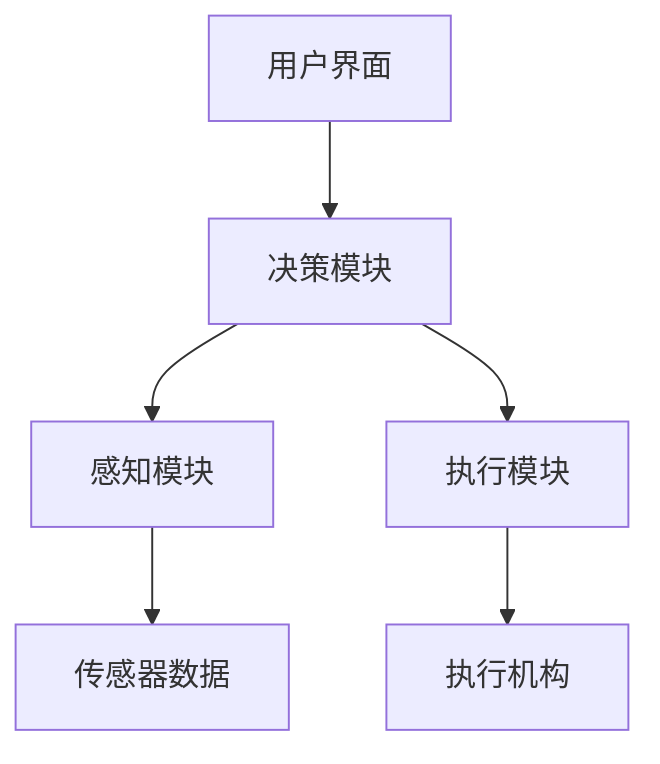
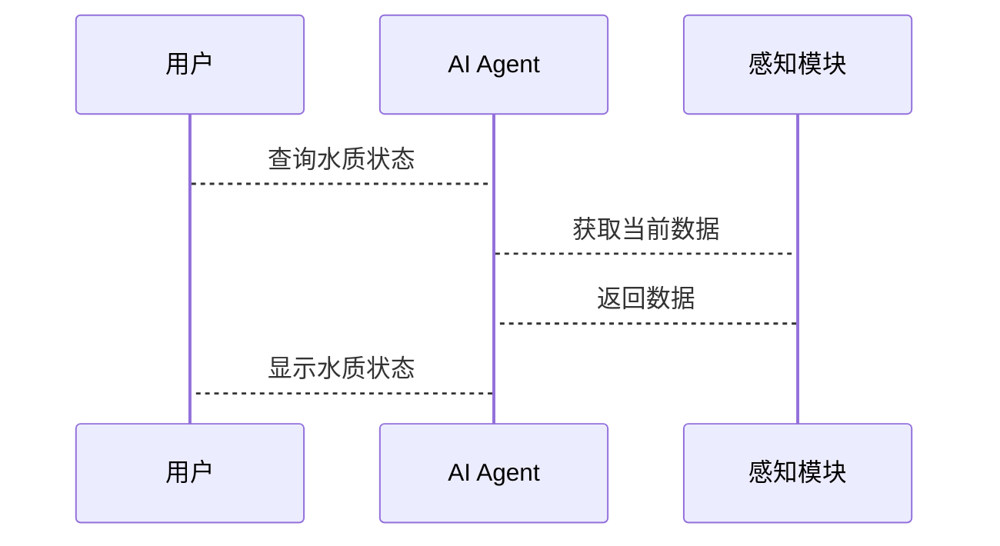

                 


# 智能鱼缸：AI Agent的水质平衡维护

> 关键词：智能鱼缸, AI Agent, 水质监测, 自动控制, 机器学习, 强化学习

> 摘要：本文详细探讨了智能鱼缸中AI Agent的应用，从背景介绍到系统架构，再到项目实战，系统阐述了如何利用AI技术实现水质的自动监测与平衡维护。文章结合理论与实践，深入分析了AI Agent的核心原理、算法实现以及系统设计，为读者提供了全面的技术指导。

---

# 第一部分: 智能鱼缸与AI Agent的背景介绍

## 第1章: 问题背景与需求分析

### 1.1 传统鱼缸维护的难点

#### 1.1.1 水质变化的复杂性
鱼缸中的水质会受到多种因素的影响，如鱼的代谢物、饲料残渣、水温变化等。这些因素会导致水质指标（如氨氮、亚硝酸盐、硝酸盐、pH值、温度等）的变化具有非线性和动态性的特点。

#### 1.1.2 鱼缸维护的常见问题
- **水质突变风险**：突发的水质变化可能危及鱼的生存。
- **维护成本高**：需要定期更换水、清洁过滤器等，耗时耗力。
- **实时性不足**：传统维护方式依赖人工监测，存在滞后性。

#### 1.1.3 传统维护方法的局限性
传统维护方法主要依赖人工观察和定期测试，这种方式不仅效率低下，而且难以应对突发情况。此外，人工维护还可能因为疏忽导致水质恶化。

### 1.2 AI Agent在鱼缸维护中的应用价值

#### 1.2.1 智能化维护的需求
随着科技的进步，人们对自动化、智能化的需求日益增加。智能鱼缸可以通过AI Agent实现无人值守的水质维护，提高维护效率和准确性。

#### 1.2.2 AI Agent的核心优势
- **实时监测**：AI Agent可以24/7实时监测水质指标，确保数据的连续性和准确性。
- **智能决策**：通过机器学习和强化学习算法，AI Agent能够根据实时数据做出最优决策。
- **自我优化**：AI Agent可以通过经验不断优化维护策略，提高系统的稳定性和效率。

#### 1.2.3 智能鱼缸的市场前景
随着智能家居和物联网技术的普及，智能鱼缸市场潜力巨大。AI Agent的应用可以提升用户体验，增加产品的附加值。

---

## 第2章: AI Agent与智能鱼缸的定义

### 2.1 AI Agent的基本概念

#### 2.1.1 什么是AI Agent
AI Agent（智能体）是指能够感知环境、自主决策并执行动作的智能系统。它能够根据环境信息做出反应，以实现特定的目标。

#### 2.1.2 AI Agent的核心特征
- **自主性**：能够在没有外部干预的情况下自主运行。
- **反应性**：能够实时感知环境变化并做出反应。
- **目标导向**：通过优化目标函数实现最优决策。
- **学习能力**：能够通过经验改进自身的决策能力。

#### 2.1.3 AI Agent与传统自动化的区别
传统自动化系统通常是基于规则的，而AI Agent具有更强的适应性和学习能力，能够应对复杂多变的环境。

### 2.2 智能鱼缸的定义与组成

#### 2.2.1 智能鱼缸的定义
智能鱼缸是一种结合了物联网和人工智能技术的鱼缸系统，能够实时监测水质指标，并通过AI Agent实现自动调节。

#### 2.2.2 智能鱼缸的核心组成部分
- **传感器**：用于采集水质数据（如pH、温度、氨氮、亚硝酸盐、硝酸盐等）。
- **执行机构**：如水泵、加热器、化学添加装置等，用于调节水质。
- **AI Agent**：负责数据处理、状态评估和决策控制。
- **用户界面**：用于展示数据和用户交互。

#### 2.2.3 智能鱼缸的系统架构
智能鱼缸的系统架构通常包括感知层、决策层和执行层。感知层负责数据采集，决策层负责分析和决策，执行层负责具体操作。

---

## 第3章: 智能鱼缸的核心问题与边界

### 3.1 智能鱼缸的核心问题

#### 3.1.1 水质监测与调节
- **核心任务**：实时监测水质指标，并根据指标变化自动调节。
- **挑战**：水质指标之间相互关联，调节时需要综合考虑。

#### 3.1.2 系统稳定性与可靠性
- **挑战**：系统需要在复杂环境下保持稳定运行，避免因故障导致水质恶化。
- **解决方案**：通过冗余设计和自我修复能力确保系统的可靠性。

#### 3.1.3 用户交互与反馈
- **需求**：用户需要实时了解系统状态，并能够根据需要进行干预。
- **实现方式**：通过用户界面展示数据，并提供手动控制选项。

### 3.2 智能鱼缸的边界与外延

#### 3.2.1 系统的边界
- **输入**：水质传感器数据、用户指令。
- **输出**：水泵控制信号、化学添加信号、报警信号。
- **外部环境**：鱼缸中的水、鱼、过滤系统等。

#### 3.2.2 系统的外延功能
- **扩展功能**：远程监控、数据分析与报告生成、历史数据记录等。
- **限制**：目前主要关注水质调节，未来可以扩展到其他功能，如鱼的行为分析。

#### 3.2.3 系统与外部环境的交互
- **数据输入**：传感器数据、用户输入。
- **数据输出**：控制信号、报警信息、状态报告。

---

# 第二部分: AI Agent的核心概念与联系

## 第4章: AI Agent的核心原理

### 4.1 感知模块

#### 4.1.1 数据采集与处理
- **传感器数据**：pH、温度、氨氮、亚硝酸盐、硝酸盐等。
- **数据预处理**：去噪、归一化、特征提取。
- **数据存储**：将数据存储在数据库中，供后续分析使用。

#### 4.1.2 数据特征提取
- **特征选择**：根据水质指标的重要性选择关键特征。
- **特征工程**：通过数据变换提高模型性能。

#### 4.1.3 数据分析与预测
- **机器学习模型**：如支持向量机（SVM）、随机森林（Random Forest）等。
- **时间序列分析**：使用ARIMA、LSTM等模型预测水质变化。

### 4.2 决策模块

#### 4.2.1 状态评估与判断
- **水质状态分类**：将水质分为健康、亚健康、不健康等状态。
- **状态评估标准**：根据水质指标的阈值判断当前状态。

#### 4.2.2 动作选择与优化
- **动作空间**：包括开启水泵、关闭水泵、添加化学物质等。
- **动作优化**：通过强化学习优化动作选择，减少对环境的破坏。

#### 4.2.3 决策策略的动态调整
- **策略更新**：根据新数据不断优化决策策略。
- **自适应学习**：通过反馈机制调整策略。

### 4.3 执行模块

#### 4.3.1 动作执行与反馈
- **执行机构控制**：通过继电器或电机控制执行机构。
- **反馈机制**：执行动作后，系统会采集新的数据，判断动作是否有效。

#### 4.3.2 系统状态监控
- **实时监控**：持续监测系统状态，确保正常运行。
- **异常处理**：当检测到异常时，触发报警或采取应急措施。

#### 4.3.3 系统日志与记录
- **日志记录**：记录系统运行状态、动作执行情况和异常事件。
- **数据存档**：保存历史数据，用于后续分析和改进。

---

## 第5章: 核心概念与联系

### 5.1 核心概念的对比分析

| **概念**       | **特点**                                                                 |
|----------------|--------------------------------------------------------------------------|
| 感知模块       | 数据采集与处理，特征提取，分析与预测                                     |
| 决策模块       | 状态评估，动作选择，动态调整策略                                         |
| 执行模块       | 动作执行，系统监控，日志记录                                             |

### 5.2 ER实体关系图

```mermaid
erd
    智能鱼缸
        感知模块
            传感器
                pH传感器
                温度传感器
                氨氮传感器
                亚硝酸盐传感器
                硝酸盐传感器
        决策模块
            状态评估
                水质状态分类
                动作选择
            优化策略
                策略更新
                动作优化
        执行模块
            执行机构
                水泵
                加热器
                化学添加装置
            反馈机制
                数据反馈
                状态反馈
```

---

## 第6章: 算法原理与数学模型

### 6.1 水质监测算法

#### 6.1.1 数据采集与预处理
- **数据采集**：通过传感器获取水质数据。
- **数据预处理**：去除噪声，归一化处理。

#### 6.1.2 机器学习模型
- **算法选择**：使用随机森林或支持向量机（SVM）进行分类。
- **模型训练**：使用历史数据训练模型，预测水质状态。

#### 6.1.3 算法流程图


#### 6.1.4 代码实现
```python
import pandas as pd
from sklearn.ensemble import RandomForestClassifier
from sklearn.metrics import accuracy_score

# 数据加载
data = pd.read_csv('water_quality.csv')

# 特征与标签分离
X = data.drop('status', axis=1)
y = data['status']

# 模型训练
model = RandomForestClassifier()
model.fit(X, y)

# 预测
predicted = model.predict(X)
print("准确率:", accuracy_score(y, predicted))
```

### 6.2 AI Agent决策算法

#### 6.2.1 强化学习模型
- **算法选择**：使用Q-Learning算法。
- **状态空间**：水质指标。
- **动作空间**：执行动作（如开启水泵、关闭水泵）。

#### 6.2.2 算法流程图


#### 6.2.3 数学模型
- **状态评估**：$$ Q(s, a) = r + \gamma \max Q(s', a') $$
- **动作选择**：$$ \pi(a|s) = \text{softmax}(Q(s,a)/\tau) $$

---

## 第7章: 系统分析与架构设计

### 7.1 系统功能设计

#### 7.1.1 领域模型


#### 7.1.2 系统架构


### 7.2 接口设计与交互流程

#### 7.2.1 接口设计
- **输入接口**：传感器数据、用户指令。
- **输出接口**：控制信号、报警信号。

#### 7.2.2 交互流程


---

## 第8章: 项目实战

### 8.1 环境安装与配置

#### 8.1.1 系统环境
- **硬件**：Raspberry Pi、传感器模块、水泵、继电器。
- **软件**：Python、Raspbian、机器学习库（如scikit-learn、TensorFlow）。

#### 8.1.2 工具安装
```bash
pip install numpy pandas scikit-learn
```

### 8.2 核心代码实现

#### 8.2.1 数据采集与处理
```python
import RPi.GPIO as GPIO
import time

# 传感器数据采集函数
def get_water_quality():
    # 示例代码，实际需要根据传感器类型编写
    ph = measure_ph()  # pH传感器
    temp = measure_temp()  # 温度传感器
    ammonia = measure_ammonia()  # 氨氮传感器
    nitrite = measure_nitrite()  # 亚硝酸盐传感器
    return {'pH': ph, '温度': temp, '氨氮': ammonia, '亚硝酸盐': nitrite}
```

#### 8.2.2 AI Agent决策逻辑
```python
class AI-Agent:
    def __init__(self):
        self.model = self.load_model()  # 加载机器学习模型
        self.current_state = self.get_current_state()

    def get_current_state(self):
        # 获取传感器数据
        data = get_water_quality()
        return data

    def decide_action(self, state):
        # 根据模型预测水质状态
        predicted_status = self.model.predict(state)
        # 根据状态选择动作
        if predicted_status == '健康':
            return 'no action'
        elif predicted_status == '亚健康':
            return '开启水泵'
        else:
            return '添加化学物质'

    def execute_action(self, action):
        # 执行动作
        if action == '开启水泵':
            self.control_pump(True)
        elif action == '添加化学物质':
            self.add_chemical()
        # 获取反馈
        feedback = self.get_feedback()
        # 更新模型
        self.model.update(feedback)

    def control_pump(self, state):
        # 控制水泵
        pass

    def add_chemical(self):
        # 添加化学物质
        pass

    def get_feedback(self):
        # 获取反馈
        return self.get_current_state()
```

### 8.3 实际案例分析

#### 8.3.1 案例背景
假设鱼缸中的pH值突然下降，AI Agent需要判断是否需要采取行动。

#### 8.3.2 系统反应
- **感知模块**：检测到pH值为7.0，低于正常范围（7.5-8.5）。
- **决策模块**：判断水质为亚健康状态，决定开启水泵。
- **执行模块**：开启水泵，调整水流速度，反馈新的pH值。
- **结果**：pH值回升至8.0，水质恢复正常。

---

## 第9章: 最佳实践与小结

### 9.1 最佳实践

#### 9.1.1 传感器校准
定期校准传感器，确保数据的准确性。

#### 9.1.2 数据存储
- **本地存储**：保存历史数据，便于分析和回溯。
- **云端备份**：防止数据丢失。

#### 9.1.3 系统维护
- **定期检查**：确保硬件正常运行。
- **模型更新**：根据新数据优化模型。

### 9.2 注意事项

- **安全性**：确保化学添加装置不会因故障导致化学物质泄漏。
- **稳定性**：系统应具备冗余设计，防止单点故障。
- **用户教育**：用户需要了解系统的基本操作和安全注意事项。

### 9.3 拓展阅读

- **相关技术**：物联网（IoT）、边缘计算、强化学习。
- **应用场景**：家庭 aquarium、工业水质控制、农业灌溉系统。

---

# 作者：AI天才研究院 & 禅与计算机程序设计艺术

