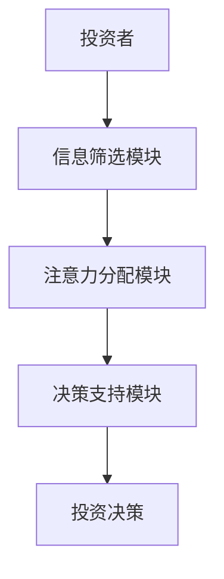

                 


# 《有限注意力：信息过载时代的投资决策挑战》

---

## 关键词：有限注意力，信息过载，投资决策，决策疲劳，注意力分配

---

## 摘要：  
在信息爆炸的时代，投资者面临着前所未有的信息过载挑战。本文深入探讨了有限注意力在投资决策中的影响，分析了信息过载对决策效率和质量的负面影响。文章提出了有限注意力模型，并通过数学公式和算法设计，展示了如何优化注意力分配以缓解信息过载的压力。最后，本文结合实际案例，提出了在投资决策中应对信息过载的策略和建议。

---

# 第一部分：有限注意力与信息过载的背景

---

## 第1章：有限注意力与信息过载概述

### 1.1 有限注意力的定义与特征  
有限注意力是指人类在处理信息时，由于生理和认知的限制，只能关注有限的信息源或信息片段。注意力资源的有限性导致了信息过载对决策效率和质量的负面影响。  

#### 1.1.1 注意力资源的有限性  
- 人类的注意力是稀缺资源，无法同时关注多个信息源。  
- 注意力分配受到时间、精力和认知能力的限制。  

#### 1.1.2 信息过载的概念与表现  
- 信息过载是指信息的数量远超过人类处理能力的极限。  
- 表现为信息碎片化、信息冗余和信息质量参差不齐。  

#### 1.1.3 有限注意力对决策的影响  
- 注意力分配不当可能导致决策失误。  
- 信息过载增加了决策疲劳的风险。  

---

### 1.2 投资决策中的注意力挑战  

#### 1.2.1 投资决策的基本流程  
1. 收集信息：投资者需要从多种渠道获取市场数据和新闻。  
2. 信息筛选：根据个人判断筛选出有价值的信息。  
3. 分析与决策：基于筛选后的信息做出投资决策。  

#### 1.2.2 信息过载对投资决策的具体影响  
- 信息筛选的难度增加。  
- 决策疲劳导致判断力下降。  
- 信息碎片化影响决策的全面性。  

#### 1.2.3 注意力分配的优先级问题  
- 如何在众多信息中确定优先关注的内容？  
- 优先级的错误可能导致投资失误。  

---

### 1.3 有限注意力与投资决策的关系  

#### 1.3.1 注意力资源的稀缺性  
- 投资者的注意力资源有限，无法同时关注所有信息源。  
- 有限的注意力资源可能导致信息筛选的偏差。  

#### 1.3.2 信息过载对决策效率的负面影响  
- 信息过载降低了决策效率。  
- 决策疲劳导致判断力下降。  

#### 1.3.3 有限注意力对投资结果的潜在影响  
- 注意力分配不当可能导致投资决策失误。  
- 信息筛选的偏差影响投资结果的质量。  

---

## 第2章：信息过载时代的投资决策挑战  

### 2.1 信息过载的现状分析  

#### 2.1.1 数字化信息的爆炸性增长  
- 互联网时代，信息的数量呈指数级增长。  
- 社交媒体和新闻平台提供了海量信息，但信息质量参差不齐。  

#### 2.1.2 投资信息的碎片化问题  
- 投资信息被分割成碎片化的内容，难以形成完整的决策依据。  
- 碎片化信息增加了信息筛选的难度。  

#### 2.1.3 社交媒体与虚假信息的影响  
- 社交媒体传播虚假信息，误导投资者判断。  
- 虚假信息加剧了信息过载的问题。  

---

### 2.2 投资者注意力分配的复杂性  

#### 2.2.1 不同投资者群体的注意力特点  
- 机构投资者：依赖专业团队和系统化决策。  
- 个人投资者：受情绪影响较大，注意力容易被误导。  

#### 2.2.2 时间压力与决策疲劳  
- 短期交易者面临更高的时间压力，注意力容易疲劳。  
- 决策疲劳导致判断力下降，影响投资决策。  

#### 2.2.3 信息筛选与注意力分配的矛盾  
- 信息过载导致信息筛选的难度增加。  
- 注意力分配的优先级问题影响信息筛选的效果。  

---

### 2.3 信息过载对投资决策质量的影响  

#### 2.3.1 决策疲劳的定义与表现  
- 决策疲劳是指由于连续决策导致的判断力下降。  
- 表现为决策犹豫、判断力下降和决策失误。  

#### 2.3.2 信息过载对决策效率的负面影响  
- 信息过载降低了决策效率。  
- 决策疲劳导致判断力下降。  

#### 2.3.3 有限注意力对投资结果的潜在影响  
- 注意力分配不当可能导致投资决策失误。  
- 信息筛选的偏差影响投资结果的质量。  

---

## 第3章：有限注意力模型与信息过载的关系  

### 3.1 注意力经济理论  

#### 3.1.1 注意力经济的基本概念  
- 注意力经济是指以注意力为稀缺资源的经济模式。  
- 信息过载时代，注意力成为最重要的资源。  

#### 3.1.2 信息过载与注意力分配的关系  
- 信息过载导致注意力分配的难度增加。  
- 注意力分配的优化是缓解信息过载的关键。  

#### 3.1.3 有限注意力模型的构建  
- 有限注意力模型是基于注意力资源有限性构建的数学模型。  
- 模型假设：投资者只能关注有限的信息源，注意力分配受到限制。  

---

### 3.2 信息过载对注意力分配的影响  

#### 3.2.1 信息筛选的困难性  
- 信息筛选是注意力分配的第一步。  
- 信息筛选的难度增加导致注意力分配的效率下降。  

#### 3.2.2 信息质量与注意力分配的关系  
- 高质量信息更容易吸引注意力。  
- 低质量信息被忽视，影响决策的全面性。  

#### 3.2.3 信息冗余对注意力分配的干扰  
- 信息冗余增加了注意力分配的难度。  
- 信息冗余导致注意力资源的浪费。  

---

### 3.3 有限注意力模型的应用  

#### 3.3.1 模型的基本假设  
- 投资者的注意力资源有限。  
- 信息过载导致注意力分配的效率下降。  

#### 3.3.2 模型的构建与验证  
- 通过数学公式和算法设计，构建注意力分配模型。  
- 模型验证：通过实证分析，验证模型的有效性。  

#### 3.3.3 模型在投资决策中的应用  
- 有限注意力模型可以帮助投资者优化注意力分配。  
- 模型的应用可以提高投资决策的效率和质量。  

---

## 第4章：信息过载时代下的投资决策优化策略  

### 4.1 优化注意力分配的策略  

#### 4.1.1 建立信息筛选机制  
- 通过筛选机制，减少无关信息的干扰。  
- 筛选机制的设计需要考虑信息的质量和相关性。  

#### 4.1.2 合理分配注意力资源  
- 根据信息的重要性和相关性，合理分配注意力资源。  
- 优先关注高价值的信息源。  

#### 4.1.3 利用技术手段优化注意力分配  
- 通过人工智能和大数据技术，优化信息筛选和注意力分配。  
- 技术手段的应用可以提高注意力分配的效率。  

---

### 4.2 决策疲劳的缓解策略  

#### 4.2.1 合理安排工作节奏  
- 分阶段处理信息，避免连续决策导致的决策疲劳。  
- 工作与休息结合，缓解注意力疲劳。  

#### 4.2.2 提高决策效率  
- 通过系统化的方法，提高决策效率。  
- 减少不必要的决策，集中注意力处理关键问题。  

#### 4.2.3 建立决策支持系统  
- 通过决策支持系统，辅助投资者做出决策。  
- 系统化的决策支持可以减少决策疲劳的影响。  

---

## 第5章：有限注意力模型的数学公式与算法设计  

### 5.1 注意力分配模型  

#### 5.1.1 模型的基本假设  
- 投资者的注意力资源有限。  
- 信息过载导致注意力分配的效率下降。  

#### 5.1.2 模型的数学公式  
$$
\text{注意力分配比例} = \frac{\text{信息的重要性}}{\sum \text{所有信息的重要性}}
$$  
- 信息的重要性由其相关性和质量决定。  

---

### 5.2 决策疲劳缓解算法  

#### 5.2.1 算法的基本思路  
- 通过算法优化，缓解决策疲劳。  
- 算法设计需要考虑信息的优先级和投资者的注意力状态。  

#### 5.2.2 算法的数学公式  
$$
\text{决策疲劳指数} = \frac{\text{连续决策时间}}{\text{总决策时间}} \times 100\%
$$  
- 决策疲劳指数反映了决策疲劳的程度。  

---

## 第6章：系统架构与实现方案  

### 6.1 系统架构设计  

#### 6.1.1 系统功能设计  
- 信息筛选模块：根据投资者的需求，筛选相关信息。  
- 注意力分配模块：根据信息的重要性，分配注意力资源。  
- 决策支持模块：辅助投资者做出决策。  

#### 6.1.2 系统架构图  

- 系统架构图展示了各模块之间的关系。  

---

### 6.2 系统实现方案  

#### 6.2.1 环境安装  
- 需要安装Python、机器学习库（如Scikit-learn）和数据可视化工具（如Matplotlib）。  

#### 6.2.2 核心代码实现  
```python
import numpy as np
from sklearn.metrics import pairwise_distances

def attention_allocation(information_importance):
    total_importance = np.sum(information_importance)
    attention_allocation = information_importance / total_importance
    return attention_allocation

# 示例数据
information_importance = np.array([0.2, 0.3, 0.1, 0.4])
allocation = attention_allocation(information_importance)
print("注意力分配比例：", allocation)
```
- 代码示例展示了如何根据信息的重要性，计算注意力分配比例。  

---

## 第7章：项目实战与案例分析  

### 7.1 项目实战  

#### 7.1.1 项目背景  
- 某投资机构面临信息过载的问题，需要优化注意力分配。  

#### 7.1.2 项目目标  
- 构建注意力分配模型，优化投资决策。  

#### 7.1.3 项目实施  
- 收集投资相关信息。  
- 根据信息的重要性，分配注意力资源。  
- 通过系统化的方法，优化投资决策。  

---

### 7.2 案例分析  

#### 7.2.1 案例背景  
- 某投资者在信息过载的环境下，难以做出正确的投资决策。  

#### 7.2.2 案例分析  
- 通过注意力分配模型，优化信息筛选和决策过程。  
- 分析模型的应用效果，总结经验教训。  

---

## 第8章：总结与展望  

### 8.1 总结  
- 有限注意力是信息过载时代下，投资者面临的主要挑战。  
- 通过优化注意力分配和缓解决策疲劳，可以提高投资决策的效率和质量。  

### 8.2 展望  
- 未来的研究方向：  
  - 进一步优化注意力分配模型。  
  - 探索人工智能在注意力管理中的应用。  

---

## 作者：AI天才研究院/AI Genius Institute & 禅与计算机程序设计艺术 /Zen And The Art of Computer Programming  

---

**注**：以上目录大纲仅为示例，具体内容可根据实际需求进行调整和补充。

