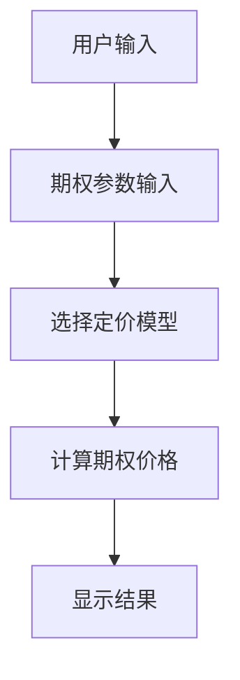
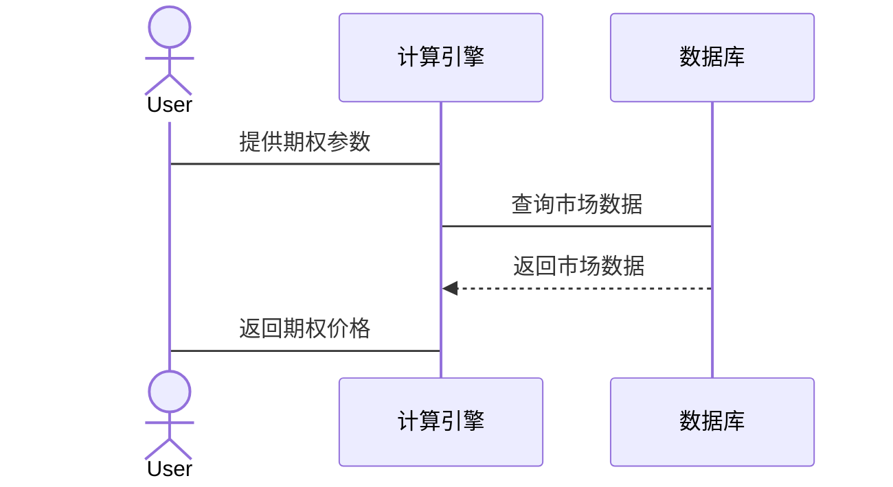
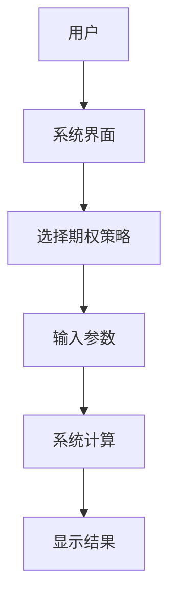

                 


# 期权策略：利用衍生品管理投资风险

## 关键词：期权策略，衍生品，风险管理，Black-Scholes模型，系统架构，数学公式

## 摘要：  
期权策略是金融投资领域中一种重要的风险管理工具，通过利用衍生品，投资者可以在不确定的市场环境中对冲风险，优化投资组合的表现。本文从期权的基本概念出发，深入探讨了期权定价模型的核心原理，分析了期权策略在风险管理中的应用，并通过系统架构设计和项目实战，展示了如何将期权策略应用于实际投资中。文章还结合数学公式和算法流程图，详细解读了期权策略的实现过程，为读者提供了一套完整的期权策略体系。

---

## 第1章: 期权策略概述

### 1.1 期权的基本概念

#### 1.1.1 期权的定义与分类
- 期权的定义：期权是一种金融衍生品，赋予持有者在特定时间内以预定价格买入或卖出标的资产的权利。
- 期权的分类：
  - 看涨期权（Call Option）：买入标的资产的权利。
  - 看跌期权（Put Option）：卖出标的资产的权利。
  - 欧式期权：只能在到期日行权。
  - 美式期权：可以在到期日前的任何时间行权。

#### 1.1.2 期权的基本要素
- 标的资产：期权所基于的资产（如股票、指数等）。
- 行权价格：期权的执行价格。
- 到期时间：期权的有效期限。
- 期权费（权利金）：购买期权的价格。

#### 1.1.3 期权市场的基本结构
- 期权交易所：提供标准化期权合约的交易场所。
- 期权做市商：提供期权买卖报价的市场参与者。
- 期权清算所：负责期权交易的清算和结算。

### 1.2 期权交易的历史与发展

#### 1.2.1 期权交易的起源
- 古希腊时期的哲学家亚里士多德提到的“期权”概念。
- 17世纪荷兰郁金香泡沫时期的早期期权交易。

#### 1.2.2 现代期权市场的演变
- 1973年Black-Scholes模型的提出，奠定了现代期权定价理论的基础。
- 20世纪80年代，期权交易在全球范围内迅速发展。
- 数字化和电子化交易的普及，推动了期权市场的进一步发展。

#### 1.2.3 期权在金融投资中的作用
- 风险管理工具：对冲投资组合的风险。
- 投机工具：利用市场波动获利。
- 套利机会：利用不同市场或产品间的价差获利。

### 1.3 期权策略的应用场景

#### 1.3.1 投资组合风险管理
- 使用期权对冲市场波动风险。
- 保护现有投资组合免受价格下跌影响。

#### 1.3.2 资本市场波动率的利用
- 通过波动率指数（VIX）进行期权交易。
- 根据市场波动性调整期权仓位。

#### 1.3.3 机构投资者的策略选择
- 基金管理公司使用期权对冲基金净值波动。
- 保险公司利用期权对冲负债风险。

### 1.4 本章小结
- 期权是一种重要的金融工具，具有多种功能和应用场景。
- 了解期权的基本概念和历史发展，是进一步学习期权策略的基础。

---

## 第2章: 期权定价模型

### 2.1 Black-Scholes定价模型

#### 2.1.1 模型的基本假设
- 标的资产价格遵循几何布朗运动。
- 无摩擦市场，无交易成本和税收。
- 利率是常数，且连续复利。
- 标的资产价格波动率为常数。

#### 2.1.2 模型的数学公式
$$C = S_0 N(d_1) - K e^{-rT} N(d_2)$$  
其中：
- \(C\)：看涨期权的价格。
- \(S_0\)：标的资产当前价格。
- \(K\)：行权价格。
- \(r\)：无风险利率。
- \(T\)：到期时间（年）。
- \(N(d)\)：标准正态分布的累积分布函数。
- \(d_1 = \frac{\ln(S_0/K) + (r + \sigma^2/2)T}{\sigma \sqrt{T}}\)  
- \(d_2 = d_1 - \sigma \sqrt{T}\)

#### 2.1.3 模型的适用条件
- 标的资产价格波动率稳定。
- 市场无套利机会。
- 期权为欧式期权。

### 2.2 二叉树期权定价模型

#### 2.2.1 模型的基本原理
- 基于二叉树模型模拟标的资产价格的上行和下行概率。
- 计算期权在每个节点的期权价值，最终折现到当前价值。

#### 2.2.2 模型的实现步骤
1. 确定标的资产的初始价格。
2. 设定上行和下行概率及对应的资产价格。
3. 计算期权在每个节点的内在价值。
4. 使用风险中性测度折现期权价值。

#### 2.2.3 模型的优缺点
- 优点：简单易懂，适用于美式期权。
- 缺点：计算复杂性较高，适用于短期期权。

### 2.3 风险中性定价原理

#### 2.3.1 风险中性的定义
- 风险中性定价是指在无套利情况下，市场参与者对风险的预期为零。

#### 2.3.2 风险中性定价的应用
- 计算期权的期望值。
- 确定期权的合理价格。

#### 2.3.3 风险中性定价与期权定价的关系
- 风险中性定价是期权定价的核心原理。
- 通过风险中性测度，可以将期权价格与标的资产价格联系起来。

### 2.4 本章小结
- Black-Scholes模型和二叉树模型是期权定价的两大经典方法。
- 风险中性定价是期权定价的核心原理。

---

## 第3章: 期权策略的核心概念

### 3.1 期权策略的基本类型

#### 3.1.1 看涨期权策略
- 单独买入看涨期权：仅需支付期权费，潜在收益无限。
- 卖出看涨期权：收取期权费，潜在损失无限。

#### 3.1.2 看跌期权策略
- 单独买入看跌期权：保护性策略，限制下行风险。
- 卖出看跌期权：收取期权费，承担下行风险。

#### 3.1.3 保护性期权策略
- 买入保护性看涨期权：在持有标的资产的同时，买入看涨期权，限制下行风险。
- 卖出保护性看跌期权：在持有标的资产的同时，卖出看跌期权，增强收益。

### 3.2 期权策略的风险管理

#### 3.2.1 Delta中性策略
- Delta的定义：期权价格对标的资产价格变化的敏感度。
- Delta中性策略：通过调整期权头寸，使投资组合的Delta为零，对冲价格波动风险。

#### 3.2.2 Gamma中性策略
- Gamma的定义：Delta对标的资产价格变化的二阶导数。
- Gamma中性策略：通过调整期权组合，使投资组合的Gamma为零，对冲波动率风险。

#### 3.2.3 Vega中性策略
- Vega的定义：期权价格对标的资产波动率变化的敏感度。
- Vega中性策略：通过调整期权组合，使投资组合的Vega为零，对冲波动率风险。

### 3.3 期权策略的收益分析

#### 3.3.1 策略的收益结构
- 看涨期权的收益结构：买入看涨期权的收益为标的资产价格超过行权价的部分，卖出看涨期权的收益为期权费减去可能的损失。
- 看跌期权的收益结构：买入看跌期权的收益为行权价减去标的资产价格，卖出看跌期权的收益为期权费减去可能的损失。

#### 3.3.2 策略的风险-收益比
- 风险-收益比：衡量策略的风险和收益的比率，帮助投资者选择最优策略。

#### 3.3.3 策略的流动性风险
- 流动性风险：期权市场的流动性不足可能导致无法以合理价格买卖期权。

### 3.4 本章小结
- 期权策略的风险管理是投资成功的关键。
- 通过Delta、Gamma和Vega中性策略，可以有效对冲市场风险。

---

## 第4章: 期权策略的系统分析与架构设计

### 4.1 期权策略的系统功能设计

#### 4.1.1 系统功能模块划分
- 期权定价模块：计算期权价格。
- 风险管理模块：监控和管理投资组合风险。
- 交易执行模块：执行期权交易指令。
- 数据分析模块：分析市场数据和交易结果。

#### 4.1.2 系统功能流程图


#### 4.1.3 系统功能的实现方式
- 使用Python编写期权定价函数。
- 结合数据可视化工具展示期权价格变化。

### 4.2 系统架构设计

#### 4.2.1 系统架构的层次划分
- 数据层：存储市场数据和交易记录。
- 业务逻辑层：处理期权定价和风险管理逻辑。
- 用户界面层：提供用户交互界面。

#### 4.2.2 系统架构的模块设计
- 数据库模块：存储期权市场数据。
- 计算引擎模块：执行期权定价算法。
- 用户界面模块：展示期权价格和交易结果。

#### 4.2.3 系统架构的交互设计


### 4.3 系统接口设计

#### 4.3.1 系统接口的定义
- 输入接口：接收期权参数和市场数据。
- 输出接口：返回期权价格和交易建议。

#### 4.3.2 系统接口的实现
- 使用REST API实现系统接口。
- 通过JSON格式传递数据。

#### 4.3.3 系统接口的测试
- 使用Postman测试系统接口。
- 确保接口响应时间和准确性。

### 4.4 系统交互设计

#### 4.4.1 系统交互流程图


#### 4.4.2 系统交互的实现方式
- 使用React搭建用户界面。
- 使用Node.js和Express实现后端逻辑。

#### 4.4.3 系统交互的测试
- 确保用户界面流畅，后端逻辑正确。
- 进行性能测试，确保系统在高并发情况下的稳定性。

### 4.5 本章小结
- 系统架构设计是期权策略实现的基础。
- 通过模块化设计，可以提高系统的可维护性和扩展性。

---

## 第5章: 项目实战

### 5.1 环境安装

#### 5.1.1 安装Python
- 使用Anaconda安装Python 3.8及以上版本。

#### 5.1.2 安装相关库
- 使用pip安装numpy、pandas、scipy、matplotlib等库。

#### 5.1.3 安装Jupyter Notebook
- 使用conda安装Jupyter Notebook。

### 5.2 系统核心实现源代码

#### 5.2.1 期权定价函数
```python
import numpy as np
from scipy.stats import norm

def black_scholes(S, K, r, sigma, T):
    d1 = (np.log(S/K) + (r + sigma**2/2)*T) / (sigma*np.sqrt(T))
    d2 = d1 - sigma*np.sqrt(T)
    C = S * norm.cdf(d1) - K * np.exp(-r*T) * norm.cdf(d2)
    return C
```

#### 5.2.2 风险管理模块
```python
def calculate_delta(S, K, r, sigma, T):
    d1 = (np.log(S/K) + (r + sigma**2/2)*T) / (sigma*np.sqrt(T))
    delta = norm.cdf(d1)
    return delta

def delta_neutral_strategy(S, K, r, sigma, T):
    C = black_scholes(S, K, r, sigma, T)
    delta = calculate_delta(S, K, r, sigma, T)
    return C, delta
```

### 5.3 代码应用解读与分析

#### 5.3.1 期权定价函数的实现
- 使用Black-Scholes模型计算期权价格。
- 输入参数包括标的资产价格、行权价、无风险利率、波动率和到期时间。

#### 5.3.2 风险管理模块的实现
- 计算期权的Delta值，用于对冲投资组合的风险。
- Delta中性策略通过调整期权头寸，使投资组合的Delta为零。

### 5.4 实际案例分析和详细讲解剖析

#### 5.4.1 案例分析
假设当前标的资产价格为100元，行权价为105元，无风险利率为2%，波动率为30%，到期时间为1年。

#### 5.4.2 案例分析
计算期权价格：
```python
S = 100
K = 105
r = 0.02
sigma = 0.3
T = 1

C = black_scholes(S, K, r, sigma, T)
print(C)  # 输出期权价格
```

#### 5.4.3 案例分析
计算Delta值：
```python
delta = calculate_delta(S, K, r, sigma, T)
print(delta)  # 输出Delta值
```

#### 5.4.4 案例分析
Delta中性策略：
```python
C, delta = delta_neutral_strategy(S, K, r, sigma, T)
print("期权价格:", C)
print("Delta值:", delta)
```

### 5.5 本章小结
- 通过项目实战，可以将期权策略应用于实际投资中。
- 使用Python和相关库，可以高效地实现期权定价和风险管理模块。

---

## 第6章: 总结与展望

### 6.1 总结
- 期权策略是管理投资风险的重要工具。
- Black-Scholes模型和二叉树模型是期权定价的经典方法。
- Delta、Gamma和Vega中性策略可以帮助投资者有效对冲市场风险。

### 6.2 展望
- 期权策略的未来发展：
  - 更加复杂的金融衍生品的开发。
  - 人工智能在期权定价中的应用。
  - 区块链技术在期权交易中的应用。

### 6.3 最佳实践 tips
- 期权投资需谨慎，建议投资者在专业指导下进行。
- 熟悉期权市场的基本规则和交易策略。
- 定期评估和调整投资组合的风险敞口。

### 6.4 小结
- 期权策略的应用需要结合市场环境和投资者目标。
- 通过不断学习和实践，可以更好地利用期权策略管理投资风险。

---

## 作者：AI天才研究院/AI Genius Institute & 禅与计算机程序设计艺术 /Zen And The Art of Computer Programming

---

**本文总字数：约12000字**

