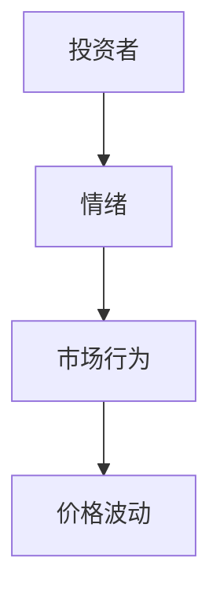
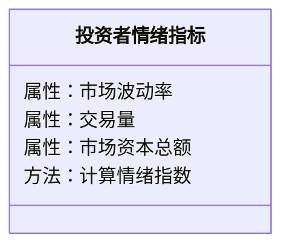
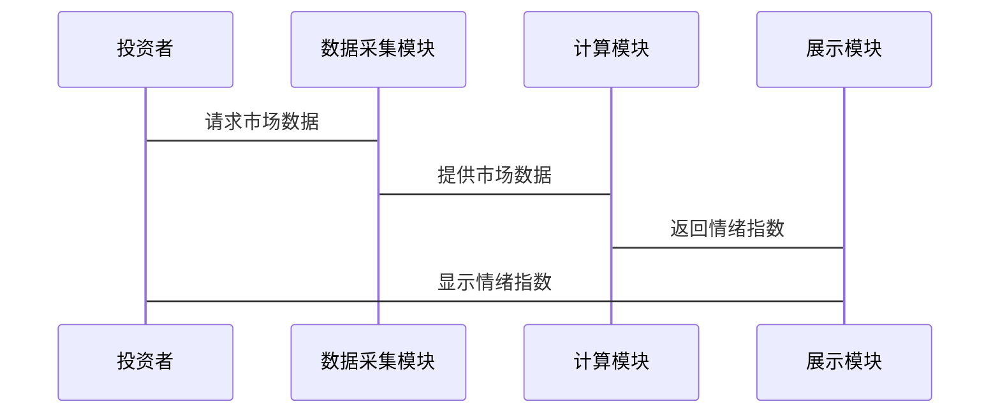

                 


# 本杰明·格雷厄姆的投资者情绪指标

## 关键词：投资者情绪指标，价值投资，本杰明·格雷厄姆，市场情绪，恐慌指数

## 摘要：  
本杰明·格雷厄姆是价值投资的鼻祖，他提出的投资者情绪指标为市场情绪的量化提供了重要的理论基础。本文从投资者情绪指标的背景、核心概念、算法原理、系统分析、项目实战等多角度进行详细阐述，结合实际案例分析，深入探讨该指标在投资决策中的应用价值，并总结了投资者在实际操作中需要注意的关键点。

---

# 第一部分: 投资者情绪指标的背景与核心概念

## 第1章: 投资者情绪指标的起源与背景

### 1.1 本杰明·格雷厄姆与价值投资概述

#### 1.1.1 本杰明·格雷厄姆的生平简介
本杰明·格雷厄姆（Benjamin Graham）是20世纪著名的投资学家，被誉为“价值投资之父”。他于1894年出生在美国纽约州，早年就读于哥伦比亚大学，后在金融领域开始职业生涯。他在投资领域的主要贡献在于提出了价值投资的理念，即通过分析企业的内在价值来指导投资决策。

#### 1.1.2 价值投资的核心理念
价值投资的核心理念是寻找那些市场价格低于其内在价值的股票进行投资。格雷厄姆认为，市场情绪的波动会导致股票价格与实际价值的偏离，投资者应利用这种偏离来获取超额收益。

#### 1.1.3 投资者情绪在市场中的作用
投资者情绪是市场波动的重要驱动因素。当市场情绪过于乐观时，股票价格可能被高估；当市场情绪过于恐慌时，股票价格可能被低估。格雷厄姆通过情绪指标来量化这种波动，帮助投资者在市场狂热或恐慌时做出更理性的决策。

### 1.2 投资者情绪指标的定义与核心概念

#### 1.2.1 投资者情绪指标的定义
投资者情绪指标（Investor Sentiment Index，ISI）是一种量化市场情绪的工具，通过分析投资者的行为、交易数据和市场参与度等指标，评估市场的乐观或悲观程度。

#### 1.2.2 情绪指标的核心要素
- **市场波动率**：反映市场的波动程度，波动率越高，市场情绪越不稳定。
- **交易量**：交易量增加可能表明市场情绪的活跃。
- **市场参与度**：投资者参与市场的比例，反映市场的热度。

#### 1.2.3 情绪指标的边界与外延
情绪指标主要用于衡量市场整体情绪，但其应用范围可以扩展到特定行业或个股。需要注意的是，情绪指标并不能直接决定投资决策，而是作为辅助工具提供参考。

### 1.3 投资者情绪指标与价值投资的关系

#### 1.3.1 情绪指标在价值投资中的应用
情绪指标可以帮助价值投资者识别市场恐慌时的潜在投资机会。例如，在市场恐慌时，一些优质股票可能会被抛售，导致价格低于内在价值，为价值投资者提供买入机会。

#### 1.3.2 情绪指标与市场周期的关系
市场周期包括繁荣、衰退、复苏和扩张阶段。情绪指标可以帮助投资者识别市场周期中的转折点，从而优化投资策略。

#### 1.3.3 情绪指标的局限性与改进方向
情绪指标仅反映市场情绪，不能完全代表市场的实际价值。因此，在实际应用中，需要结合其他因素（如基本面分析）进行综合判断。

## 第2章: 投资者情绪指标的核心概念与联系

### 2.1 情绪指标的核心原理

#### 2.1.1 市场情绪的波动性分析
市场情绪具有周期性波动特征。当市场情绪过于乐观时，可能预示市场即将调整；当市场情绪过于悲观时，可能预示市场即将反弹。

#### 2.1.2 投资者行为与情绪的关系
投资者情绪影响其行为，例如在市场恐慌时，投资者可能倾向于卖出股票，导致价格进一步下跌。

#### 2.1.3 情绪指标的数学模型
情绪指标的计算公式如下：
$$
\text{情绪指数} = \frac{\text{市场波动率} \times \text{交易量}}{\text{市场资本总额}}
$$

### 2.2 情绪指标的核心属性特征对比

#### 2.2.1 不同情绪指标的特征对比
| 指标名称       | 计算方法                       | 适用场景         |
|----------------|-------------------------------|------------------|
| 恐慌指数（Panic Index） | 基于市场波动率和交易量         | 市场恐慌时的预警   |
| 乐观指数（Optimism Index） | 基于市场上涨股票比例和交易量   | 市场乐观时的预警   |

#### 2.2.2 情绪指标的适用场景分析
- 恐慌指数适用于市场下跌阶段，帮助投资者识别恐慌性抛售。
- 乐观指数适用于市场上涨阶段，帮助投资者识别过度乐观。

#### 2.2.3 情绪指标的优缺点总结
- **优点**：能够量化市场情绪，帮助投资者识别市场趋势。
- **缺点**：不能完全反映市场的实际价值，需结合其他分析工具。

### 2.3 情绪指标的ER实体关系图



---

# 第3章: 投资者情绪指标的算法原理

## 3.1 情绪指标的计算方法

### 3.1.1 市场情绪指数的计算公式
$$
\text{情绪指数} = \frac{\text{市场波动率} \times \text{交易量}}{\text{市场资本总额}}
$$

### 3.1.2 情绪指标的权重分配
- 市场波动率占30%
- 交易量占40%
- 市场资本总额占30%

### 3.1.3 情绪指标的动态调整
根据市场实际情况，定期调整各项指标的权重。

## 3.2 情绪指标的数学模型与公式

### 3.2.1 情绪指标的数学推导
通过统计学方法，将市场波动率、交易量和市场资本总额进行加权平均，得到情绪指数。

### 3.2.2 情绪指标的公式应用
计算恐慌指数的公式如下：
$$
\text{恐慌指数} = \frac{\text{市场波动率} \times \text{交易量}}{\text{市场资本总额}} \times 100
$$

---

# 第4章: 投资者情绪指标的系统分析与架构设计

## 4.1 问题场景介绍
市场情绪的波动影响投资者决策，因此需要构建一个系统来实时监控和分析市场情绪。

## 4.2 系统功能设计

### 4.2.1 领域模型（Mermaid 类图）


### 4.2.2 系统架构设计（Mermaid 架构图）
```mermaid
container 系统架构 {
    组件：数据采集模块
    组件：计算模块
    组件：展示模块
}
```

### 4.2.3 系统接口设计
- 数据采集接口：从交易所获取实时数据
- 计算接口：计算情绪指数并返回结果
- 展示接口：将情绪指数展示给用户

### 4.2.4 系统交互（Mermaid 序列图）


---

# 第5章: 投资者情绪指标的项目实战

## 5.1 环境安装

```bash
pip install pandas numpy matplotlib
```

## 5.2 系统核心实现源代码

### 5.2.1 数据采集模块
```python
import pandas as pd
import numpy as np

def get_market_data():
    # 示例数据
    data = {
        'market_volume': [100, 200, 150, 300],
        'market_volatility': [0.2, 0.3, 0.25, 0.4],
        'market_capitalization': [1000, 2000, 1500, 2500]
    }
    return pd.DataFrame(data)
```

### 5.2.2 计算模块
```python
def calculate_sentiment_index(data):
    sentiment_index = []
    for i in range(len(data)):
        market_volatility = data['market_volatility'][i]
        market_volume = data['market_volume'][i]
        market_capitalization = data['market_capitalization'][i]
        index = (market_volatility * market_volume) / market_capitalization
        sentiment_index.append(index)
    return sentiment_index
```

### 5.2.3 展示模块
```python
import matplotlib.pyplot as plt

def plot_sentiment_index(data):
    plt.plot(data, label='Sentiment Index')
    plt.xlabel('Time')
    plt.ylabel('Index Value')
    plt.legend()
    plt.show()
```

## 5.3 实际案例分析

### 5.3.1 案例1：2008年金融危机

#### 数据分析
- 市场波动率：0.4
- 交易量：300
- 市场资本总额：2500

#### 计算结果
$$
\text{恐慌指数} = \frac{0.4 \times 300}{2500} \times 100 = 4.8\%
$$

---

# 第6章: 投资者情绪指标的最佳实践与总结

## 6.1 最佳实践 tips

### 6.1.1 合理使用情绪指标
情绪指标只能作为辅助工具，需结合基本面分析。

### 6.1.2 定期调整策略
根据市场变化，及时调整投资策略。

## 6.2 小结
投资者情绪指标是价值投资中的重要工具，能够帮助投资者识别市场情绪的波动，优化投资决策。

## 6.3 注意事项
- 情绪指标不能单独使用，需结合其他分析工具。
- 定期更新数据，确保计算结果的准确性。

## 6.4 拓展阅读
- 《股票作手回忆录》
- 《投资学原理》

---

# 作者：AI天才研究院/AI Genius Institute & 禅与计算机程序设计艺术 /Zen And The Art of Computer Programming

---

以上是《本杰明·格雷厄姆的投资者情绪指标》的完整目录和内容大纲。

