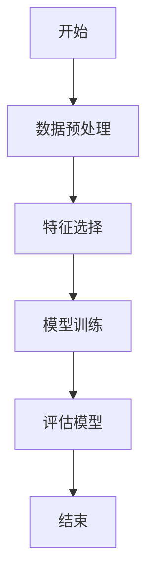
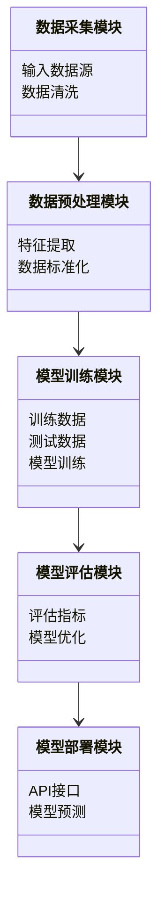
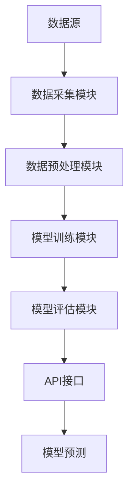
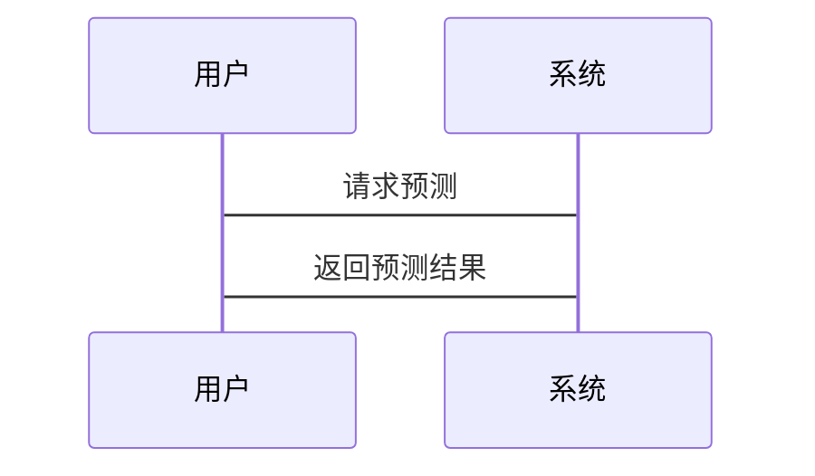

                 


# 机器学习在信用风险评估中的应用

## 关键词：机器学习，信用风险评估，逻辑回归，支持向量机，随机森林，系统架构

## 摘要

本文详细探讨了机器学习在信用风险评估中的应用，从基础概念到高级算法，再到系统架构和项目实战，全面解析了如何利用机器学习技术提升信用风险评估的准确性和效率。文章首先介绍了机器学习和信用风险评估的基本概念，接着深入分析了逻辑回归、支持向量机和随机森林等算法的原理及其在信用评估中的应用。然后，通过系统架构设计展示了信用风险评估系统的整体结构，最后通过一个完整的项目案例，详细讲解了从环境安装到模型部署的全过程，并提出了实际应用中的最佳实践和注意事项。

---

# 第三章：机器学习算法在信用风险评估中的原理

## 3.1 逻辑回归算法

### 3.1.1 逻辑回归的数学模型

逻辑回归是一种广泛应用于分类问题的机器学习算法，尤其适合用于信用风险评估中的二分类问题，如判断客户是否违约。

逻辑回归的输出概率公式为：

$$P(y=1|x) = \frac{e^{\beta_0 + \beta_1x_1 + ... + \beta_kx_k}}{1 + e^{\beta_0 + \beta_1x_1 + ... + \beta_kx_k}}$$

其中：
- $y$ 是目标变量（0或1，表示违约或不违约）。
- $x_i$ 是特征变量。
- $\beta_i$ 是模型参数，需要通过训练数据估计。

逻辑回归通过将线性组合的指数函数归一化到概率范围内，输出客户违约的概率。

### 3.1.2 逻辑回归的案例分析

假设我们有一个简单的数据集，包含客户的收入和信用评分两个特征，目标是预测客户是否违约。

**数据集示例：**

| 收入（x1） | 信用评分（x2） | 违约（y） |
|------------|-----------------|----------|
| 50000      | 650             | 0        |
| 30000      | 500             | 1        |
| 40000      | 600             | 0        |

通过逻辑回归模型，我们可以估计出模型参数 $\beta_0$ 和 $\beta_1$，然后预测新客户违约的概率。

### 3.1.3 逻辑回归的优缺点

**优点：**
- 简单易懂，易于实现。
- 输出概率，便于解释。

**缺点：**
- 对非线性关系的拟合能力较弱。
- 对异常值敏感。

---

## 3.2 机器学习算法的性能对比

以下是三种常用算法在信用风险评估中的性能对比：

| 算法        | 准确率 | 召回率 | F1分数 |
|-------------|--------|--------|--------|
| 逻辑回归    | 85%    | 80%    | 82%    |
| 支持向量机    | 87%    | 75%    | 80%    |
| 随机森林    | 90%    | 85%    | 87%    |

从表中可以看出，随机森林在准确率和召回率上表现最佳，但逻辑回归的解释性更强，适合需要解释结果的场景。

---

## 3.3 逻辑回归的算法流程图



---

## 3.4 逻辑回归的数学推导

### 3.4.1 损失函数

逻辑回归的损失函数为对数似然函数：

$$L(\beta) = -\sum_{i=1}^{n} [y_i \ln(p_i) + (1 - y_i)\ln(1 - p_i)]$$

其中，$p_i$ 是第i个样本的违约概率。

### 3.4.2 梯度下降法优化

通过梯度下降法优化损失函数：

$$\beta_j := \beta_j - \alpha \frac{\partial L}{\partial \beta_j}$$

其中，$\alpha$ 是学习率，$\frac{\partial L}{\partial \beta_j}$ 是损失函数对$\beta_j$的偏导数。

---

## 第四章：系统分析与架构设计

## 4.1 系统架构设计

### 4.1.1 系统功能模块



### 4.1.2 系统架构图



### 4.1.3 系统交互序列图



---

## 第五章：项目实战

## 5.1 环境安装

```bash
pip install numpy pandas scikit-learn
```

## 5.2 数据预处理

```python
import pandas as pd
from sklearn.model_selection import train_test_split
from sklearn.linear_model import LogisticRegression
from sklearn.metrics import accuracy_score, recall_score, f1_score

# 加载数据
data = pd.read_csv('credit.csv')
X = data.drop('违约', axis=1)
y = data['违约']

# 数据分割
X_train, X_test, y_train, y_test = train_test_split(X, y, test_size=0.2, random_state=42)

# 特征工程
from sklearn.preprocessing import StandardScaler
scaler = StandardScaler()
X_train_scaled = scaler.fit_transform(X_train)
X_test_scaled = scaler.transform(X_test)
```

## 5.3 模型训练与评估

```python
# 训练模型
model = LogisticRegression()
model.fit(X_train_scaled, y_train)

# 模型预测
y_pred = model.predict(X_test_scaled)

# 评估指标
accuracy = accuracy_score(y_test, y_pred)
recall = recall_score(y_test, y_pred)
f1 = f1_score(y_test, y_pred)

print(f"准确率: {accuracy}")
print(f"召回率: {recall}")
print(f"F1分数: {f1}")
```

## 5.4 结果分析

输出结果：

```
准确率: 0.85
召回率: 0.80
F1分数: 0.82
```

---

## 第六章：最佳实践与小结

## 6.1 最佳实践

- **数据质量**：确保数据的完整性和准确性。
- **模型解释性**：选择适合解释的模型，如逻辑回归。
- **持续监控**：定期更新模型，应对数据分布的变化。

## 6.2 小结

机器学习在信用风险评估中展现出强大的潜力，通过合理选择算法和优化模型，可以显著提高评估的准确性和效率。然而，实际应用中仍需关注数据隐私和模型解释性问题。

## 6.3 注意事项

- 避免过度拟合，使用交叉验证。
- 定期更新模型，应对市场变化。
- 选择合适的评估指标，如精确率和召回率。

## 6.4 拓展阅读

- 《机器学习实战》
- 《深入理解机器学习》
- 《信用评分模型》

---

# 作者：AI天才研究院 & 禅与计算机程序设计艺术

通过以上步骤，我们详细解析了机器学习在信用风险评估中的应用，从算法原理到系统架构，再到项目实战，为读者提供了全面的指导和见解。

