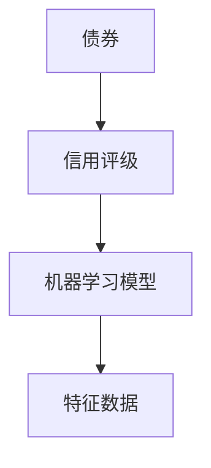
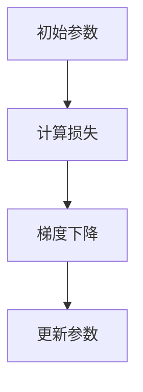
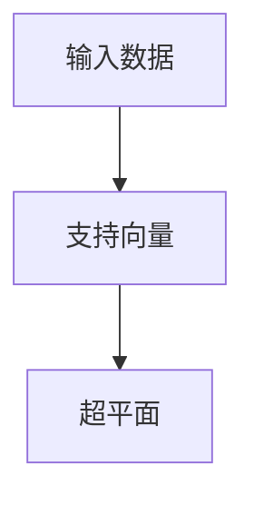
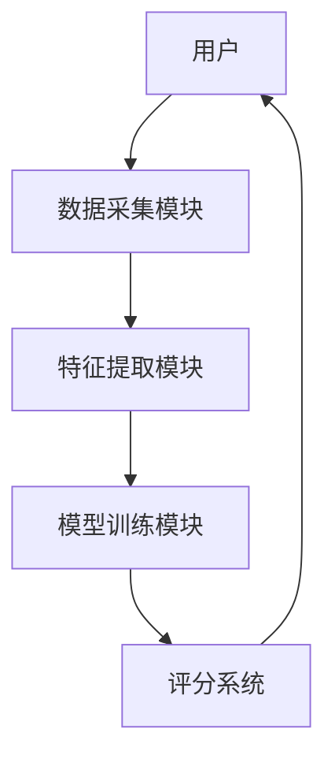
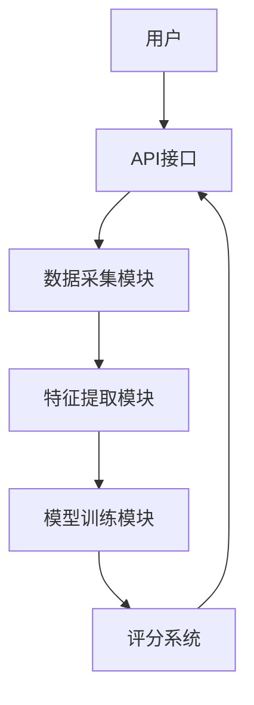
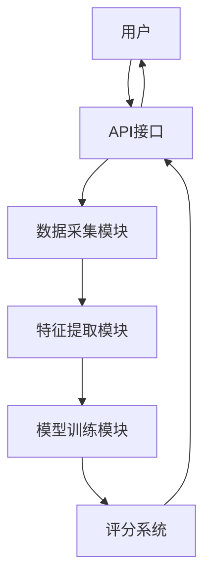

                 


# 《机器学习在债券信用评级中的应用研究》

**关键词**：债券信用评级、机器学习、特征工程、模型评估、系统架构

**摘要**：本文系统地探讨了机器学习在债券信用评级中的应用，从背景介绍、核心算法原理、系统架构设计到实际项目实战，全面解析了机器学习在信用评级中的优势、挑战及解决方案。通过对比不同算法的优缺点，结合实际案例分析，本文为读者提供了从理论到实践的完整指南，帮助读者更好地理解和应用机器学习技术在债券信用评级中的应用场景。

---

## 第一章: 背景介绍

### 1.1 问题背景

#### 1.1.1 信用评级的定义与重要性
信用评级是对债务人偿还债务能力的综合评估，是金融领域的重要组成部分。债券信用评级是信用评级的重要分支，主要用于评估债券发行人偿还债务的风险水平。信用评级结果直接关系到债券的发行成本和市场流动性，对金融市场稳定运行具有重要意义。

#### 1.1.2 传统信用评级方法的局限性
传统信用评级方法主要依赖于经验丰富的分析师对财务数据和市场信息进行主观判断。这种方法存在以下局限性：
- **主观性**：依赖分析师的个人经验和判断，可能导致结果偏差。
- **信息不全**：传统方法通常只考虑有限的财务指标，忽略了非结构化数据（如新闻、社交媒体等）的价值。
- **效率低下**：面对海量数据时，人工分析效率较低，难以满足实时需求。

#### 1.1.3 机器学习在信用评级中的优势
机器学习作为一种数据驱动的自动化分析技术，具有以下显著优势：
- **数据处理能力**：能够处理海量结构化和非结构化数据，提取更多潜在特征。
- **自动化与高效性**：通过算法自动学习数据中的模式，提高分析效率。
- **客观性**：减少人为判断干扰，提高评级结果的客观性和一致性。

### 1.2 问题描述

#### 1.2.1 债券信用评级的核心要素
债券信用评级的核心要素包括：
- **发行人资质**：包括公司财务状况、盈利能力、管理水平等。
- **债券条款**：包括债券期限、票面利率、偿还方式等。
- **市场环境**：包括宏观经济指标、行业发展趋势等。
- **外部评级**：包括第三方评级机构的评级结果。

#### 1.2.2 机器学习在信用评级中的适用场景
- **风险预警**：通过机器学习模型实时监测债券发行人风险，提前预警潜在违约。
- **特征提取**：从海量数据中提取关键特征，提高评级结果的准确性。
- **个性化评级**：针对不同发行人的特点，定制化评级模型，提高评级结果的精细度。

#### 1.2.3 问题解决的边界与外延
- **边界**：本研究主要关注债券信用评级的自动化模型构建与优化。
- **外延**：未来可以进一步研究如何结合外部事件（如新冠疫情）对评级结果的影响。

### 1.3 核心概念与联系

#### 1.3.1 核心概念原理
- **债券评级**：通过量化指标和模型评估债券发行人的信用风险。
- **机器学习**：利用算法从数据中学习特征，建立预测模型。
- **特征工程**：对数据进行预处理和特征提取，为模型提供有效输入。

#### 1.3.2 核心概念属性特征对比表格
| 概念       | 描述                     |
|------------|--------------------------|
| 债券评级    | 评估债券信用风险的过程   |
| 机器学习    | 基于数据的模式识别方法     |
| 特征工程    | 数据预处理与特征提取      |
| 模型评估    | 模型性能的量化评估方法     |

#### 1.3.3 ER实体关系图


### 1.4 本章小结
本章从背景、问题背景、核心概念等方面介绍了机器学习在债券信用评级中的应用，为后续分析奠定了基础。

---

## 第二章: 机器学习算法原理

### 2.1 机器学习模型概述

#### 2.1.1 线性回归
- **定义**：通过拟合一条直线来预测目标变量。
- **公式**：$$ y = \beta_0 + \beta_1x_1 + \beta_2x_2 + ... + \beta_nx_n $$
- **适用场景**：适合线性关系明显的数据。

#### 2.1.2 支持向量机 (SVM)
- **定义**：通过找到一个超平面，将数据分为两类。
- **适用场景**：适合非线性分类问题。

#### 2.1.3 随机森林
- **定义**：通过集成多个决策树模型，提高预测准确性。
- **适用场景**：适合高维数据和复杂分类问题。

#### 2.1.4 神经网络
- **定义**：通过多层神经元网络模拟人脑的神经网络。
- **适用场景**：适合处理非结构化数据和复杂模式识别。

### 2.2 算法原理详细讲解

#### 2.2.1 线性回归的数学模型
$$ y = \beta_0 + \beta_1x_1 + \beta_2x_2 + ... + \beta_nx_n $$
- **损失函数**：$$ L = \frac{1}{2m}\sum_{i=1}^{m}(y_i - \hat{y}_i)^2 $$
- **优化方法**：$$ \theta = \theta - \alpha \frac{\partial L}{\partial \theta} $$

#### 2.2.2 梯度下降优化


#### 2.2.3 支持向量机的分类原理


### 2.3 算法对比与选择

#### 2.3.1 不同算法的优缺点对比
| 算法       | 优点                     | 缺点                     |
|------------|--------------------------|--------------------------|
| 线性回归    | 简单，计算速度快          | 仅适合线性关系           |
| SVM         | 高精度，适合小数据集      | 不适合高维数据           |
| 随机森林    | 高精度，适合高维数据      | 计算复杂度较高           |
| 神经网络    | 适合复杂模式识别         | 需要大量数据，易过拟合   |

#### 2.3.2 适用场景分析
- **线性回归**：适合简单线性关系的信用评分。
- **SVM**：适合小样本分类问题。
- **随机森林**：适合高维数据特征提取。
- **神经网络**：适合非结构化数据处理。

### 2.4 本章小结
本章详细介绍了机器学习的核心算法及其在债券信用评级中的应用，为后续系统设计提供了理论基础。

---

## 第三章: 系统分析与架构设计

### 3.1 问题场景

#### 3.1.1 系统应用场景
- **数据来源**：债券发行人财务数据、市场数据、新闻数据等。
- **用户需求**：投资者需要实时、准确的债券信用评级。

#### 3.1.2 系统功能设计
- **数据采集**：从多种数据源获取债券相关信息。
- **特征提取**：对数据进行预处理和特征提取。
- **模型训练**：基于机器学习算法构建信用评级模型。
- **评分系统**：对债券发行人进行信用评分，并输出结果。

#### 3.1.3 系统架构设计


### 3.2 系统架构设计

#### 3.2.1 系统架构图


#### 3.2.2 系统接口设计
- **输入接口**：接收债券发行人数据。
- **输出接口**：输出信用评分结果。

#### 3.2.3 系统交互流程图


### 3.3 本章小结
本章从系统架构设计的角度，详细描述了机器学习在债券信用评级中的应用场景和实现方案。

---

## 第四章: 项目实战

### 4.1 环境安装

#### 4.1.1 安装Python和相关库
- **安装Python**：使用Anaconda或Miniconda安装Python 3.8及以上版本。
- **安装库**：
  ```bash
  pip install pandas numpy scikit-learn matplotlib
  ```

### 4.2 系统核心实现源代码

#### 4.2.1 数据预处理代码
```python
import pandas as pd
import numpy as np

# 加载数据
data = pd.read_csv('bond_data.csv')

# 删除缺失值
data = data.dropna()

# 标准化处理
from sklearn.preprocessing import StandardScaler
scaler = StandardScaler()
scaled_data = scaler.fit_transform(data)
```

#### 4.2.2 特征选择代码
```python
from sklearn.ensemble import RandomForestClassifier
from sklearn.feature_selection import SelectFromModel

model = RandomForestClassifier()
model.fit(scaled_data, labels)
selected_features = model.feature_importances_
```

#### 4.2.3 模型训练代码
```python
from sklearn.model_selection import train_test_split
from sklearn.metrics import accuracy_score

X_train, X_test, y_train, y_test = train_test_split(selected_features, labels, test_size=0.2)

model = RandomForestClassifier()
model.fit(X_train, y_train)
y_pred = model.predict(X_test)
print("Accuracy:", accuracy_score(y_test, y_pred))
```

### 4.3 实际案例分析

#### 4.3.1 数据分析与建模
- **数据来源**：某债券发行人的财务数据、市场数据等。
- **模型训练**：使用随机森林模型进行训练。
- **结果输出**：输出债券信用评级结果。

#### 4.3.2 模型优化与调优
- **超参数优化**：使用网格搜索优化模型参数。
- **交叉验证**：使用K折交叉验证评估模型性能。

### 4.4 项目小结
本章通过实际案例展示了机器学习在债券信用评级中的应用，从数据预处理到模型训练，再到结果输出，详细讲解了整个实现过程。

---

## 第五章: 最佳实践与总结

### 5.1 最佳实践 tips

#### 5.1.1 数据清洗与特征工程
- **数据清洗**：去除缺失值和异常值。
- **特征工程**：提取有意义的特征，降低模型复杂度。

#### 5.1.2 模型调优与优化
- **超参数优化**：使用网格搜索或随机搜索优化模型参数。
- **交叉验证**：使用K折交叉验证评估模型性能。

#### 5.1.3 结果验证与解释
- **结果验证**：通过混淆矩阵、ROC曲线等方法验证模型性能。
- **结果解释**：通过特征重要性分析解释模型结果。

### 5.2 总结与展望

#### 5.2.1 本章总结
- 机器学习在债券信用评级中的应用具有显著优势。
- 通过特征工程和模型优化可以显著提高评级准确性。

#### 5.2.2 未来展望
- **多模态数据融合**：结合文本数据、社交媒体数据等多模态数据，进一步提高评级准确性。
- **实时评级系统**：开发实时监控系统，及时捕捉市场变化对债券评级的影响。

### 5.3 本章小结
本章总结了机器学习在债券信用评级中的应用经验，并展望了未来的研究方向。

---

## 作者

作者：AI天才研究院/AI Genius Institute & 禅与计算机程序设计艺术 /Zen And The Art of Computer Programming

---

通过以上思考过程，我们从背景介绍、算法原理、系统设计到项目实战，全面解析了机器学习在债券信用评级中的应用。希望本文能为读者提供有价值的参考和启发。

