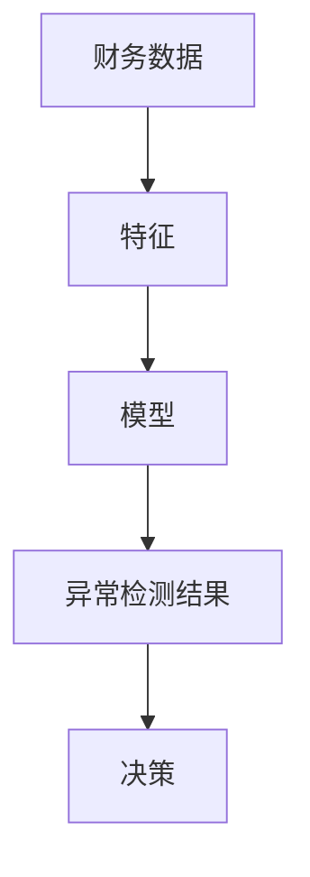
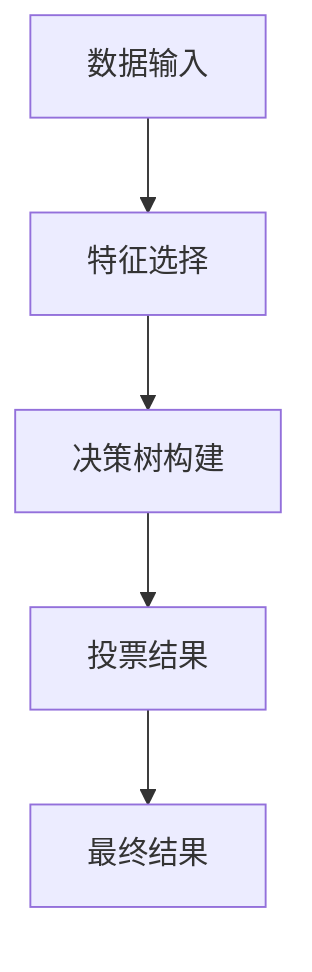
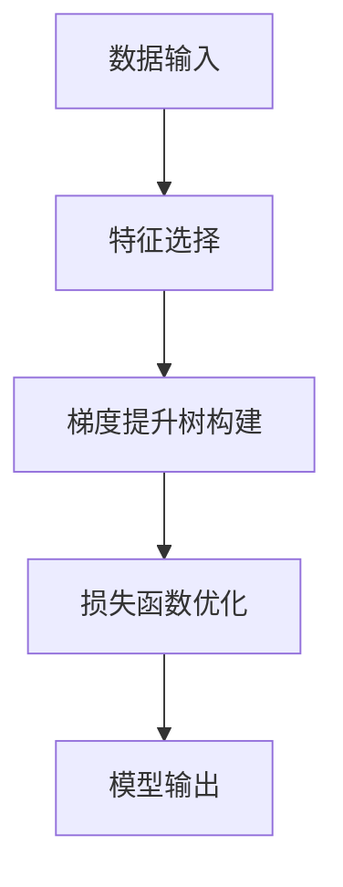
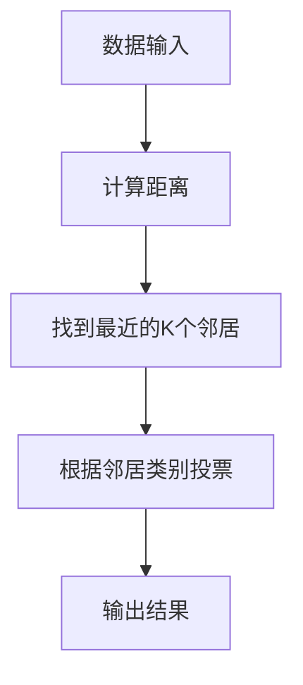
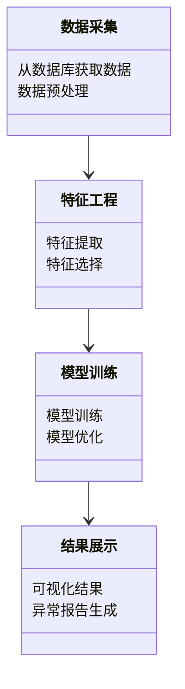
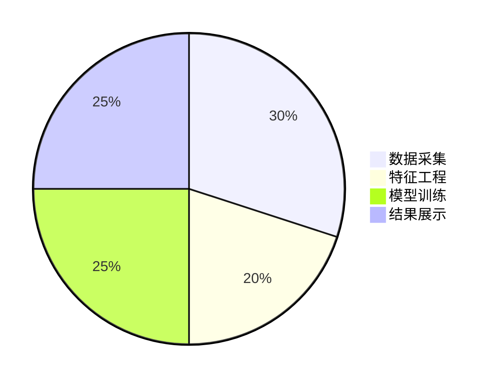
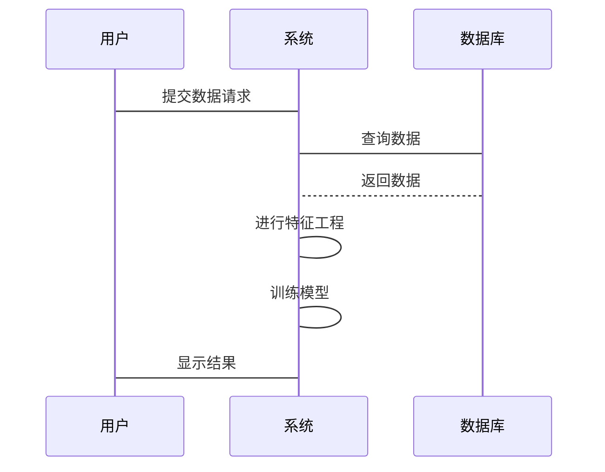

                 


```markdown
# 机器学习在公司财务异常检测中的应用

## 关键词：
- 机器学习
- 财务异常检测
- 数据挖掘
- 随机森林
- XGBoost
- 特征工程

## 摘要：
随着企业规模的不断扩大和金融市场的日益复杂，传统的财务分析方法在检测财务异常方面面临着诸多挑战。机器学习作为一种强大的数据分析工具，能够从海量数据中提取有价值的信息，发现隐藏的模式和异常情况。本文将详细探讨机器学习在公司财务异常检测中的应用，从数据预处理、特征工程到算法选择和模型部署，全面解析如何利用机器学习技术提升财务异常检测的准确性和效率。通过实际案例分析，本文将展示机器学习在财务异常检测中的实际应用价值，并为读者提供一套完整的解决方案。

---

## 第一部分: 机器学习在公司财务异常检测中的应用概述

## 第1章: 机器学习与财务异常检测的背景介绍

### 1.1 机器学习的基本概念
#### 1.1.1 机器学习的定义与核心概念
机器学习是一种人工智能技术，通过数据训练模型，使其能够从数据中学习并做出预测或分类。其核心概念包括监督学习、无监督学习和半监督学习。

#### 1.1.2 机器学习的分类与应用场景
- **监督学习**：适用于分类和回归问题，如预测股票价格。
- **无监督学习**：适用于聚类和降维，如发现交易模式。
- **半监督学习**：结合监督和无监督学习，适用于数据标注不足的情况。

#### 1.1.3 机器学习在企业中的重要性
机器学习能够帮助企业自动化分析数据，发现潜在问题，优化决策流程。

### 1.2 财务异常检测的定义与重要性
#### 1.2.1 财务异常检测的定义
财务异常检测是指通过分析财务数据，识别出与正常情况不符的异常行为或数据。

#### 1.2.2 财务异常检测的主要应用场景
- **欺诈检测**：识别财务报表中的虚假信息。
- **风险预警**：提前发现潜在的财务危机。
- **合规性检查**：确保企业财务行为符合相关法规。

#### 1.2.3 财务异常检测对企业价值的影响
及时发现财务异常可以帮助企业避免重大损失，提升财务透明度和信任度。

### 1.3 机器学习在财务异常检测中的优势
#### 1.3.1 传统财务分析的局限性
传统方法依赖人工经验，难以处理海量数据和复杂模式。

#### 1.3.2 机器学习在处理大数据和复杂模式的优势
机器学习能够从大量数据中发现隐藏的模式和异常，提高检测的准确性和效率。

#### 1.3.3 机器学习在财务异常检测中的具体应用案例
- 使用随机森林算法检测欺诈交易。
- 使用聚类算法识别异常的财务趋势。

## 1.4 本章小结
### 1.4.1 机器学习与财务异常检测的结合点
机器学习通过数据挖掘和模式识别，能够有效提升财务异常检测的效率和准确性。

### 1.4.2 机器学习在财务异常检测中的潜力
随着技术的进步，机器学习在财务异常检测中的应用将更加广泛和深入。

---

## 第2章: 机器学习在财务异常检测中的核心概念

### 2.1 机器学习模型分类
#### 2.1.1 监督学习
- 适用于已标注数据的分类和回归任务。
- 常见算法：支持向量机（SVM）、随机森林、XGBoost。

#### 2.1.2 非监督学习
- 适用于无标注数据的聚类和降维任务。
- 常见算法：K-means、DBSCAN。

#### 2.1.3 半监督学习
- 结合监督学习和无监督学习，适用于部分标注数据的情况。
- 常见算法：标签传播算法。

### 2.2 财务异常检测的关键特征
#### 2.2.1 财务数据的特征提取
- 财务数据包括收入、支出、利润、资产负债等指标。
- 特征提取需要考虑数据的时序性和相关性。

#### 2.2.2 异常检测的核心特征分析
- 异常检测的关键在于找到与正常数据显著不同的特征组合。
- 常见特征包括交易金额、交易频率、账户余额变化等。

#### 2.2.3 特征工程在财务异常检测中的重要性
- 特征工程是将原始数据转换为适合模型输入的特征。
- 常见特征工程方法：标准化、归一化、主成分分析（PCA）。

### 2.3 机器学习模型在财务异常检测中的应用
#### 2.3.1 常见的机器学习算法在财务异常检测中的应用
- **随机森林**：适用于分类任务，能够处理高维数据。
- **XGBoost**：适用于分类和回归任务，具有高准确性和效率。
- **K-近邻算法（KNN）**：适用于聚类任务，能够发现异常簇。

#### 2.3.2 算法选择的影响因素
- 数据量和数据类型。
- 检测目标（分类或聚类）。
- 计算资源和时间限制。

#### 2.3.3 模型评估与优化
- 常见评估指标：准确率、召回率、F1分数。
- 模型优化方法：网格搜索、交叉验证。

## 2.4 核心概念与联系
### 2.4.1 核心概念原理
机器学习通过特征工程提取有用的信息，利用算法模型发现数据中的模式和异常。

### 2.4.2 核心概念属性特征对比表格
| 概念       | 监督学习       | 非监督学习     |
|------------|----------------|----------------|
| 数据类型    | 标签数据       | 无标签数据     |
| 任务类型    | 分类/回归      | 聚类/降维      |
| 常见算法    | SVM, Random Forest | K-means, DBSCAN |

### 2.4.3 ER实体关系图架构（使用 Mermaid）



---

## 第3章: 机器学习算法原理与数学模型

### 3.1 常见算法介绍
#### 3.1.1 随机森林
- **原理**：随机森林是一种集成学习算法，通过构建多棵决策树并进行投票或平均来提高模型的准确性和稳定性。
- **优势**：能够处理高维数据，对噪声有较强的鲁棒性。

#### 3.1.2 XGBoost
- **原理**：XGBoost是一种基于梯度提升树的算法，通过迭代优化损失函数来构建强分类器。
- **优势**：训练速度快，准确率高。

#### 3.1.3 K-近邻算法（KNN）
- **原理**：KNN是一种基于实例的算法，通过计算待测点与训练集中各点的距离，找到最近的K个邻居并根据邻居的类别进行预测。
- **优势**：简单易实现，适用于小规模数据。

### 3.2 算法原理与流程图
#### 3.2.1 随机森林算法流程图（使用 Mermaid）



#### 3.2.2 XGBoost算法流程图（使用 Mermaid）



#### 3.2.3 K-近邻算法流程图（使用 Mermaid）



### 3.3 算法数学模型

#### 3.3.1 随机森林的数学模型
随机森林的预测结果是基于多棵决策树的投票结果，公式如下：

$$
\text{预测结果} = \arg\max_{y} \sum_{i=1}^{n} \text{树}_i(y)
$$

其中，$\text{树}_i(y)$表示第$i$棵树的预测结果为$y$的概率。

#### 3.3.2 XGBoost的数学模型
XGBoost的目标是最小化损失函数，其优化过程如下：

$$
\text{损失函数} = \sum_{i=1}^{n} \left( y_i - f(x_i) \right)^2
$$

其中，$y_i$是实际值，$f(x_i)$是模型预测值。

#### 3.3.3 K-近邻算法的数学模型
K-近邻算法的预测结果是基于邻居的平均或投票，公式如下：

$$
\text{预测类别} = \arg\max_{y} \sum_{i=1}^{K} \text{邻居}_i(y)
$$

其中，$K$是邻居的数量。

---

## 第4章: 机器学习在财务异常检测中的系统架构设计

### 4.1 系统功能设计
#### 4.1.1 领域模型（使用 Mermaid 类图）



### 4.2 系统架构设计
#### 4.2.1 系统架构图（使用 Mermaid 架构图）



### 4.3 系统接口设计
#### 4.3.1 数据接口
- 数据输入接口：从数据库或文件中读取数据。
- 数据输出接口：将结果输出到可视化界面或报告。

#### 4.3.2 模型接口
- 模型训练接口：接收特征数据，输出训练好的模型。
- 模型预测接口：接收新的数据，返回预测结果。

### 4.4 系统交互流程（使用 Mermaid 序列图）



---

## 第5章: 项目实战——基于机器学习的财务异常检测系统

### 5.1 项目介绍
#### 5.1.1 项目背景
本文将通过一个实际案例，展示如何利用机器学习技术开发一个财务异常检测系统。

#### 5.1.2 项目目标
- 实现一个能够自动检测公司财务异常的系统。
- 提供可视化界面供用户查看检测结果。

### 5.2 环境配置
#### 5.2.1 安装Python
- 安装Python 3.8及以上版本。
- 安装Jupyter Notebook用于数据分析和建模。

#### 5.2.2 安装依赖库
```bash
pip install numpy
pip install pandas
pip install scikit-learn
pip install xgboost
pip install matplotlib
```

### 5.3 核心实现
#### 5.3.1 数据预处理
- 数据清洗：处理缺失值和异常值。
- 数据标准化：对特征进行标准化处理。

#### 5.3.2 特征选择
- 使用随机森林算法进行特征重要性评估。
- 删除冗余特征，选择关键特征。

#### 5.3.3 模型训练
- 使用XGBoost算法进行分类任务。
- 使用随机森林算法进行聚类任务。

#### 5.3.4 模型优化
- 使用网格搜索（Grid Search）优化模型参数。
- 使用交叉验证评估模型性能。

#### 5.3.5 模型部署
- 将训练好的模型部署到服务器。
- 提供API接口供其他系统调用。

### 5.4 代码实现
#### 5.4.1 数据加载与预处理
```python
import pandas as pd
import numpy as np

# 加载数据
data = pd.read_csv('financial_data.csv')

# 处理缺失值
data = data.dropna()

# 标准化处理
from sklearn.preprocessing import StandardScaler
scaler = StandardScaler()
data_scaled = scaler.fit_transform(data)
```

#### 5.4.2 特征工程
```python
from sklearn.ensemble import RandomForestClassifier
from sklearn.feature_selection import SelectFromModel

# 使用随机森林进行特征重要性评估
model = RandomForestClassifier()
selector = SelectFromModel(model)
selector.fit(data_scaled, labels)
selected_features = selector.transform(data_scaled)
```

#### 5.4.3 模型训练与优化
```python
# 使用XGBoost进行分类任务
import xgboost as xgb

# 训练模型
model = xgb.XGBClassifier()
model.fit(selected_features, labels)

# 模型优化
from sklearn.model_selection import GridSearchCV

param_grid = {
    'n_estimators': [50, 100, 150],
    'learning_rate': [0.01, 0.05, 0.1],
    'max_depth': [3, 4, 5]
}

grid_search = GridSearchCV(model, param_grid, cv=5)
grid_search.fit(selected_features, labels)
best_model = grid_search.best_estimator_
```

#### 5.4.4 模型部署与接口设计
```python
# 提供API接口
from flask import Flask, request, jsonify

app = Flask(__name__)

@app.route('/predict', methods=['POST'])
def predict():
    data = request.json
    # 数据预处理
    processed_data = scaler.transform(data)
    # 模型预测
    prediction = best_model.predict(processed_data)
    return jsonify({'result': prediction.tolist()})

if __name__ == '__main__':
    app.run(debug=True)
```

### 5.5 项目实战总结
#### 5.5.1 项目小结
通过本项目，我们成功实现了基于机器学习的财务异常检测系统，能够有效地识别财务数据中的异常情况。

#### 5.5.2 最佳实践 tips
- 数据预处理是关键，需要仔细清洗和标准化。
- 特征工程能够显著提高模型的准确率。
- 模型优化是提升性能的重要手段，建议使用网格搜索和交叉验证。

#### 5.5.3 注意事项
- 数据隐私和安全问题需要注意。
- 模型的可解释性是实际应用中的重要考量因素。
- 模型需要定期更新，以适应数据分布的变化。

---

## 第6章: 总结与展望

### 6.1 总结
本文详细介绍了机器学习在公司财务异常检测中的应用，从算法原理到系统设计，再到项目实战，全面解析了如何利用机器学习技术提升财务异常检测的效率和准确性。

### 6.2 展望
随着人工智能技术的不断进步，机器学习在财务异常检测中的应用将更加广泛和深入。未来的研究方向包括：
- 更加高效和可解释的算法开发。
- 多模态数据的融合与分析。
- 智能化决策支持系统的构建。

---

## 作者：AI天才研究院/AI Genius Institute & 禅与计算机程序设计艺术 /Zen And The Art of Computer Programming
```

