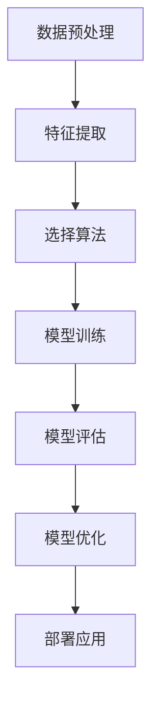
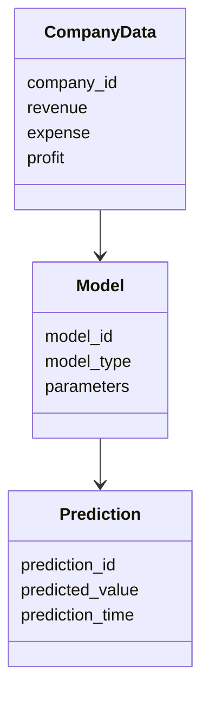
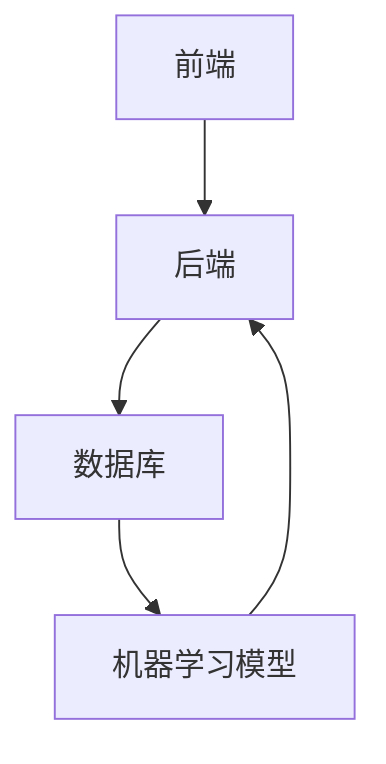
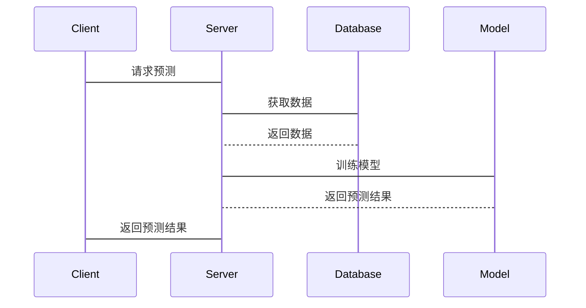

                 


# 机器学习在公司财务预测中的应用研究

## 关键词：机器学习，财务预测，深度学习，算法原理，系统架构

## 摘要：  
机器学习作为人工智能领域的核心技术，正在逐步改变传统的财务预测方式。本文将详细探讨机器学习在公司财务预测中的应用，从背景介绍到算法实现，从系统架构到项目实战，全面解析如何利用机器学习提升财务预测的准确性和效率。通过本文，读者将深入了解机器学习在财务预测中的核心概念、算法原理、系统设计及实际应用，并掌握如何在实际项目中应用这些技术。

---

## 第1章: 机器学习在公司财务预测中的应用概述

### 1.1 机器学习的基本概念
#### 1.1.1 机器学习的定义与核心原理
机器学习是一种人工智能技术，通过数据训练模型，使其能够从数据中学习并做出预测或决策。其核心原理包括监督学习、无监督学习和强化学习等。

#### 1.1.2 机器学习与传统统计分析的区别
传统统计分析依赖于假设检验和固定模型，而机器学习则通过数据驱动的方式，自动提取特征并优化模型。

#### 1.1.3 机器学习在企业中的应用价值
机器学习可以帮助企业提高预测准确性、优化资源配置、降低风险等。

### 1.2 公司财务预测的背景与重要性
#### 1.2.1 财务预测的基本概念
财务预测是通过分析历史数据，预测未来的财务状况，如收入、支出、利润等。

#### 1.2.2 传统财务预测方法的局限性
传统方法依赖于经验判断和简单统计模型，预测精度有限，难以应对复杂多变的市场环境。

#### 1.2.3 机器学习在财务预测中的优势
机器学习能够处理大量非结构化数据，发现隐藏的模式，提高预测的准确性和鲁棒性。

### 1.3 机器学习在财务预测中的应用价值
#### 1.3.1 提高预测准确性
机器学习模型能够捕捉复杂的财务数据关系，显著提高预测精度。

#### 1.3.2 提升决策效率
通过自动化数据处理和预测，机器学习能够快速提供决策支持，提升企业运营效率。

#### 1.3.3 优化资源配置
机器学习可以帮助企业更合理地分配资源，降低浪费，提高整体效益。

---

## 第2章: 机器学习核心概念与财务预测的关系

### 2.1 机器学习的核心概念
#### 2.1.1 监督学习
监督学习是基于 labeled 数据的训练，常见于回归和分类任务。例如，使用线性回归预测公司收入。

#### 2.1.2 无监督学习
无监督学习用于发现数据中的隐藏结构，如聚类分析，帮助识别财务数据中的潜在模式。

#### 2.1.3 强化学习
强化学习通过试错机制优化决策，例如在投资组合优化中动态调整资产配置。

### 2.2 财务预测的核心要素
#### 2.2.1 财务数据的特征
财务数据包括收入、支出、利润、现金流等，这些数据可以通过特征工程提取关键特征。

#### 2.2.2 财务预测的目标
财务预测的目标包括预测收入、成本、利润、现金流等关键指标。

#### 2.2.3 财务预测的边界
财务预测需要考虑数据的可得性、模型的适用性以及外部环境的不确定性。

### 2.3 机器学习与财务预测的联系
#### 2.3.1 数据驱动的预测方法
机器学习通过数据驱动的方式，发现传统方法难以察觉的规律。

#### 2.3.2 特征工程在财务预测中的应用
特征工程是将原始数据转化为更有预测性的特征，例如使用移动平均数、收益率等指标。

#### 2.3.3 模型评估与优化
通过交叉验证和网格搜索等方法，优化模型参数，提高预测性能。

### 2.4 核心概念对比表
| 比较维度       | 传统统计方法           | 机器学习方法           |
|----------------|------------------------|------------------------|
| 数据需求       | 小，结构化数据         | 大，结构化和非结构化数据 |
| 模型复杂度     | 简单，可解释性高       | 复杂，难以解释          |
| 预测精度       | 一般，受假设限制       | 更高，捕捉复杂模式      |

### 2.5 ER实体关系图
```mermaid
erd
  矩形 Company {
    公司编号
    公司名称
  }
  矩形 FinancialData {
    数据编号
    收入
    支出
    利润
  }
  矩形 Model {
    模型编号
    模型名称
    模型参数
  }
  矩形 Prediction {
    预测编号
    预测值
    预测时间
  }
  关系：Company --> FinancialData
  关系：FinancialData --> Model
  关系：Model --> Prediction
```

---

## 第3章: 机器学习算法原理与财务预测模型

### 3.1 常用机器学习算法简介
#### 3.1.1 线性回归
线性回归用于预测连续型变量，例如公司收入预测。

$$ y = \beta_0 + \beta_1x_1 + \beta_2x_2 + \cdots + \beta_nx_n $$

#### 3.1.2 支持向量机
支持向量机用于分类和回归任务，适合高维数据。

#### 3.1.3 随机森林
随机森林是一种基于决策树的集成学习方法，适用于分类和回归。

### 3.2 算法实现与流程图


### 3.3 数学模型与公式
#### 3.3.1 线性回归的损失函数
$$ L = \frac{1}{2m}\sum_{i=1}^{m}(y_i - \hat{y}_i)^2 $$

#### 3.3.2 支持向量回归
$$ y = f(x) + \epsilon $$

### 3.4 算法流程与代码实现
```python
import pandas as pd
from sklearn.model_selection import train_test_split
from sklearn.linear_model import LinearRegression

# 数据加载与预处理
data = pd.read_csv('financial_data.csv')
X = data[['收入', '支出']]
y = data['利润']

# 数据分割
X_train, X_test, y_train, y_test = train_test_split(X, y, test_size=0.2)

# 模型训练
model = LinearRegression()
model.fit(X_train, y_train)

# 模型预测
predictions = model.predict(X_test)
```

---

## 第4章: 系统分析与架构设计

### 4.1 项目背景与目标
开发一个基于机器学习的财务预测系统，提高企业的财务预测能力。

### 4.2 系统功能设计


### 4.3 系统架构设计


### 4.4 接口与交互设计


---

## 第5章: 项目实战

### 5.1 环境配置
安装Python、机器学习库（如scikit-learn、XGBoost）和数据处理工具（如Pandas）。

### 5.2 数据预处理与特征工程
```python
import pandas as pd
from sklearn.preprocessing import StandardScaler

data = pd.read_csv('financial_data.csv')
# 特征工程
features = data[['收入', '支出', '资产', '负债']]
target = data['利润']

# 数据标准化
scaler = StandardScaler()
features_scaled = scaler.fit_transform(features)
```

### 5.3 模型训练与优化
```python
from sklearn.ensemble import RandomForestRegressor
from sklearn.model_selection import GridSearchCV

# 参数优化
param_grid = {
    'n_estimators': [100, 200],
    'max_depth': [None, 10, 20]
}

grid_search = GridSearchCV(RandomForestRegressor(), param_grid, cv=5)
grid_search.fit(features_scaled, target)
best_model = grid_search.best_estimator_
```

### 5.4 案例分析
以某公司为例，使用随机森林模型预测未来一年的利润。

---

## 第6章: 最佳实践与总结

### 6.1 最佳实践
- 数据预处理是关键，尤其是特征工程。
- 模型选择要根据数据特性，避免过拟合。
- 模型部署要考虑实时性和可扩展性。

### 6.2 小结
机器学习为公司财务预测提供了新的思路和方法，通过数据驱动的方式，显著提高了预测的准确性和效率。

### 6.3 注意事项
- 数据质量直接影响模型性能。
- 模型解释性在企业应用中很重要。
- 需要结合业务知识进行特征选择。

### 6.4 拓展阅读
推荐书籍和论文，深入学习机器学习和财务预测的相关知识。

---

## 参考文献
1. 《机器学习实战》
2. 《深入浅出机器学习》
3. 《财务报表分析与企业价值评估》

---

## 作者：AI天才研究院 & 禅与计算机程序设计艺术

---

感谢您的阅读！希望本文对您理解机器学习在公司财务预测中的应用有所帮助。如需进一步探讨或获取代码示例，请随时联系！

