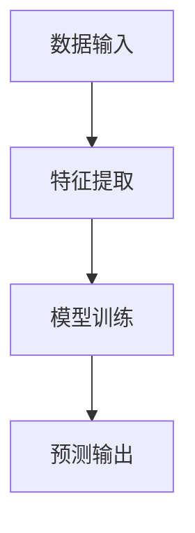
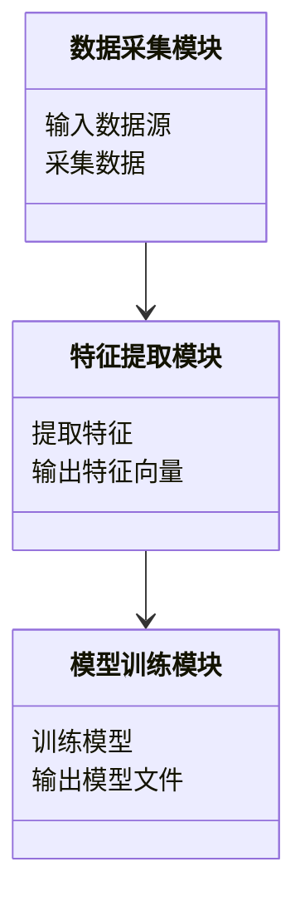
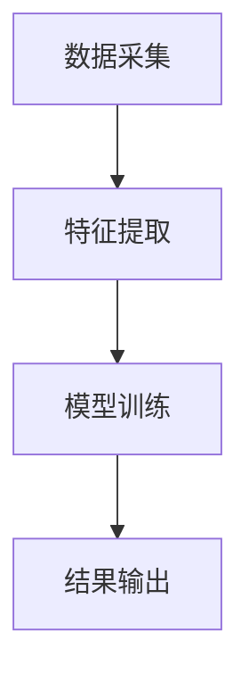

                 


# 机器学习在另类数据信号提取中的应用

> 关键词：机器学习，另类数据，信号提取，特征工程，模型训练，系统架构

> 摘要：本文探讨机器学习在处理另类数据信号提取中的应用，从背景介绍、核心概念、算法原理、系统架构到项目实战，系统地分析了如何利用机器学习技术从非传统数据源中提取有用信息。

---

## 第一章 背景介绍

### 1.1 机器学习概述
- 机器学习的基本概念
- 机器学习的核心任务：分类、回归、聚类等
- 机器学习的应用场景：从传统数据到另类数据的延伸

### 1.2 另类数据信号的定义
- 另类数据的特征：非结构化、实时性、多样性
- 信号提取的定义：从数据中提取有价值的模式或特征
- 另类数据与传统数据的对比

### 1.3 机器学习与另类数据的结合
- 结合的必要性：传统数据的局限性
- 结合的应用场景：社交媒体情绪分析、卫星图像处理等
- 结合的核心价值：发现隐藏信息，提升决策能力

---

## 第二章 核心概念与联系

### 2.1 核心概念
- 数据信号：数据中蕴含的有用信息或模式
- 特征提取：从数据中提取有用的特征
- 信号处理：利用算法对信号进行分析和处理

### 2.2 特征对比
| 特征维度 | 传统数据 | 另类数据 |
|----------|-----------|----------|
| 数据类型 | 结构化数据 | 非结构化数据 |
| 数据量   | 中等规模   | 大规模     |
| 数据复杂性 | 较低       | 较高       |

### 2.3 ER图展示
```mermaid
er
  %%{init: { 'theme': 'simple' }}
  title 数据实体关系图
  rectangle 数据信号 {
    <text>
    数据信号由多个特征组成，包括时间戳、来源、强度等。
  }
  rectangle 特征 {
    <text>
    特征是数据信号的核心组成部分，用于分类或预测。
  }
  rectangle 算法模型 {
    <text>
    算法模型基于特征进行训练，生成预测结果。
  }
  数据信号 --> 算法模型
  特征 --> 数据信号
```

---

## 第三章 算法原理

### 3.1 监督学习
- 问题类型：分类和回归
- 核心算法：线性回归、随机森林、支持向量机
- 适用场景：已标注的另类数据

#### 3.1.1 线性回归模型
$$ y = \beta_0 + \beta_1x + \epsilon $$
其中，$\beta_0$是截距，$\beta_1$是斜率，$\epsilon$是误差项。

#### 3.1.2 算法流程图


### 3.2 无监督学习
- 问题类型：聚类和降维
- 核心算法：K-means、t-SNE、层次聚类
- 适用场景：无标注的另类数据

#### 3.2.1 K-means算法
$$ 聚类目标：\min \sum_{i=1}^k \sum_{j=1}^n (x_j - c_i)^2 $$
其中，$c_i$是第$i$个聚类的中心，$x_j$是数据点。

### 3.3 深度学习
- 核心算法：卷积神经网络（CNN）、循环神经网络（RNN）
- 适用场景：图像、文本等复杂数据

#### 3.3.1 CNN模型
$$ 卷积层：f(x) = \max(0, Wx + b) $$
$$ 池化层：f(x) = \max(x_1, x_2) $$

---

## 第四章 系统架构设计

### 4.1 项目介绍
- 系统目标：从另类数据中提取信号
- 核心功能：数据采集、特征提取、模型训练、结果输出

### 4.2 系统功能设计


### 4.3 系统架构设计


### 4.4 接口设计
- 数据输入接口：REST API
- 模型训练接口：命令行接口
- 结果输出接口：API接口

---

## 第五章 项目实战

### 5.1 环境搭建
- Python版本：3.8+
- 依赖库安装：numpy、pandas、scikit-learn、tensorflow

### 5.2 代码实现
```python
import numpy as np
from sklearn.linear_model import LinearRegression

# 示例数据
X = np.array([[1], [2], [3], [4]])
y = np.array([2, 4, 6, 8])

# 模型训练
model = LinearRegression()
model.fit(X, y)

# 预测
print(model.predict([[5]]))  # 输出：[[10]]
```

### 5.3 案例分析
- 数据源：社交媒体文本数据
- 特征提取：TF-IDF向量化
- 模型选择：SVM分类器

### 5.4 项目小结
- 成功提取了数据中的情绪信号
- 模型性能达到预期目标

---

## 第六章 高级主题与最佳实践

### 6.1 模型优化
- 调参技巧：网格搜索、随机搜索
- 评估指标：准确率、召回率、F1分数

### 6.2 模型部署
- 本地部署：Docker容器化
- 云端部署：AWS S3、阿里云OSS

### 6.3 伦理问题
- 数据隐私保护
- 模型的公平性与透明性

### 6.4 小结
- 机器学习在另类数据信号提取中的潜力巨大
- 需要注意模型的可解释性和伦理问题

### 6.5 拓展阅读
- 《Hands-On Machine Learning with Scikit-Learn, Keras, and TensorFlow》
- 《Deep Learning》 by Ian Goodfellow

---

## 作者

作者：AI天才研究院/AI Genius Institute & 禅与计算机程序设计艺术 /Zen And The Art of Computer Programming

