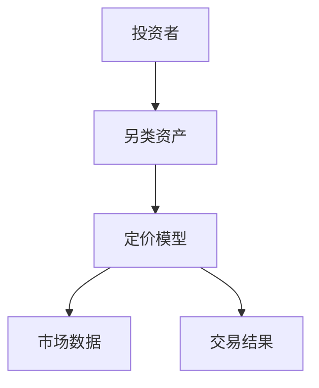
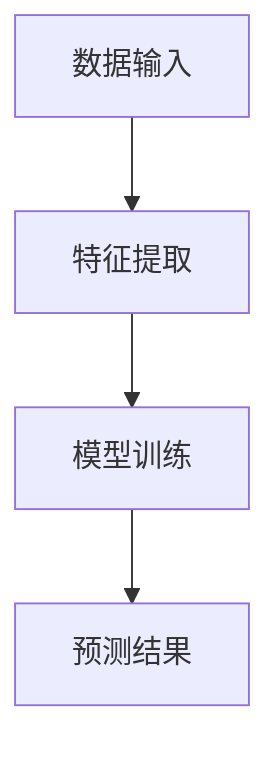
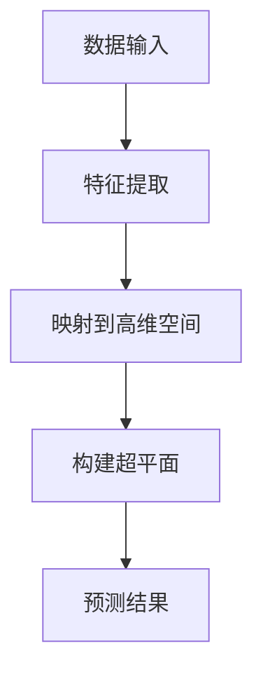
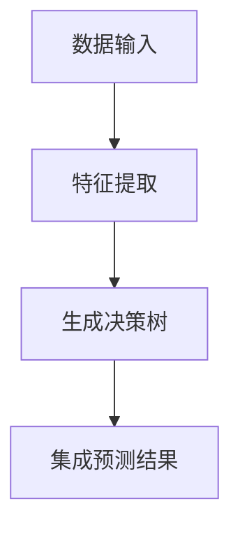
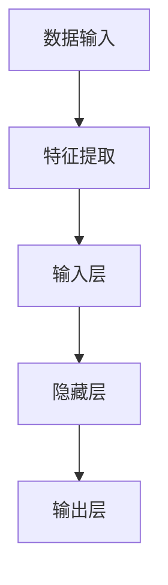
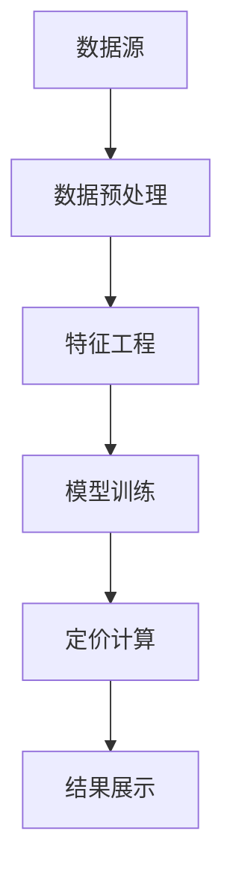
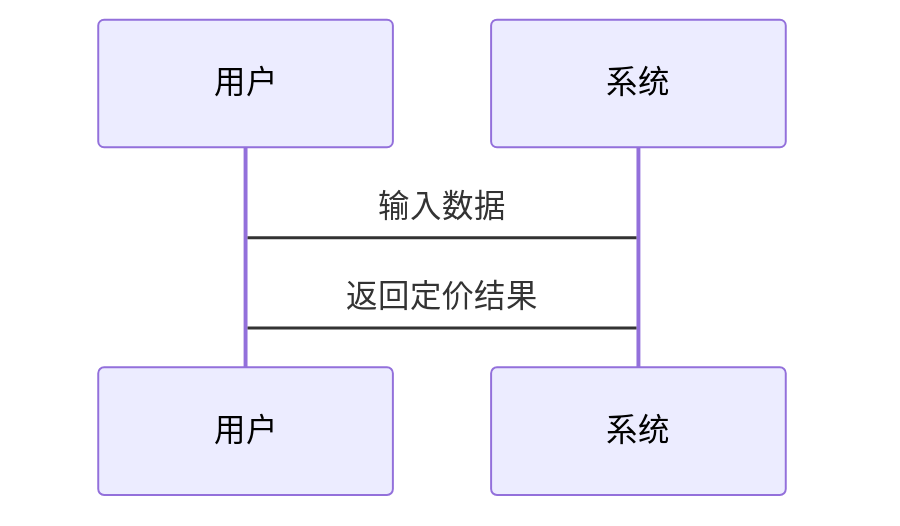

                 


# 机器学习在另类资产定价中的应用研究

## 关键词
机器学习、另类资产、资产定价、金融模型、深度学习、特征工程

## 摘要
机器学习在金融领域的应用日益广泛，特别是在另类资产定价方面展现了巨大潜力。本文系统地探讨了机器学习在另类资产定价中的应用，从背景介绍、核心概念、算法原理到系统架构、项目实战和最佳实践，为读者提供了全面的视角。通过实际案例和数学模型的分析，本文揭示了机器学习如何提升资产定价的准确性，优化投资决策，并推动金融科技创新。

---

## 第1章: 问题背景与研究意义

### 1.1 问题背景

#### 1.1.1 另类资产的定义与特点
另类资产是指传统金融资产之外的资产类别，包括房地产、私募股权、对冲基金、艺术品、贵金属等。这些资产通常具有高收益、高风险的特点，并且市场流动性较低。与传统资产相比，另类资产的价格受多种因素影响，如市场情绪、宏观经济指标、行业趋势等。

#### 1.1.2 传统资产定价模型的局限性
传统资产定价模型（如CAPM和APT）主要适用于股票和债券等标准化资产。然而，对于另类资产，这些模型在处理非线性关系、复杂市场动态和大数据时显得力不从力。传统模型往往无法捕捉到隐藏在大数据中的关键信息，导致定价结果不够准确。

#### 1.1.3 机器学习在金融领域的潜力
机器学习是一种人工智能技术，能够从大量数据中自动学习模式和特征，并用于预测和分类。在金融领域，机器学习已被用于信用评分、风险管理、股票预测等方面。在另类资产定价中，机器学习可以通过分析非结构化数据（如文本、图像）和结构化数据，提取更多有用的特征，从而提高定价的准确性。

### 1.2 研究意义

#### 1.2.1 提高资产定价的准确性
机器学习能够处理复杂的数据关系，发现传统模型难以捕捉的模式，从而提供更准确的定价。

#### 1.2.2 优化投资决策效率
通过机器学习模型，投资者可以快速获取另类资产的定价信息，从而优化投资组合，提高投资效率。

#### 1.2.3 推动金融科技创新
机器学习的应用不仅提升了资产定价的准确性，还推动了金融领域的技术进步，为金融行业注入了新的活力。

---

## 第2章: 核心概念与联系

### 2.1 核心概念原理

#### 2.1.1 机器学习的定义与特点
机器学习是一种通过数据学习模型的技术，具有以下特点：
1. **数据驱动**：依赖大量数据进行训练。
2. **自动化**：能够自动提取数据特征。
3. **适应性**：模型能够适应新数据的变化。

#### 2.1.2 另类资产定价的核心要素
1. **数据来源**：包括市场数据、行业数据、宏观经济指标等。
2. **定价模型**：用于预测资产价格的数学模型。
3. **风险评估**：评估资产在不同市场条件下的风险。

#### 2.1.3 机器学习与金融定价的结合点
1. **特征工程**：提取有用的特征用于模型训练。
2. **非线性关系**：机器学习擅长处理非线性关系。
3. **实时预测**：能够实时更新模型，提供动态定价。

### 2.2 核心概念对比表

表2-1: 不同资产类型的特点对比

| 资产类型 | 价格波动性 | 市场流动性 | 数据复杂性 |
|----------|------------|------------|------------|
| 股票     | 高          | 高          | 中          |
| 债券     | 中          | 高          | 中          |
| 房地产   | 高          | 低          | 高          |
| 私募股权 | 高          | 极低        | 高          |

### 2.3 实体关系图

图2-1: 机器学习在资产定价中的ER实体关系图



---

## 第3章: 常用机器学习算法及其在资产定价中的应用

### 3.1 算法原理

#### 3.1.1 线性回归
线性回归是一种简单的回归算法，适用于线性关系的预测。

**流程图**



**数学模型**

$$ y = \beta_0 + \beta_1x + \epsilon $$

**实际案例**
以房地产价格预测为例，使用线性回归模型，通过面积和位置预测房价。

#### 3.1.2 支持向量机（SVM）
SVM适用于非线性分类和回归问题。

**流程图**



**数学模型**

$$ \text{目标函数} = \min \frac{1}{2}||\mathbf{w}||^2 + C \sum_{i=1}^n \xi_i $$

**实际案例**
使用SVM模型预测私募股权的评级。

#### 3.1.3 随机森林
随机森林是一种集成学习算法，适用于分类和回归问题。

**流程图**



**数学模型**
随机森林通过集成多个决策树的预测结果来提高准确性。

**实际案例**
使用随机森林预测艺术品的市场价格。

#### 3.1.4 神经网络与深度学习
神经网络适用于复杂非线性关系的预测。

**流程图**



**数学模型**

$$ y = \sigma(w x + b) $$

**实际案例**
使用LSTM模型预测房地产价格走势。

---

## 第4章: 系统分析与架构设计

### 4.1 系统功能设计

图4-1: 系统功能设计的领域模型


### 4.2 系统架构设计

图4-2: 系统架构设计



### 4.3 系统接口设计

图4-3: 系统接口设计



---

## 第5章: 项目实战

### 5.1 环境安装

```bash
pip install numpy pandas scikit-learn tensorflow
```

### 5.2 核心代码实现

#### 5.2.1 数据预处理

```python
import pandas as pd
import numpy as np

# 读取数据
data = pd.read_csv('assets.csv')

# 数据清洗
data.dropna()
data = data.replace([np.inf, -np.inf], np.nan).dropna()

# 特征提取
features = data[['size', 'location', 'economic_indicators']]
```

#### 5.2.2 模型训练

```python
from sklearn.ensemble import RandomForestRegressor

# 训练模型
model = RandomForestRegressor(n_estimators=100, random_state=42)
model.fit(features, target)
```

#### 5.2.3 定价计算

```python
# 预测价格
predicted_price = model.predict(new_features)
```

### 5.3 实际案例分析

以房地产价格预测为例，使用随机森林模型，数据包括面积、位置和经济指标。经过训练，模型能够预测新房产的价格，并评估其市场风险。

### 5.4 项目小结

通过项目实战，读者可以掌握机器学习在另类资产定价中的具体应用，理解从数据处理到模型训练的全过程。

---

## 第6章: 最佳实践 tips

1. **数据清洗**：确保数据质量，避免缺失值和异常值。
2. **特征选择**：选择与目标相关的特征，减少模型复杂度。
3. **模型调优**：通过交叉验证优化模型参数。
4. **结果验证**：使用回测和风险指标验证模型的准确性。
5. **持续监控**：定期更新模型，适应市场变化。

---

## 第7章: 总结与展望

### 7.1 总结

机器学习为另类资产定价提供了新的方法，通过分析复杂数据关系，提高了定价的准确性。本文详细探讨了机器学习算法、系统架构和项目实战，为读者提供了全面的视角。

### 7.2 展望

未来，随着人工智能技术的发展，深度学习和强化学习将在资产定价中发挥更大作用。同时，多模态数据的结合（如文本、图像）也将为另类资产定价带来新的可能性。

---

## 作者

作者：AI天才研究院/AI Genius Institute & 禅与计算机程序设计艺术 /Zen And The Art of Computer Programming

---

这篇文章通过系统地分析机器学习在另类资产定价中的应用，为读者提供了从理论到实践的全面指导，帮助他们在金融领域中更好地应用机器学习技术。

