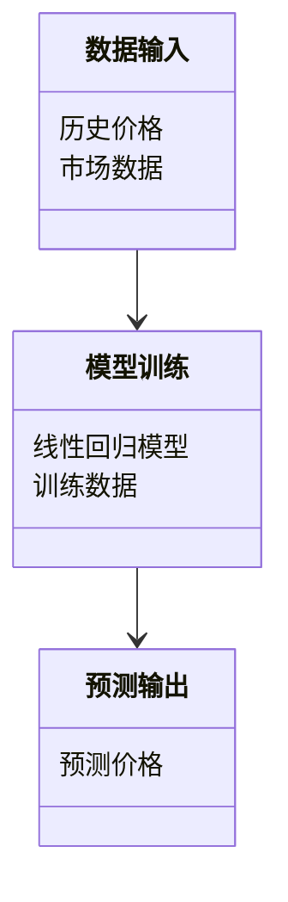
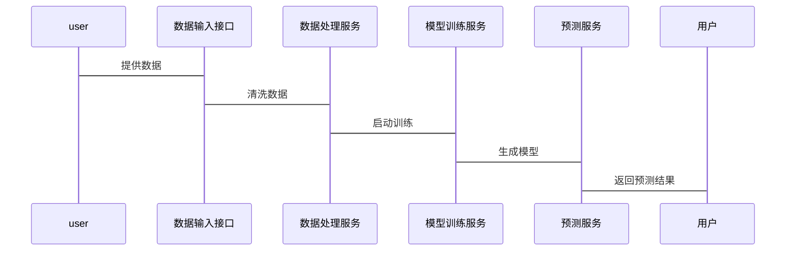

                 


# 机器学习在投资决策中的应用

---

## 关键词
机器学习, 投资决策, 股票预测, 风险评估, 投资组合优化, 数据驱动决策, 人工智能

---

## 摘要
机器学习作为一种强大的数据分析工具，正在逐步改变金融行业的投资决策方式。通过分析海量市场数据，机器学习能够帮助投资者发现潜在的模式和趋势，从而做出更科学的投资决策。本文将深入探讨机器学习在投资决策中的应用，包括其核心概念、算法原理、系统架构以及实际案例分析。我们还将讨论机器学习在投资中的优势与挑战，并提供一些实用的建议，帮助读者更好地理解和应用这些技术。

---

# 第一部分: 机器学习在投资决策中的应用概述

## 第1章: 机器学习与投资决策的背景介绍

### 1.1 机器学习的基本概念

#### 1.1.1 机器学习的定义与核心概念
机器学习是一种人工智能技术，通过数据训练模型，使其能够从数据中学习并做出预测或决策。其核心概念包括：
- **监督学习**：模型通过标记数据进行训练，预测新的数据。
- **无监督学习**：模型通过数据的内在结构发现模式。
- **强化学习**：模型通过与环境互动，学习最优策略。

#### 1.1.2 投资决策的基本原理
投资决策是基于对市场、公司和经济环境的分析，选择最优的投资组合以实现收益最大化或风险最小化。传统方法依赖于财务指标和市场分析，但其局限性日益明显。

#### 1.1.3 机器学习在投资中的应用背景
随着金融市场数据的爆炸式增长，传统方法难以处理复杂性和不确定性。机器学习的出现，为投资决策提供了新的可能性。

---

### 1.2 机器学习与投资决策的结合

#### 1.2.1 机器学习在金融领域的优势
- **数据处理能力**：能够处理海量非结构化数据。
- **预测能力**：通过历史数据预测未来趋势。
- **自动化决策**：减少人为情绪干扰。

#### 1.2.2 投资决策中的数据特征
- **市场数据**：包括股票价格、交易量等。
- **财务指标**：如市盈率、ROE等。
- **行为数据**：投资者情绪、交易频率等。

#### 1.2.3 机器学习在投资中的潜在价值
通过分析数据，机器学习可以帮助投资者发现隐藏的模式，优化投资组合，降低风险。

---

### 1.3 机器学习在投资中的应用场景

#### 1.3.1 股票价格预测
利用历史价格和市场数据，机器学习模型可以预测未来股价走势。

#### 1.3.2 风险评估与管理
通过分析市场波动和资产相关性，模型可以评估投资组合的风险。

#### 1.3.3 投资组合优化
机器学习可以帮助投资者找到最优的资产配置，以最大化收益或最小化风险。

---

## 第2章: 机器学习的核心概念与原理

### 2.1 机器学习的核心概念

#### 2.1.1 监督学习
监督学习是基于标记数据的训练方法。例如，线性回归模型可以用于预测股票价格。

#### 2.1.2 无监督学习
无监督学习用于发现数据中的隐藏结构。例如，聚类分析可以将相似的股票分组。

#### 2.1.3 强化学习
强化学习通过试错学习最优策略。例如，算法可以通过模拟交易环境，学习最佳的买卖时机。

---

### 2.2 投资决策中的关键因素

#### 2.2.1 市场数据
市场数据是投资决策的基础，包括股票价格、指数、交易量等。

#### 2.2.2 财务指标
如市盈率、ROE等指标可以帮助评估公司的财务健康状况。

#### 2.2.3 行为数据
投资者的行为数据反映了市场情绪，如交易频率和时间。

---

### 2.3 机器学习与投资决策的关联性分析

#### 2.3.1 数据驱动的决策模式
机器学习通过数据分析提供决策支持，避免了传统方法的主观性。

#### 2.3.2 模型的可解释性问题
复杂的模型（如神经网络）难以解释其决策过程，这在投资决策中可能是个挑战。

#### 2.3.3 算法的稳定性与鲁棒性
投资市场的波动性要求模型具有高度的稳定性和鲁棒性。

---

### 2.4 核心概念对比表

| 概念 | 机器学习 | 投资决策 |
|------|----------|----------|
| 输入 | 数据集   | 市场数据 |
| 输出 | 预测值   | 投资建议 |
| 方法 | 算法     | 模型     |

---

## 第3章: 机器学习算法原理与投资决策模型

### 3.1 监督学习算法

#### 3.1.1 线性回归
线性回归用于预测连续值，如股票价格。其数学模型为：
$$ y = \beta_0 + \beta_1x + \epsilon $$
其中，$y$是预测值，$x$是自变量，$\beta$是系数，$\epsilon$是误差项。

#### 3.1.2 支持向量机
支持向量机（SVM）用于分类和回归。例如，可以用于股票涨跌预测。

#### 3.1.3 随机森林
随机森林是一种集成算法，通过组合多个决策树的结果来提高准确性。

---

### 3.2 无监督学习算法

#### 3.2.1 K-means聚类
K-means聚类用于将股票分成不同的类别，如按行业或市值。

#### 3.2.2 主成分分析
主成分分析（PCA）用于降维，提取数据的主要特征。

---

### 3.3 强化学习算法

#### 3.3.1 Q-learning
Q-learning是一种强化学习算法，可以用于模拟投资策略。

---

## 第4章: 系统分析与架构设计

### 4.1 问题场景介绍

#### 4.1.1 项目介绍
我们以股票价格预测为例，构建一个机器学习模型。

---

### 4.2 系统功能设计

#### 4.2.1 领域模型（Mermaid类图）


---

### 4.3 系统架构设计

#### 4.3.1 系统架构图
```mermaid
container 投资决策系统 {
    service 数据处理服务 {
        数据清洗
        数据转换
    }
    service 模型训练服务 {
        线性回归模型
        支持向量机模型
    }
    service 预测服务 {
        预测结果
        风险评估
    }
}
```

---

### 4.4 系统接口设计

#### 4.4.1 接口设计
- 数据输入接口：接收历史价格和市场数据。
- 训练接口：启动模型训练。
- 预测接口：获取预测结果。

---

### 4.5 系统交互流程（Mermaid序列图）



---

## 第5章: 项目实战

### 5.1 环境安装

#### 5.1.1 安装Python
```bash
python --version
pip install numpy pandas scikit-learn
```

---

### 5.2 核心代码实现

#### 5.2.1 数据预处理
```python
import pandas as pd
import numpy as np

# 加载数据
data = pd.read_csv('stock_data.csv')

# 数据清洗
data = data.dropna()
```

#### 5.2.2 模型训练
```python
from sklearn.linear_model import LinearRegression

# 训练模型
model = LinearRegression()
model.fit(data[['open', 'high', 'low']], data['close'])
```

#### 5.2.3 模型预测
```python
# 预测股票价格
predicted_price = model.predict(new_data)
```

---

### 5.3 案例分析

#### 5.3.1 股票价格预测
假设我们有一个股票的历史数据，训练一个线性回归模型来预测未来的价格。

#### 5.3.2 风险评估
通过分析资产的相关性矩阵，评估投资组合的风险。

---

## 第6章: 最佳实践与总结

### 6.1 最佳实践

#### 6.1.1 数据质量
确保数据的完整性和准确性。

#### 6.1.2 模型选择
选择适合数据和任务的模型。

#### 6.1.3 模型解释
避免过于复杂的模型，确保结果可解释。

---

### 6.2 小结

机器学习为投资决策提供了新的可能性，但其应用需要谨慎考虑数据质量和模型选择。

---

### 6.3 注意事项

- 投资有风险，需谨慎。
- 模型需定期更新，以适应市场变化。

---

### 6.4 拓展阅读

- 《机器学习实战》
- 《Python机器学习》
- 《投资学基础》

---

## 作者

**作者：AI天才研究院/AI Genius Institute & 禅与计算机程序设计艺术 /Zen And The Art of Computer Programming**

---

