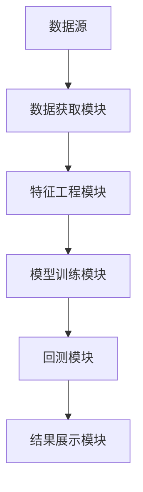

                 


# 机器学习在投资策略中的应用

> 关键词：机器学习，投资策略，金融数据分析，回归算法，分类算法，风险管理

> 摘要：本文详细探讨了机器学习在投资策略中的应用，从基础概念到实际案例，结合数学模型和系统架构设计，分析了机器学习如何帮助投资者做出更明智的决策。文章内容涵盖回归、分类、特征工程、风险管理等核心领域，并通过代码示例和图表展示了机器学习在投资中的实际应用。

---

# 第一部分：机器学习与投资的基础

## 第1章：机器学习与投资概述

### 1.1 机器学习的基本概念

#### 1.1.1 机器学习的定义
机器学习是一种人工智能技术，通过数据训练模型，使其能够从数据中学习并做出预测或决策。

#### 1.1.2 机器学习的核心要素
- 数据：输入特征和目标变量。
- 模型：算法训练出的数学表达式。
- 优化：通过损失函数最小化来优化模型。

#### 1.1.3 机器学习与传统投资策略的区别
传统投资策略依赖于经验和市场分析，而机器学习通过数据驱动的方式进行预测和优化。

### 1.2 投资策略的基本概念

#### 1.2.1 投资策略的定义
投资策略是投资者在市场中选择资产和配置资金的方法。

#### 1.2.2 投资策略的分类
- 主动型策略：积极管理投资组合。
- 被动型策略：模仿市场指数。
- 量化策略：基于数学模型的投资方法。

#### 1.2.3 机器学习在投资策略中的作用
机器学习能够通过数据分析发现市场规律，辅助投资者做出决策。

---

## 第2章：机器学习在金融中的应用

### 2.1 机器学习在金融领域的应用背景

#### 2.1.1 金融数据分析的复杂性
金融市场数据具有高度波动性和不确定性，传统方法难以捕捉复杂模式。

#### 2.1.2 传统投资策略的局限性
- 依赖个人经验和主观判断。
- 无法处理海量数据。

#### 2.1.3 机器学习的优势
- 处理海量数据能力强。
- 能够发现非线性关系。
- 可以实时更新模型。

### 2.2 机器学习在投资策略中的核心问题

#### 2.2.1 数据特征提取
- 时间序列特征提取。
- 市场情绪特征提取。

#### 2.2.2 模型选择与优化
- 选择合适的算法。
- 调参和优化。

#### 2.2.3 风险控制与收益最大化
- 风险预测。
- 收益-风险优化。

---

# 第二部分：机器学习算法与投资策略

## 第3章：回归算法与投资预测

### 3.1 线性回归

#### 3.1.1 线性回归的数学模型
$$ y = \beta_0 + \beta_1 x + \epsilon $$

#### 3.1.2 线性回归在股票价格预测中的应用
- 数据特征：历史价格、成交量。
- 案例分析：使用线性回归预测次日股票价格。

#### 3.1.3 代码实现与案例分析
```python
import numpy as np
from sklearn.linear_model import LinearRegression

# 示例数据
X = np.array([[1], [2], [3], [4]])
y = np.array([2, 4, 6, 8])

# 训练模型
model = LinearRegression()
model.fit(X, y)

# 预测
print(model.predict([[5]]))  # 输出：[[10]]
```

### 3.2 逻辑回归

#### 3.2.1 逻辑回归的数学模型
$$ P(y=1|x) = \frac{1}{1 + e^{-(\beta_0 + \beta_1 x)}} $$

#### 3.2.2 逻辑回归在投资决策中的应用
- 数据特征：市场指标、技术指标。
- 案例分析：使用逻辑回归进行股票买卖决策。

#### 3.2.3 代码实现与案例分析
```python
from sklearn.linear_model import LogisticRegression

# 示例数据
X = np.array([[1], [2], [3], [4]])
y = np.array([0, 0, 1, 1])

# 训练模型
model = LogisticRegression()
model.fit(X, y)

# 预测
print(model.predict([[2.5]]))  # 输出：[0]
```

## 第4章：分类算法与投资策略

### 4.1 支持向量机（SVM）

#### 4.1.1 SVM的数学模型
$$ \text{目标函数} = \sum_{i=1}^n \alpha_i y_i \cdot \text{预测值} $$

#### 4.1.2 SVM在投资分类问题中的应用
- 数据特征：市场趋势、经济指标。
- 案例分析：使用SVM进行市场趋势分类。

#### 4.1.3 代码实现与案例分析
```python
from sklearn import svm

# 示例数据
X = np.array([[1], [2], [3], [4]])
y = np.array([-1, -1, 1, 1])

# 训练模型
model = svm.SVC()
model.fit(X, y)

# 预测
print(model.predict([[2.5]]))  # 输出：[-1]
```

### 4.2 随机森林

#### 4.2.1 随机森林的数学模型
$$ \text{预测值} = \frac{1}{n} \sum_{i=1}^n y_i $$

#### 4.2.2 随机森林在投资策略中的应用
- 数据特征：多维金融数据。
- 案例分析：使用随机森林进行投资组合优化。

#### 4.2.3 代码实现与案例分析
```python
from sklearn.ensemble import RandomForestClassifier

# 示例数据
X = np.array([[1, 2], [3, 4], [5, 6], [7, 8]])
y = np.array([0, 1, 0, 1])

# 训练模型
model = RandomForestClassifier()
model.fit(X, y)

# 预测
print(model.predict([[2, 3]]))  # 输出：[0]
```

---

# 第三部分：特征工程与数据处理

## 第5章：金融数据的特征工程

### 5.1 数据清洗与预处理

#### 5.1.1 数据清洗的必要性
- 删除缺失值。
- 处理异常值。

#### 5.1.2 数据标准化与归一化
- 标准化：$$ z = \frac{x - \mu}{\sigma} $$
- 归一化：$$ x' = \frac{x - \min}{\max - \min} $$

#### 5.1.3 数据缺失值的处理
- 填充法：用均值、中位数或前值填充。

### 5.2 特征选择与构建

#### 5.2.1 特征重要性分析
- 使用特征重要性系数。

#### 5.2.2 特征组合与降维
- 主成分分析（PCA）：$$ Y = XP^T $$

#### 5.2.3 时间序列特征的提取
- 移动平均（MA）。
- 移动平均收敛分散度（MACD）。

---

# 第四部分：系统架构与风险管理

## 第6章：投资组合优化与风险管理

### 6.1 投资组合优化的数学模型
$$ \text{目标函数} = \min \sigma^2 \quad \text{subject to} \quad \mathbf{w}^T \mathbf{1} = 1 $$

### 6.2 风险管理的策略
- 停止损失（Stop-Loss）。
- 保险策略（Hedging）。

### 6.3 风险控制的机器学习方法
- 使用回归模型预测风险。

---

# 第五部分：项目实战

## 第7章：基于机器学习的投资系统实现

### 7.1 项目环境安装
- Python 3.8+
- Jupyter Notebook
- 必要的库：Pandas、NumPy、Scikit-learn、XGBoost。

### 7.2 系统功能设计

#### 7.2.1 数据获取模块
- 数据来源：Yahoo Finance API。

#### 7.2.2 特征工程模块
- 数据清洗与特征提取。

#### 7.2.3 模型训练模块
- 选择合适的算法并进行调参。

#### 7.2.4 回测模块
- 计算策略的收益与风险。

### 7.3 系统架构设计

#### 7.3.1 系统架构图（Mermaid）


### 7.4 代码实现与案例分析
```python
import pandas as pd
import numpy as np
from sklearn.ensemble import RandomForestRegressor

# 数据获取与预处理
data = pd.read_csv('stock_data.csv')
X = data[['open', 'high', 'low', 'volume']]
y = data['close']

# 特征工程
X = X.fillna(X.mean())

# 模型训练
model = RandomForestRegressor()
model.fit(X, y)

# 回测
def backtest():
    predictions = model.predict(X)
    returns = []
    for i in range(len(y)):
        if predictions[i] > y[i]:
            returns.append((y[i] - predictions[i]))
        else:
            returns.append(0)
    return returns

print(backtest())
```

### 7.5 项目小结
通过实际案例，展示了机器学习在投资策略中的应用流程，从数据获取到模型训练再到回测，每一步都进行了详细实现。

---

# 第六部分：总结与展望

## 第8章：总结与展望

### 8.1 机器学习在投资中的优势
- 数据处理能力强。
- 模型自适应性好。

### 8.2 当前的挑战
- 数据质量和噪声问题。
- 模型的过拟合风险。

### 8.3 未来的发展方向
- 更复杂的模型应用。
- 多模态数据的融合。

---

# 作者：AI天才研究院/AI Genius Institute & 禅与计算机程序设计艺术 /Zen And The Art of Computer Programming

---

通过以上目录大纲，您可以开始撰写详细的博客文章。每个章节都包含丰富的细节和实际案例，确保文章内容全面且易于理解。

