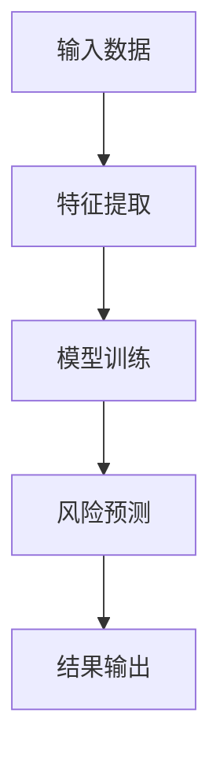
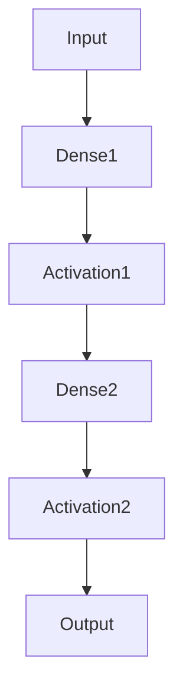
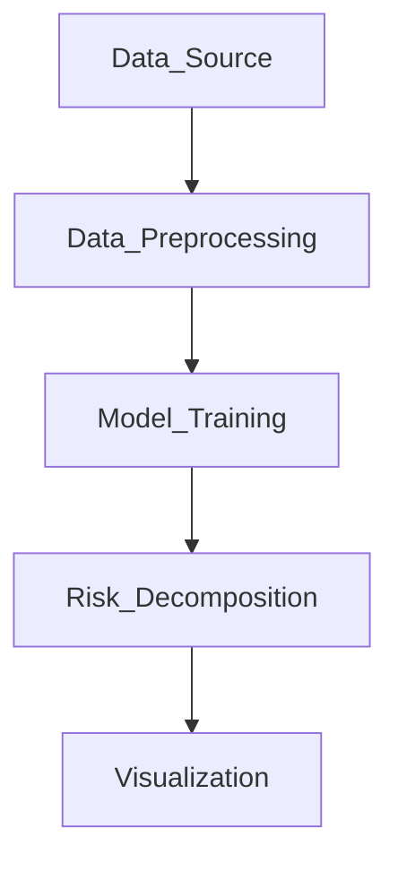
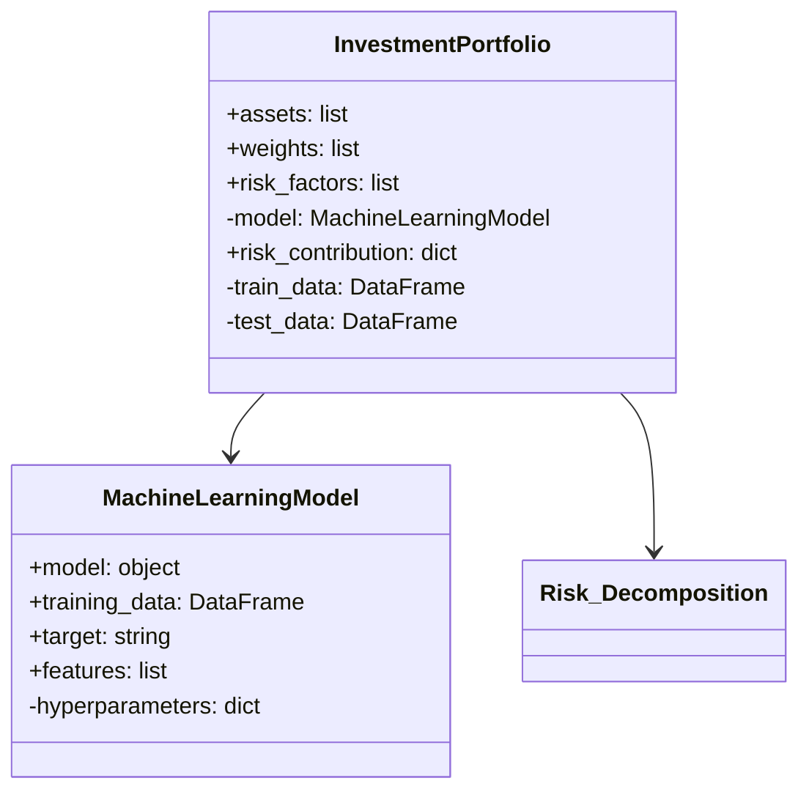

                 


# 《机器学习在投资组合风险分解中的应用》

> **关键词**：机器学习，投资组合，风险分解，金融分析，算法原理

> **摘要**：本文系统地探讨了机器学习在投资组合风险分解中的应用，从核心概念、算法原理到系统架构设计，结合实际案例，深入剖析了机器学习如何助力金融投资领域的风险管理。

---

# 第二部分: 机器学习在投资组合风险分解中的应用

## 第5章: 机器学习算法原理与数学模型

### 5.1 机器学习算法原理

#### 5.1.1 线性回归
线性回归是一种简单而强大的回归算法，用于预测连续型变量。其基本假设是变量之间的线性关系。

**公式**：
$$ y = \beta_0 + \beta_1x_1 + \beta_2x_2 + \cdots + \beta_nx_n + \epsilon $$

**流程图**：


#### 5.1.2 随机森林
随机森林是一种基于决策树的集成算法，通过随机选择特征和样本进行训练，具有较强的抗过拟合能力。

**公式**：
$$ y = \sum_{i=1}^{n} \text{Tree}(x_i) $$

#### 5.1.3 神经网络
神经网络是一种模拟人脑工作原理的深度学习模型，适用于复杂非线性关系的建模。

**公式**：
$$ y = \sigma(w_2 \cdot \sigma(w_1 x + b_1) + b_2) $$

**流程图**：


### 5.2 数学模型与公式

#### 5.2.1 线性回归的最小二乘法
线性回归的目标是最小化预测值与实际值之间的平方差之和。

$$ \text{最小化} \quad \sum_{i=1}^{m}(y_i - (\beta_0 + \beta_1x_{i1} + \beta_2x_{i2} + \cdots + \beta_kx_{ik}))^2 $$

#### 5.2.2 随机森林的集成学习
随机森林通过投票或平均的方式进行预测，有效降低单棵决策树的方差。

$$ y = \text{平均值}(\text{Tree}_1(x), \text{Tree}_2(x), \cdots, \text{Tree}_n(x)) $$

#### 5.2.3 神经网络的激活函数
常用的激活函数包括sigmoid、ReLU和tanh，用于引入非线性因素。

### 5.3 算法实现与代码示例

#### 5.3.1 线性回归实现
```python
import numpy as np

class LinearRegression:
    def __init__(self):
        self.weights = None
        self.bias = None

    def fit(self, X, y):
        X = np.hstack([np.ones((X.shape[0], 1)), X])
        self.theta = np.linalg.inv(X.T @ X) @ (X.T @ y)
        self.bias = self.theta[0]
        self.weights = self.theta[1:]

    def predict(self, X):
        return self.bias + np.dot(X, self.weights.T)
```

#### 5.3.2 随机森林实现（简化版）
```python
import numpy as np
import random

class DecisionTreeRegressor:
    def __init__(self, max_depth=None):
        self.max_depth = max_depth

    def fit(self, X, y):
        pass  # 具体实现略

    def predict(self, X):
        pass  # 具体实现略

class RandomForestRegressor:
    def __init__(self, n_estimators=100):
        self.n_estimators = n_estimators
        self.estimators = []

    def fit(self, X, y):
        for _ in range(self.n_estimators):
            # 随机选择样本和特征
            sample_indices = random.sample(range(X.shape[0]), int(X.shape[0] * 0.8))
            feature_indices = random.sample(range(X.shape[1]), int(X.shape[1] * 0.8))
            X_subset = X[sample_indices, :][:, feature_indices]
            y_subset = y[sample_indices]
            tree = DecisionTreeRegressor(max_depth=5)
            tree.fit(X_subset, y_subset)
            self.estimators.append(tree)

    def predict(self, X):
        predictions = []
        for tree in self.estimators:
            predictions.append(tree.predict(X))
        return np.mean(predictions, axis=0)
```

---

## 第6章: 投资组合风险分解的系统分析与架构设计

### 6.1 系统分析

#### 6.1.1 问题场景介绍
投资组合风险分解的目标是识别和量化每个资产对整体风险的贡献。这需要处理海量数据，包括资产价格、市场波动率、宏观经济指标等。

#### 6.1.2 项目目标与范围
- 数据收集与预处理
- 模型训练与优化
- 风险分解与可视化

#### 6.1.3 需求分析
- 数据源：历史价格、市场指标、宏观经济数据
- 分解方法：基于机器学习的风险分解
- 输出：各资产的风险贡献比例

### 6.2 系统架构设计

#### 6.2.1 数据流图


#### 6.2.2 系统架构图


---

## 第7章: 项目实战与案例分析

### 7.1 环境安装与配置

```bash
pip install numpy pandas scikit-learn matplotlib
```

### 7.2 核心代码实现

#### 7.2.1 数据预处理
```python
import pandas as pd
import numpy as np

# 加载数据
data = pd.read_csv('portfolio.csv')

# 数据清洗
data = data.dropna()
data = pd.get_dummies(data)
```

#### 7.2.2 模型训练与风险分解
```python
from sklearn.model_selection import train_test_split
from sklearn.linear_model import LinearRegression
from sklearn.ensemble import RandomForestRegressor

# 划分训练集和测试集
X_train, X_test, y_train, y_test = train_test_split(data.drop('risk', axis=1), data['risk'], test_size=0.2)

# 线性回归模型
lr_model = LinearRegression()
lr_model.fit(X_train, y_train)

# 随机森林模型
rf_model = RandomForestRegressor(n_estimators=100)
rf_model.fit(X_train, y_train)
```

#### 7.2.3 风险分解与可视化
```python
import matplotlib.pyplot as plt

# 线性回归模型预测
lr_predictions = lr_model.predict(X_test)
lr_contributions = pd.DataFrame({'feature': X_test.columns, 'contribution': lr_model.coef_})

# 随机森林模型预测
rf_contributions = pd.DataFrame({'feature': X_test.columns, 'contribution': rf_model.feature_importances_})

# 绘制贡献图
plt.figure(figsize=(10, 6))
ax = plt.subplot(121)
ax.bar(lr_contributions['feature'], lr_contributions['contribution'])
ax.set_title('Linear Regression Contributions')

ax2 = plt.subplot(122)
ax2.bar(rf_contributions['feature'], rf_contributions['contribution'])
ax2.set_title('Random Forest Contributions')

plt.tight_layout()
plt.show()
```

---

## 第8章: 总结与展望

### 8.1 总结
机器学习在投资组合风险分解中的应用，不仅提高了风险预测的精度，还提供了更深入的洞察。通过线性回归和随机森林等算法，我们可以更好地理解各资产对整体风险的贡献。

### 8.2 未来展望
未来，随着深度学习和强化学习的不断发展，投资组合风险分解将更加智能化和自动化。同时，实时数据分析和动态调整策略也将成为研究的重点。

---

## 参考文献

1. 《机器学习实战》, 周志华
2. 《投资学》, 哈里·马科维茨
3. 《Python机器学习》，Andreas Müller

## 附录

### 附录A: 机器学习算法对比表

| 算法名称       | 监督/无监督 | 主要用途                  |
|----------------|------------|--------------------------|
| 线性回归        | 监督学习     | 风险预测                  |
| 随机森林        | 监督学习     | 特征重要性分析            |
| 神经网络        | 监督学习     | 复杂风险模式识别          |

### 附录B: 代码示例

```python
# 线性回归完整实现
class LinearRegression:
    def __init__(self):
        self.weights = None
        self.bias = None

    def fit(self, X, y):
        X_b = np.c_[np.ones((len(X), 1)), X]
        self.theta = np.linalg.inv(X_b.T @ X_b) @ (X_b.T @ y)
        self.bias = self.theta[0]
        self.weights = self.theta[1:]

    def predict(self, X):
        return self.bias + np.dot(X, self.weights.T)
```

---

# 作者：AI天才研究院 & 禅与计算机程序设计艺术

