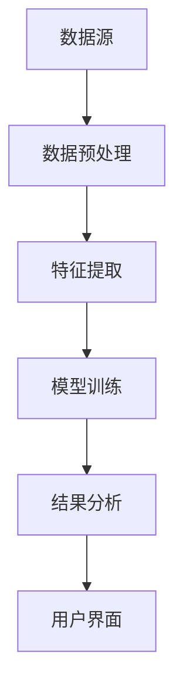

                 


# 机器学习在投资者行为分析中的应用

> **关键词**：机器学习，投资者行为分析，金融数据分析，情绪分析，预测模型，个性化投资策略

> **摘要**：  
本文探讨了机器学习在投资者行为分析中的应用，结合背景介绍、核心概念、算法原理、系统设计、项目实战和最佳实践，详细阐述了如何利用机器学习技术分析投资者行为，构建预测模型，并优化投资策略。通过实际案例分析和代码实现，展示了机器学习在金融领域的强大潜力。

---

## 第一部分：背景介绍

### 第1章：机器学习与投资者行为分析的背景

#### 1.1 机器学习的基本概念

机器学习是一种人工智能技术，通过数据训练模型以实现预测、分类或决策。其核心在于从数据中提取模式和关系，而无需明确编程规则。机器学习可以分为三类：
- **监督学习**：基于标记数据进行预测（如线性回归、支持向量机）。
- **无监督学习**：从无标记数据中发现结构（如聚类分析）。
- **强化学习**：通过与环境交互学习策略（如Q-Learning）。

#### 1.2 投资者行为分析的背景

投资者行为分析旨在理解投资者的决策模式和行为特征。传统方法依赖于统计数据和市场分析，但难以捕捉个体行为的复杂性。机器学习通过分析海量数据，识别隐藏模式，为投资者行为建模提供了新思路。

#### 1.3 机器学习在金融领域的应用现状

- **股票预测**：利用历史数据训练模型预测股价走势。
- **风险评估**：通过机器学习识别高风险投资。
- **情绪分析**：分析社交媒体数据预测市场情绪。
- **个性化投资策略**：基于投资者行为定制投资方案。

---

## 第二部分：核心概念与联系

### 第2章：机器学习的核心概念与投资者行为分析

#### 2.1 机器学习的核心概念

- **数据与特征**：数据是模型的输入，特征是数据的属性（如价格、成交量）。
- **监督与无监督学习**：监督学习需要标签数据，无监督学习不需要。
- **模型训练**：通过优化目标函数调整模型参数。

#### 2.2 投资者行为分析的关键要素

- **投资者类型**：分为保守型、激进型等。
- **行为模式**：包括交易频率、决策偏好。
- **影响因素**：市场环境、个人情绪、经济指标。

#### 2.3 机器学习与投资者行为分析的联系

- **数据驱动建模**：利用大数据分析投资者行为。
- **情绪分析**：通过自然语言处理分析社交媒体数据。
- **个性化策略**：基于行为分析定制投资方案。

---

## 第三部分：算法原理讲解

### 第3章：监督学习算法原理

#### 3.1 线性回归

线性回归用于预测连续型变量，如股票价格。其目标是最小化预测值与实际值的平方差之和。

- **数学模型**：$$ y = \beta_0 + \beta_1x + \epsilon $$
- **实现代码**：
  ```python
  import numpy as np
  from sklearn.linear_model import LinearRegression

  X = np.array([[1, 2], [3, 4], [5, 6]])
  y = np.array([7, 8, 9])
  model = LinearRegression().fit(X, y)
  print(model.coef_)
  ```

#### 3.2 支持向量机

SVM适用于分类问题，如投资者类型分类。

- **数学模型**：最大化$$ \frac{1}{||w||} $$
- **实现代码**：
  ```python
  from sklearn.svm import SVC
  X = [[1, 0], [0, 1], [0, 0], [1, 1]]
  y = [0, 0, 1, 1]
  model = SVC().fit(X, y)
  print(model.predict([[1, 1]]))
  ```

---

## 第四部分：系统分析与架构设计方案

### 第4章：投资者行为分析系统的架构设计

#### 4.1 项目介绍

构建一个基于机器学习的投资者行为分析系统，用于预测市场情绪和投资策略。

#### 4.2 系统功能设计

- 数据收集模块：从社交媒体获取文本数据。
- 特征工程模块：提取情绪特征。
- 模型训练模块：训练情绪分类模型。
- 结果分析模块：生成投资建议。

#### 4.3 系统架构设计



---

## 第五部分：项目实战

### 第5章：基于情绪分析的投资者行为预测

#### 5.1 环境安装

安装Python和相关库：
```bash
pip install numpy pandas scikit-learn
```

#### 5.2 核心代码实现

情绪分析代码：
```python
from sklearn.feature_extraction.text import TfidfVectorizer
from sklearn.svm import SVC

texts = ["我看好这只股票", "市场前景黯淡"]
vectorizer = TfidfVectorizer()
X = vectorizer.fit_transform(texts)
model = SVC().fit(X, [1, 0])
print(model.predict(vectorizer.transform(["市场表现一般"])))
```

#### 5.3 案例分析

分析社交媒体数据，预测市场情绪，辅助投资决策。

---

## 第六部分：最佳实践

### 第6章：总结与展望

- **总结**：机器学习在投资者行为分析中具有巨大潜力，能够帮助投资者做出更明智的决策。
- **小结**：本文详细介绍了机器学习的应用场景和实现方法，为读者提供了理论和实践指导。
- **注意事项**：数据质量和模型选择对结果影响重大，需谨慎处理。
- **拓展阅读**：建议深入学习深度学习和强化学习在金融领域的应用。

---

**作者：AI天才研究院（AI Genius Institute） & 禅与计算机程序设计艺术（Zen And The Art of Computer Programming）**

