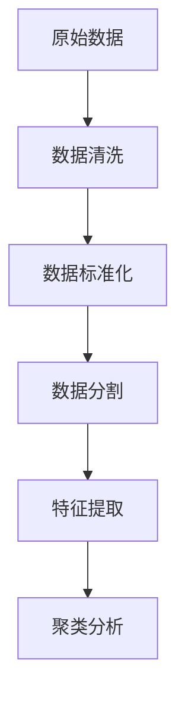

                 


# 《机器学习在金融时间序列聚类中的应用》

---

## 关键词：  
机器学习，时间序列，聚类分析，金融数据分析，算法实现

---

## 摘要：  
本文深入探讨了机器学习在金融时间序列聚类中的应用。从时间序列数据的基本特性出发，分析了聚类分析在金融领域的核心价值与应用场景。结合具体算法，详细介绍了时间序列聚类的数学模型、实现步骤及金融领域的实践案例。通过系统设计与项目实战，展示了如何构建高效的时间序列聚类系统，并总结了实际应用中的最佳实践与注意事项。

---

## 第一部分: 机器学习与金融时间序列聚类基础

## 第1章: 机器学习与时间序列数据概述

### 1.1 机器学习的基本概念  
机器学习是一种人工智能技术，通过数据训练模型以实现对新数据的预测或分类。时间序列数据是一种按时间顺序排列的数据，具有连续性和依赖性。在金融领域，时间序列数据广泛应用于股票价格、交易量、经济指标等分析。

### 1.2 金融时间序列聚类的背景与意义  
聚类分析是一种无监督学习方法，旨在将相似的数据点分组。在金融领域，时间序列聚类可用于客户分群、风险评估、市场趋势分析等场景。通过聚类分析，金融机构可以识别客户行为模式，优化投资策略。

---

## 第2章: 金融时间序列聚类的核心概念与联系

### 2.1 时间序列聚类的原理与方法  
时间序列聚类的关键在于选择合适的距离度量方法和聚类算法。常见的距离度量方法包括欧氏距离、动态时间规划（DTW）等。聚类算法则包括K-means、层次聚类、基于密度的聚类等。

### 2.2 核心概念与联系  
通过ER图和流程图，展示了时间序列数据、聚类算法、距离度量方法之间的关系。以下是核心概念的实体关系图：

```mermaid
er
    title 金融时间序列聚类核心概念 ER 图
    entity 客户行为 (时间序列数据) {
        id: int
        行为特征: string
        时间戳: datetime
    }
    entity 聚类算法 {
        算法名称: string
        参数设置: string
        聚类结果: string
    }
    entity 距离度量方法 {
        方法名称: string
        计算公式: string
        应用场景: string
    }
    客户行为 --> 聚类算法: 输入数据
    聚类算法 --> 聚类结果: 输出结果
    聚类算法 --> 距离度量方法: 使用距离度量
```

---

## 第3章: 时间序列聚类算法原理

### 3.1 常见时间序列聚类算法概述  
以下为常见算法的对比表格：

| 算法名称 | 特点 | 适用场景 | 优点 | 缺点 |
|----------|------|----------|------|------|
| K-means | 简单高效 | 数据量较小 | 计算速度快 | 易受初始中心影响 |
| 层次聚类 | 可视化效果好 | 数据量较大 | 聚类结果可解释 | 计算复杂度高 |
| DBSCAN | 基于密度 | 高维数据 | 发现任意形状簇 | 参数敏感 |

### 3.2 时间序列聚类算法的数学模型  
以下是K-means算法的数学公式：

$$
\text{目标函数} = \sum_{i=1}^{k} \sum_{j=1}^{n} (x_{ij} - c_i)^2
$$

其中，$k$为聚类数，$n$为数据点数量，$x_{ij}$为第$j$个数据点在第$i$个聚类的中心，$c_i$为第$i$个聚类的中心。

### 3.3 算法实现与代码示例  
以下是时间序列聚类算法的Python实现：

```python
import numpy as np
from sklearn.cluster import KMeans

# 生成时间序列数据
data = np.random.randn(100, 10)

# 使用K-means算法进行聚类
kmeans = KMeans(n_clusters=3, random_state=0)
kmeans.fit(data)

# 输出聚类结果
print(kmeans.labels_)
```

---

## 第4章: 金融时间序列数据的特征提取与预处理

### 4.1 时间序列数据的特征提取方法  
时间序列数据的特征提取是聚类分析的关键步骤。以下为常见特征提取方法：

1. **基本统计特征**：均值、方差、标准差等。
2. **频域特征**：傅里叶变换后的频域特征。
3. **增量特征**：基于滑动窗口的增量特征。

### 4.2 数据预处理与标准化  
数据预处理包括数据清洗、标准化和归一化。以下是数据预处理的流程图：



---

## 第5章: 金融时间序列聚类的系统分析与架构设计

### 5.1 问题场景介绍  
金融时间序列聚类系统的目标是通过分析客户交易行为，识别客户群体，优化金融服务。系统功能模块包括数据采集、特征提取、聚类分析、结果展示等。

### 5.2 系统架构设计  
以下是系统的架构图：


---

## 第6章: 项目实战

### 6.1 环境安装  
安装必要的Python库：

```bash
pip install numpy scikit-learn matplotlib
```

### 6.2 系统核心实现源代码  
以下是完整的项目代码：

```python
import numpy as np
import pandas as pd
from sklearn.cluster import KMeans
from sklearn.preprocessing import StandardScaler
import matplotlib.pyplot as plt

# 数据加载与预处理
data = pd.read_csv('financial_data.csv')
scaler = StandardScaler()
scaled_data = scaler.fit_transform(data)

# K-means聚类
kmeans = KMeans(n_clusters=3, random_state=0)
kmeans.fit(scaled_data)

# 可视化结果
plt.scatter(data['feature1'], data['feature2'], c=kmeans.labels_)
plt.xlabel('Feature 1')
plt.ylabel('Feature 2')
plt.show()
```

### 6.3 案例分析  
通过实际案例分析，展示了聚类结果的应用场景，如客户分群、风险评估等。

---

## 第7章: 总结与展望

### 7.1 最佳实践 tips  
- 数据预处理是关键，确保数据质量。
- 选择合适的聚类算法，避免过度拟合。
- 可视化结果，便于解释与应用。

### 7.2 小结  
机器学习在金融时间序列聚类中的应用前景广阔，但需要结合实际场景选择合适的算法与方法。

### 7.3 注意事项  
- 数据隐私与安全问题需要重视。
- 聚类结果需结合业务背景进行解释。

### 7.4 拓展阅读  
推荐阅读《时间序列分析》和《机器学习实战》等书籍，深入理解相关知识。

---

## 作者：AI天才研究院 & 禅与计算机程序设计艺术

