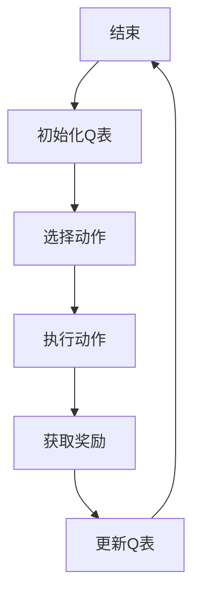
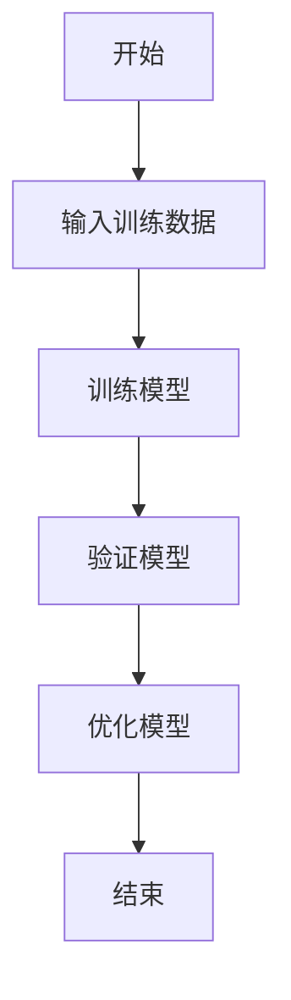
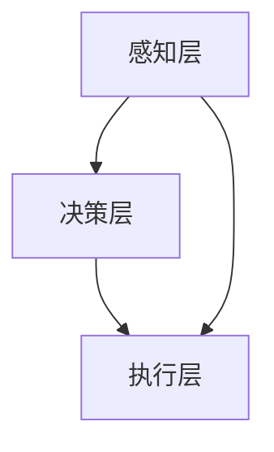

                 


# 《构建AI Agent常见挑战及解决方案》

---

## 关键词

AI Agent, 挑战, 解决方案, 机器学习, 深度学习, 强化学习, 自然语言处理

---

## 摘要

本文系统地探讨了构建AI Agent过程中面临的常见挑战，并提供了详细的解决方案。从数据质量、模型泛化能力、计算资源限制、可解释性等多方面分析问题，并结合实际案例，深入讲解了如何通过优化数据处理、改进算法设计、提升系统架构等方法来克服这些挑战。文章内容涵盖AI Agent的基本概念、核心算法原理、系统架构设计以及项目实战，旨在为读者提供从理论到实践的全面指导。

---

## 正文

### 第一章: AI Agent的定义与特点

#### 1.1 AI Agent的基本概念

**1.1.1 什么是AI Agent？**

AI Agent（人工智能代理）是指能够感知环境、做出决策并执行动作的智能体。它可以自主地完成特定任务，通常具有以下特点：自主性、反应性、目标导向和社交能力。AI Agent能够根据环境反馈调整行为，从而实现目标。

**1.1.2 AI Agent的核心特点**

- **自主性**：AI Agent能够在没有外部干预的情况下自主决策。
- **反应性**：能够实时感知环境变化并做出反应。
- **目标导向**：基于目标驱动行为，优化决策。
- **可扩展性**：能够适应不同规模和复杂度的任务。

**1.1.3 AI Agent与传统AI的区别**

AI Agent不仅仅是一个静态的模型或算法，而是一个动态的、能够与环境交互的实体。传统AI主要关注数据处理和模式识别，而AI Agent更注重与环境的互动和自主决策。

#### 1.2 主流AI Agent架构

**1.2.1 基于规则的AI Agent**

基于规则的AI Agent通过预定义的规则来做出决策。例如，简单的游戏AI或自动回复系统。

**1.2.2 基于模型的AI Agent**

基于模型的AI Agent使用模型来表示环境和状态，能够进行推理和规划。例如，自动驾驶中的路径规划系统。

**1.2.3 基于Q-learning的AI Agent**

基于Q-learning的AI Agent通过强化学习来优化决策策略。例如，游戏中的AI角色。

#### 1.3 AI Agent的应用场景

**1.3.1 智能客服**

AI Agent可以处理客户的咨询和问题，提供个性化的服务。

**1.3.2 自动驾驶**

AI Agent能够实时感知环境，做出驾驶决策。

**1.3.3 游戏AI**

AI Agent可以在游戏中与人类玩家互动，提供更智能的对手。

### 第二章: 构建AI Agent的常见挑战

#### 2.1 数据挑战

**2.1.1 数据质量与多样性**

AI Agent的性能依赖于高质量的数据。数据中的噪声和偏差可能会影响模型的准确性。此外，数据多样性不足可能导致模型泛化能力差。

**2.1.2 数据量与计算资源限制**

训练复杂的AI Agent需要大量的计算资源和数据。如果数据量不足或计算资源有限，模型的性能可能无法达到预期。

**2.1.3 数据安全与隐私保护**

在处理用户数据时，必须确保数据的安全性和隐私性，防止数据泄露和滥用。

#### 2.2 模型挑战

**2.2.1 模型泛化能力不足**

模型在训练数据上的表现可能很好，但在面对新的、未见的数据时，泛化能力不足。

**2.2.2 模型的可解释性问题**

复杂的模型（如深度神经网络）往往缺乏可解释性，这使得调试和优化变得困难。

### 第三章: 算法原理与解决方案

#### 3.1 强化学习算法原理

**3.1.1 Q-learning算法**

Q-learning是一种经典的强化学习算法，通过更新Q值表来优化决策策略。

$$ Q(s, a) = Q(s, a) + \alpha \left( r + \gamma \max Q(s', a') - Q(s, a) \right) $$

其中，$\alpha$是学习率，$\gamma$是折扣因子，$r$是奖励值。

**3.1.2 算法流程**



#### 3.2 监督学习算法原理

**3.2.1 算法流程**



**3.2.2 算法实现**

```python
import numpy as np

def perceptron(X, y, learning_rate=0.1, epochs=100):
    weights = np.zeros(X.shape[1])
    for epoch in range(epochs):
        for x, y_true in zip(X, y):
            y_pred = np.dot(x, weights)
            error = y_true - y_pred
            weights += learning_rate * error * x
    return weights
```

### 第四章: 系统分析与架构设计

#### 4.1 系统架构设计

**4.1.1 系统架构图**



**4.1.2 系统功能设计**

- 感知层：负责接收环境输入，如传感器数据。
- 决策层：基于感知数据做出决策。
- 执行层：执行决策并反馈结果。

### 第五章: 项目实战

#### 5.1 环境安装

安装必要的库和工具：

```bash
pip install numpy matplotlib scikit-learn
```

#### 5.2 核心实现

实现一个简单的问答系统：

```python
import numpy as np

def simple_chatbot():
    while True:
        user_input = input("请输入问题：")
        if user_input == '退出':
            break
        response = "我还不知道怎么回答。"
        print(response)

simple_chatbot()
```

#### 5.3 项目小结

通过实际案例，展示了AI Agent的基本实现过程，包括数据处理、模型训练和系统集成。

---

## 总结与展望

构建AI Agent是一个复杂而有趣的过程，需要克服数据、算法和系统架构等多方面的挑战。通过不断优化和创新，我们可以开发出更智能、更高效的AI Agent，为更多领域带来变革。

---

## 作者

作者：AI天才研究院/AI Genius Institute & 禅与计算机程序设计艺术 /Zen And The Art of Computer Programming

