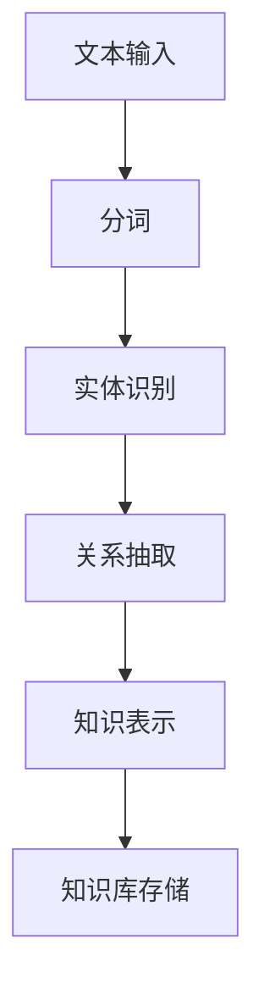
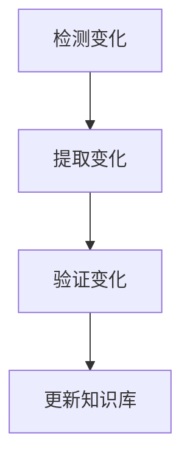
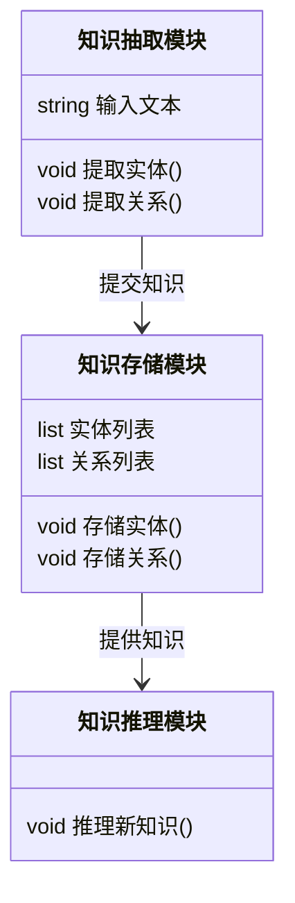
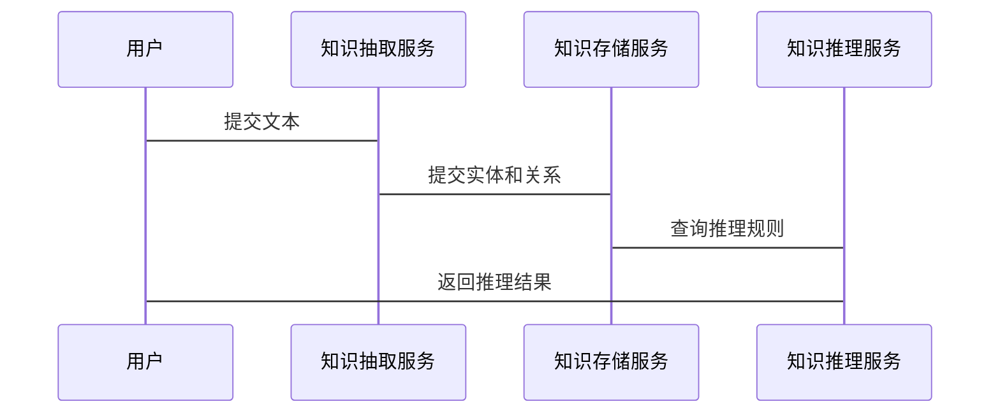

                 


# 《构建AI Agent的动态知识库管理系统》

## 关键词：AI Agent，动态知识库，知识表示，知识抽取，知识推理，系统架构设计

## 摘要：  
本文详细探讨了构建AI Agent的动态知识库管理系统的各个方面，从核心概念到系统架构设计，再到项目实战，系统性地介绍了动态知识库的构建方法和应用场景。通过详细分析知识表示、知识抽取、知识更新与维护、系统架构设计等关键环节，结合实际案例和代码实现，帮助读者全面掌握动态知识库管理系统的构建与优化技巧。

---

## 第1章: AI Agent与动态知识库概述

### 1.1 AI Agent的基本概念

#### 1.1.1 AI Agent的定义与特点  
AI Agent（智能体）是指能够感知环境、自主决策并采取行动以实现特定目标的实体。AI Agent可以是软件程序、机器人或其他智能系统。其核心特点包括：  
1. **自主性**：能够在没有外部干预的情况下独立运行。  
2. **反应性**：能够实时感知环境并做出响应。  
3. **目标导向**：以实现特定目标为导向。  
4. **学习能力**：能够通过经验或数据不断优化自身的行为。  

#### 1.1.2 动态知识库的定义与特点  
动态知识库是一种能够实时更新、适应环境变化的知识存储系统。其特点包括：  
1. **动态性**：能够实时更新知识内容。  
2. **可扩展性**：支持新增知识的快速集成。  
3. **高效性**：支持快速查询和推理。  
4. **自适应性**：能够根据环境变化自动调整知识结构。  

#### 1.1.3 AI Agent与动态知识库的关系  
AI Agent需要依赖知识库来实现智能决策，而动态知识库为AI Agent提供了实时更新的知识支持。AI Agent通过动态知识库获取信息、推理知识，并根据推理结果采取行动。

### 1.2 动态知识库的背景与应用

#### 1.2.1 知识库管理的演变历程  
传统的知识库管理主要依赖静态数据，难以适应快速变化的环境。随着AI技术的发展，动态知识库逐渐成为主流，能够实时更新和适应环境变化。

#### 1.2.2 动态知识库的应用场景  
动态知识库广泛应用于多个领域：  
1. **自然语言处理**：用于语义理解、问答系统等。  
2. **推荐系统**：根据用户行为实时更新推荐内容。  
3. **智能客服**：通过动态知识库实现智能对话和问题解决。  

#### 1.2.3 动态知识库的挑战与机遇  
动态知识库的挑战包括数据实时更新的难度、知识抽取的复杂性以及知识推理的准确性。而机遇则在于其能够为AI Agent提供实时、准确的知识支持，提升系统的智能性和适应性。

---

## 第2章: 动态知识库的核心概念与联系

### 2.1 动态知识库的核心概念

#### 2.1.1 知识表示与存储  
知识表示是动态知识库的核心，常用的方法包括：  
1. **符号表示**：使用符号（如谓词逻辑）表示知识。  
2. **语义网络**：通过节点和边表示概念及其关系。  
3. **知识图谱**：通过实体和关系构建大规模的知识网络。  

知识存储则需要高效的数据库支持，如图数据库或分布式存储系统。

#### 2.1.2 知识更新与维护  
动态知识库需要实时更新知识内容，常用的方法包括：  
1. **增量更新**：仅更新变化的部分。  
2. **全量更新**：定期重写整个知识库。  
3. **版本控制**：记录知识库的变更历史，支持回滚。  

#### 2.1.3 知识检索与推理  
知识检索通过查询引擎快速定位所需知识，而知识推理则通过逻辑推理技术（如基于规则的推理、概率推理等）扩展知识库的内容。

### 2.2 动态知识库的属性特征对比

#### 表格：动态知识库与静态知识库的对比

| 属性          | 静态知识库           | 动态知识库           |
|---------------|--------------------|--------------------|
| 数据更新频率  | 低或无             | 高                 |
| 数据一致性    | 高                 | 可能较低           |
| 响应时间      | 较慢               | 较快               |
| 适用场景      | 稳定环境             | 动态变化的环境       |

### 2.3 ER实体关系图

```mermaid
erDiagram
    actor 用户 {
        string 用户ID
        string 用户名
        string 用户角色
    }
    actor 知识库管理员 {
        string 管理员ID
        string 管理员名
        string 管理员权限
    }
    knowledge_base 知识库 {
        string 知识库ID
        string 知识库名称
        string 知识库类型
    }
    knowledge_entity 知识实体 {
        string 实体ID
        string 实体类型
        string 实体属性
    }
    knowledge_relation 知识关系 {
        string 关系ID
        string 关系类型
    }
    用户 --> 知识库: 查询
    用户 --> 知识库: 更新
    知识库管理员 --> 知识库: 维护
    知识库 --> 知识实体: 包含
    知识库 --> 知识关系: 包含
```

---

## 第3章: 知识表示与动态知识库的构建

### 3.1 知识表示的理论基础

#### 3.1.1 符号逻辑与知识表示  
符号逻辑是知识表示的基础，常用谓词逻辑表示知识。例如：  
$$\text{Student}(x) \land \text{Likes}(x, y) \rightarrow \text{Likes}(y, x)$$  

#### 3.1.2 语义网络与知识图谱  
语义网络通过节点和边表示概念及其关系，而知识图谱则是大规模语义网络的扩展，例如：  
- 实体：人、组织、地点等。  
- 关系：属于、位于、创作等。  

### 3.2 知识抽取与构建算法

#### 3.2.1 知识抽取的流程



#### 3.2.2 知识抽取的数学模型  
知识抽取可以通过机器学习模型实现，例如：  
$$P(y|x) = \frac{P(x|y)P(y)}{P(x)}$$  
其中，$x$ 是输入文本，$y$ 是抽取的结果。

#### 3.2.3 知识抽取的Python实现

```python
import spacy

nlp = spacy.load("en_core_web_sm")
text = "Apple is a company founded by Steve Jobs."
doc = nlp(text)
ents = [(ent.text, ent.label_) for ent in doc.ents]
print(ents)
```

### 3.3 知识更新与维护机制

#### 3.3.1 增量更新算法



#### 3.3.2 版本控制

```python
def save_version(version):
    with open(f"knowledge_base_version_{version}.json", "w") as f:
        json.dump(knowledge_base, f)
```

---

## 第4章: 动态知识库的系统架构设计

### 4.1 系统功能设计

#### 4.1.1 功能模块划分
1. 知识抽取模块：负责从文本中提取实体和关系。  
2. 知识存储模块：负责存储知识实体和关系。  
3. 知识推理模块：负责根据已有知识推理新知识。  

#### 4.1.2 功能模块的类图



### 4.2 系统架构设计

#### 4.2.1 微服务架构

```mermaid
serviceDiagram
    service 知识抽取服务 {
        - 提供API接口
    }
    service 知识存储服务 {
        - 提供API接口
    }
    service 知识推理服务 {
        - 提供API接口
    }
    知识抽取服务 --> 知识存储服务: POST /store
    知识存储服务 --> 知识推理服务: GET /query
```

#### 4.2.2 系统交互流程



---

## 第5章: 项目实战——动态知识库管理系统实现

### 5.1 项目背景与目标

#### 5.1.1 项目背景
随着AI Agent的应用越来越广泛，动态知识库的管理需求也在不断增加。

#### 5.1.2 项目目标
构建一个支持知识抽取、存储、推理和更新的动态知识库管理系统。

### 5.2 项目环境搭建

#### 5.2.1 开发工具安装
安装Python、Jupyter Notebook、数据库（如Neo4j）。

#### 5.2.2 依赖库安装
安装自然语言处理库（如spaCy）、图数据库驱动（如Neo4j的Python驱动）。

### 5.3 核心代码实现

#### 5.3.1 知识抽取模块

```python
import spacy

nlp = spacy.load("en_core_web_sm")
text = "Apple is a company founded by Steve Jobs."
doc = nlp(text)
ents = [(ent.text, ent.label_) for ent in doc.ents]
print(ents)
```

#### 5.3.2 知识存储模块

```python
from neo4j import GraphDatabase

driver = GraphDatabase.driver("bolt://localhost:7687", auth=("neo4j", "password"))
with driver.session() as session:
    session.write_transaction(lambda tx: tx.run("CREATE (a:Entity {name: 'Apple'})"))
    session.write_transaction(lambda tx: tx.run("CREATE (b:Entity {name: 'Steve Jobs'})"))
    session.write_transaction(lambda tx: tx.run("CREATE (a)-[:Founded]->(b)"))
```

#### 5.3.3 知识推理模块

```python
from neo4j import GraphDatabase

driver = GraphDatabase.driver("bolt://localhost:7687", auth=("neo4j", "password"))
with driver.session() as session:
    session.read_transaction(lambda tx: tx.run("MATCH (a)-[:Founded]->(b) RETURN a.name, b.name"))
```

### 5.4 案例分析与实现

#### 5.4.1 知识抽取案例
从新闻文本中提取公司名称和人物关系。

#### 5.4.2 知识推理案例
推理出“Steve Jobs是Apple的创始人”。

### 5.5 项目小结

#### 5.5.1 核心代码总结
- 使用spaCy进行知识抽取。  
- 使用Neo4j进行知识存储和推理。  

#### 5.5.2 实践中的注意事项
- 确保知识抽取的准确性。  
- 定期更新知识库以保持知识的时效性。  

---

## 第6章: 总结与展望

### 6.1 系统总结
本文详细介绍了构建AI Agent的动态知识库管理系统的各个方面，从知识表示到系统架构设计，再到项目实战，为读者提供了一个全面的构建指南。

### 6.2 未来展望
未来，动态知识库管理系统将更加智能化，支持更复杂的知识推理和自适应更新。同时，随着AI技术的不断发展，动态知识库在更多领域的应用将成为可能。

---

## 作者：AI天才研究院/AI Genius Institute & 禅与计算机程序设计艺术 /Zen And The Art of Computer Programming

---

**注意：** 以上目录大纲和内容仅为示例，实际撰写时需根据具体需求调整。

