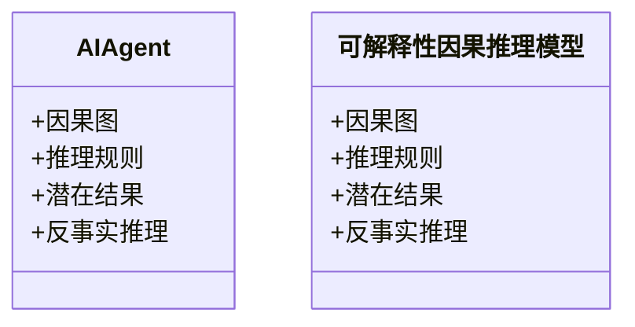
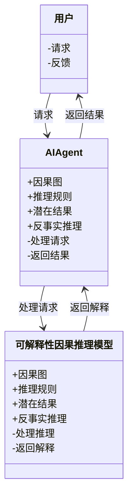
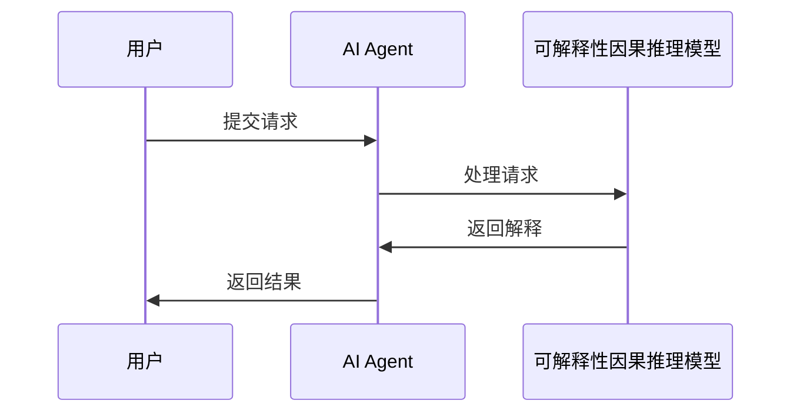

                 


# 构建AI Agent的可解释性因果推理模型

> 关键词：AI Agent，可解释性，因果推理，模型构建，算法原理，系统架构

> 摘要：本文详细探讨了如何构建具备可解释性因果推理能力的AI Agent模型。通过背景分析、核心概念讲解、算法原理阐述、系统架构设计以及项目实战，为读者提供了一套完整的构建方法论。文章从潜在结果框架、因果图结构、反事实推理等算法入手，结合系统功能设计、架构图、接口设计和交互流程，深入分析了可解释性因果推理模型的构建过程，并通过实际案例展示了模型的应用效果。

---

# 第一部分: 构建AI Agent的可解释性因果推理模型背景与核心概念

## 第1章: AI Agent与因果推理概述

### 1.1 AI Agent的基本概念

#### 1.1.1 什么是AI Agent
AI Agent（人工智能代理）是指能够感知环境、自主决策并执行任务的智能实体。它可以是一个软件程序、机器人或其他形式的智能系统。AI Agent的核心目标是通过与环境交互，完成特定任务或优化目标函数。

- **自主性**：AI Agent能够自主决策，无需外部干预。
- **反应性**：能够实时感知环境并做出反应。
- **目标导向性**：基于目标函数进行决策和行动。

#### 1.1.2 AI Agent的核心特征

| 特征         | 描述                                         |
|--------------|----------------------------------------------|
| 自主性       | 能够自主决策，无需外部干预                 |
| 反应性       | 能够实时感知环境并做出反应                 |
| 目标导向性   | 基于目标函数进行决策和行动                 |
| 可解释性     | 能够解释其决策过程和结果                   |

#### 1.1.3 可解释性AI Agent的定义与目标
可解释性AI Agent是指其决策过程和结果能够被人类理解、验证和信任的AI Agent。其目标是通过透明化和可解释的方式，让用户信任并依赖AI Agent的决策。

---

### 1.2 因果推理的基本概念

#### 1.2.1 什么是因果推理
因果推理是指从因果关系中推断出原因与结果之间的关系。与相关性不同，因果推理关注的是“为什么”某个事件发生，而不仅仅是“相关”关系。

- **因果关系**：A是B的原因，即A的发生导致B的发生。
- **相关关系**：A和B之间存在统计关联，但并不一定存在因果关系。

#### 1.2.2 因果推理与相关概念的对比

| 概念       | 描述                                         |
|------------|----------------------------------------------|
| 相关性     | 统计上的关联性，不涉及因果关系             |
| 因果性     | 原因与结果之间的关系，涉及“为什么”的问题 |
| 可解释性   | 能够被人类理解和信任的性质                 |

#### 1.2.3 可解释性因果推理的重要性
在AI Agent中，因果推理的可解释性是确保用户信任和依赖AI决策的关键。通过可解释性因果推理，用户可以理解AI Agent的决策逻辑，并在必要时进行干预或调整。

---

### 1.3 可解释性因果推理模型的核心概念

#### 1.3.1 可解释性因果推理模型的定义
可解释性因果推理模型是指能够明确表达因果关系，并通过可解释的方式（如规则、逻辑推理等）展示其决策过程的模型。

#### 1.3.2 模型的组成要素

| 组成要素     | 描述                                         |
|--------------|----------------------------------------------|
| 因果图       | 表示因果关系的有向图                         |
| 潜在结果     | 在不同干预下的可能结果                     |
| 反事实推理   | 推测在“如果怎样”的情况下结果的变化         |

#### 1.3.3 模型的核心属性对比表格

| 属性         | 可解释性因果推理模型                         |
|--------------|----------------------------------------------|
| 表达方式     | 使用因果图、规则和逻辑推理展示因果关系       |
| 解释能力     | 能够解释因果关系和决策过程                 |
| 可调整性     | 用户可以通过调整因果图或规则改变推理结果     |

---

## 第2章: 可解释性AI Agent的背景与需求

### 2.1 当前AI Agent的发展现状

#### 2.1.1 AI Agent在各领域的应用现状

| 领域       | 应用场景                                         |
|------------|----------------------------------------------|
| 医疗       | 疾病诊断、药物推荐                               |
| 金融       | 风险评估、投资决策                               |
| 教育       | 学生学习路径规划                                 |
| 交通       | 自动驾驶、路线优化                               |

#### 2.1.2 当前AI Agent存在的问题

| 问题       | 描述                                         |
|------------|----------------------------------------------|
| 黑箱问题     | AI Agent的决策过程难以被人类理解             |
| 可解释性不足 | 用户无法理解AI Agent的决策逻辑               |
| 可靠性问题   | 在复杂场景中可能出现不可预测的行为           |

#### 2.1.3 可解释性AI Agent的需求背景
随着AI Agent在关键领域的广泛应用，用户对AI Agent的可解释性需求日益增加。特别是在医疗、金融等领域，用户需要了解AI Agent的决策逻辑，以确保决策的正确性和可靠性。

---

### 2.2 可解释性因果推理的必要性

#### 2.2.1 可解释性在AI系统中的重要性
可解释性是用户信任AI系统的关键因素。通过可解释性，用户可以理解AI系统的决策逻辑，并在必要时进行干预。

#### 2.2.2 因果推理在可解释性中的作用
因果推理是实现可解释性的核心。通过因果推理，AI Agent能够明确表达因果关系，并通过可解释的方式展示其决策过程。

#### 2.2.3 用户对可解释性AI Agent的需求
用户希望AI Agent能够清晰地展示其决策逻辑，并在需要时进行干预。特别是在高风险领域，可解释性是用户信任和依赖AI Agent的前提。

---

## 第3章: 可解释性因果推理模型的核心概念

### 3.1 可解释性因果推理模型的定义

#### 3.1.1 定义与基本特征
可解释性因果推理模型是一种能够明确表达因果关系，并通过可解释的方式展示其决策过程的模型。

#### 3.1.2 模型的组成要素

| 组成要素     | 描述                                         |
|--------------|----------------------------------------------|
| 因果图       | 表示因果关系的有向图                         |
| 潜在结果     | 在不同干预下的可能结果                     |
| 反事实推理   | 推测在“如果怎样”的情况下结果的变化         |

#### 3.1.3 模型的核心属性对比表格

| 属性         | 可解释性因果推理模型                         |
|--------------|----------------------------------------------|
| 表达方式     | 使用因果图、规则和逻辑推理展示因果关系       |
| 解释能力     | 能够解释因果关系和决策过程                 |
| 可调整性     | 用户可以通过调整因果图或规则改变推理结果     |

---

## 3.2 可解释性因果推理模型的ER实体关系图

```mermaid
er
actor: 用户
agent: AI Agent
model: 可解释性因果推理模型
rule: 推理规则
cause_effect: 因果关系
```

---

# 第二部分: 可解释性因果推理模型的算法原理

## 第4章: 因果推理算法基础

### 4.1 潜在结果框架

#### 4.1.1 潜在结果的基本概念
潜在结果是指在不同的干预下，可能产生的结果。例如，在医疗领域，潜在结果可以是患者在不同治疗方案下的健康状况。

#### 4.1.2 潜在结果的计算公式
$$ Y_i = \text{潜在结果} $$

---

### 4.2 因果图结构

#### 4.2.1 因果图的构建过程
因果图是通过节点和边表示变量之间的因果关系。构建因果图的关键步骤包括：

1. 确定变量：识别所有相关的变量。
2. 确定因果关系：明确变量之间的因果关系。
3. 绘制因果图：使用节点和边表示因果关系。

#### 4.2.2 因果图的数学表示
$$ P(Y|do(X)) = \text{因果图的条件概率} $$

---

### 4.3 反事实推理

#### 4.3.1 反事实推理的基本原理
反事实推理是通过假设某种干预来推断其结果。例如，假设我们干预某个变量，我们可以推断其对其他变量的影响。

#### 4.3.2 反事实推理的数学公式
$$ \text{反事实推理公式} $$

---

## 5章: 系统架构设计

### 5.1 系统功能设计

#### 5.1.1 领域模型



---

### 5.2 系统架构设计



---

### 5.3 系统接口设计

#### 5.3.1 接口设计
- **输入接口**：接收用户请求和环境信息。
- **输出接口**：返回推理结果和解释。

---

### 5.4 系统交互流程



---

## 6章: 项目实战

### 6.1 环境配置

#### 6.1.1 安装依赖
- Python 3.8+
- Mermaid
- Pandas
- Scikit-learn

---

### 6.2 代码实现

#### 6.2.1 核心代码

```python
import pandas as pd
from sklearn.tree import DecisionTreeClassifier

# 数据加载
data = pd.read_csv('data.csv')

# 特征选择
features = ['age', 'gender', 'symptom']
target = 'disease'

# 模型训练
model = DecisionTreeClassifier()
model.fit(data[features], data[target])

# 推理
def infer因果关系(features):
    prediction = model.predict([features])
    return prediction[0]
```

---

### 6.3 功能模块

#### 6.3.1 功能模块
- **数据处理模块**：负责数据的加载和预处理。
- **模型训练模块**：负责因果推理模型的训练。
- **推理解释模块**：负责推理结果的解释和展示。

---

### 6.4 案例分析

#### 6.4.1 案例背景
在医疗领域，假设我们有一个诊断模型，用于诊断某种疾病。

#### 6.4.2 数据分析
通过对患者数据的分析，我们可以构建因果图，明确各个症状与疾病之间的因果关系。

#### 6.4.3 模型应用
通过模型推理，我们可以解释每个症状对疾病的影响，并根据因果关系进行诊断。

---

### 6.5 项目小结

---

## 7章: 扩展阅读与最佳实践

### 7.1 扩展阅读

#### 7.1.1 推荐书籍
- 《因果推理入门》
- 《可解释的人工智能：模型、方法和应用》

#### 7.1.2 推荐论文
- "Causal Inference in AI"（《AI中的因果推理》）

---

### 7.2 最佳实践 tips

#### 7.2.1 数据质量
确保数据的准确性和完整性。

#### 7.2.2 模型解释性
选择合适的模型，确保其可解释性。

#### 7.2.3 模型调整
根据实际需求，调整模型的参数和结构。

---

### 7.3 小结

---

### 7.4 注意事项

#### 7.4.1 数据隐私
确保数据的隐私和安全。

#### 7.4.2 模型透明度
保持模型的透明度，确保用户能够理解其决策过程。

#### 7.4.3 模型可调整性
确保模型可以根据需求进行调整和优化。

---

## 8章: 总结

### 8.1 总结

---

### 8.2 作者

作者：AI天才研究院/AI Genius Institute & 禅与计算机程序设计艺术 /Zen And The Art of Computer Programming

