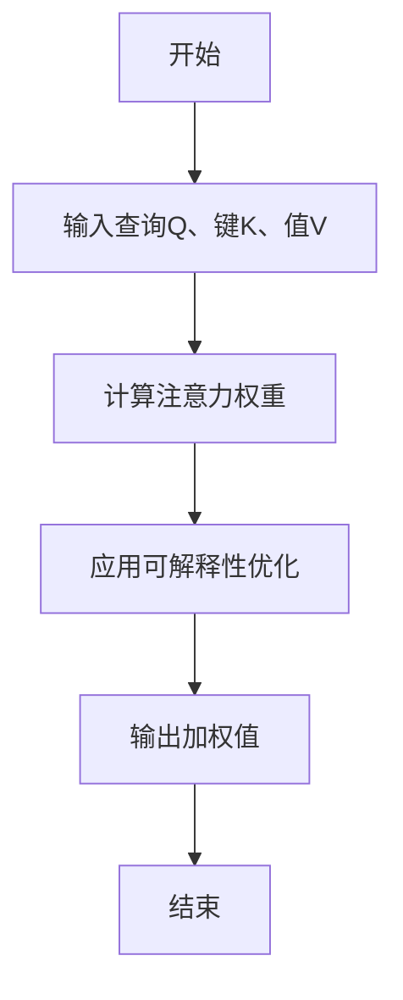
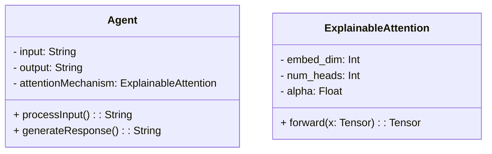
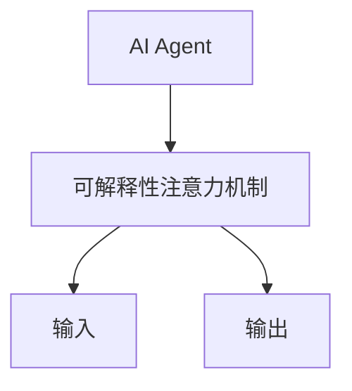
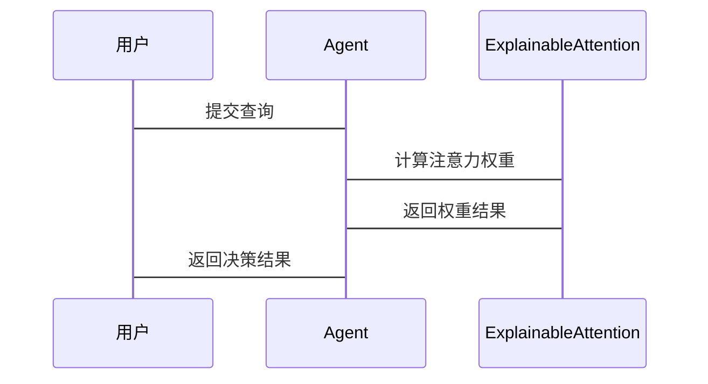

                 


# 构建AI Agent的可解释性注意力机制

> 关键词：AI Agent、可解释性注意力机制、注意力权重、解释性算法、系统架构、透明度

> 摘要：本文详细探讨了构建AI Agent的可解释性注意力机制的核心原理、算法实现、系统架构及实际应用。通过分析注意力机制的基本概念、改进方向及可解释性优化策略，结合实际案例和代码实现，为读者提供从理论到实践的全面指导。

---

# 第一部分: 可解释性注意力机制的背景与核心概念

## 第1章: AI Agent与可解释性注意力机制概述

### 1.1 问题背景与描述

#### 1.1.1 AI Agent的基本概念与特点
AI Agent（智能体）是指能够感知环境、做出决策并采取行动的实体。它可以是一个软件程序，也可以是硬件设备。AI Agent的核心特点包括自主性、反应性、目标导向性和社会性。例如，自动驾驶汽车、智能音箱、推荐系统等都是典型的AI Agent应用。

#### 1.1.2 注意力机制在AI Agent中的作用
在AI Agent中，注意力机制是一种用于选择关注输入数据中重要部分的技术。它通过计算权重来决定每个输入对最终决策的影响程度。注意力机制能够帮助AI Agent聚焦于关键信息，从而提高决策的准确性和效率。

#### 1.1.3 可解释性的重要性与挑战
AI Agent的决策过程通常被视为“黑箱”，用户难以理解其背后的逻辑。可解释性是提升用户信任、支持系统调试和优化的重要因素。然而，传统的注意力机制往往缺乏透明度，难以解释其权重分配的逻辑。

### 1.2 可解释性注意力机制的核心目标
#### 1.2.1 提高AI决策的透明度
通过可解释性注意力机制，AI Agent的决策过程变得更加透明，用户可以了解每个输入对最终决策的具体贡献。

#### 1.2.2 增强用户对AI Agent的信任
可解释性能够帮助用户理解AI Agent的行为，从而增强信任，减少对“黑箱”模型的疑虑。

#### 1.2.3 支持调试与优化
可解释性注意力机制为系统开发者提供了调试和优化的依据，帮助他们发现和修正模型中的问题。

### 1.3 本章小结
本章介绍了AI Agent的基本概念、注意力机制的作用以及可解释性的重要性与挑战。通过这些内容，读者可以理解为什么需要构建可解释性注意力机制，并为后续章节的深入探讨奠定基础。

---

## 第2章: 注意力机制的基本原理

### 2.1 注意力机制的定义与核心要素

#### 2.1.1 注意力机制的数学模型
注意力机制的核心思想是通过计算输入数据的权重来确定每个输入的重要性。数学上，注意力机制可以表示为：
$$
\text{Attention}(Q, K, V) = \text{softmax}\left(\frac{QK^T}{\sqrt{d_k}}\right)V
$$
其中，$Q$ 是查询向量，$K$ 是键向量，$V$ 是值向量，$d_k$ 是键向量的维度。

#### 2.1.2 查询、键、值的概念与作用
- **查询（Query）**：表示当前需要关注的信息。
- **键（Key）**：用于匹配输入数据中的重要部分。
- **值（Value）**：表示键对应的权重信息。

#### 2.1.3 注意力权重的计算方法
注意力权重的计算通常涉及相似度计算和归一化处理。例如，使用点积相似度和Softmax函数：
$$
\text{weight}_i = \text{softmax}\left(\frac{\sum_{j=1}^{n} Q_j K_j^T}{\sqrt{d_k}}\right)
$$

### 2.2 可解释性注意力机制的改进方向

#### 2.2.1 提高注意力权重的可解释性
通过引入可解释性解释方法（如可视化、分解分析）来增强注意力权重的透明度。

#### 2.2.2 引入可解释性解释方法
例如，使用反向注意力传播（RAT）、注意力可视化等方法，帮助用户理解权重分配的逻辑。

#### 2.2.3 优化注意力机制的可解释性评估指标
设计专门的评估指标，如可解释性分数、透明度评分等，用于量化注意力机制的可解释性水平。

### 2.3 本章小结
本章详细介绍了注意力机制的基本原理和可解释性改进的方向，为后续章节的深入分析提供了理论基础。

---

## 第3章: 可解释性注意力机制的核心概念与联系

### 3.1 注意力机制的核心概念原理

#### 3.1.1 基于矩阵的注意力计算
注意力机制的核心是通过矩阵运算来计算每个输入的权重。例如，多头注意力机制通过多个查询、键、值的组合，进一步增强注意力的灵活性和表达能力。

#### 3.1.2 多头注意力机制的工作原理
多头注意力机制通过并行计算多个子注意力，进一步捕捉输入数据的多方面特征。其数学表示为：
$$
\text{Multi-Head}(Q, K, V) = \text{Concat}(\text{Attention}(Q_i, K_i, V_i), \dots, \text{Attention}(Q_j, K_j, V_j))
$$
其中，$i, j$ 表示不同的头。

#### 3.1.3 可解释性注意力机制的创新点
可解释性注意力机制在传统注意力机制的基础上，引入了透明度和可解释性的优化策略，例如引入可解释性解释方法和可解释性评估指标。

### 3.2 核心概念属性特征对比

#### 3.2.1 不同注意力机制的对比分析
通过对比传统注意力机制与可解释性注意力机制的特征，可以更好地理解可解释性注意力机制的优势。例如，下表展示了两种机制在权重计算、可解释性、应用场景等方面的对比：

| 特征                | 传统注意力机制         | 可解释性注意力机制       |
|---------------------|-----------------------|--------------------------|
| 权重计算方式        | 基于点积和Softmax       | 基于改进的权重计算方法     |
| 可解释性            | 低                   | 高                      |
| 应用场景            | 通用任务             | 需要解释性的任务         |

#### 3.2.2 基于ER图的实体关系架构
通过ER图（实体关系图）可以直观展示可解释性注意力机制的实体关系。例如，下图展示了查询、键、值以及注意力权重之间的关系：

```mermaid
erDiagram
    agent[AI Agent] {
        attentionMechanism<---weight[注意力权重]
        inputFeature<---weight[注意力权重]
    }
```

### 3.3 本章小结
本章通过对比分析和图表展示，详细探讨了可解释性注意力机制的核心概念与联系，帮助读者更好地理解其工作原理和优势。

---

## 第4章: 可解释性注意力机制的算法原理

### 4.1 算法原理的数学模型与公式

#### 4.1.1 注意力机制的数学表达式
注意力机制的数学表达式可以表示为：
$$
\text{weight}_i = \text{softmax}\left(\frac{Q_i K_j^T}{\sqrt{d_k}}\right)
$$
其中，$Q_i$ 是查询向量，$K_j$ 是键向量，$d_k$ 是键向量的维度。

#### 4.1.2 可解释性注意力机制的优化公式
为了提高可解释性，可以在注意力权重计算中引入透明度优化策略。例如：
$$
\text{weight}_i = \text{softmax}\left(\frac{Q_i K_j^T}{\sqrt{d_k}} \times \alpha\right)
$$
其中，$\alpha$ 是透明度调节参数。

#### 4.1.3 算法流程图
下图展示了可解释性注意力机制的算法流程：



### 4.2 算法实现的Python代码

#### 4.2.1 基于PyTorch的注意力机制实现
以下是基于PyTorch实现的注意力机制代码：

```python
import torch
import torch.nn as nn

class Attention(nn.Module):
    def __init__(self, embed_dim, num_heads=8):
        super(Attention, self).__init__()
        self.num_heads = num_heads
        self.head_dim = embed_dim // num_heads
        self.all_heads = nn.ModuleList([nn.Linear(embed_dim, embed_dim) for _ in range(num_heads)])
        
    def forward(self, x):
        batch_size, seq_len, embed_dim = x.size()
        x = x.view(batch_size, seq_len, self.num_heads, self.head_dim)
        x = x.permute(0, 2, 1, 3)
        
        output = []
        for i, head in enumerate(self.all_heads):
            q = x[:, i, :, :]
            k = x[:, i, :, :]
            v = x[:, i, :, :]
            
            attention = torch.bmm(q, k.permute(0, 1, 3, 2))
            attention = torch.softmax(attention, dim=-1)
            output_head = torch.bmm(attention, v)
            output.append(output_head)
            
        output = torch.cat(output, dim=1)
        output = output.view(batch_size, seq_len, embed_dim)
        return output
```

#### 4.2.2 可解释性注意力机制的核心代码
以下是改进后的可解释性注意力机制代码：

```python
class ExplainableAttention(nn.Module):
    def __init__(self, embed_dim, num_heads=8, alpha=1.0):
        super(ExplainableAttention, self).__init__()
        self.num_heads = num_heads
        self.head_dim = embed_dim // num_heads
        self.alpha = alpha
        self.all_heads = nn.ModuleList([nn.Linear(embed_dim, embed_dim) for _ in range(num_heads)])
        
    def forward(self, x):
        batch_size, seq_len, embed_dim = x.size()
        x = x.view(batch_size, seq_len, self.num_heads, self.head_dim)
        x = x.permute(0, 2, 1, 3)
        
        output = []
        for i, head in enumerate(self.all_heads):
            q = x[:, i, :, :]
            k = x[:, i, :, :]
            v = x[:, i, :, :]
            
            attention = torch.bmm(q, k.permute(0, 1, 3, 2))
            attention = torch.softmax(attention * self.alpha, dim=-1)
            output_head = torch.bmm(attention, v)
            output.append(output_head)
            
        output = torch.cat(output, dim=1)
        output = output.view(batch_size, seq_len, embed_dim)
        return output
```

#### 4.2.3 代码功能解读与分析
上述代码实现了多头注意力机制，并引入了透明度调节参数 $\alpha$ 以增强可解释性。通过调整 $\alpha$，可以控制注意力权重的分布，从而提高权重分配的透明度。

### 4.3 本章小结
本章详细探讨了可解释性注意力机制的数学模型和算法实现，通过代码示例帮助读者理解其工作原理。

---

## 第5章: 可解释性注意力机制的系统分析与架构设计

### 5.1 系统分析与设计概述

#### 5.1.1 问题场景介绍
假设我们正在开发一个智能客服AI Agent，该系统需要理解用户的查询内容并生成相应的回复。为了提高用户体验，我们需要确保AI Agent的决策过程具有可解释性。

#### 5.1.2 系统功能设计（领域模型Mermaid类图）
以下是系统功能的领域模型类图：



#### 5.1.3 系统架构设计（Mermaid架构图）
以下是系统的架构设计图：



### 5.2 系统接口与交互设计

#### 5.2.1 系统接口设计
以下是系统的接口设计：

- 输入接口：接收用户的查询内容。
- 输出接口：返回AI Agent的决策结果。
- 注意力机制接口：提供可解释性注意力机制的计算功能。

#### 5.2.2 系统交互流程（Mermaid序列图）
以下是系统的交互流程图：



### 5.3 本章小结
本章通过系统分析与架构设计，展示了可解释性注意力机制在实际系统中的应用，帮助读者理解其在整体系统中的角色和功能。

---

## 第6章: 可解释性注意力机制的项目实战

### 6.1 项目环境安装与配置

#### 6.1.1 安装必要的依赖库
需要安装PyTorch和Mermaid图表生成工具。安装命令如下：
```
pip install torch
pip install mermaid
```

#### 6.1.2 环境配置
确保Python版本为3.6以上，并安装相应的依赖库。

### 6.2 系统核心实现源代码

#### 6.2.1 可解释性注意力机制的核心代码
以下是完整的可解释性注意力机制代码：

```python
import torch
import torch.nn as nn
from torch.nn import Module, MultiheadAttention

class ExplainableAttention(Module):
    def __init__(self, embed_dim, num_heads=8, alpha=1.0):
        super(ExplainableAttention, self).__init__()
        self.num_heads = num_heads
        self.head_dim = embed_dim // num_heads
        self.alpha = alpha
        self.all_heads = MultiheadAttention(embed_dim, num_heads, dropout=0.1)
        
    def forward(self, x):
        output, attention_weights = self.all_heads(x, x, x)
        attention_weights = attention_weights * self.alpha
        return output, attention_weights
```

#### 6.2.2 代码功能解读与分析
上述代码实现了多头注意力机制，并返回注意力权重，以便后续分析和解释。

### 6.3 代码应用解读与分析

#### 6.3.1 输入数据准备
假设输入数据为一个批次的查询内容，格式为Tensor。

#### 6.3.2 注意力机制计算
通过调用`ExplainableAttention`类的`forward`方法，计算出输出结果和注意力权重。

#### 6.3.3 可视化与解释
可以通过可视化工具将注意力权重转化为热图，帮助用户理解AI Agent的关注点。

### 6.4 项目小结
本章通过实际项目案例，展示了可解释性注意力机制的应用场景和实现方法，帮助读者理解其在实际项目中的具体应用。

---

## 第7章: 最佳实践与小结

### 7.1 本章小结
本文详细探讨了构建AI Agent的可解释性注意力机制的核心原理、算法实现、系统架构及实际应用。通过理论分析和代码示例，读者可以系统性地理解可解释性注意力机制的构建过程。

### 7.2 注意事项
在实际应用中，需要注意以下几点：
- 可解释性与性能之间的平衡
- 注意力权重的可视化与解释
- 系统的可扩展性和可维护性

### 7.3 拓展阅读
- 《Attention Is All You Need》
- 《可解释的人工智能：理论、方法与应用》

---

作者：AI天才研究院/AI Genius Institute & 禅与计算机程序设计艺术 /Zen And The Art of Computer Programming

