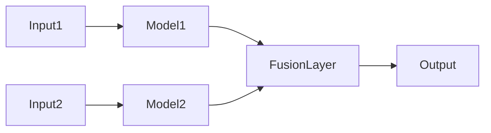
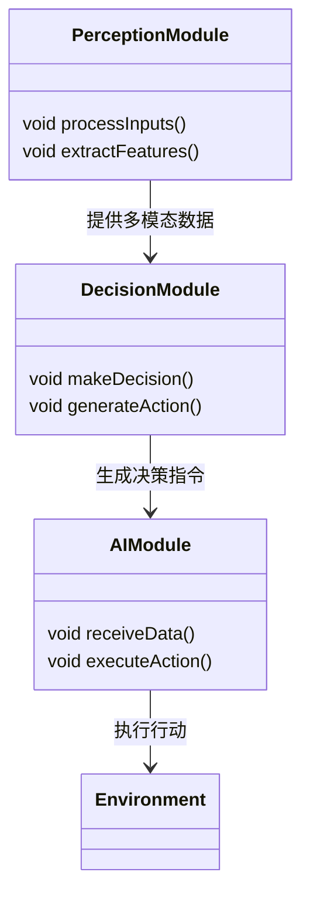

                 


# 构建AI Agent的多模态感知系统

> **关键词**: AI Agent, 多模态感知, 深度学习, 数据融合, 决策系统, 系统架构, 项目实战

> **摘要**: 本文将详细探讨构建AI Agent的多模态感知系统的各个方面，从基础概念到算法实现，再到系统设计和项目实战。通过系统的背景介绍、核心概念分析、算法原理讲解、系统架构设计、项目实战案例以及高级主题探讨，帮助读者全面理解并掌握多模态感知系统的设计与实现。

---

## 第一部分：AI Agent与多模态感知系统基础

### 第1章：AI Agent与多模态感知系统概述

#### 1.1 AI Agent的基本概念

##### 1.1.1 AI Agent的定义与特点
AI Agent（人工智能代理）是一种能够感知环境、做出决策并采取行动的智能实体。它具有自主性、反应性、目标导向性和社会性等特点，能够根据环境信息自主决策并执行任务。

##### 1.1.2 多模态感知的定义与应用领域
多模态感知是指同时利用多种感知方式（如视觉、听觉、触觉等）来获取和处理信息的过程。它广泛应用于自动驾驶、智能安防、机器人控制、虚拟助手等领域。

##### 1.1.3 问题背景与解决方法
传统单模态感知系统在处理复杂环境时存在局限性，例如视觉系统可能无法识别声音信息。多模态感知通过融合多种信息，能够更准确地理解环境，提高系统的鲁棒性和智能性。

---

#### 1.2 多模态感知系统的组成与功能

##### 1.2.1 感知模块的功能与实现
感知模块负责从环境中获取多种模态的数据，如图像、语音、文本等，并进行预处理和特征提取。

##### 1.2.2 决策模块的原理与作用
决策模块基于感知模块提供的多模态数据，通过算法生成决策，并指导AI Agent采取相应的行动。

##### 1.2.3 多模态数据融合的意义与挑战
多模态数据融合能够提高系统的感知能力，但同时也面临数据异构性、信息冗余和计算复杂度高等挑战。

---

## 第二部分：多模态感知系统的核心概念

### 第2章：多模态数据的特征与属性

#### 2.1 多模态数据的特征对比

| 特征维度 | 视觉数据 | 听觉数据 | 文本数据 |
|----------|----------|----------|----------|
| 数据类型 | 图像、视频 | 语音、音频 | 文本、语料库 |
| 数据量   | 大 | 较大 | 较大 |
| 信息丰富度 | 高 | 高 | 中等 |

---

#### 2.2 多模态感知系统的实体关系

```mermaid
erDiagram
    actor User
    actor Environment
    actor AI Agent
    system Multi-modal Perception System
    system Decision Making System
    boundary Perception Module
    boundary Decision Module

    User --> Perception Module: 提供输入数据
    Environment --> Perception Module: 感知环境信息
    Perception Module --> Decision Module: 提供多模态数据
    Decision Module --> AI Agent: 生成决策指令
```

---

## 第三部分：多模态数据融合算法原理

### 第3章：数据融合算法的原理与实现

#### 3.1 数据融合的基本原理

##### 3.1.1 数据预处理与特征提取
对多模态数据进行归一化、降维等预处理，提取关键特征。

##### 3.1.2 融合策略的选择与优化
根据数据特性选择合适的融合策略，如加权融合、注意力机制等。

##### 3.1.3 融合效果的评估方法
通过准确率、召回率等指标评估融合效果。

---

#### 3.2 基于深度学习的融合算法

##### 3.2.1 模型结构与训练流程



模型结构包括多个子网络分别处理不同模态数据，然后通过融合层生成最终输出。

---

## 第四部分：AI Agent决策系统的算法实现

### 第4章：决策算法的原理与实现

#### 4.1 决策算法的原理

##### 4.1.1 基于强化学习的决策过程
通过状态、动作和奖励的循环，优化决策策略。

##### 4.1.2 基于规则的决策方法
根据预定义规则进行决策，适用于简单场景。

##### 4.1.3 多模态信息对决策的影响
综合考虑多种模态信息，提高决策的准确性和鲁棒性。

---

## 第五部分：系统架构设计与实现

### 第5章：系统架构设计

#### 5.1 系统架构的模块划分



---

## 第六部分：项目实战与案例分析

### 第6章：项目实战

#### 6.1 环境安装与配置

##### 6.1.1 开发环境的选择与搭建
推荐使用Python、TensorFlow、Keras等工具。

##### 6.1.2 依赖库的安装与管理
安装必要的库，如numpy、pandas、scikit-learn等。

##### 6.1.3 数据集的获取与预处理
下载多模态数据集并进行清洗和标注。

---

## 第七部分：高级主题与未来趋势

### 第7章：高级主题与未来趋势

#### 7.1 系统优化与性能提升

##### 7.1.1 算法优化方法
如参数调优、模型压缩等。

##### 7.1.2 系统扩展与应用
探索多模态感知系统在更多领域的应用。

---

## 总结

本文详细探讨了构建AI Agent的多模态感知系统的各个方面，从基础概念到算法实现，再到系统设计和项目实战。通过系统的背景介绍、核心概念分析、算法原理讲解、系统架构设计、项目实战案例以及高级主题探讨，帮助读者全面理解并掌握多模态感知系统的设计与实现。

---

**作者：AI天才研究院/AI Genius Institute & 禅与计算机程序设计艺术 /Zen And The Art of Computer Programming**

