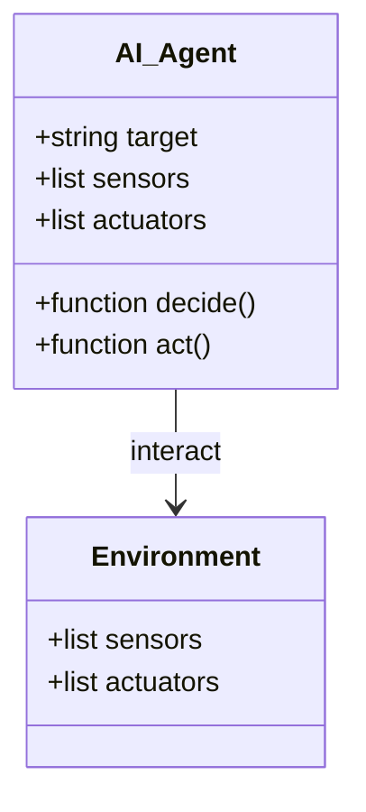
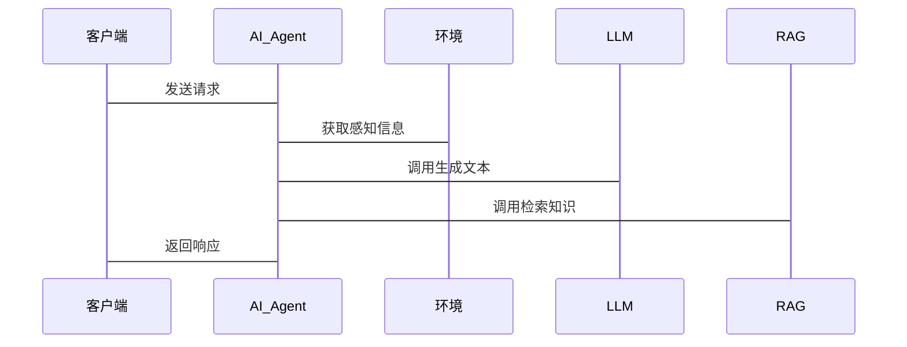

                 


# 《构建AI Agent的开源工具与框架》

> 关键词：AI Agent, 开源工具, 大语言模型, RAG, 智能系统, 自然语言处理

> 摘要：  
本文详细探讨了构建AI Agent所需的开源工具与框架，从基础概念到高级算法，再到实际项目实现，全面解析AI Agent的核心原理与应用实践。文章首先介绍了AI Agent的定义、核心概念与技术背景，然后深入分析了其算法原理与数学模型，随后从系统架构设计、项目实战等多个维度展开，最后结合实际案例总结了AI Agent的实现与优化经验。通过本文，读者可以全面掌握AI Agent的构建方法，并能够实际操作相关工具与框架。

---

## 第一章: AI Agent的背景与核心概念

### 1.1 AI Agent的定义与背景

#### 1.1.1 什么是AI Agent
AI Agent（人工智能代理）是一种能够感知环境、自主决策并执行任务的智能实体。它通过与环境交互，利用传感器获取信息，然后通过算法处理信息并采取行动，以实现特定目标。AI Agent可以是软件程序、机器人或其他智能系统。

#### 1.1.2 AI Agent的应用场景
AI Agent广泛应用于多个领域，包括：
- **自然语言处理**：如智能对话系统、问答系统。
- **智能助手**：如Siri、Alexa等虚拟助手。
- **自动化系统**：如工业自动化中的智能监控系统。
- **游戏开发**：如NPC行为控制、游戏AI。
- **智能客服**：如自动响应客户咨询的系统。

#### 1.1.3 AI Agent的核心特点
AI Agent的核心特点包括：
1. **自主性**：能够自主决策，无需人工干预。
2. **反应性**：能够实时感知环境并做出反应。
3. **目标导向**：所有行为都以实现特定目标为导向。
4. **学习能力**：能够通过经验改进性能。

### 1.2 AI Agent的分类与架构

#### 1.2.1 基于规则的AI Agent
基于规则的AI Agent通过预定义的规则来做出决策。例如，简单的问答系统可以根据关键词匹配规则生成答案。这种方式实现简单，但灵活性较差。

#### 1.2.2 基于模型的AI Agent
基于模型的AI Agent利用机器学习模型（如深度学习模型）进行推理和决策。这种架构能够处理复杂任务，但需要大量数据和计算资源。

#### 1.2.3 基于强化学习的AI Agent
基于强化学习的AI Agent通过与环境交互，利用奖励机制优化行为策略。这种方式适用于需要动态决策的任务，如游戏AI和自动驾驶。

### 1.3 AI Agent的技术背景

#### 1.3.1 大语言模型（LLM）与AI Agent的关系
大语言模型（如GPT）为AI Agent提供了强大的自然语言处理能力。AI Agent可以通过调用LLM API来生成文本、回答问题或进行对话。

#### 1.3.2 RAG（Retrieval-Augmented Generation）技术
RAG技术结合了检索和生成能力，使得AI Agent能够基于外部知识库进行更准确的推理和回答。

#### 1.3.3 知识图谱与AI Agent的结合
知识图谱为AI Agent提供了结构化的知识表示，使其能够更好地理解和推理复杂信息。

### 1.4 当前AI Agent的应用现状

#### 1.4.1 在自然语言处理中的应用
AI Agent通过自然语言处理技术实现智能对话和文本生成。

#### 1.4.2 在智能客服中的应用
AI Agent可以自动响应客户咨询，提高服务效率并降低人工成本。

#### 1.4.3 在自动化系统中的应用
AI Agent可以用于工业自动化中的设备监控和故障诊断。

---

## 第二章: AI Agent的核心概念与联系

### 2.1 AI Agent的核心概念原理

#### 2.1.1 感知、决策与执行
AI Agent的工作流程包括三个主要阶段：
1. **感知**：通过传感器或数据源获取环境信息。
2. **决策**：基于感知信息和内部模型生成行动计划。
3. **执行**：通过执行器或输出模块实施行动计划。

#### 2.1.2 数据源与知识库
AI Agent需要依赖多样化的数据源和知识库来支持其决策过程，包括：
- **文本数据**：如文档、网页内容。
- **结构化数据**：如数据库、知识图谱。
- **外部API**：如天气预报API、新闻数据API。

#### 2.1.3 模型与算法
AI Agent的核心算法包括：
- **大语言模型（LLM）**：如GPT、BERT。
- **强化学习算法**：如Q-Learning、Deep Q-Network。
- **检索增强生成（RAG）**：结合检索和生成技术。

### 2.2 AI Agent与相关技术的对比

#### 2.2.1 AI Agent与传统自动化系统的区别
| 特性         | AI Agent                          | 传统自动化系统                   |
|--------------|----------------------------------|---------------------------------|
| 自主性       | 高                               | 低                             |
| 决策能力     | 强大                             | 有限                           |
| 适应性       | 高                               | 低                             |

#### 2.2.2 AI Agent与大语言模型（LLM）的关系
AI Agent利用LLM作为其生成和理解文本的核心模块，但AI Agent不仅仅是一个生成文本的工具，它还需要结合环境信息和任务目标进行决策和执行。

#### 2.2.3 AI Agent与RAG技术的结合
RAG技术为AI Agent提供了强大的检索和生成能力，使其能够基于外部知识库进行更智能的推理和回答。

---

## 第三章: AI Agent的算法原理与数学模型

### 3.1 大语言模型（LLM）的工作原理

#### 3.1.1 模型输入的处理过程
1. **输入预处理**：对输入文本进行分词、编码等预处理。
2. **嵌入层**：将输入文本转换为向量表示。
3. **编码层**：通过多层网络进行编码，提取上下文信息。
4. **解码层**：生成输出文本。

#### 3.1.2 模型训练的数学基础
大语言模型的训练目标是最小化生成文本与真实文本之间的差距。常用的损失函数是交叉熵损失：
$$ L = -\sum_{i=1}^{n} \log P(y_i|x_{<i}) $$

#### 3.1.3 模型输出的生成机制
模型通过解码层生成概率分布，然后根据采样方法（如贪心采样、随机采样）生成最终的输出文本。

#### 3.1.4 代码示例
以下是一个简单的语言模型训练代码示例：
```python
import torch
import torch.nn as nn

class SimpleLM(nn.Module):
    def __init__(self, vocab_size, embedding_dim, hidden_dim):
        super(SimpleLM, self).__init__()
        self.embedding = nn.Embedding(vocab_size, embedding_dim)
        self.lstm = nn.LSTM(embedding_dim, hidden_dim)
        self.fc = nn.Linear(hidden_dim, vocab_size)
    
    def forward(self, input, hidden):
        embedded = self.embedding(input)
        output, hidden = self.lstm(embedded, hidden)
        output = self.fc(output)
        return output, hidden

model = SimpleLM(vocab_size=10000, embedding_dim=256, hidden_dim=512)
```

### 3.2 基于RAG的AI Agent实现

#### 3.2.1 RAG技术的核心原理
RAG结合了检索和生成技术，首先从知识库中检索相关上下文，然后基于上下文生成回答。

#### 3.2.2 RAG在AI Agent中的应用
1. **检索阶段**：通过向量索引或数据库查询相关知识。
2. **生成阶段**：结合检索到的知识生成最终回答。

#### 3.2.3 RAG的代码示例
```python
import faiss
import numpy as np

# 初始化向量索引
index = faiss.IndexFlatL2(vector_dimension)

# 检索过程
def retrieve(query, index):
    vec = get_vector(query)
    D, I = index.search(vec, k=5)
    return I[0]

# 生成过程
def generate_response(query, context):
    full_input = f"Context: {context}\nQuery: {query}"
    response = model.generate(full_input)
    return response
```

### 3.3 算法原理的数学模型

#### 3.3.1 交叉熵损失函数
交叉熵损失函数用于衡量生成文本与真实文本的差异：
$$ L = -\sum_{i=1}^{n} \log P(y_i|x_{<i}) $$

#### 3.3.2 LSTM网络结构
LSTM是一种常用的序列模型，其结构如下：
$$
f_t(x_t) = \sigma(W_f x_t + U_f h_{t-1} + b_f)
$$

---

## 第四章: AI Agent的系统架构设计

### 4.1 系统功能设计

#### 4.1.1 领域模型
通过Mermaid类图展示AI Agent的领域模型：


#### 4.1.2 系统架构
通过Mermaid架构图展示系统架构：


#### 4.1.3 系统交互
通过Mermaid序列图展示系统交互过程：


### 4.2 项目实战

#### 4.2.1 环境配置
安装所需的依赖：
```bash
pip install transformers faiss-cpu numpy torch
```

#### 4.2.2 代码实现
实现一个简单的AI Agent：
```python
from transformers import pipeline

class SimpleAI_Agent:
    def __init__(self):
        self.nlp = pipeline("text-generation", model="gpt2")

    def process_request(self, query):
        response = self.nlp(query, max_length=50, num_return_sequences=1)
        return response[0]['generated_text']
```

#### 4.2.3 功能测试
测试AI Agent的功能：
```bash
agent = SimpleAI_Agent()
print(agent.process_request("What is AI?"))
```

---

## 第五章: 总结与展望

### 5.1 总结
本文从背景、核心概念、算法原理到系统架构设计，全面探讨了AI Agent的构建过程。通过实际案例的分析，展示了AI Agent在不同领域的应用潜力。

### 5.2 未来展望
AI Agent的研究和应用前景广阔，未来可能在以下几个方向取得突破：
- **多模态AI Agent**：结合视觉、听觉等多种感知方式。
- **强化学习优化**：通过强化学习进一步提升AI Agent的自主决策能力。
- **人机协作**：实现更高效的人机协作模式。

---

## 附录

### 附录A: 工具安装指南
安装所需的开源工具：
```bash
pip install transformers faiss-cpu numpy torch
```

### 附录B: 代码样例
完整的AI Agent实现代码：
```python
import torch
import faiss
from transformers import pipeline

class SimpleAI_Agent:
    def __init__(self):
        self.nlp = pipeline("text-generation", model="gpt2")
        self.index = faiss.IndexFlatL2(512)

    def add_context(self, texts):
        vectors = self.get_vectors(texts)
        self.index.add(vectors)

    def get_vectors(self, texts):
        # 假设使用预训练的向量模型
        return np.array([encode(text) for text in texts], dtype=np.float32)

    def process_request(self, query):
        # 检索相关上下文
        vec = self.get_vector(query)
        D, I = self.index.search(vec, k=5)
        context = texts[I[0]]
        # 生成回答
        response = self.nlp(f"Context: {context}\nQuery: {query}", max_length=50, num_return_sequences=1)
        return response[0]['generated_text']
```

### 附录C: 术语表
- **AI Agent**：人工智能代理。
- **LLM**：大语言模型。
- **RAG**：检索增强生成。
- **知识图谱**：结构化的知识表示。

---

## 作者

作者：AI天才研究院/AI Genius Institute & 禅与计算机程序设计艺术 /Zen And The Art of Computer Programming

