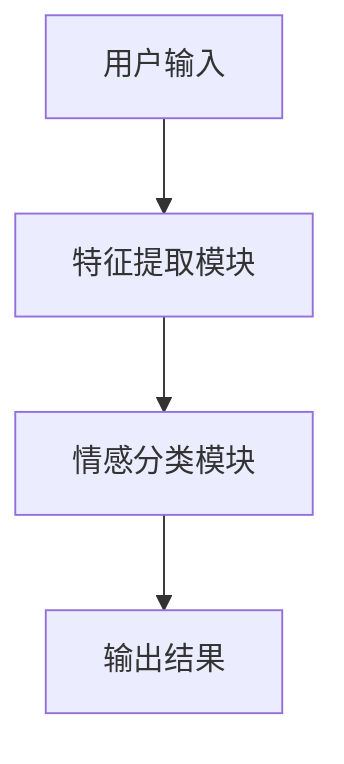
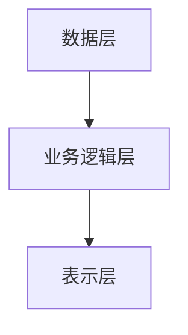
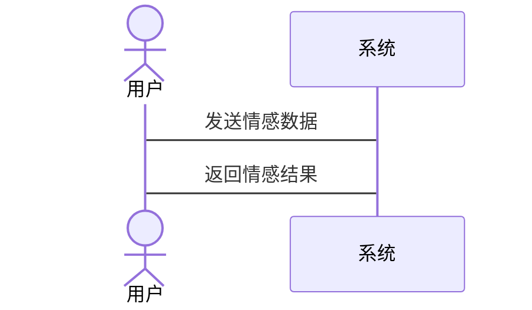

                 


# 《构建AI Agent的情感计算模型》

---

## 关键词：情感计算，AI Agent，深度学习，自然语言处理，情感分类

---

## 摘要：  
情感计算是人工智能领域的重要分支，它使AI Agent能够理解和处理人类情感。本文从情感计算的基本概念出发，详细探讨其在AI Agent中的应用，分析情感计算模型的算法原理、系统架构和实际应用。通过案例分析和代码实现，帮助读者全面掌握情感计算模型的构建方法。

---

# 第一部分: 情感计算模型的背景与基础

## 第1章: 情感计算模型的概述

### 1.1 情感计算的核心概念

#### 1.1.1 情感计算的定义与背景  
情感计算（Affective Computing）是通过计算机技术理解和处理人类情感的科学。它不仅关注事实的逻辑推理，还关注人类的情感状态，从而实现更智能的交互。

#### 1.1.2 情感计算的基本原理  
情感计算的核心在于识别、理解和模拟人类情感。它通常通过自然语言处理、语音识别和面部表情识别等技术来实现。

#### 1.1.3 情感计算在AI Agent中的必要性  
AI Agent需要理解用户的情感状态，以便提供更个性化的服务。情感计算使AI Agent能够根据用户的情感调整其行为，从而提高用户体验。

### 1.2 AI Agent的基本概念

#### 1.2.1 AI Agent的定义与分类  
AI Agent是一种能够感知环境并采取行动以实现目标的智能体。它可以分为简单AI Agent和复杂AI Agent，后者需要情感计算能力。

#### 1.2.2 情感计算在AI Agent中的作用  
情感计算使AI Agent能够理解用户的情感，从而更好地与用户互动。例如，在客服系统中，AI Agent可以根据用户的情感状态调整响应方式。

#### 1.2.3 情感计算的边界与外延  
情感计算的边界包括情感识别、情感分类和情感模拟。外延则涉及多模态情感计算（结合语言、声音、表情等）。

### 1.3 情感计算模型的核心要素

#### 1.3.1 情感数据的来源与处理  
情感数据可以来自文本、语音和图像。处理情感数据需要进行特征提取和数据清洗。

#### 1.3.2 情感计算的特征提取  
特征提取是情感计算的关键步骤。例如，在文本中提取情感关键词，或在语音中提取声调特征。

#### 1.3.3 情感计算的输出形式  
情感计算的输出可以是情感标签（如正面、负面、中性）或情感强度（如情感值范围）。

---

## 第2章: 情感计算模型的原理与联系

### 2.1 情感计算模型的原理

#### 2.1.1 情感特征的提取方法  
情感特征提取是情感计算的基础。常用方法包括基于词袋模型、TF-IDF和深度学习特征提取。

#### 2.1.2 情感分类的算法选择  
情感分类算法包括基于规则的方法（如情感词典）和基于深度学习的方法（如RNN、CNN）。

#### 2.1.3 情感计算的上下文理解  
情感计算需要考虑上下文信息，例如情感的语境和背景。

### 2.2 情感计算模型的属性特征对比

| 模型类型       | 基于规则的情感计算模型 | 基于深度学习的情感计算模型 |
|----------------|------------------------|---------------------------|
| 优点           | 实现简单，易于解释       | 高精度，能够处理复杂模式   |
| 缺点           | 无法处理复杂情感模式     | 需要大量数据训练           |
| 适用场景       | 小规模数据              | 大规模数据，复杂场景       |

### 2.3 情感计算的ER实体关系图  
```mermaid
er
actor: 用户
action: 情感计算操作
object: 情感数据
```

### 2.4 本章小结

---

## 第3章: 情感计算模型的算法实现

### 3.1 基于规则的情感分类算法

#### 3.1.1 基于关键词的情感分类  
通过预定义的情感词典，匹配文本中的关键词来判断情感。

#### 3.1.2 基于情感词典的分类方法  
使用如SentiWordNet等词典，对文本进行情感评分。

#### 3.1.3 规则的优缺点分析  
基于规则的算法实现简单，但难以处理复杂情感。

### 3.2 基于深度学习的情感分类算法

#### 3.2.1 基于RNN的情感分类  
使用循环神经网络（RNN）处理序列数据，如文本情感分类。

#### 3.2.2 基于CNN的情感分类  
使用卷积神经网络（CNN）提取文本特征。

#### 3.2.3 情感迁移学习  
通过迁移学习，利用预训练模型（如BERT）进行情感分类。

### 3.3 算法流程图  
```mermaid
graph TD
A[文本输入] -> B[特征提取]
B -> C[选择模型]
C -> D[模型训练]
D -> E[情感分类]
E -> F[输出结果]
```

### 3.4 数学公式

#### 情感分类的损失函数  
$$ \text{损失函数} = -\sum_{i=1}^{n} y_i \log(p_i) + (1-y_i) \log(1-p_i) $$

其中，\( y_i \) 是真实标签，\( p_i \) 是模型预测的概率。

---

## 第4章: 情感计算模型的系统架构与设计

### 4.1 系统功能设计

#### 4.1.1 系统功能模块  
1. 情感数据输入模块  
2. 情感特征提取模块  
3. 情感分类模块  
4. 情感结果输出模块  

#### 4.1.2 功能模块的交互流程  


### 4.2 系统架构设计

#### 4.2.1 分层架构设计  
- 数据层：处理情感数据。
- 业务逻辑层：实现情感计算逻辑。
- 表示层：展示情感计算结果。

#### 4.2.2 系统架构图  


### 4.3 系统接口设计

#### 4.3.1 API接口设计  
- 输入接口：接受文本或语音数据。
- 输出接口：返回情感计算结果。

#### 4.3.2 接口交互流程  


---

## 第5章: 项目实战与实现

### 5.1 项目环境搭建

#### 5.1.1 环境要求  
- Python 3.8+
- 安装库：scikit-learn, TensorFlow, Keras

### 5.2 核心代码实现

#### 5.2.1 情感分类代码示例  
```python
from sklearn.feature_extraction.text import TfidfVectorizer
from sklearn.svm import SVC

# 数据预处理
text_data = [...]  # 文本数据
labels = [...]     # 标签数据

# 特征提取
vectorizer = TfidfVectorizer()
features = vectorizer.fit_transform(text_data)

# 模型训练
model = SVC()
model.fit(features, labels)

# 预测
test_text = "I love this product!"
test_feature = vectorizer.transform([test_text])
predicted_label = model.predict(test_feature)
print(predicted_label)
```

#### 5.2.2 深度学习模型实现  
```python
import tensorflow as tf
from tensorflow.keras import layers

model = tf.keras.Sequential()
model.add(layers.Embedding(input_dim=10000, output_dim=50))
model.add(layers.SimpleRNN(units=100))
model.add(layers.Dense(1, activation='sigmoid'))
model.compile(optimizer='adam', loss='binary_crossentropy', metrics=['accuracy'])
model.fit(train_data, train_labels, epochs=10, batch_size=32)
```

### 5.3 案例分析与应用

#### 5.3.1 情感分类案例  
使用上述代码对社交媒体评论进行情感分类，输出结果为正面、负面或中性。

#### 5.3.2 情感计算的实际应用  
在智能客服系统中，实时分析用户情感，调整响应策略。

### 5.4 项目小结

---

## 第6章: 最佳实践与小结

### 6.1 注意事项与问题解决

- 数据质量：确保情感数据的多样性和代表性。
- 模型泛化能力：避免过拟合，选择合适的模型参数。

### 6.2 未来发展趋势

- 多模态情感计算：结合文本、语音和图像信息。
- 情感计算的实时性：优化模型推理速度。

### 6.3 参考文献与扩展阅读

- 参考文献：[1] 情感计算相关论文。
- 扩展阅读：推荐相关书籍和资源。

---

# 作者：AI天才研究院/AI Genius Institute & 禅与计算机程序设计艺术 /Zen And The Art of Computer Programming

---

**本文由AI天才研究院撰写，转载请注明出处。**

