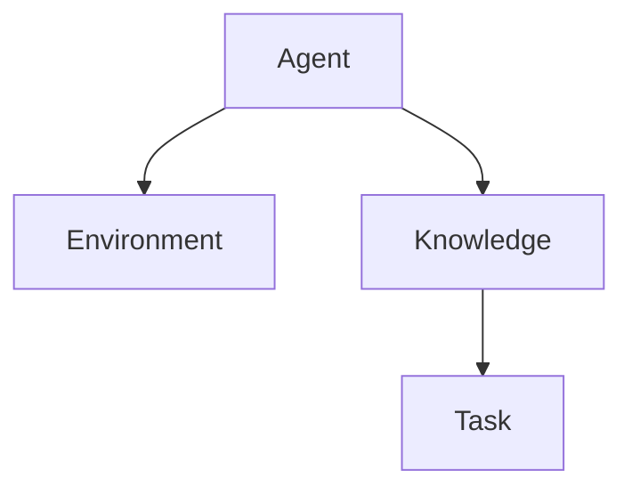
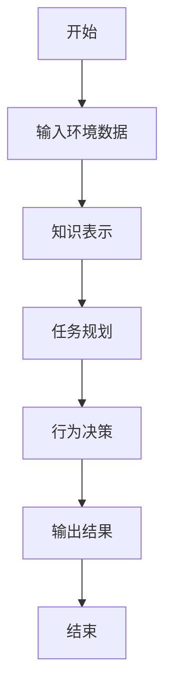
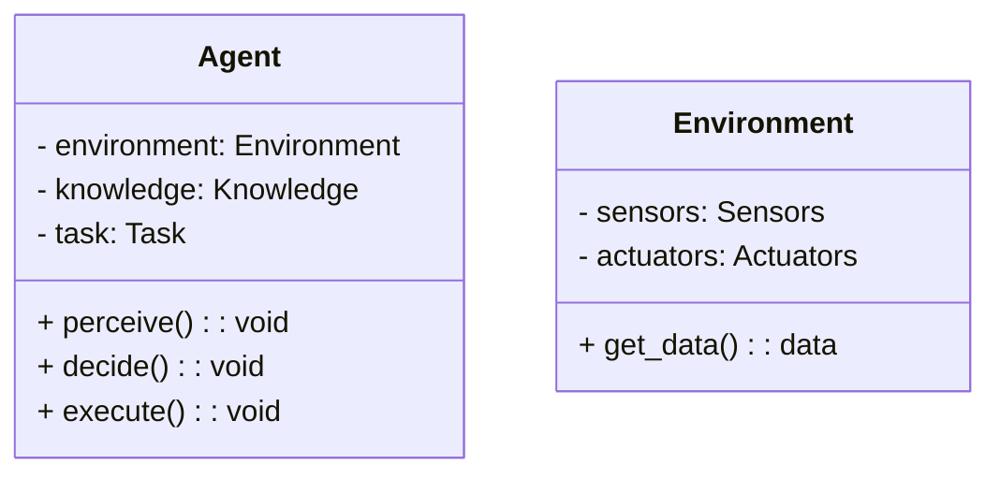
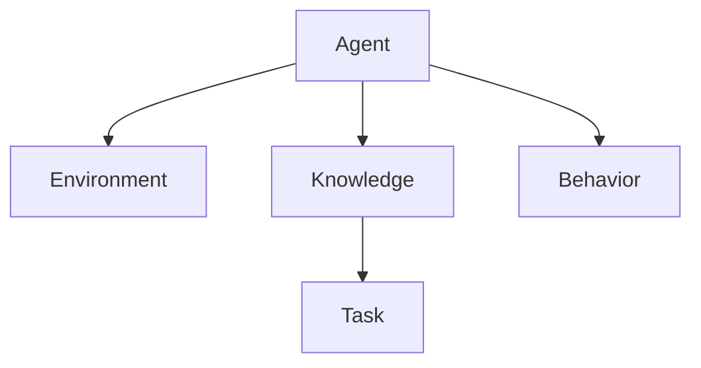
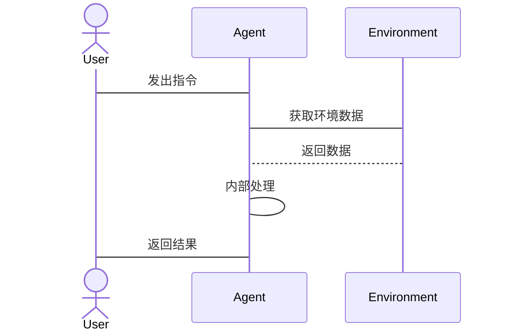

                 


# 《构建AI Agent的敏捷开发流程》

> 关键词：AI Agent, 敏捷开发, 人工智能, 软件架构, 系统设计

> 摘要：本文将详细探讨如何在AI Agent的开发过程中采用敏捷开发方法，通过逐步分析和系统设计，构建高效、可靠的AI Agent系统。从基本概念到算法实现，从系统架构到项目实战，结合具体案例和代码示例，为读者提供一份完整的AI Agent敏捷开发指南。

---

# 第1章: AI Agent的基本概念与应用场景

## 1.1 AI Agent的定义与核心特征
### 1.1.1 什么是AI Agent
AI Agent（人工智能代理）是一种能够感知环境、自主决策并执行任务的智能系统。它能够根据当前状态和环境输入，通过内部算法计算出最优行为策略。

### 1.1.2 AI Agent的核心特征
- **自主性**：AI Agent无需外部干预，能够自主决策。
- **反应性**：能够实时感知环境变化并做出反应。
- **目标导向**：所有行为均以实现特定目标为导向。
- **学习能力**：能够通过经验优化自身算法。

### 1.1.3 AI Agent与传统程序的区别
AI Agent与传统程序的最大区别在于其“智能”属性，能够处理复杂和不确定的环境，具备自主决策能力。

## 1.2 敏捷开发的基本原理
### 1.2.1 敏捷开发的定义
敏捷开发是一种以迭代和增量开发为特点的软件开发方法，强调快速响应变化和团队协作。

### 1.2.2 敏捷开发的核心原则
- **用户参与**：客户直接参与开发过程。
- **迭代开发**：分阶段交付，持续改进。
- **团队协作**：强调团队成员的紧密合作。
- **灵活性**：能够快速适应需求变化。

### 1.2.3 AI Agent开发中敏捷方法的应用
在AI Agent的开发中，敏捷方法可以帮助团队快速验证和迭代算法，确保系统能够适应不断变化的需求和环境。

## 1.3 AI Agent敏捷开发的背景与意义
### 1.3.1 当前AI开发的挑战
- **复杂性高**：AI Agent需要处理复杂多变的环境。
- **需求不确定性**：需求往往在开发过程中发生变化。
- **快速迭代**：需要快速验证和优化算法。

### 1.3.2 敏捷开发在AI Agent中的应用价值
- **提高开发效率**：通过迭代开发快速验证算法。
- **增强灵活性**：能够快速响应需求变化。
- **降低风险**：通过持续测试减少潜在问题。

### 1.3.3 未来AI Agent开发的趋势
随着AI技术的不断发展，敏捷开发将成为AI Agent开发的主流方法，特别是在处理复杂和动态的环境时。

## 1.4 本章小结
本章介绍了AI Agent的基本概念及其核心特征，探讨了敏捷开发的基本原理，并分析了AI Agent敏捷开发的背景与意义。

---

# 第2章: AI Agent的核心概念与联系

## 2.1 AI Agent的核心概念原理
### 2.1.1 知识表示
知识表示是AI Agent理解环境的基础，通常采用符号逻辑、概率推理或神经网络等方式。

### 2.1.2 行为决策
行为决策是AI Agent的核心功能，基于当前状态和目标，选择最优行为。

### 2.1.3 环境感知
环境感知是AI Agent获取外界信息的关键，通常通过传感器或数据输入实现。

## 2.2 核心概念对比表
| 概念         | 特征1       | 特征2       |
|--------------|------------|------------|
| 知识表示     | 符号化       | 概率化       |
| 行为决策     | 确定性       | 随机性       |
| 环境感知     | 实时性       | 延时性       |

## 2.3 ER实体关系图


## 2.4 本章小结
本章详细讲解了AI Agent的核心概念及其之间的关系，通过对比表和实体关系图帮助读者更好地理解这些概念。

---

# 第3章: AI Agent的算法原理

## 3.1 算法原理概述
### 3.1.1 知识表示算法
知识表示算法包括符号逻辑、概率推理和神经网络等方法。

### 3.1.2 行为决策算法
行为决策算法包括决策树、随机森林和强化学习等方法。

### 3.1.3 环境感知算法
环境感知算法包括计算机视觉、自然语言处理和语音识别等技术。

## 3.2 算法实现流程图


## 3.3 Python实现代码
```python
def knowledge_representation(data):
    # 知识表示算法实现
    pass

def behavior_decision(knowledge):
    # 行为决策算法实现
    pass

def environment_perception(environment):
    # 环境感知算法实现
    pass
```

## 3.4 数学模型与公式
### 3.4.1 知识表示的数学模型
$$
\text{Knowledge} = \sum_{i=1}^{n} w_i x_i
$$

---

# 第4章: 系统分析与架构设计

## 4.1 问题场景介绍
AI Agent需要在复杂环境中完成特定任务，例如自动驾驶汽车需要实时感知环境并做出驾驶决策。

## 4.2 系统功能设计
### 4.2.1 领域模型类图


## 4.3 系统架构设计


## 4.4 接口设计与交互流程图


## 4.5 本章小结
本章通过系统分析与架构设计，明确了AI Agent的实现过程，为后续开发奠定了基础。

---

# 第5章: 项目实战

## 5.1 环境安装
需要安装Python、相关AI库（如TensorFlow、Keras）和开发工具（如PyCharm）。

## 5.2 核心代码实现
```python
import numpy as np

def perceive(environment):
    # 环境感知算法实现
    return environment.get_data()

def decide(knowledge):
    # 行为决策算法实现
    return np.random.choice(['left', 'right', 'forward'], 1)[0]

def execute(action):
    # 执行动作
    print(f"执行动作：{action}")

class Agent:
    def __init__(self, environment):
        self.environment = environment

    def run(self):
        while True:
            data = self.perceive(self.environment)
            knowledge = process_data(data)
            action = decide(knowledge)
            self.execute(action)
```

## 5.3 代码解读与分析
- **perceive函数**：从环境中获取数据。
- **decide函数**：基于知识做出决策。
- **execute函数**：执行具体动作。
- **Agent类**：封装了整个AI Agent的行为，包含感知、决策和执行三个步骤。

## 5.4 实际案例分析
以自动驾驶汽车为例，展示如何通过上述代码实现基本的环境感知、决策和执行。

## 5.5 本章小结
本章通过实际项目，详细讲解了AI Agent的实现过程，帮助读者掌握敏捷开发的具体方法。

---

# 第6章: 最佳实践与注意事项

## 6.1 最佳实践
- **持续集成**：定期进行代码审查和测试。
- **模块化设计**：确保代码的可维护性和扩展性。
- **数据质量管理**：保证训练数据的准确性和多样性。

## 6.2 小结
敏捷开发方法在AI Agent的开发中具有重要意义，通过持续迭代和团队协作，能够快速验证和优化算法。

## 6.3 注意事项
- **需求明确**：确保对任务目标有清晰的理解。
- **数据安全**：保护敏感数据不被泄露。
- **性能优化**：确保系统在复杂环境中的运行效率。

## 6.4 拓展阅读
推荐阅读《敏捷开发实战手册》和《人工智能：一种现代的方法》等书籍，以深入理解敏捷开发与AI Agent的相关知识。

---

# 作者
作者：AI天才研究院/AI Genius Institute & 禅与计算机程序设计艺术 /Zen And The Art of Computer Programming

