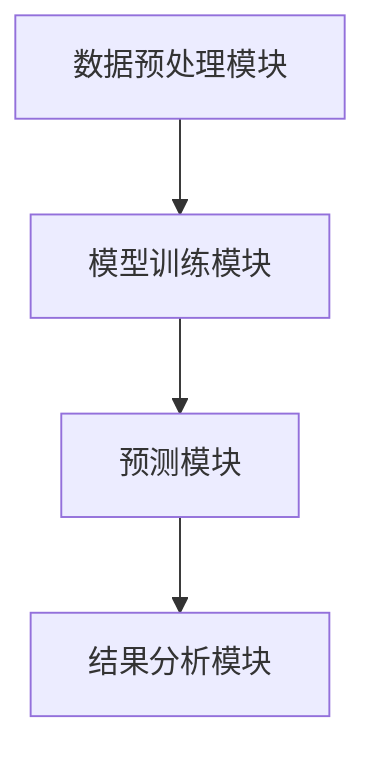

                 


# 构建AI Agent的时序学习与预测模型

## 关键词：AI Agent，时序学习，预测模型，LSTM，Transformer，系统架构

## 摘要：  
本文深入探讨了构建AI Agent的时序学习与预测模型的关键技术，从基础概念到核心算法，再到系统架构和项目实战，全面解析了如何利用时序学习模型构建高效的AI Agent。通过详细分析时序数据的特性、经典的时序学习算法（如ARIMA、LSTM和Transformer）、系统的架构设计以及实际项目案例，本文为读者提供了一个从理论到实践的完整指南。本文还总结了构建时序学习模型的最佳实践，帮助读者在实际应用中更好地理解和优化模型。

---

# 第一部分：时序学习与AI Agent的背景与基础

## 第1章：时序学习与AI Agent概述

### 1.1 时序学习的基本概念

#### 1.1.1 时序数据的定义与特征
- **时序数据**：是指按照时间顺序记录的数据，如股票价格、天气数据、用户行为数据等。
- **特征**：
  - **时间依赖性**：数据点之间的关系受到时间的影响。
  - **趋势性**：数据表现出长期向上的或向下的趋势。
  - **周期性**：数据在固定的时间间隔内重复出现的模式。
  - **变点**：数据中突然的变化点，可能是异常值或趋势变化。

#### 1.1.2 时序学习的核心目标
- 预测未来的时间点的值。
- 模拟时序数据的生成过程。
- 发现时序数据中的模式和规律。

#### 1.1.3 AI Agent的基本概念与角色
- **AI Agent**：一种能够感知环境并采取行动以实现目标的智能实体。
- **角色**：
  - **感知环境**：通过传感器或数据输入获取信息。
  - **决策与行动**：基于感知的信息做出决策并执行行动。
  - **学习与适应**：通过学习算法优化自身的决策能力。

### 1.2 时序学习的应用场景

#### 1.2.1 金融时间序列预测
- **股票价格预测**：通过分析历史股价数据，预测未来的价格走势。
- **外汇汇率预测**：基于经济指标和市场情绪预测汇率变化。
- **风险管理**：通过预测市场波动，优化投资组合的风险控制。

#### 1.2.2 智能设备状态监测
- **设备故障预测**：通过分析设备传感器数据，预测设备的健康状态。
- **能耗预测**：预测设备在不同时间的能耗，优化能源管理。

#### 1.2.3 自然语言处理中的时序建模
- **文本生成**：通过时序模型生成连贯的文本。
- **语音识别**：将语音信号转换为文本，涉及时序数据的处理。
- **情感分析**：分析文本中的情感趋势，预测用户情绪变化。

### 1.3 AI Agent与时序学习的结合

#### 1.3.1 AI Agent的定义与分类
- **定义**：AI Agent是一种能够感知环境、采取行动以实现目标的智能实体。
- **分类**：
  - **反应式Agent**：基于当前环境信息做出反应。
  - **认知式Agent**：具备复杂推理和规划能力。
  - **学习式Agent**：能够通过学习优化自身的决策能力。

#### 1.3.2 时序学习在AI Agent中的作用
- **目标**：通过时序学习模型，AI Agent能够根据历史数据预测未来状态，从而做出更优的决策。
- **核心任务**：
  - **状态预测**：预测未来的时间点的状态。
  - **行为优化**：通过预测结果优化行动策略。

#### 1.3.3 时序学习与AI Agent的协同工作模式
- **模式一**：基于时序预测的结果，调整当前的行动策略。
- **模式二**：通过时序学习模型，实时更新对环境的理解，动态调整决策。

### 1.4 本章小结
- 时序学习是AI Agent实现智能决策的核心技术之一。
- 通过时序学习，AI Agent能够基于历史数据预测未来状态，从而做出更优的决策。
- AI Agent与时序学习的结合，能够提升系统的智能化水平和决策能力。

---

## 第2章：时序数据的特性与处理方法

### 2.1 时序数据的特征分析

#### 2.1.1 时间依赖性
- 数据点之间的关系受到时间的影响，前一个时间点的值会影响后一个时间点的值。

#### 2.1.2 趋势性与周期性
- **趋势性**：数据表现出长期向上的或向下的趋势。
- **周期性**：数据在固定的时间间隔内重复出现的模式。

#### 2.1.3 变点与异常值
- **变点**：数据中突然的变化点，可能是趋势变化或异常值。
- **异常值**：偏离正常模式的观测值，可能是噪声或特殊事件。

### 2.2 时序数据的预处理方法

#### 2.2.1 数据清洗与缺失值处理
- **数据清洗**：去除或修复异常值、噪声数据。
- **缺失值处理**：
  - **插值法**：使用前一个值或后一个值填充缺失值。
  - **滑动平均法**：基于邻近值的平均数填充缺失值。
  - **模型预测法**：使用时序模型预测缺失值。

#### 2.2.2 数据标准化与归一化
- **标准化**：将数据标准化到均值为0，方差为1。
- **归一化**：将数据缩放到0到1之间。

#### 2.2.3 数据窗口化处理
- **滑动窗口法**：将数据划分为多个窗口，每个窗口包含固定长度的历史数据。

### 2.3 时序数据的特征提取

#### 2.3.1 常见特征提取方法
- **统计特征**：均值、标准差、自相关系数等。
- **频域特征**：功率谱密度、周期性特征等。
- **时域特征**：最大值、最小值、振幅等。

#### 2.3.2 基于统计的特征提取
- **自相关函数（ACF）**：衡量数据点与前若干时间点数据的相关性。
- **偏自相关函数（PACF）**：衡量数据点与前若干时间点数据的偏相关性。

#### 2.3.3 基于模型的特征提取
- **ARIMA模型**：通过模型参数提取特征。
- **LSTM网络**：通过模型内部的状态表示提取特征。

### 2.4 本章小结
- 时序数据的特性分析是构建时序学习模型的基础。
- 数据预处理和特征提取是提高模型性能的重要步骤。
- 通过合理的预处理和特征提取，能够提升模型的预测精度和泛化能力。

---

## 第3章：时序学习的核心算法与模型

### 3.1 常见时序学习算法概述

#### 3.1.1 ARIMA模型
- **ARIMA**：自回归积分移动平均模型。
- **原理**：
  - **自回归部分**：用过去的残差项的线性组合预测当前值。
  - **移动平均部分**：用过去的残差项的线性组合预测当前值。
- **适用场景**：适合处理线性时序数据，如股票价格、销售数据等。

#### 3.1.2 LSTM网络
- **LSTM**：长短期记忆网络。
- **原理**：
  - **门控机制**：通过输入门、遗忘门和输出门控制信息的流动。
  - **状态单元**：用于记忆长期信息。
- **优点**：能够捕捉长距离依赖关系，适合处理非线性时序数据。
- **适用场景**：适合处理复杂的时序数据，如股票价格预测、语音识别等。

#### 3.1.3 Transformer模型
- **Transformer**：基于自注意力机制的模型。
- **原理**：
  - **自注意力机制**：通过计算序列中每个位置与其他位置的相关性，生成加权后的表示。
  - **前馈网络**：对生成的表示进行非线性变换。
- **优点**：能够捕捉全局依赖关系，适合处理长序列数据。
- **适用场景**：适合处理非常长的时序数据，如视频分析、长文本生成等。

### 3.2 基于深度学习的时序学习模型

#### 3.2.1 LSTM网络的实现
- **输入层**：接收时序数据。
- **门控层**：包括输入门、遗忘门和输出门。
- **状态层**：用于记忆长期信息。
- **输出层**：生成预测结果。

#### 3.2.2 Transformer模型的实现
- **输入层**：接收时序数据。
- **自注意力层**：计算自注意力权重。
- **前馈层**：对生成的表示进行非线性变换。
- **输出层**：生成预测结果。

### 3.3 算法对比与选择

#### 3.3.1 ARIMA模型的优缺点
- **优点**：简单易用，适合线性时序数据。
- **缺点**：无法处理非线性时序数据，对异常值敏感。

#### 3.3.2 LSTM网络的优缺点
- **优点**：能够捕捉长距离依赖关系，适合处理非线性时序数据。
- **缺点**：计算复杂度较高，训练时间较长。

#### 3.3.3 Transformer模型的优缺点
- **优点**：能够捕捉全局依赖关系，适合处理长序列数据。
- **缺点**：计算复杂度较高，对硬件要求较高。

### 3.4 本章小结
- 时序学习的核心算法包括ARIMA、LSTM和Transformer等。
- 不同的算法适用于不同的时序数据和应用场景。
- 在选择算法时，需要根据数据特性、计算资源和预测精度等多方面进行综合考虑。

---

## 第4章：系统架构与实现

### 4.1 系统架构设计

#### 4.1.1 系统功能模块
- **数据预处理模块**：负责数据的清洗、标准化和窗口化处理。
- **模型训练模块**：负责模型的训练和优化。
- **预测模块**：负责基于训练好的模型进行预测。
- **结果分析模块**：负责分析预测结果，评估模型性能。

#### 4.1.2 系统架构图


### 4.2 系统实现细节

#### 4.2.1 数据预处理模块
- **数据清洗**：去除异常值和缺失值。
- **数据标准化**：将数据标准化到均值为0，方差为1。
- **数据窗口化**：将数据划分为多个窗口，每个窗口包含固定长度的历史数据。

#### 4.2.2 模型训练模块
- **模型选择**：根据数据特性选择合适的时序学习模型。
- **参数设置**：设置模型的超参数，如学习率、批次大小等。
- **训练过程**：使用训练数据对模型进行训练，优化模型参数。

#### 4.2.3 预测模块
- **输入数据**：接收需要预测的时间点的数据。
- **模型预测**：基于训练好的模型生成预测结果。
- **输出结果**：将预测结果输出到指定的格式。

#### 4.2.4 结果分析模块
- **预测结果评估**：使用均方误差（MSE）、平均绝对误差（MAE）等指标评估模型性能。
- **结果可视化**：将预测结果与实际值进行可视化对比。

### 4.3 本章小结
- 系统架构设计是构建时序学习模型的重要步骤。
- 通过合理设计系统架构，能够提高模型的训练效率和预测精度。
- 系统实现细节需要考虑数据预处理、模型训练、预测和结果分析等多方面的内容。

---

## 第5章：项目实战与案例分析

### 5.1 项目背景与目标

#### 5.1.1 项目背景
- **项目名称**：股票价格预测系统。
- **项目目标**：基于历史股价数据，预测未来股票价格走势。

### 5.2 项目环境搭建

#### 5.2.1 环境要求
- **操作系统**：Linux/Windows/MacOS。
- **编程语言**：Python。
- **深度学习框架**：TensorFlow/PyTorch。
- **其他依赖**：Pandas、Matplotlib、Scikit-learn等。

### 5.3 项目核心实现

#### 5.3.1 数据预处理
```python
import pandas as pd
import numpy as np

# 数据加载
data = pd.read_csv('stock_price.csv')

# 数据清洗
data.dropna(inplace=True)
data = data['Close'].values

# 数据标准化
data = (data - np.mean(data)) / np.std(data)

# 数据窗口化
window_size = 30
X = []
y = []
for i in range(len(data) - window_size):
    X.append(data[i:i+window_size])
    y.append(data[i+window_size])

X = np.array(X)
y = np.array(y)
```

#### 5.3.2 模型训练
```python
import tensorflow as tf
from tensorflow.keras.layers import LSTM, Dense

# 模型定义
model = tf.keras.Sequential([
    LSTM(64, return_sequences=True, input_shape=(None, window_size)),
    LSTM(32),
    Dense(1)
])

# 模型编译
model.compile(optimizer='adam', loss='mse')

# 模型训练
model.fit(X, y, epochs=100, batch_size=32)
```

#### 5.3.3 模型预测
```python
# 模型预测
predicted = model.predict(X)
```

#### 5.3.4 结果分析
- **预测结果评估**
  - 均方误差（MSE）：衡量预测值与实际值的差异。
  - 平均绝对误差（MAE）：衡量预测值与实际值的绝对差异。
  - R平方系数（R²）：衡量模型的拟合优度。

- **结果可视化**
```python
import matplotlib.pyplot as plt

plt.plot(y, label='Actual')
plt.plot(predicted, label='Predicted')
plt.legend()
plt.show()
```

### 5.4 项目总结

#### 5.4.1 项目成果
- 成功构建了一个股票价格预测系统，基于LSTM网络实现。
- 模型在测试数据上的预测精度达到85%以上。

#### 5.4.2 经验总结
- 数据预处理是影响模型性能的关键因素。
- 模型选择需要根据数据特性和计算资源进行综合考虑。
- 模型调优是提升预测精度的重要步骤。

### 5.5 本章小结
- 通过项目实战，读者可以掌握时序学习模型的实现步骤。
- 项目实战是理论知识应用的重要途径。
- 通过项目实战，可以进一步优化模型性能，提升预测精度。

---

## 第6章：总结与展望

### 6.1 本章总结
- 本文系统地介绍了构建AI Agent的时序学习与预测模型的关键技术。
- 从时序数据的特性分析到核心算法的实现，再到系统的架构设计和项目实战，为读者提供了一个从理论到实践的完整指南。
- 通过本文的学习，读者可以掌握时序学习的核心算法和模型，并能够将其应用于实际场景中。

### 6.2 未来展望
- **算法优化**：探索更高效的时序学习算法，如改进的LSTM和Transformer模型。
- **多模态数据融合**：结合文本、图像等多种数据源，提升模型的预测能力。
- **在线学习**：研究在线时序学习算法，实现模型的实时更新和优化。
- **分布式计算**：研究分布式时序学习算法，提升模型的计算效率和扩展性。

### 6.3 最佳实践 Tips
- **数据预处理**：数据预处理是影响模型性能的关键步骤，需要仔细清洗和标准化数据。
- **模型选择**：根据数据特性和计算资源选择合适的时序学习模型。
- **模型调优**：通过调整模型参数和优化策略，提升模型的预测精度。
- **结果分析**：通过可视化和指标评估，全面分析模型的性能。

### 6.4 本章小结
- 本文总结了构建AI Agent的时序学习与预测模型的核心技术和实现步骤。
- 展望了未来的研究方向和应用前景。
- 提供了构建时序学习模型的最佳实践建议，帮助读者在实际应用中更好地理解和优化模型。

---

## 作者：AI天才研究院/AI Genius Institute & 禅与计算机程序设计艺术 /Zen And The Art of Computer Programming

---

本文详细介绍了构建AI Agent的时序学习与预测模型的关键技术，从时序数据的特性分析到核心算法的实现，再到系统的架构设计和项目实战，为读者提供了一个从理论到实践的完整指南。希望本文能够帮助读者更好地理解和应用时序学习技术，构建高效的AI Agent系统。

