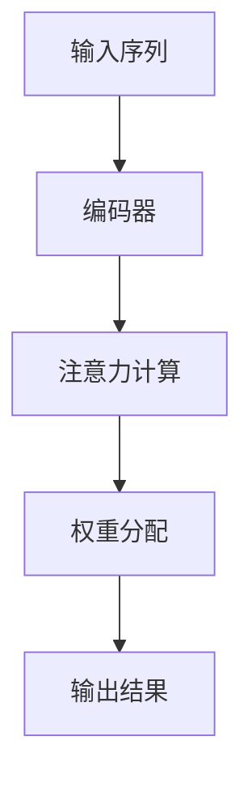
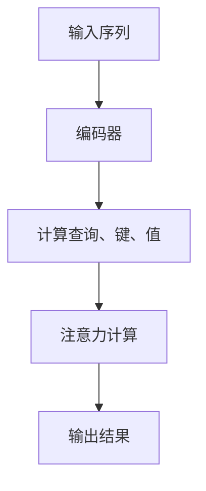

                 


# 构建AI Agent的注意力机制设计

> 关键词：AI Agent，注意力机制，自然语言处理，强化学习，机器学习，深度学习

> 摘要：本文深入探讨了AI Agent中注意力机制的设计与实现，从理论基础到实际应用，结合具体的算法原理和项目实战，全面解析注意力机制在提升AI Agent性能中的关键作用。

---

# 第一部分: AI Agent与注意力机制的背景介绍

## 第1章: AI Agent的基本概念

### 1.1 AI Agent的定义与特点
- **定义**：AI Agent（人工智能代理）是指在计算机系统中，能够感知环境并采取行动以实现目标的实体。
- **特点**：
  - **自主性**：能够在没有外部干预的情况下运行。
  - **反应性**：能够实时感知环境并做出反应。
  - **目标导向**：所有行动都是为了实现特定目标。
  - **学习能力**：能够通过经验改进自身的性能。
- **与传统AI的区别**：传统AI通常是指静态的知识库或规则系统，而AI Agent具有动态性和目标导向性。

### 1.2 注意力机制的基本概念
- **定义**：注意力机制是一种模拟人类注意力的选择性关注机制，用于在处理信息时，优先关注更重要的部分。
- **核心原理**：
  - **查询（Query）**：表示当前输入的序列。
  - **键（Key）**：用于匹配输入中的其他部分。
  - **值（Value）**：根据键的匹配程度，分配权重。
- **应用场景**：文本生成、图像识别、语音识别、机器翻译等。

### 1.3 AI Agent与注意力机制的结合
- **作用**：通过注意力机制，AI Agent能够更高效地处理复杂任务，提升决策的准确性和效率。
- **提升性能的方式**：
  - **信息筛选**：在处理大量信息时，注意力机制能够快速筛选出关键信息。
  - **动态调整**：根据环境变化，实时调整关注点。
- **当前研究现状**：
  - 基于Transformer的AI Agent研究逐渐增多。
  - 多头注意力机制在复杂任务中的应用成为热点。

---

# 第二部分: 注意力机制的核心概念与联系

## 第2章: 注意力机制的核心概念与联系

### 2.1 注意力机制的原理
- **基本原理**：
  1. **输入编码**：将输入序列编码为查询、键和值。
  2. **计算相似度**：通过查询和键的点积计算相似度。
  3. **归一化**：通过Softmax函数将相似度转化为权重。
  4. **加权求和**：根据权重对值进行加权求和，得到最终的输出。
- **数学模型**：
  $$\text{Attention}(Q, K, V) = \text{softmax}\left(\frac{QK^T}{\sqrt{d_k}}\right)V$$
  - $Q$：查询矩阵。
  - $K$：键矩阵。
  - $V$：值矩阵。
  - $d_k$：键的维度。

### 2.2 注意力机制与相关概念的对比
- **与传统机器学习模型的对比**：
  | 特性           | 传统模型       | 注意力机制       |
  |----------------|----------------|------------------|
  | 数据处理方式   | 基于规则或统计  | 基于动态权重分配  |
  | 信息利用方式   | 全局关注        | 选择性关注       |
  | 灵活性         | 较低           | 较高             |
- **与卷积神经网络的对比**：
  - **CNN**：擅长处理局部特征，适用于图像等二维数据。
  - **注意力机制**：适用于序列数据，能够捕捉全局关系。
- **与循环神经网络的对比**：
  - **RNN**：处理序列数据，但存在梯度消失问题。
  - **注意力机制**：通过权重分配，提升序列建模能力。

### 2.3 注意力机制的ER实体关系图


---

# 第三部分: 注意力机制的算法原理讲解

## 第3章: 注意力机制的算法原理讲解

### 3.1 注意力机制的算法流程


### 3.2 注意力机制的数学模型
- **计算步骤**：
  1. **计算查询、键、值**：
     $$Q = W_q x, K = W_k x, V = W_v x$$
  2. **计算相似度**：
     $$\text{score} = Q \cdot K^T$$
  3. **归一化**：
     $$\text{weight} = \text{softmax}(\text{score}/\sqrt{d_k})$$
  4. **加权求和**：
     $$\text{output} = \text{weight} \cdot V$$

### 3.3 多头注意力机制的实现
- **多头注意力的原理**：
  - 将查询、键、值分成多个子空间。
  - 分别计算每个子空间的注意力，并将结果拼接。
- **计算流程**：
  1. **分割**：
     $$Q = Q_1, Q_2, ..., Q_h$$
  2. **计算子注意力**：
     $$\text{Attention}_i = \text{softmax}(\frac{Q_i K_i^T}{\sqrt{d_k}}) V_i$$
  3. **拼接**：
     $$\text{output} = [\text{Attention}_1, \text{Attention}_2, ..., \text{Attention}_h]$$
- **代码实现**：
  ```python
  def multi_head_attention(query, key, value, num_heads):
      d_k = query.shape[-1] // num_heads
      query = query.view(-1, num_heads, d_k)
      key = key.view(-1, num_heads, d_k)
      value = value.view(-1, num_heads, d_k)
      
      scores = (query @ key.transpose(-2, -1)) / (d_k ** 0.5)
      attention = F.softmax(scores, dim=-1)
      output = (attention @ value).view(-1, num_heads * d_k)
      return output
  ```

---

# 第四部分: AI Agent的注意力机制设计

## 第4章: AI Agent的注意力机制设计

### 4.1 AI Agent的体系结构
- **基于Transformer的AI Agent架构**：
  ```mermaid
  graph TD
      A[输入序列] --> B[编码器]
      B --> C[多头注意力]
      C --> D[前馈网络]
      D --> E[输出结果]
  ```
- **注意力机制在AI Agent中的位置**：
  - **编码器**：负责将输入序列编码为高维向量。
  - **解码器**：基于编码器的输出生成目标序列。
  - **注意力层**：在编码器和解码器中均应用注意力机制。

### 4.2 注意力机制在AI Agent中的应用
- **文本生成**：
  - **应用场景**：自动文本生成、对话系统。
  - **实现方式**：通过解码器中的自注意力机制生成上下文相关的输出。
- **对话系统**：
  - **应用场景**：智能客服、虚拟助手。
  - **实现方式**：结合上下文注意力机制，提升对话的连贯性。
- **图像识别**：
  - **应用场景**：目标检测、图像分割。
  - **实现方式**：通过视觉注意力机制，关注图像中的关键区域。

---

# 第五部分: 系统分析与架构设计方案

## 第5章: 系统分析与架构设计方案

### 5.1 系统分析
- **问题场景**：构建一个基于Transformer的AI Agent，用于文本生成任务。
- **系统功能设计**：
  - **领域模型**：
    ```mermaid
    graph TD
        User[用户输入] --> Encoder[编码器]
        Encoder --> Attention[注意力层]
        Attention --> FFN[前馈网络]
        FFN --> Decoder[解码器]
        Decoder --> Output[输出结果]
    ```
  - **系统架构设计**：
    ```mermaid
    graph TD
        Input --> Encoder
        Encoder --> Attention
        Attention --> FFN
        FFN --> Decoder
        Decoder --> Output
    ```
  - **系统接口设计**：
    - 输入接口：接收用户输入的文本序列。
    - 输出接口：生成目标文本序列。
    - 控制接口：管理系统的运行状态。

### 5.2 项目实战
- **环境安装**：
  - Python 3.8+
  - PyTorch 1.9+
  - Transformers库
  ```bash
  pip install torch transformers
  ```
- **系统核心实现源代码**：
  ```python
  from transformers import AutoTokenizer, AutoModelForSeq2Seq
  import torch

  model_name = "facebook/m2m-large-4m"
  tokenizer = AutoTokenizer.from_pretrained(model_name)
  model = AutoModelForSeq2Seq.from_pretrained(model_name)

  inputs = "hello world"
  tokenized_inputs = tokenizer(inputs, return_tensors="pt")
  outputs = model.generate(**tokenized_inputs, max_length=50)
  print(tokenizer.decode(outputs[0], skip_special_tokens=True))
  ```
- **代码应用解读与分析**：
  - **tokenizer**：将输入文本编码为模型可处理的格式。
  - **model**：基于Transformer的AI Agent模型。
  - **generate**：根据输入生成目标序列。
  - **decode**：将生成的序列解码为人类可读的文本。

### 5.3 实际案例分析
- **案例分析**：基于上述代码实现一个简单的文本生成AI Agent。
  - **输入**：用户输入“hello world”。
  - **输出**：生成一段与输入相关的文本，例如“Hello! How can I assist you today?”
- **详细讲解**：
  - **输入处理**：通过tokenizer将输入文本转换为token索引。
  - **模型推理**：调用模型的generate方法生成目标序列。
  - **输出解码**：将生成的序列解码为可读文本。

### 5.4 项目小结
- **项目总结**：通过本项目，我们实现了基于Transformer的AI Agent，验证了注意力机制在文本生成中的有效性。
- **经验总结**：
  - **模型选择**：选择合适的模型架构能够显著提升性能。
  - **数据预处理**：高质量的数据预处理是模型训练的关键。
  - **超参数调优**：通过调整超参数能够进一步优化模型性能。

---

# 第六部分: 总结与展望

## 第6章: 总结与展望

### 6.1 总结
- **核心内容回顾**：
  - 介绍了AI Agent和注意力机制的基本概念。
  - 探讨了注意力机制在AI Agent中的设计与实现。
  - 通过项目实战，验证了注意力机制的有效性。
- **主要收获**：
  - 理解了注意力机制的核心原理。
  - 掌握了基于Transformer的AI Agent设计方法。
  - 提升了实际项目开发能力。

### 6.2 未来展望
- **研究方向**：
  - 更高效的注意力机制设计。
  - 注意力机制在多模态任务中的应用。
  - 增强学习与注意力机制的结合。
- **技术趋势**：
  - 多模态AI Agent逐渐成为研究热点。
  - 自适应注意力机制的研究逐渐深入。
  - 边缘计算与注意力机制的结合受到关注。

---

# 附录

## 附录A: 进一步阅读的资源
- **推荐书籍**：
  - 《Attention is All You Need》（论文）
  - 《Transformers in Action》（书籍）
  - 《Deep Learning》（书籍）
- **推荐博客**：
  - [Towards Data Science](https://towardsdatascience.com/)
  - [Hugging Face](https://huggingface.co/)
  - [Medium - AI](https://medium.com/ai)

## 附录B: 常见问题解答
- **Q: 什么是注意力机制？**
  - A: 注意力机制是一种选择性关注机制，用于在处理信息时，优先关注更重要的部分。
- **Q: 为什么AI Agent需要注意力机制？**
  - A: 注意力机制能够帮助AI Agent更高效地处理复杂任务，提升决策的准确性和效率。
- **Q: 如何选择合适的注意力机制？**
  - A: 根据具体任务需求选择，自注意力机制适用于序列任务，视觉注意力机制适用于图像任务。

---

# 作者

作者：AI天才研究院/AI Genius Institute & 禅与计算机程序设计艺术 /Zen And The Art of Computer Programming

---

# 结语

通过本文的深入探讨，我们不仅了解了AI Agent和注意力机制的基本概念，还掌握了它们在实际应用中的设计与实现方法。希望本文能够为读者在构建AI Agent的注意力机制设计方面提供有价值的参考和启发。

