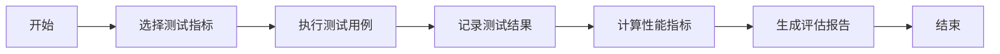
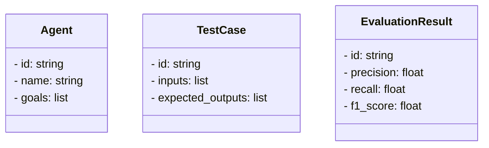
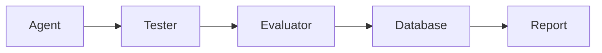
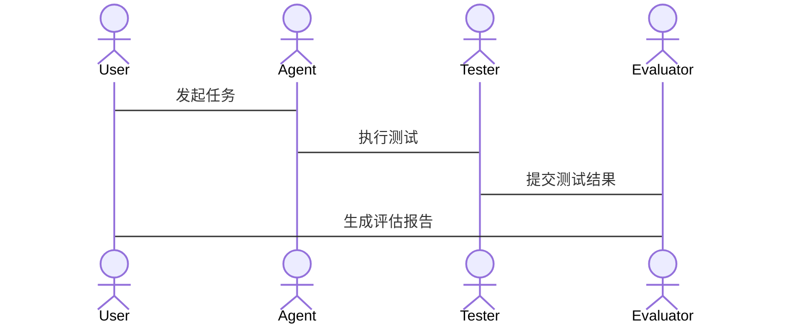

                 


# 构建AI Agent的测试与评估框架

> 关键词：AI Agent，测试框架，评估指标，算法原理，系统架构

> 摘要：本文详细探讨了构建AI Agent测试与评估框架的各个方面，包括核心概念、算法原理、系统架构设计和项目实战。通过理论分析和实践案例，为读者提供了一套完整的构建和优化AI Agent测试与评估框架的方法。

---

# 第一部分: AI Agent 测试与评估框架背景介绍

## 第1章: AI Agent 核心概念与问题背景

### 1.1 AI Agent 的基本概念

#### 1.1.1 什么是 AI Agent
AI Agent（人工智能代理）是一种能够感知环境、自主决策并执行任务的智能实体。它可以是一个软件程序、机器人或其他智能系统，旨在通过与环境交互来实现特定目标。

#### 1.1.2 AI Agent 的主要特点
- **自主性**：AI Agent能够自主决策，无需外部干预。
- **反应性**：能够实时感知环境并做出响应。
- **目标导向性**：所有行为都围绕实现特定目标展开。
- **学习能力**：通过数据和经验不断优化自身性能。

#### 1.1.3 AI Agent 的分类与应用场景
- **简单反射型代理**：基于预设规则执行任务，适用于规则明确的场景。
- **基于模型的反射型代理**：通过内部模型理解和决策，适用于复杂环境。
- **目标驱动型代理**：以目标为导向，动态调整行为。
- **效用驱动型代理**：通过最大化效用函数实现目标。

应用场景包括自动驾驶、智能助手、机器人控制、智能推荐系统等。

### 1.2 AI Agent 的问题背景

#### 1.2.1 当前 AI Agent 发展现状
AI Agent的应用越来越广泛，但其测试与评估框架尚未完全成熟。不同场景下，AI Agent的性能和行为差异显著，导致测试与评估的复杂性增加。

#### 1.2.2 AI Agent 在实际应用中的挑战
- **多样性**：不同AI Agent的设计和目标差异大，难以统一测试标准。
- **动态性**：环境和任务的变化要求测试与评估框架具备灵活性。
- **复杂性**：AI Agent的决策过程涉及多维度因素，测试与评估需覆盖多个维度。

#### 1.2.3 构建测试与评估框架的必要性
- **保证质量**：确保AI Agent在实际应用中的稳定性和可靠性。
- **优化性能**：通过评估结果反哺设计，提升AI Agent的性能。
- **统一标准**：为不同AI Agent提供一致的测试与评估基准。

### 1.3 本章小结
本章介绍了AI Agent的基本概念、特点和应用场景，并分析了当前AI Agent测试与评估面临的挑战和构建框架的必要性。

---

# 第二部分: AI Agent 测试与评估的核心概念

## 第2章: AI Agent 测试与评估的关键维度

### 2.1 AI Agent 的功能特性

#### 2.1.1 知识表示与推理能力
AI Agent需要能够理解、存储和推理知识，这是其决策的基础。

#### 2.1.2 行为决策的准确性
AI Agent的决策必须准确，以确保任务的完成。

#### 2.1.3 系统响应的实时性
AI Agent需要在合理的时间内完成决策和响应。

### 2.2 测试与评估的核心维度

#### 2.2.1 功能完整性测试
- **输入覆盖性**：测试所有可能的输入情况。
- **输出正确性**：确保输出符合预期。

#### 2.2.2 性能指标评估
- **响应时间**：系统对请求的响应速度。
- **吞吐量**：单位时间内处理的任务数量。
- **错误率**：系统在运行过程中出现的错误次数。

#### 2.2.3 鲁棒性与健壮性测试
- **异常处理能力**：系统在异常输入或环境下的表现。
- **容错能力**：系统在部分功能失效时的应对策略。

### 2.3 AI Agent 测试与评估的边界与外延

#### 2.3.1 测试范围的界定
- **功能边界**：明确测试的范围和限制。
- **性能边界**：设定性能测试的指标和阈值。

#### 2.3.2 评估框架的适用场景
- **通用场景**：适用于大多数AI Agent的测试与评估。
- **特定场景**：针对特定任务定制评估框架。

#### 2.3.3 与其他测试框架的对比
- **传统软件测试**：关注功能和性能。
- **AI测试**：关注数据驱动和模型性能。

### 2.4 核心概念的 ER 实体关系图

```mermaid
er
actor(Agent, "被测 AI Agent", "需要进行测试与评估")
actor(Tester, "测试者", "负责设计和执行测试用例")
actor(Evaluator, "评估者", "负责分析测试结果并生成评估报告")
```

### 2.5 本章小结
本章详细探讨了AI Agent的功能特性及其测试与评估的核心维度，并通过ER实体关系图展示了各角色之间的关系。

---

# 第三部分: AI Agent 测试与评估的算法原理

## 第3章: 基于性能指标的 AI Agent 评估算法

### 3.1 精准度与召回率的计算

#### 3.1.1 精准度公式
$$ \text{Precision} = \frac{\text{True Positives}}{\text{True Positives + False Positives} } $$

#### 3.1.2 召回率公式
$$ \text{Recall} = \frac{\text{True Positives}}{\text{True Positives + False Negatives} } $$

#### 3.1.3 F1分数
$$ F1 = 2 \times \frac{\text{Precision} \times \text{Recall}}{\text{Precision + Recall}} $$

#### 3.1.4 AUC曲线
AUC（Area Under Curve）曲线用于评估分类器的整体性能，其值越接近1，模型性能越好。

### 3.2 基于性能指标的测试流程



### 3.3 算法实现

```python
def calculate_precision(tp, fp):
    return tp / (tp + fp)

def calculate_recall(tp, fn):
    return tp / (tp + fn)

def calculate_f1(precision, recall):
    return 2 * (precision * recall) / (precision + recall)

# 示例
tp = 80
fp = 20
fn = 10

precision = calculate_precision(tp, fp)
recall = calculate_recall(tp, fn)
f1 = calculate_f1(precision, recall)

print(f"Precision: {precision}")
print(f"Recall: {recall}")
print(f"F1 Score: {f1}")
```

### 3.4 本章小结
本章通过公式和算法流程图详细讲解了AI Agent测试与评估中常用的性能指标及其计算方法。

---

# 第四部分: AI Agent 测试与评估的系统架构设计

## 第4章: 测试与评估框架的系统架构

### 4.1 问题场景介绍
AI Agent需要在多种环境下进行测试，包括不同的输入数据、环境条件和任务要求。

### 4.2 项目介绍
构建一个通用的AI Agent测试与评估框架，支持多种类型AI Agent的测试与评估。

### 4.3 系统功能设计

#### 4.3.1 领域模型



#### 4.3.2 系统架构设计



### 4.4 系统接口设计

#### 4.4.1 输入接口
- **测试用例输入**：接收测试用例数据。
- **性能指标输入**：接收性能指标数据。

#### 4.4.2 输出接口
- **评估报告输出**：生成评估报告。
- **反馈输出**：输出测试与评估的反馈信息。

### 4.5 系统交互设计



### 4.6 本章小结
本章通过系统架构设计图和交互流程图，详细描述了AI Agent测试与评估框架的系统结构和功能。

---

# 第五部分: AI Agent 测试与评估的项目实战

## 第5章: 项目实战

### 5.1 环境安装

```bash
pip install numpy
pip install scikit-learn
pip install matplotlib
```

### 5.2 核心代码实现

```python
from sklearn.metrics import precision_score, recall_score, f1_score
from sklearn.metrics import roc_auc_score

# 示例数据
y_true = [0, 1, 1, 0, 1]
y_pred = [0, 1, 0, 1, 1]

precision = precision_score(y_true, y_pred)
recall = recall_score(y_true, y_pred)
f1 = f1_score(y_true, y_pred)
auc = roc_auc_score(y_true, y_pred)

print(f"Precision: {precision}")
print(f"Recall: {recall}")
print(f"F1 Score: {f1}")
print(f"AUC: {auc}")
```

### 5.3 代码应用解读与分析
通过上述代码，我们可以计算AI Agent在分类任务中的精准度、召回率、F1分数和AUC值，从而全面评估其性能。

### 5.4 实际案例分析
以一个简单的分类任务为例，展示如何通过上述代码进行测试与评估。

### 5.5 本章小结
本章通过具体的环境安装和代码实现，展示了如何在实际项目中应用AI Agent测试与评估框架。

---

# 第六部分: 总结与展望

## 第6章: 总结与展望

### 6.1 最佳实践 tips
- **选择合适的评估指标**：根据任务需求选择合适的性能指标。
- **动态调整测试用例**：根据AI Agent的特性动态调整测试用例。
- **结合人工审核**：在自动化测试的基础上结合人工审核，确保测试结果的准确性。

### 6.2 小结
本文详细探讨了构建AI Agent测试与评估框架的各个方面，包括核心概念、算法原理、系统架构设计和项目实战。

### 6.3 注意事项
- **数据质量问题**：确保测试数据的多样性和代表性。
- **性能瓶颈**：注意系统架构设计中的性能优化。
- **安全性问题**：确保测试与评估过程中的数据安全。

### 6.4 拓展阅读
- 推荐阅读《机器学习实战》、《深入理解机器学习》等书籍，以进一步了解AI Agent的测试与评估方法。

---

# 作者：AI天才研究院/AI Genius Institute & 禅与计算机程序设计艺术 /Zen And The Art of Computer Programming

