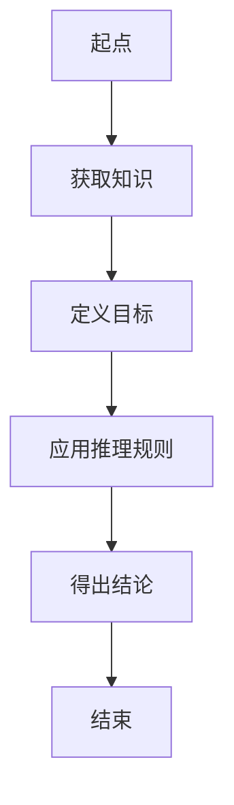

                 


# 构建AI Agent的认知架构设计

> 关键词：AI Agent，认知架构，符号系统，推理机制，系统架构设计，项目实战

> 摘要：构建AI Agent的认知架构设计是一门复杂而深刻的技术，涉及符号系统、推理机制、系统架构设计等多个方面。本文将从AI Agent的基本概念出发，逐步深入探讨认知架构的核心概念、符号系统、推理机制、系统架构设计以及项目实战，帮助读者全面理解并掌握构建AI Agent的认知架构设计。

---

# 第一部分: AI Agent与认知架构概述

## 第1章: AI Agent的基本概念

### 1.1 AI Agent的定义
AI Agent（人工智能代理）是指能够感知环境并采取行动以实现目标的智能实体。它具备自主性、反应性、主动性、社交性和学习性等特征。

### 1.2 认知架构的重要性
认知架构是AI Agent的核心，它决定了AI Agent如何处理信息、做出决策和与环境交互。认知架构的设计直接影响AI Agent的智能水平和应用效果。

### 1.3 AI Agent的分类与应用场景
AI Agent可以根据智能水平分为简单反应式、基于模型的反应式、基于目标的、基于效用的和基于学习的代理。应用场景包括自动驾驶、智能助手、机器人控制、游戏AI和推荐系统等。

---

## 第2章: 认知架构的核心概念

### 2.1 认知架构的原理
认知架构通过符号系统和推理机制实现知识表示和问题求解。符号系统用于表示知识，推理机制用于根据知识做出决策。

### 2.2 核心概念对比表
| 核心要素 | 定义 | 特征 | 示例 |
|----------|------|------|------|
| 符号     | 表示知识的基本单位 | 离散性、可组合性 | "狗"、"跑" |
| 推理     | 根据知识得出结论的过程 | 逻辑性、不确定性 | 逻辑推理、概率推理 |
| 知识库   | 存储知识的结构化数据 | 组织性、可扩展性 | 关系数据库、知识图谱 |

### 2.3 ER实体关系图
使用Mermaid图展示认知架构中的实体关系：
```mermaid
erDiagram
    actor 用户 {
        key string 用户ID
        string 用户名
        string 密码
    }
    actor 环境 {
        key string 环境ID
        string 环境类型
        string 状态
    }
    actor 行为 {
        key string 行为ID
        string 行为类型
        string 行为描述
    }
    用户 --> 环境 : 与环境交互
    用户 --> 行为 : 执行行为
    环境 --> 行为 : 导致行为发生
```

---

## 第3章: 符号系统与知识表示

### 3.1 符号系统的定义与特点
符号系统是一种通过符号表示和操作知识的系统。它具有明确性、形式化和可解释性等特点。

### 3.2 知识表示的数学模型
知识表示可以通过符号逻辑和数学公式实现。例如，命题逻辑公式：
$$P \rightarrow Q$$
表示如果P为真，则Q也为真。

### 3.3 符号系统在认知架构中的应用
符号系统广泛应用于知识库构建、逻辑推理和自然语言处理等领域。例如，基于符号逻辑的问答系统可以通过符号表示和推理回答用户问题。

---

## 第4章: 推理机制与算法原理

### 4.1 推理机制的定义与分类
推理机制是根据已有知识得出新结论的过程。常见的推理类型包括逻辑推理、概率推理和启发式推理。

### 4.2 推理算法的流程图
使用Mermaid图展示逻辑推理算法的流程：


### 4.3 推理算法的数学模型
逻辑推理可以通过布尔逻辑公式表示，例如：
$$A \land B \rightarrow C$$
表示如果A和B都为真，则C也为真。

---

## 第5章: 系统架构设计

### 5.1 系统架构设计的概述
系统架构设计是构建AI Agent认知架构的核心步骤。它包括功能设计、模块划分和接口设计。

### 5.2 系统功能设计
系统功能设计需要明确每个功能模块的作用和交互方式。例如，知识表示模块负责存储和管理知识，推理模块负责根据知识进行推理。

### 5.3 系统架构的Mermaid图
使用Mermaid图展示系统架构：


### 5.4 系统接口设计
系统接口设计需要明确模块之间的通信协议和数据格式。例如，知识表示模块和推理模块之间可以通过JSON格式传递数据。

---

## 第6章: 项目实战与案例分析

### 6.1 项目环境的搭建
项目环境需要安装Python、Java等编程语言以及相关开发工具。例如，使用Python和TensorFlow框架可以快速搭建一个简单的AI Agent系统。

### 6.2 系统核心实现源代码
以下是符号系统和推理机制的实现代码示例：
```python
# 符号系统实现
class Symbol:
    def __init__(self, name):
        self.name = name

# 推理算法实现
def logical_inference(rules, facts):
    for rule in rules:
        if all(fact in facts for fact in rule['premises']):
            return rule['conclusion']
    return None
```

### 6.3 项目实战案例分析
通过一个简单的问答系统案例，展示符号系统和推理机制的应用。例如，用户提问“什么是狗？”系统通过符号表示和推理得出答案。

### 6.4 项目小结
项目实战帮助我们理解理论知识的实际应用。通过项目，我们可以更好地掌握符号系统、推理机制和系统架构设计的实现方法。

---

## 第7章: 最佳实践与未来展望

### 7.1 最佳实践 tips
- 在符号系统设计中，尽量使用标准的符号表示方法。
- 在推理算法中，根据实际需求选择合适的推理方法。
- 在系统架构设计中，注重模块的独立性和可扩展性。

### 7.2 未来展望
随着人工智能技术的发展，认知架构设计将更加复杂和多样化。未来的研究方向包括多模态推理、动态知识更新和人机协作等。

---

作者：AI天才研究院/AI Genius Institute & 禅与计算机程序设计艺术 /Zen And The Art of Computer Programming

