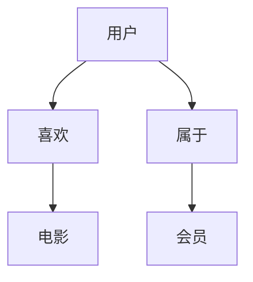
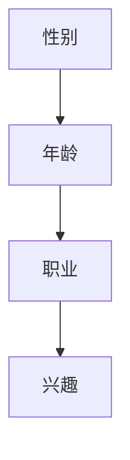
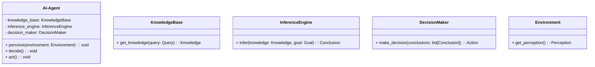
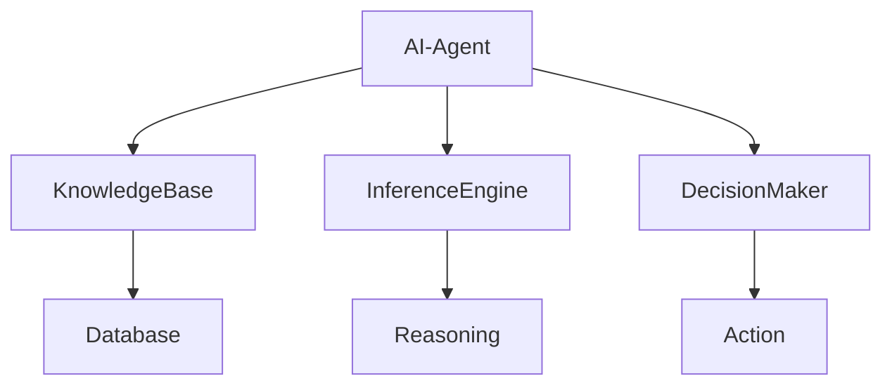
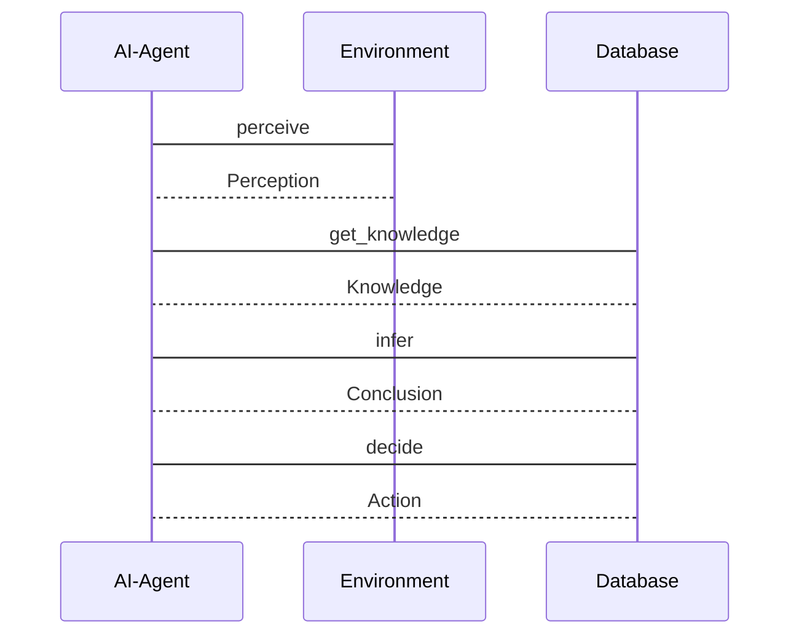

                 


# 构建AI Agent的认知计算图模型

## 关键词：AI Agent、认知计算图模型、图神经网络、知识表示、逻辑推理

## 摘要：  
本文将详细介绍构建AI Agent的认知计算图模型的方法与原理。从AI Agent的基本概念到认知计算图模型的核心原理，再到具体的算法实现与系统架构设计，本文将全面解析认知计算图模型在AI Agent构建中的应用。通过理论与实践相结合的方式，深入探讨如何利用图结构的知识表示与逻辑推理来提升AI Agent的认知能力。

---

## 第一部分: 构建AI Agent的认知计算图模型背景介绍

### 第1章: AI Agent与认知计算图模型概述

#### 1.1 AI Agent的基本概念  
AI Agent（人工智能代理）是指能够感知环境、自主决策并采取行动以实现目标的智能体。AI Agent的核心特征包括自主性、反应性、目标导向性和社会性。认知计算图模型是一种基于图结构的知识表示与推理方法，能够帮助AI Agent更好地理解和处理复杂任务。

#### 1.2 认知计算图模型的背景与意义  
传统的AI Agent在处理复杂任务时，往往面临知识表示不够灵活、推理能力有限等问题。认知计算图模型通过将知识表示为图结构，结合逻辑推理和概率推理，能够有效提升AI Agent的认知能力。认知计算图模型的优势包括可解释性强、可扩展性高以及支持复杂关系推理。

#### 1.3 本书的目标与结构  
本书旨在通过理论与实践结合的方式，系统介绍认知计算图模型的构建方法及其在AI Agent中的应用。本书内容将涵盖认知计算图模型的核心原理、算法实现、系统架构设计以及项目实战等内容，帮助读者从零开始掌握认知计算图模型的构建与应用。

---

## 第二部分: 认知计算图模型的核心概念与联系

### 第2章: 认知计算图模型的核心原理

#### 2.1 认知计算图模型的基本原理  
认知计算图模型是一种基于图结构的知识表示方法，通过节点和边的组合，可以灵活地表示实体、属性和关系。模型支持多种推理方式，包括逻辑推理和概率推理，能够帮助AI Agent进行复杂任务的决策。

#### 2.2 实体关系分析与建模  
实体是认知计算图模型的基本构建单元，关系是实体之间的连接。通过实体关系分析，可以构建完整的知识图谱。以下是实体与关系的对比分析：

| 实体 | 属性 | 关系 |
|------|------|------|
| 用户 | 年龄、性别 | 喜欢、属于 |

下图是一个简单的ER实体关系图：



#### 2.3 概念属性对比分析  
概念图谱是认知计算图模型的重要组成部分，通过对比分析实体与属性、关系与属性的差异，可以更好地构建知识图谱。

| 实体 | 属性 | 关系 |
|------|------|------|
| 用户 | 年龄、性别 | 喜欢、属于 |

下图是一个概念图谱的构建与优化示例：


### 第3章: 认知计算图模型的数学基础

#### 3.1 图论基础  
图论是认知计算图模型的数学基础，主要包括图的基本概念、图的表示方法以及图的运算与性质。以下是图的基本概念：

- 节点：图中的基本单元，表示实体或属性。
- 边：连接节点的边，表示实体之间的关系。
- 图的表示：图可以表示为邻接矩阵或邻接列表。

#### 3.2 知识表示与逻辑推理  
知识表示是认知计算图模型的核心任务，逻辑推理是知识表示的重要工具。以下是知识表示的基本形式：

- 逻辑命题：$p \land q$ 表示“p且q”。
- 逻辑推理：通过推理规则从前提得出结论。

#### 3.3 概率图模型基础  
概率图模型是认知计算图模型的重要组成部分，主要包括贝叶斯网络和马尔可夫随机场。以下是贝叶斯网络的基本结构：



---

## 第三部分: 认知计算图模型的算法原理

### 第4章: 基于图神经网络的算法实现

#### 4.1 图神经网络的基本原理  
图神经网络是一种基于图结构的深度学习方法，能够有效地处理图数据。以下是图神经网络的基本操作：

- 节点嵌入：将节点映射到低维空间。
- 边嵌入：将边映射到低维空间。
- 图嵌入：将整个图映射到低维空间。

#### 4.2 基于图神经网络的算法实现  
以下是基于图神经网络的算法实现：

```python
import torch
from torch import nn

class GNN(nn.Module):
    def __init__(self, input_dim, hidden_dim, output_dim):
        super(GNN, self).__init__()
        self.linear1 = nn.Linear(input_dim, hidden_dim)
        self.linear2 = nn.Linear(hidden_dim, output_dim)
        self.relu = nn.ReLU()

    def forward(self, x):
        x = self.linear1(x)
        x = self.relu(x)
        x = self.linear2(x)
        return x

# 示例输入
input_dim = 2
hidden_dim = 4
output_dim = 1
model = GNN(input_dim, hidden_dim, output_dim)
x = torch.randn(2, input_dim)
output = model(x)
print(output)
```

---

## 第四部分: 系统分析与架构设计方案

### 第5章: 项目介绍与系统功能设计

#### 5.1 项目背景  
本项目旨在构建一个基于认知计算图模型的AI Agent，能够实现知识表示、逻辑推理和自主决策。

#### 5.2 系统功能设计  
以下是系统功能设计的类图：



#### 5.3 系统架构设计  
以下是系统架构设计的架构图：



#### 5.4 系统交互设计  
以下是系统交互设计的序列图：



---

## 第五部分: 项目实战

### 第6章: 项目实战

#### 6.1 环境安装  
以下是项目环境安装步骤：

```bash
pip install torch
pip install networkx
pip install matplotlib
```

#### 6.2 核心代码实现  
以下是核心代码实现：

```python
import networkx as nx
import matplotlib.pyplot as plt

# 创建图
G = nx.DiGraph()
G.add_node('A', label='用户')
G.add_node('B', label='喜欢')
G.add_node('C', label='电影')
G.add_edge('A', 'B', label='喜欢')
G.add_edge('B', 'C', label='电影')

# 绘制图
nx.draw(G, node_size=1500, alpha=0.8)
plt.show()
```

#### 6.3 案例分析  
以下是案例分析：

假设我们有一个简单的认知计算图模型，表示“用户喜欢电影”。通过图神经网络，我们可以推理出“用户喜欢的动作片”。

---

## 第六部分: 总结与展望

### 第7章: 总结与展望

#### 7.1 最佳实践  
在构建认知计算图模型时，建议从简单问题入手，逐步扩展模型的复杂性。同时，注意数据的质量和模型的可解释性。

#### 7.2 小结  
本文系统介绍了构建AI Agent的认知计算图模型的方法与原理，从理论到实践，全面解析了认知计算图模型的构建与应用。

#### 7.3 注意事项  
在实际应用中，需要注意数据的质量和模型的可扩展性。

#### 7.4 拓展阅读  
建议读者进一步学习图神经网络和知识图谱的相关知识。

---

## 作者：AI天才研究院 & 禅与计算机程序设计艺术

---

以上是《构建AI Agent的认知计算图模型》的技术博客文章的详细内容，涵盖了从理论到实践的各个方面，希望对您有所帮助！

