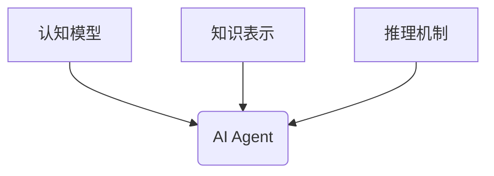
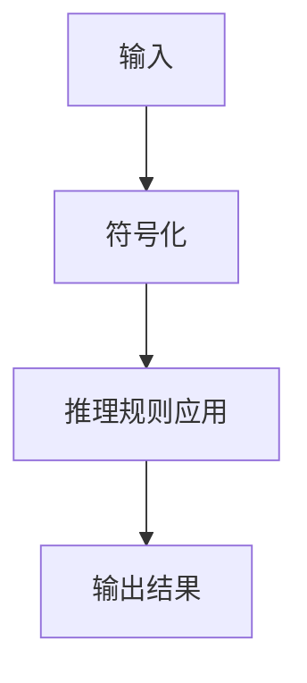
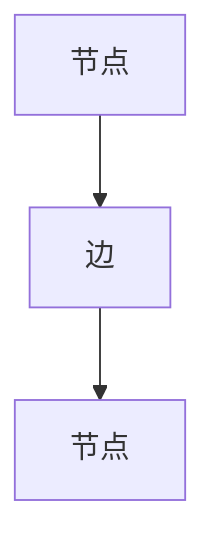
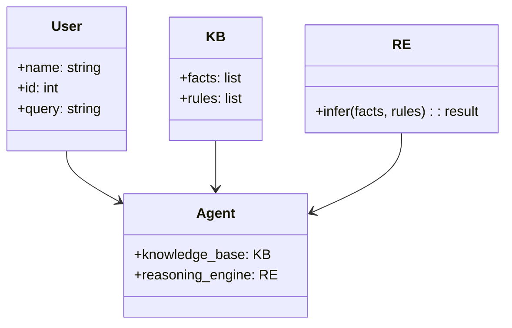
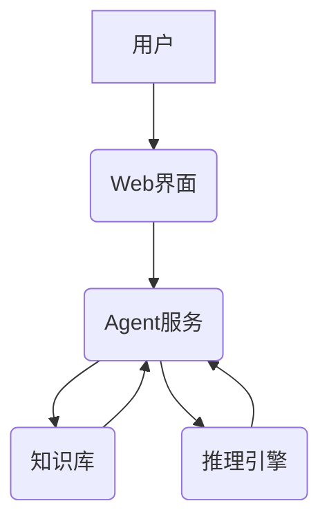
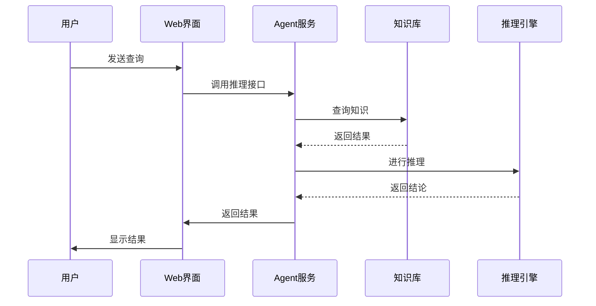

                 


# 构建AI Agent的认知计算模型

> 关键词：认知计算模型，AI Agent，知识表示，推理机制，系统架构

> 摘要：本文详细探讨了构建AI Agent的认知计算模型，从基础概念到高级算法，结合实际案例分析，深入解析了认知模型的原理、算法实现、系统设计和应用实践，为读者提供全面的技术指导。

---

## 第一部分: 构建AI Agent的认知计算模型基础

### 第1章: 认知计算模型概述

#### 1.1 认知计算模型的定义与背景
认知计算模型是一种模拟人类认知过程的数学模型，用于描述和实现AI Agent的智能行为。AI Agent通过感知环境、处理信息、做出决策并执行动作，实现与环境的交互。认知计算模型是AI Agent的核心，涵盖了知识表示、推理机制和学习能力等多个方面。

#### 1.2 认知计算模型的核心要素
- **知识表示**：通过符号、语义网络等方式表示AI Agent的知识。
- **推理机制**：基于知识库进行逻辑推理或概率推理。
- **学习与自适应能力**：通过机器学习算法不断优化模型。

#### 1.3 认知计算模型的应用场景
- **智能对话系统**：如智能音箱、聊天机器人。
- **自动决策系统**：如自动驾驶、智能推荐系统。
- **多智能体协作**：如分布式AI系统中的协作任务。

### 第2章: AI Agent的核心概念与联系

#### 2.1 认知模型的原理
- **符号逻辑推理**：基于规则的推理方法，适用于确定性问题。
- **基于概率的推理**：利用概率论处理不确定性问题。
- **知识图谱的构建与应用**：通过知识图谱表示实体间的关系。

#### 2.2 认知模型与AI Agent的关系
- **实体关系图（ER图）**：展示认知模型中的实体及其关系。


- **数学模型**：认知模型的数学表达式，如向量空间模型：
$$v_i = \sum_{j=1}^{n} w_{ij} \cdot v_j$$

#### 2.3 认知模型的数学模型
- **知识表示的向量空间模型**：
$$v_i = \sum_{j=1}^{n} w_{ij} \cdot v_j$$
- **推理的逻辑框架**：
$$\text{如果 } P \text{ 和 } Q \text{ 成立，则 } R \text{ 成立}$$

### 第3章: 认知计算模型的算法原理

#### 3.1 基于符号逻辑的推理算法
- **逻辑推理的步骤**：


- **符号逻辑推理的实现**：
```python
def inference(rule_set, facts):
    # 简单的符号逻辑推理实现
    pass
```

#### 3.2 基于机器学习的推理算法
- **神经网络推理模型**：
$$y = f(x; \theta)$$
- **图神经网络的应用**：


#### 3.3 算法实现与优化
- **算法的Python实现**：
```python
def neural_inference(model, input_data):
    # 简单的神经网络推理实现
    pass
```

### 第4章: 系统分析与架构设计方案

#### 4.1 问题场景介绍
构建一个智能客服AI Agent，用于处理用户咨询和解决问题。

#### 4.2 系统功能设计
- **领域模型**：


- **系统架构设计**：


#### 4.3 系统接口设计
- **用户接口**：API接口，供前端调用。
- **系统交互流程**：


### 第5章: 项目实战

#### 5.1 环境安装
安装Python、TensorFlow、Keras等工具。

#### 5.2 核心代码实现
```python
class KnowledgeBase:
    def __init__(self, facts, rules):
        self.facts = facts
        self.rules = rules

class ReasoningEngine:
    def infer(self, facts, rules):
        # 简单的推理实现
        pass

class AI_Agent:
    def __init__(self, knowledge_base, reasoning_engine):
        self.kb = knowledge_base
        self.re = reasoning_engine

    def process_query(self, query):
        # 实现查询处理逻辑
        pass
```

#### 5.3 案例分析
构建一个简单的智能客服系统，处理常见问题。

#### 5.4 项目小结
通过项目实战，验证了认知计算模型的有效性和实用性。

### 第6章: 总结与展望

#### 6.1 总结
本文详细探讨了构建AI Agent的认知计算模型，涵盖了从理论到实践的各个方面。

#### 6.2 展望
未来，认知计算模型将更加复杂和智能，AI Agent将在更多领域得到广泛应用。

---

作者：AI天才研究院 & 禅与计算机程序设计艺术

