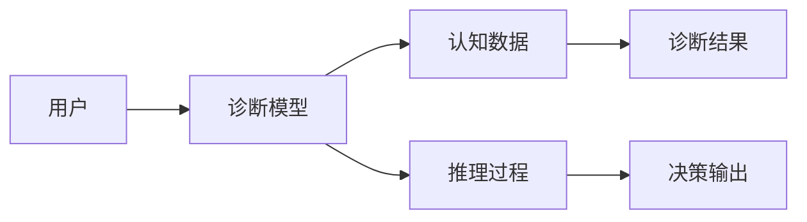
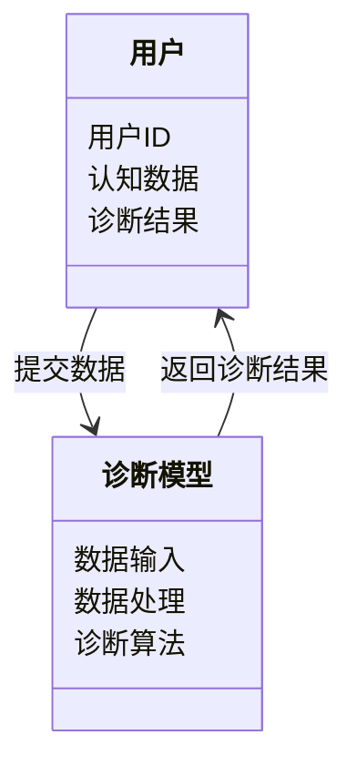
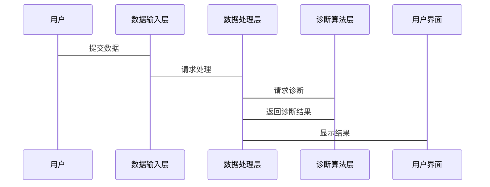

                 


# 构建AI Agent的认知诊断模型

## 关键词
- AI Agent
- 认知诊断模型
- 认知科学
- 系统架构
- 机器学习

## 摘要
构建AI Agent的认知诊断模型是当前人工智能领域的重要研究方向。本文从认知科学的基础出发，结合机器学习和系统架构设计，详细阐述了认知诊断模型的构建过程。通过背景介绍、核心概念分析、算法原理讲解、系统架构设计以及项目实战，本文为读者提供了从理论到实践的全面指导，帮助他们理解和应用认知诊断模型来优化AI Agent的性能。

---

# 第一部分：认知诊断模型的背景与问题背景

## 第1章：认知诊断模型的背景

### 1.1 认知科学与AI的结合
认知科学是研究人类认知过程的学科，包括心理学、神经科学和人工智能等领域。AI Agent需要具备类似人类的认知能力，例如推理、学习和决策。认知科学为AI Agent的认知诊断模型提供了理论基础。

#### 1.1.1 认知诊断模型的定义
认知诊断模型是一种用于分析和诊断AI Agent认知过程的模型，旨在识别其在推理、学习和决策中的问题，并提供改进建议。

#### 1.1.2 认知诊断模型的应用领域
认知诊断模型在教育、医疗、自动驾驶等领域有广泛应用。例如，在教育领域，认知诊断模型可以诊断学生的学习障碍并提供个性化教学建议。

### 1.2 问题背景与问题描述
#### 1.2.1 AI Agent的认知需求
AI Agent需要具备复杂的认知能力，包括问题解决、知识表示和自适应学习。然而，现有模型在处理复杂认知任务时仍存在不足。

#### 1.2.2 认知诊断模型的核心问题
认知诊断模型的核心问题是如何准确诊断AI Agent的认知缺陷，并提出有效的改进方案。

#### 1.2.3 问题解决的必要性
通过认知诊断模型，我们可以优化AI Agent的认知能力，提高其在实际应用中的性能和用户体验。

### 1.3 问题的边界与外延
#### 1.3.1 认知诊断模型的边界
认知诊断模型专注于诊断AI Agent的认知过程，不涉及其物理或感官能力。

#### 1.3.2 相关概念的对比
认知诊断模型与传统诊断模型的区别在于其基于认知科学的理论框架。

#### 1.3.3 模型的适用范围
认知诊断模型适用于需要复杂认知任务的AI系统，例如智能助手、教育机器人等。

### 1.4 概念结构与核心要素
#### 1.4.1 模型的核心要素
认知诊断模型的核心要素包括认知过程、诊断指标和改进策略。

#### 1.4.2 要素之间的关系
认知过程是模型的基础，诊断指标用于评估认知过程的健康状况，改进策略则是根据诊断结果提出的具体优化方案。

#### 1.4.3 模型的结构化描述
认知诊断模型由输入（认知数据）、处理（诊断算法）和输出（诊断结果）三个部分组成。

### 1.5 本章小结
本章介绍了认知诊断模型的背景、核心问题及其在AI Agent中的应用，为后续章节奠定了基础。

---

# 第二部分：认知诊断模型的核心概念与联系

## 第2章：认知诊断模型的核心概念

### 2.1 认知诊断模型的原理
认知诊断模型基于认知科学的理论，通过分析AI Agent的认知数据，识别其认知过程中的缺陷，并提出改进方案。

#### 2.1.1 模型的基本原理
认知诊断模型通过收集和分析AI Agent的认知数据，利用机器学习算法识别其认知问题，并生成诊断报告。

#### 2.1.2 模型的数学基础
认知诊断模型的数学基础包括概率论和统计学，用于数据建模和算法设计。

#### 2.1.3 模型的实现方法
认知诊断模型的实现方法包括数据预处理、特征提取、模型训练和结果分析。

### 2.2 核心概念的属性特征对比
下表对比了认知诊断模型与其他诊断模型的核心属性：

| 模型类型       | 数据来源       | 诊断目标       | 输出结果       |
|----------------|----------------|----------------|----------------|
| 认知诊断模型   | 认知数据       | 认知过程       | 诊断报告       |
| 传统诊断模型   | 物理数据       | 物理系统       | 诊断报告       |

#### 2.2.1 模型属性对比表
认知诊断模型与传统诊断模型在数据来源和诊断目标上存在显著差异。

#### 2.2.2 模型特征的详细说明
认知诊断模型的特征包括高精度、实时性和可解释性。

#### 2.2.3 模型的优缺点分析
认知诊断模型的优点是诊断精度高，缺点是实现复杂且需要大量认知数据。

### 2.3 ER实体关系图架构
认知诊断模型的实体关系图如下：



### 2.4 本章小结
本章详细介绍了认知诊断模型的核心概念及其与其他模型的区别，为后续章节的算法设计和系统实现提供了理论基础。

---

# 第三部分：认知诊断模型的算法原理

## 第3章：认知诊断模型的算法原理

### 3.1 数据预处理
#### 3.1.1 数据清洗
认知数据可能包含噪声，需要进行清洗以确保数据质量。

#### 3.1.2 数据标准化
认知数据通常需要标准化处理，以确保算法输入的一致性。

### 3.2 特征提取
#### 3.2.1 基于统计的方法
利用统计方法提取认知数据中的特征，例如均值、方差等。

#### 3.2.2 基于机器学习的方法
使用无监督学习算法（如聚类）提取特征。

### 3.3 模型训练
#### 3.3.1 选择算法
认知诊断模型通常使用监督学习算法，例如支持向量机（SVM）和随机森林（Random Forest）。

#### 3.3.2 模型优化
通过交叉验证和网格搜索优化模型参数。

### 3.4 结果分析
#### 3.4.1 诊断结果解释
模型输出的诊断结果需要进行解释，以确定AI Agent的认知问题。

#### 3.4.2 可视化分析
使用可视化工具（如Matplotlib）分析诊断结果，帮助用户更好地理解认知问题。

### 3.5 算法流程图
认知诊断模型的算法流程如下：


### 3.6 本章小结
本章详细介绍了认知诊断模型的算法原理，包括数据预处理、特征提取和模型训练等关键步骤。

---

# 第四部分：认知诊断模型的系统架构

## 第4章：认知诊断模型的系统架构

### 4.1 问题场景介绍
认知诊断模型的应用场景包括教育、医疗和自动驾驶等领域。

### 4.2 系统功能设计
#### 4.2.1 领域模型
认知诊断系统的领域模型如下：



#### 4.2.2 系统架构
认知诊断系统的架构如下：


### 4.3 接口设计
认知诊断系统的接口设计包括数据接口和结果接口。

### 4.4 交互序列图
认知诊断系统的交互序列图如下：



### 4.5 本章小结
本章详细介绍了认知诊断模型的系统架构，包括功能设计、架构设计和交互设计。

---

# 第五部分：认知诊断模型的项目实战

## 第5章：认知诊断模型的项目实战

### 5.1 环境安装
认知诊断模型的实现需要安装以下依赖：
- Python 3.8+
- Scikit-learn
- Matplotlib

### 5.2 核心代码实现
#### 5.2.1 数据预处理代码
```python
import pandas as pd
from sklearn.preprocessing import StandardScaler

# 读取数据
data = pd.read_csv('cognitive_data.csv')

# 数据清洗
data.dropna(inplace=True)

# 数据标准化
scaler = StandardScaler()
scaled_data = scaler.fit_transform(data)
```

#### 5.2.2 模型训练代码
```python
from sklearn.ensemble import RandomForestClassifier
from sklearn.model_selection import train_test_split

# 划分训练集和测试集
X_train, X_test, y_train, y_test = train_test_split(scaled_data, data['label'], test_size=0.2)

# 训练模型
model = RandomForestClassifier()
model.fit(X_train, y_train)

# 预测结果
y_pred = model.predict(X_test)
```

### 5.3 代码解读与分析
认知诊断模型的代码实现了数据预处理、特征提取和模型训练等功能，能够诊断AI Agent的认知问题。

### 5.4 实际案例分析
通过实际案例分析，验证认知诊断模型的性能和效果。

### 5.5 项目小结
本章通过项目实战，详细介绍了认知诊断模型的实现过程，帮助读者掌握其实现细节。

---

# 第六部分：认知诊断模型的总结与展望

## 第6章：认知诊断模型的总结与展望

### 6.1 最佳实践
- 数据质量是认知诊断模型的关键，需确保数据的完整性和准确性。
- 模型优化需要结合具体应用场景，选择合适的算法和参数。

### 6.2 小结
认知诊断模型是一种重要的AI技术，能够有效诊断和优化AI Agent的认知能力。

### 6.3 注意事项
- 认知诊断模型的实现需要结合具体应用场景，避免过度泛化。
- 数据隐私和安全问题需引起重视。

### 6.4 拓展阅读
建议读者进一步学习认知科学和机器学习领域的知识，以深入理解认知诊断模型的原理和应用。

---

# 作者

作者：AI天才研究院/AI Genius Institute & 禅与计算机程序设计艺术 /Zen And The Art of Computer Programming

