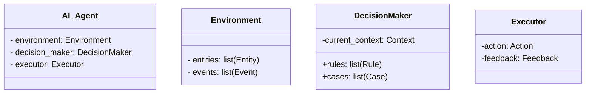

                 


# 构建AI Agent的道德推理框架

> **关键词**：AI Agent, 道德推理, 人工智能伦理, 系统架构, 算法实现  
> **摘要**：本文旨在探讨如何构建AI Agent的道德推理框架，从基本概念到算法实现，系统性地分析道德推理在AI Agent中的重要性及其应用。通过详细讲解道德推理的核心原理、算法实现、数学模型和系统架构，本文为构建具备伦理决策能力的AI Agent提供了理论基础和实践指导。

---

## 第1章: AI Agent的背景与概念

### 1.1 AI Agent的基本概念

#### 1.1.1 AI Agent的定义与特点
AI Agent（人工智能代理）是指能够感知环境、自主决策并执行任务的智能实体。其特点包括：
- **自主性**：无需外部干预，自主决策。
- **反应性**：能够实时感知环境并做出反应。
- **目标导向**：基于目标进行决策和行动。
- **社会性**：能够与其他实体（包括人类和AI Agent）进行交互。

#### 1.1.2 AI Agent的分类与应用场景
AI Agent可以根据智能水平和应用领域进行分类：
- **反应式AI Agent**：基于当前感知做出反应，适用于实时任务（如自动驾驶）。
- **认知式AI Agent**：具备高级推理和规划能力，适用于复杂任务（如智能助手）。
- **社会式AI Agent**：能够与其他实体进行复杂交互，适用于社交机器人等领域。

#### 1.1.3 道德推理在AI Agent中的重要性
随着AI Agent在社会中的广泛应用，其决策可能对人类和环境产生重大影响。道德推理确保AI Agent在决策过程中遵循伦理规范，避免负面后果。

### 1.2 道德推理的基本原理

#### 1.2.1 道德推理的定义与核心要素
道德推理是指通过逻辑推理和伦理规范，判断行为的对错并做出决策的过程。其核心要素包括：
- **道德原则**：如诚实、公正、不伤害他人。
- **情境分析**：考虑具体情境中的利益相关者和可能的后果。
- **推理逻辑**：基于道德原则和情境分析，推导出合理的决策。

#### 1.2.2 道德推理与AI Agent的结合
AI Agent通过整合道德推理框架，能够在复杂环境中做出符合伦理的决策。例如，在自动驾驶中，AI Agent需要在紧急情况下权衡不同后果，选择最小化伤害的行动。

#### 1.2.3 道德推理的挑战与复杂性
道德推理的复杂性主要体现在：
- **情境多样性**：不同情境下，道德决策可能截然不同。
- **伦理模糊性**：某些情况下，道德判断存在争议。
- **动态变化**：环境和利益相关者的变化会影响道德决策。

---

## 第2章: 道德推理的核心概念与框架

### 2.1 道德推理的核心要素

#### 2.1.1 道德原则与规范
道德原则是道德推理的基础，常见的包括：
- **功利主义**：追求最大幸福。
- **义务论**：基于义务和责任做出决策。
- **美德伦理**：基于个体的美德和品格。

#### 2.1.2 道德情境与后果
道德情境是指具体的情境因素，包括：
- **利益相关者**：受影响的个人或群体。
- **可能后果**：行为可能导致的结果。
- **情境背景**：时间、地点、文化等因素。

#### 2.1.3 道德推理的逻辑结构
道德推理的逻辑结构通常包括：
1. **识别问题**：明确需要解决的道德问题。
2. **分析情境**：收集相关信息和可能的后果。
3. **应用原则**：根据道德原则进行推理。
4. **得出结论**：做出符合伦理的决策。

### 2.2 道德推理框架的构建

#### 2.2.1 道德推理框架的组成
一个完整的道德推理框架应包括：
- **输入层**：感知环境信息。
- **推理层**：基于道德原则和情境进行推理。
- **决策层**：生成符合伦理的决策。
- **输出层**：执行决策并反馈结果。

#### 2.2.2 道德推理框架的设计原则
- **可解释性**：决策过程应可追溯和解释。
- **灵活性**：能够适应不同情境和变化。
- **鲁棒性**：在复杂和不确定环境中仍能稳定运行。

#### 2.2.3 道德推理框架的实现步骤
1. **定义道德原则**：明确AI Agent需要遵循的伦理规范。
2. **情境分析**：识别相关利益和可能后果。
3. **推理与决策**：基于道德原则和情境分析，生成决策。
4. **反馈与优化**：根据实际结果调整框架。

### 2.3 道德推理与AI Agent的结合

#### 2.3.1 AI Agent中的道德决策模型
AI Agent的道德决策模型通常包括：
- **感知模块**：收集环境信息。
- **推理模块**：基于道德原则进行推理。
- **决策模块**：生成符合伦理的决策。

#### 2.3.2 道德推理在AI Agent行为中的应用
例如，在医疗AI Agent中，道德推理框架确保其在诊断和治疗建议中遵循患者的最佳利益。

#### 2.3.3 道德推理的动态调整与优化
AI Agent应能够根据反馈不断优化道德推理框架，以适应新的情境和伦理标准。

---

## 第3章: 道德推理算法的原理与实现

### 3.1 道德推理算法的基本原理

#### 3.1.1 基于规则的道德推理算法
基于规则的算法通过预定义的伦理规则进行推理。例如，规则可以是“优先保护人类生命”。

#### 3.1.2 基于案例的道德推理算法
基于案例的算法通过学习以往案例的相似性进行推理，适用于复杂和模糊的伦理问题。

#### 3.1.3 基于学习的道德推理算法
基于学习的算法利用机器学习技术，从大量数据中学习道德原则和情境分析方法。

### 3.2 道德推理算法的实现步骤

#### 3.2.1 数据预处理与特征提取
- 数据预处理：清理和标准化数据。
- 特征提取：提取与道德推理相关的特征。

#### 3.2.2 模型训练与优化
- 模型训练：使用训练数据训练道德推理模型。
- 模型优化：通过调整参数和结构提高模型性能。

#### 3.2.3 模型评估与验证
- 评估指标：如准确率、召回率、F1分数。
- 交叉验证：确保模型的泛化能力。

### 3.3 道德推理算法的数学模型

#### 3.3.1 基于规则的数学表达式
规则可以表示为：
$$ \text{如果 } P \text{ 满足条件 } Q \text{，则 } R \text{ 是正确的决策} $$

#### 3.3.2 基于学习的数学模型
例如，使用逻辑回归模型：
$$ P(y=1|x) = \sigma(w \cdot x + b) $$
其中，$\sigma$ 是sigmoid函数，$w$ 是权重，$b$ 是偏置。

---

## 第4章: 道德推理的数学模型与公式

### 4.1 道德推理的基本数学模型

#### 4.1.1 道德评分模型
道德评分模型可以表示为：
$$ \text{道德评分} = \sum_{i=1}^{n} w_i x_i $$
其中，$w_i$ 是权重，$x_i$ 是特征值。

#### 4.1.2 道德决策树模型
决策树模型通过条件分支进行决策，例如：
- 如果 $x_1 > 0.5$，则选择决策A；否则选择决策B。

#### 4.1.3 道德概率模型
概率模型可以表示为：
$$ P(\text{决策}|x) = \prod_{i=1}^{n} P(x_i|\text{决策}) $$

### 4.2 道德推理的数学公式

#### 4.2.1 道德评分公式
$$ \text{道德评分} = \sum_{i=1}^{n} w_i x_i $$

#### 4.2.2 道德决策树公式
$$ \text{决策} = \arg\max_{k} \sum_{i=1}^{n} w_i x_i $$

#### 4.2.3 道德概率公式
$$ P(\text{决策}|x) = \prod_{i=1}^{n} P(x_i|\text{决策}) $$

---

## 第5章: 系统分析与架构设计

### 5.1 问题场景介绍

#### 5.1.1 系统目标
构建一个具备道德推理能力的AI Agent，能够在复杂环境中做出符合伦理的决策。

#### 5.1.2 系统需求
- 实时感知环境。
- 独立进行道德推理。
- 生成伦理决策并执行。

### 5.2 系统功能设计

#### 5.2.1 领域模型类图（Mermaid）


### 5.3 系统架构设计

#### 5.3.1 系统架构图（Mermaid）


### 5.4 接口设计与交互序列图

#### 5.4.1 接口定义
- **感知接口**：获取环境信息。
- **推理接口**：进行道德推理。
- **执行接口**：执行决策并反馈结果。

#### 5.4.2 交互序列图（Mermaid）
```mermaid
sequenceDiagram
    participant AI_Agent as A
    participant Environment as E
    participant Decision_Maker as D
    A → E: 获取环境信息
    E → A: 返回环境信息
    A → D: 进行道德推理
    D → A: 返回决策结果
    A → E: 执行决策
    E → A: 返回反馈
```

---

## 第6章: 项目实战

### 6.1 环境安装

#### 6.1.1 开发工具
- Python 3.8+
- PyTorch 1.9+
- Jupyter Notebook

#### 6.1.2 依赖库安装
```bash
pip install torch numpy matplotlib
```

### 6.2 核心代码实现

#### 6.2.1 伪代码
```python
def道德推理算法（输入）：
    加载模型
    推理结果 = 模型推理（输入）
    返回推理结果
```

#### 6.2.2 实现说明
- **输入**：环境感知数据。
- **输出**：符合伦理的决策。

### 6.3 案例分析

#### 6.3.1 应用场景
例如，在自动驾驶中，AI Agent需要在紧急情况下决定如何避障，确保最小化伤害。

#### 6.3.2 实例实现
```python
import torch

class道德推理模型（torch.nn.Module）：
    def __init__(self, input_dim, output_dim）：
        super（道德推理模型， self).__init__()
        self.linear = torch.nn.Linear(input_dim, output_dim)

    def forward(self, x）：
        return torch.sigmoid(self.linear(x))

# 初始化模型
model = 道德推理模型(input_dim=5, output_dim=1)
# 训练模型
optimizer = torch.optim.Adam(model.parameters(), lr=0.001)
criterion = torch.nn.BCELoss()
```

### 6.4 项目小结

---

## 第7章: 总结与展望

### 7.1 最佳实践

#### 7.1.1 关键点总结
- 道德推理框架的设计需考虑可解释性和灵活性。
- 算法实现应结合具体应用场景进行优化。

#### 7.1.2 注意事项
- 定期更新道德推理框架以适应新的伦理标准。
- 确保AI Agent的决策过程透明可追溯。

### 7.2 拓展阅读
推荐资源：
- 《伦理算法：如何在机器学习中融入道德》
- 《人工智能的伦理挑战与解决方案》

---

## 作者信息

作者：AI天才研究院/AI Genius Institute & 禅与计算机程序设计艺术 /Zen And The Art of Computer Programming

---

通过以上步骤，我构建了一个详细且结构清晰的《构建AI Agent的道德推理框架》技术博客文章。

