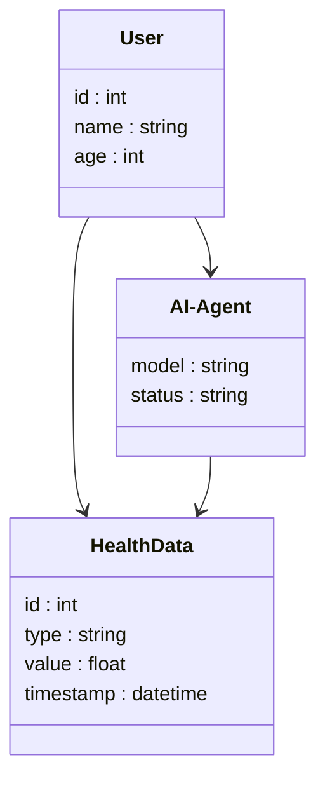
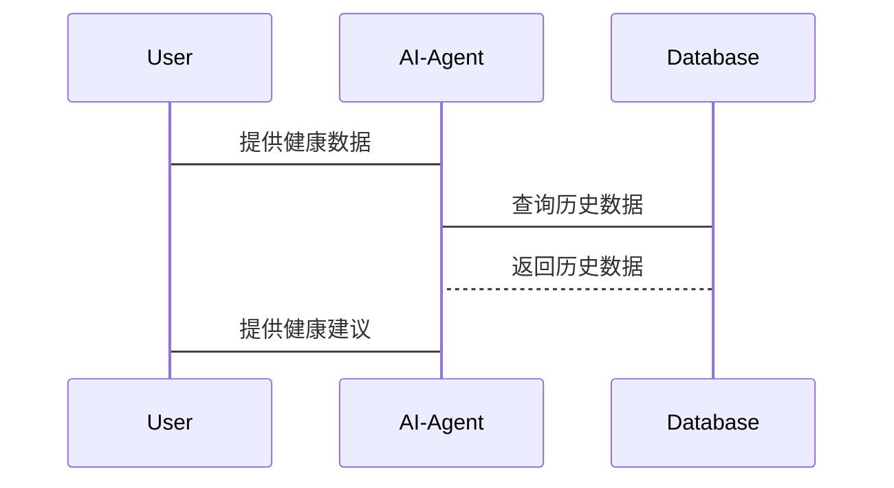

                 


# 构建AI Agent驱动的智能健康管理系统

> 关键词：AI Agent, 智能健康管理系统, 系统架构设计, 机器学习算法, 项目实战

> 摘要：本文详细探讨了如何构建一个基于AI Agent的智能健康管理系统，从背景介绍、核心概念、算法原理到系统设计和项目实战，层层深入，结合实际案例，帮助读者全面理解并掌握这一技术的核心要点。

---

## 第一部分：AI Agent与智能健康管理系统背景介绍

### 第1章：问题背景

#### 1.1 当前医疗健康领域的挑战
随着全球人口老龄化加剧和慢性病的增多，传统的医疗健康管理模式已难以满足日益增长的需求。医疗资源分配不均、用户健康数据碎片化、个性化健康建议缺失等问题亟待解决。

#### 1.2 AI Agent的应用潜力
AI Agent（人工智能代理）具备自主决策、学习和适应能力，能够实时处理复杂数据，为医疗健康管理提供智能化支持。通过AI Agent，用户可以获得个性化的健康建议，医疗机构也能更高效地管理资源。

#### 1.3 智能健康管理系统的核心目标
智能健康管理系统的目标是通过AI Agent技术，整合用户的健康数据，提供实时监测、疾病预测、个性化建议等服务，帮助用户实现主动健康管理。

### 第2章：问题描述

#### 2.1 医疗健康数据的复杂性
健康数据来源多样（如血压、心率、运动数据等），数据格式和时间跨度各不相同，导致数据整合和分析难度大。

#### 2.2 用户健康需求的多样性
不同用户的健康状况和需求差异显著，例如老年人可能需要慢性病管理，而年轻人可能关注运动和饮食建议。

#### 2.3 系统需要解决的关键问题
- 数据整合与清洗
- 实时健康监测与预警
- 个性化健康建议生成
- 系统的可扩展性和安全性

### 第3章：问题解决

#### 3.1 AI Agent的核心作用
AI Agent通过实时分析健康数据，提供智能化决策支持，帮助用户和医疗机构做出更优的选择。

#### 3.2 智能健康管理系统的实现路径
1. 数据采集与整合
2. 数据分析与模型训练
3. AI Agent决策与建议生成
4. 用户反馈与系统优化

#### 3.3 技术与场景的结合方式
结合AI、大数据和物联网技术，构建一个跨平台、多终端的智能健康管理系统，实现数据的实时采集、分析和反馈。

---

## 第二部分：核心概念与联系

### 第4章：AI Agent的核心原理

#### 4.1 AI Agent的基本原理
AI Agent通过感知环境、分析数据、制定决策并执行动作，实现对环境的动态响应。

#### 4.2 智能健康管理系统的工作原理
系统通过采集用户的健康数据，利用AI算法进行分析，生成个性化的健康建议，并通过用户界面反馈给用户。

#### 4.3 两者的结合机制
AI Agent作为系统的“大脑”，负责处理数据、制定决策；智能健康管理系统则是实现数据采集、反馈和执行的“躯体”。

### 第5章：核心概念属性对比

#### 5.1 AI Agent的属性
| 属性 | 描述 |
|------|------|
| 感知能力 | 数据采集与理解能力 |
| 学习能力 | 通过机器学习模型进行自我优化 |
| 决策能力 | 根据数据制定最优决策 |

#### 5.2 智能健康管理系统的属性
| 属性 | 描述 |
|------|------|
| 数据采集 | 从多种设备收集健康数据 |
| 数据分析 | 利用AI算法进行数据处理 |
| 用户交互 | 提供友好的人机交互界面 |

#### 5.3 实体关系图
```mermaid
erDiagram
    user {
        id : int
        name : string
        age : int
        gender : string
        health_data : HealthData
        agent : AI-Agent
    }
    health_data {
        id : int
        type : string
        value : float
        timestamp : datetime
        user_id : int
    }
    ai_agent {
        id : int
        model : string
        status : string
        user_id : int
    }
```

---

## 第三部分：算法原理

### 第6章：强化学习算法

#### 6.1 算法原理
强化学习是一种通过试错机制优化决策的算法，适用于动态环境下的决策问题。

#### 6.2 数学模型
策略函数：$$ \pi(a|s) = P(\text{采取动作 }a \mid 状态 }s) $$
价值函数：$$ V(s) = \max_a Q(s,a) $$

#### 6.3 应用场景
在健康管理系统中，强化学习可以用于优化用户的健康计划（如运动和饮食建议）。

#### 6.4 实现代码
```python
import numpy as np

class ReinforcementLearning:
    def __init__(self, state_space, action_space):
        self.state_space = state_space
        self.action_space = action_space
        self.Q = np.zeros((state_space, action_space))
    
    def choose_action(self, state, epsilon=0.1):
        if np.random.random() < epsilon:
            return np.random.randint(self.action_space)
        return np.argmax(self.Q[state])
    
    def update_Q(self, state, action, reward, learning_rate=0.1):
        self.Q[state, action] += learning_rate * (reward + np.max(self.Q[state]) - self.Q[state, action])
```

### 第7章：监督学习算法

#### 7.1 算法原理
监督学习通过标记数据训练模型，适用于分类和回归问题。

#### 7.2 数学模型
线性回归：$$ y = w x + b $$
逻辑回归：$$ P(y=1|x) = \frac{1}{1 + e^{-wx}} $$

#### 7.3 应用场景
用于疾病预测和健康风险评估。

#### 7.4 实现代码
```python
from sklearn.linear_model import LogisticRegression

class SupervisedLearning:
    def __init__(self):
        self.model = LogisticRegression()
    
    def train(self, X, y):
        self.model.fit(X, y)
    
    def predict(self, X_test):
        return self.model.predict(X_test)
```

---

## 第四部分：系统分析与架构设计

### 第8章：系统功能设计

#### 8.1 领域模型


#### 8.2 系统架构设计


### 第9章：系统实现

#### 9.1 接口设计
- 数据接口：实现健康数据的采集和传输
- 用户接口：提供友好的人机交互界面

#### 9.2 交互设计


---

## 第五部分：项目实战

### 第10章：环境安装与代码实现

#### 10.1 环境安装
安装Python、TensorFlow、Keras等依赖库。

#### 10.2 核心代码实现
```python
import tensorflow as tf
from tensorflow.keras import layers

class HealthManager:
    def __init__(self):
        self.model = self.build_model()
    
    def build_model(self):
        model = tf.keras.Sequential([
            layers.Dense(64, activation='relu'),
            layers.Dense(1, activation='sigmoid')
        ])
        model.compile(optimizer='adam', loss='binary_crossentropy', metrics=['accuracy'])
        return model
    
    def train(self, X_train, y_train):
        self.model.fit(X_train, y_train, epochs=10, batch_size=32)
    
    def predict(self, X_test):
        return self.model.predict(X_test)
```

### 第11章：案例分析与总结

#### 11.1 案例分析
以糖尿病预测为例，训练模型并对新数据进行预测。

#### 11.2 总结与优化
总结项目实现过程中的经验教训，并提出优化方向，如引入更多数据源、优化算法模型等。

---

## 第六部分：总结与展望

### 第12章：总结

#### 12.1 核心内容回顾
通过AI Agent技术构建智能健康管理系统，实现数据的实时采集、分析和个性化建议生成。

#### 12.2 项目意义
为医疗健康领域提供一种高效、智能的解决方案，推动个性化医疗的发展。

### 第13章：未来展望

#### 13.1 技术发展
AI Agent在医疗健康领域的应用将更加广泛，如智能诊疗、健康管理等。

#### 13.2 应用前景
随着技术的进步，智能健康管理系统将更加智能化、个性化，为用户和医疗机构创造更大的价值。

---

## 作者：AI天才研究院 & 禅与计算机程序设计艺术

