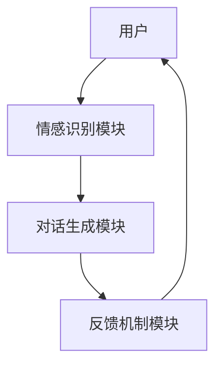

                 


# 构建AI Agent驱动的智能情感陪伴系统

## 关键词：
AI Agent、智能情感陪伴、情感计算、自然语言处理、人机交互

## 摘要：
本文详细探讨了构建AI Agent驱动的智能情感陪伴系统的各个方面。从背景介绍到系统架构设计，从算法原理到项目实战，全面解析了如何利用AI技术打造一个能够理解并回应人类情感的智能系统。文章内容涵盖情感计算的核心概念、情感分析与对话生成的算法原理、系统架构设计及实现，为读者提供了从理论到实践的完整指导。

---

# 第一部分: AI Agent与智能情感陪伴系统背景介绍

## 第1章: 问题背景与概念

### 1.1 AI Agent的基本概念
AI Agent（智能代理）是一种能够感知环境、自主决策并执行任务的智能实体。它通过与用户交互，理解用户需求，并提供相应的服务或反馈。AI Agent的核心在于其智能性，能够基于上下文和历史信息，动态调整其行为。

### 1.2 智能情感陪伴系统的定义
智能情感陪伴系统是一种结合了AI Agent和情感计算技术的系统，旨在通过理解和回应人类情感，提供情感支持和陪伴。这种系统可以应用于社交机器人、虚拟助手、心理支持平台等领域，帮助用户缓解孤独、压力或提供情感慰藉。

### 1.3 问题背景与需求分析
随着社会的发展，人们的情感需求逐渐增加。特别是在现代社会中，许多人面临孤独、压力和焦虑等问题。传统的情感支持方式（如人际交往）无法满足所有人需求，而智能情感陪伴系统作为一种新兴的技术解决方案，能够提供24/7的实时支持，具备高效性、便捷性和可扩展性的特点。

### 1.4 系统的边界与外延
智能情感陪伴系统的边界在于其功能范围：它专注于情感支持和陪伴，而不涉及其他领域（如医疗建议或专业咨询）。其外延则包括各种基于AI技术的辅助工具，如情感分析、自然语言处理和对话生成等技术。

### 1.5 核心要素与概念结构
智能情感陪伴系统的核心要素包括：
1. **情感计算模块**：负责识别和分析用户的情感状态。
2. **自然语言处理模块**：处理用户的语言输入，生成有意义的回复。
3. **对话生成模块**：基于用户的情感状态和上下文，生成个性化的回应。
4. **反馈机制**：根据用户反馈调整系统行为，优化用户体验。

---

## 第2章: AI Agent的核心概念与原理

### 2.1 AI Agent的定义与分类
AI Agent可以分为两类：
- **简单反射型Agent**：基于规则的简单反应，适用于特定任务。
- **复杂认知型Agent**：具备学习和推理能力，能够处理复杂任务。

### 2.2 情感计算与人机交互
情感计算是AI Agent的核心技术之一。通过分析用户的语言、语气和情感表达，系统能够理解用户的情感状态，并生成相应的回应。

### 2.3 情感计算的基本原理
情感计算的核心在于：
1. **情感识别**：通过文本分析、语音识别或面部识别技术，识别用户的情感状态。
2. **情感建模**：将情感状态建模，用于生成个性化回应。
3. **情感反馈**：根据用户反馈调整系统行为。

---

## 第3章: 情感计算算法原理

### 3.1 情感分析算法
情感分析是情感计算的基础。常用的情感分析算法包括：
- **基于词袋模型的文本分类**：通过统计关键词出现的频率，判断文本的情感倾向。
- **基于深度学习的文本分类**：利用神经网络模型（如LSTM、Transformer）进行情感分类。

### 3.2 对话生成算法
对话生成是情感陪伴系统的关键技术。常用的方法包括：
- **基于规则的对话生成**：通过预设的规则和模板生成回复。
- **基于深度学习的对话生成**：利用预训练语言模型生成自然流畅的回复。

### 3.3 情感计算的数学模型
情感分析的数学模型可以表示为：
$$ P(y|x) = \frac{P(x|y)P(y)}{P(x)} $$
其中，$y$ 表示情感类别，$x$ 表示输入文本。

---

## 第4章: 智能情感陪伴系统的架构设计

### 4.1 系统整体架构
智能情感陪伴系统的架构可以分为以下几个模块：
- **情感识别模块**：负责识别用户的情感状态。
- **对话生成模块**：基于情感状态生成回复。
- **反馈机制模块**：根据用户反馈优化系统行为。

### 4.2 系统功能设计
系统功能包括：
- **情感识别**：通过文本分析识别用户情感。
- **对话生成**：生成个性化回复。
- **反馈调整**：根据用户反馈优化系统行为。

### 4.3 系统架构图
以下是一个简单的系统架构图：


---

## 第5章: 项目实战

### 5.1 环境安装
为了实现智能情感陪伴系统，首先需要安装以下工具和库：
- Python 3.8+
- numpy、pandas、scikit-learn
- transformers（用于自然语言处理）

### 5.2 核心实现代码
以下是一个简单的对话生成代码示例：
```python
from transformers import pipeline

# 初始化情感分类模型
sentiment_analyzer = pipeline("sentiment-analysis")

# 初始化对话生成模型
text_generator = pipeline("text-generation")

def generate_response(user_input):
    # 分析情感
    sentiment = sentiment_analyzer(user_input)[0]['label']
    # 生成回复
    response = text_generator(user_input, max_length=50, num_return_sequences=1)
    return response[0]['generated_text']

print(generate_response("I feel sad today."))
```

### 5.3 案例分析
通过上述代码，我们可以实现一个简单的智能情感陪伴系统。用户输入情感化的文本，系统会生成相应的回复。例如：
- 用户输入：“I feel sad today.”
- 系统回复：“I'm sorry to hear that you're feeling sad. Would you like to talk about it?”

---

## 第6章: 系统测试与优化

### 6.1 系统测试
系统测试包括功能测试和性能测试。功能测试确保系统能够正确识别情感并生成回复，性能测试则关注系统的响应时间和稳定性。

### 6.2 系统优化
系统优化可以从以下几个方面入手：
- 优化情感分析模型，提高准确率。
- 优化对话生成模型，提高回复的自然性。
- 引入用户反馈机制，动态调整系统行为。

---

## 第7章: 系统部署与扩展

### 7.1 系统部署
将智能情感陪伴系统部署到实际应用场景中，需要考虑以下几点：
- 系统的可扩展性。
- 系统的安全性和隐私保护。

### 7.2 系统扩展
系统可以扩展的功能包括：
- 支持多语言情感陪伴。
- 引入图像识别技术，支持面部表情分析。

---

## 第8章: 总结与展望

### 8.1 系统总结
本文详细介绍了构建AI Agent驱动的智能情感陪伴系统的各个方面，从背景介绍到系统实现，为读者提供了完整的指导。

### 8.2 未来展望
未来，随着AI技术的不断发展，智能情感陪伴系统将更加智能化和个性化。情感计算、自然语言处理和人机交互技术的进一步融合，将为用户带来更优质的情感支持和陪伴体验。

---

## 作者：
作者：AI天才研究院/AI Genius Institute  
联系：[禅与计算机程序设计艺术](https://zen-of-computer-programming-art.com)  
邮箱：contact@zen-of-computer-programming-art.com

