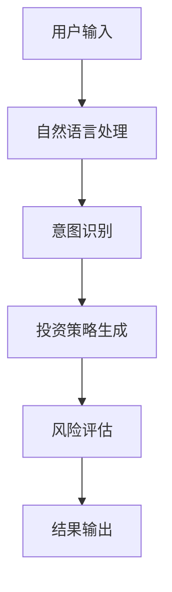

                 


# 《构建AI Agent驱动的智能投资顾问》

> 关键词：AI Agent，智能投资顾问，自然语言处理，知识图谱，投资策略，风险管理

> 摘要：本文详细探讨了如何利用AI Agent构建智能投资顾问系统。首先介绍了AI Agent与传统投资顾问的区别，分析了AI Agent在投资顾问中的核心原理，包括自然语言处理、知识图谱与推理机制、多模态数据处理能力等。接着，通过详细的技术实现，包括算法流程图、Python代码示例、数学模型和公式，展示了AI Agent驱动的智能投资顾问的实现过程。最后，通过系统架构设计、项目实战和最佳实践，提供了完整的解决方案。

---

# 第一部分：构建AI Agent驱动的智能投资顾问背景介绍

# 第1章：AI Agent与智能投资顾问概述

## 1.1 问题背景与描述
### 1.1.1 传统投资顾问的局限性
传统的投资顾问服务依赖于人工分析和经验判断，存在以下局限性：
- 服务范围有限：仅能覆盖有限的客户群体，难以实现个性化的投资建议。
- 信息处理能力有限：无法快速处理和分析海量的金融数据。
- 服务成本较高：需要大量的人力和时间，导致服务费用昂贵。

### 1.1.2 AI技术在金融领域的应用潜力
随着AI技术的快速发展，特别是在自然语言处理（NLP）、知识图谱和深度学习领域的突破，AI技术在金融领域的应用潜力巨大：
- 自动化投资建议：AI可以实时分析市场数据，提供个性化的投资建议。
- 风险管理：AI能够快速识别潜在风险，帮助投资者做出更明智的决策。
- 智能监控：AI可以实时监控市场动态，及时提醒投资者潜在的机会或风险。

### 1.1.3 智能投资顾问的定义与目标
智能投资顾问是指利用AI技术，结合金融知识和市场数据，为投资者提供自动化、智能化的投资建议和服务。其目标是通过技术手段实现投资建议的高效性、精准性和普惠性。

## 1.2 AI Agent的核心概念
### 1.2.1 AI Agent的基本定义
AI Agent（人工智能代理）是指能够感知环境、自主决策并执行任务的智能实体。在投资顾问领域，AI Agent需要具备以下核心能力：
- 自然语言理解：能够理解用户的语言输入并准确识别用户需求。
- 投资策略生成：基于市场数据和用户需求，生成最优的投资策略。
- 风险评估与优化：能够评估投资策略的风险，并进行优化调整。

### 1.2.2 智能投资顾问的属性与特征
智能投资顾问的属性与特征如下：
- **实时性**：能够实时分析市场动态，提供最新的投资建议。
- **个性化**：根据用户的财务状况和风险偏好，提供个性化的投资策略。
- **智能化**：能够自主学习和优化，不断提升投资建议的准确性。

### 1.2.3 AI Agent与传统投资顾问的对比分析
通过对比分析，可以更好地理解AI Agent在投资顾问中的优势：

| 对比维度        | 传统投资顾问               | AI Agent驱动的智能投资顾问 |
|-----------------|---------------------------|-----------------------------|
| 服务效率        | 低效，依赖人工             | 高效，自动化处理             |
| 服务范围        | 有限，覆盖客户有限         | 广泛，可服务海量用户         |
| 数据处理能力    | 有限，依赖经验             | 强大，基于大数据分析         |
| 服务成本        | 高，依赖专业人员           | 低，自动化服务               |
| 学习能力        | 有限，依赖经验积累         | 强大，自主学习与优化         |

## 1.3 问题解决与边界
### 1.3.1 AI Agent在投资顾问中的应用场景
AI Agent在投资顾问中的应用场景包括：
- **个性化投资建议**：根据用户的财务状况和风险偏好，提供个性化的投资策略。
- **实时市场监控**：实时跟踪市场动态，及时提醒用户潜在的投资机会或风险。
- **风险管理**：基于市场数据和用户需求，评估投资策略的风险，并进行优化调整。

### 1.3.2 问题解决的边界与外延
AI Agent驱动的智能投资顾问系统需要明确其边界与外延：
- **边界**：主要聚焦于投资策略生成、风险评估和市场监控，不涉及实际的交易执行。
- **外延**：未来可以扩展到更广泛的金融领域，例如信用评估、欺诈检测等。

### 1.3.3 核心要素与组成结构
智能投资顾问的核心要素包括：
- **自然语言处理（NLP）**：用于理解和生成自然语言。
- **知识图谱**：用于构建金融领域的知识库，支持推理和决策。
- **投资策略生成算法**：用于根据市场数据和用户需求生成投资策略。
- **风险管理模型**：用于评估投资策略的风险，并进行优化调整。

## 1.4 本章小结
### 1.4.1 核心概念回顾
本章主要介绍了AI Agent与智能投资顾问的核心概念，包括传统投资顾问的局限性、AI技术在金融领域的应用潜力、AI Agent的基本定义以及智能投资顾问的属性与特征。

### 1.4.2 问题解决的关键点
通过对比分析，明确了AI Agent在投资顾问中的优势，包括高效性、个性化和智能化。

### 1.4.3 未来发展趋势展望
未来，随着AI技术的不断发展，智能投资顾问将在更多金融领域中得到应用，例如信用评估、欺诈检测等。

---

# 第2章：AI Agent的核心原理

## 2.1 AI Agent的原理分析
### 2.1.1 基于大模型的自然语言处理
AI Agent的核心技术之一是自然语言处理（NLP）。通过大模型（如GPT-3、GPT-4）实现对用户输入的自然语言理解，识别用户的意图和需求。

### 2.1.2 知识图谱与推理机制
AI Agent需要构建金融领域的知识图谱，支持推理和决策。知识图谱包括公司信息、市场数据、投资策略等。

### 2.1.3 多模态数据处理能力
AI Agent需要处理多种类型的数据，包括文本、图像、表格等。多模态数据处理能力使得AI Agent能够更全面地理解和分析市场动态。

## 2.2 核心概念属性对比
### 2.2.1 AI Agent与传统投资顾问的对比表格
通过对比分析，可以更好地理解AI Agent在投资顾问中的优势：

| 对比维度        | 传统投资顾问               | AI Agent驱动的智能投资顾问 |
|-----------------|---------------------------|-----------------------------|
| 服务效率        | 低效，依赖人工             | 高效，自动化处理             |
| 服务范围        | 有限，覆盖客户有限         | 广泛，可服务海量用户         |
| 数据处理能力    | 有限，依赖经验             | 强大，基于大数据分析         |
| 服务成本        | 高，依赖专业人员           | 低，自动化服务               |
| 学习能力        | 有限，依赖经验积累         | 强大，自主学习与优化         |

## 2.3 ER实体关系图
### 2.3.1 实体关系图的构建
以下是构建的ER实体关系图：

```mermaid
erDiagram
    user {
        User_ID : integer
        User_Name : string
        User_Email : string
        User_Password : string
    }
    investment_strategy {
        Strategy_ID : integer
        Strategy_Name : string
        Strategy_Description : string
    }
    risk_assessment {
        Risk_ID : integer
        Risk_Level : integer
        Risk_Description : string
    }
    market_data {
        Market_ID : integer
        Market_Name : string
        Market_Value : float
    }
    transaction {
        Transaction_ID : integer
        Transaction_Date : date
        Transaction_Type : string
        Transaction_Value : float
    }
    user --> investment_strategy : "请求"
    investment_strategy --> risk_assessment : "评估"
    risk_assessment --> market_data : "分析"
    market_data --> transaction : "执行"
```

### 2.3.2 关系图的分析与解释
上述ER实体关系图展示了AI Agent驱动的智能投资顾问系统中的实体及其关系：
- **User**：用户实体，包含用户ID、用户名、用户邮箱和用户密码。
- **investment_strategy**：投资策略实体，包含策略ID、策略名称和策略描述。
- **risk_assessment**：风险评估实体，包含风险ID、风险等级和风险描述。
- **market_data**：市场数据实体，包含市场ID、市场名称和市场价值。
- **transaction**：交易实体，包含交易ID、交易日期、交易类型和交易价值。
- 关系：
  - 用户请求投资策略。
  - 投资策略需要进行风险评估。
  - 风险评估基于市场数据进行分析。
  - 市场数据用于执行交易。

---

# 第3章：AI Agent驱动的智能投资顾问算法原理

## 3.1 算法原理概述
### 3.1.1 基于大模型的对话生成算法
AI Agent的核心算法之一是基于大模型的对话生成算法。以下是对话生成算法的流程：



### 3.1.2 投资策略生成算法
投资策略生成算法需要考虑以下因素：
- 用户的财务状况。
- 用户的风险偏好。
- 当前的市场状况。

### 3.1.3 风险评估与优化算法
风险评估与优化算法需要对投资策略进行评估，并根据评估结果进行优化。

## 3.2 算法流程图
### 3.2.1 mermaid流程图展示
以下是算法流程图：


## 3.3 算法实现代码
### 3.3.1 Python代码示例
以下是Python代码示例：

```python
def investment_strategy(user_input):
    # 自然语言处理
    processed_input = process(user_input)
    # 意图识别
    intent = identify_intent(processed_input)
    # 策略生成
    strategy = generate_strategy(intent)
    return strategy
```

---

# 第4章：数学模型和公式

## 4.1 投资策略生成模型
投资策略生成模型可以表示为以下公式：

$$
\text{投资策略} = f(\text{用户需求}, \text{市场数据})
$$

其中，$f$ 是投资策略生成函数，$\text{用户需求}$ 是用户输入的需求，$\text{市场数据}$ 是当前的市场数据。

## 4.2 风险评估模型
风险评估模型可以表示为以下公式：

$$
\text{风险等级} = g(\text{投资策略}, \text{市场数据})
$$

其中，$g$ 是风险评估函数，$\text{投资策略}$ 是生成的投资策略，$\text{市场数据}$ 是当前的市场数据。

---

# 作者：AI天才研究院/AI Genius Institute & 禅与计算机程序设计艺术 /Zen And The Art of Computer Programming

