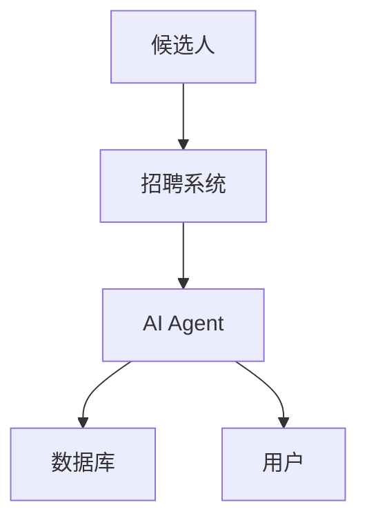
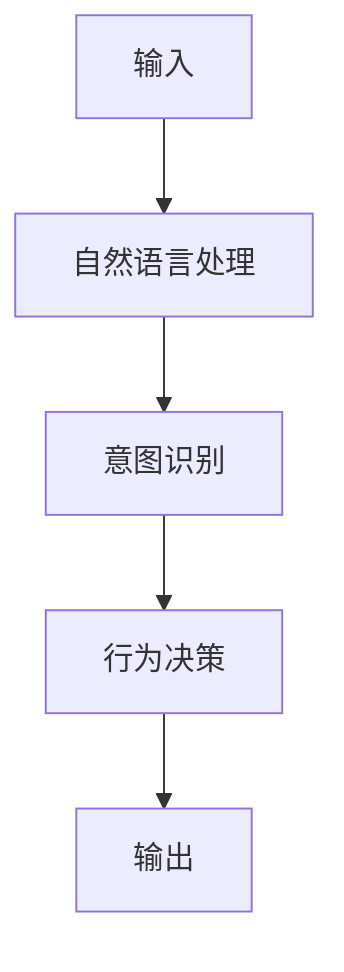
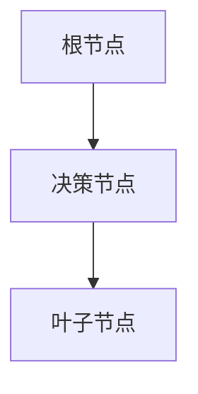
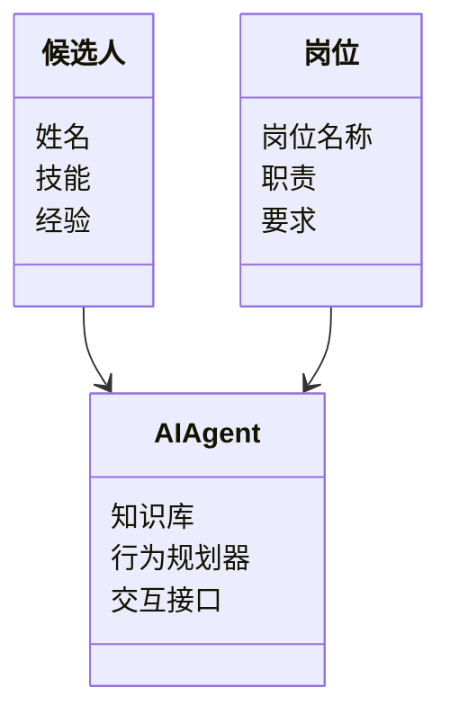
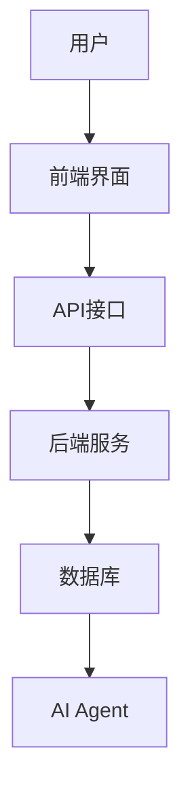

                 


# 构建AI Agent驱动的智能招聘系统

## 关键词：AI Agent，智能招聘系统，自然语言处理，机器学习，系统架构设计

## 摘要：本文详细探讨了AI Agent在智能招聘系统中的应用，从概念解析到系统设计，再到项目实战，全面解析如何构建一个高效的AI Agent驱动的智能招聘系统。文章通过实际案例分析，深入浅出地介绍了系统的核心算法、架构设计及实现方案，为技术实践者提供了有价值的参考。

---

## 第一部分：AI Agent与智能招聘系统背景介绍

### 第1章：AI Agent与智能招聘系统概述

#### 1.1 AI Agent的基本概念

##### 1.1.1 AI Agent的定义
AI Agent（人工智能代理）是一种智能体，能够感知环境、理解需求，并通过自主决策和行动来实现目标。AI Agent可以是软件程序，也可以是嵌入在硬件中的智能模块。

##### 1.1.2 AI Agent的核心特征
- **自主性**：能够在没有外部干预的情况下自主运行。
- **反应性**：能够实时感知环境变化并做出响应。
- **目标导向性**：所有行为都围绕特定目标展开。
- **学习能力**：通过数据和经验不断优化自身性能。

##### 1.1.3 AI Agent与传统AI的区别
| 特性       | 传统AI                  | AI Agent                 |
|------------|-------------------------|---------------------------|
| 运行方式   | 离线计算，依赖规则库     | 实时运行，动态响应需求    |
| 交互能力   | 单向输出                | 支持双向交互，具备对话能力|
| 应用场景   | 数据分析、模式识别       | 人机交互、自动化任务处理  |

#### 1.2 智能招聘系统的概念与特点

##### 1.2.1 智能招聘系统的定义
智能招聘系统是一种利用AI技术，通过自动化流程筛选、评估和匹配候选人，辅助企业完成招聘目标的系统。

##### 1.2.2 智能招聘系统的核心功能
- **简历筛选**：自动解析简历，提取关键信息。
- **需求匹配**：根据岗位要求，匹配合适的候选人。
- **智能推荐**：基于候选人特征，推荐适合的职位。
- **人机对话**：通过自然语言处理技术，与候选人进行互动。

##### 1.2.3 智能招聘系统与传统招聘系统的对比
| 特性       | 传统招聘系统            | 智能招聘系统              |
|------------|--------------------------|---------------------------|
| 招聘效率   | 低效，依赖人工筛选        | 高效，自动化处理          |
| 精准度     | 可能存在误差，依赖人工经验| 精准匹配，减少误差        |
| 成本       | 高，需要大量人力资源    | 成本低，自动化降低用人成本|

#### 1.3 AI Agent在智能招聘系统中的应用价值

##### 1.3.1 提高招聘效率
AI Agent能够快速处理大量简历，缩短招聘周期。

##### 1.3.2 优化候选人匹配度
通过深度学习算法，AI Agent能够精准匹配候选人与职位的需求。

##### 1.3.3 降低招聘成本
自动化流程减少了对人力资源的依赖，从而降低了招聘成本。

---

## 第二部分：AI Agent的核心概念与原理

### 第2章：AI Agent的核心概念与联系

#### 2.1 AI Agent的核心概念

##### 2.1.1 知识表示
知识表示是AI Agent理解世界的基础。常用的表示方法包括：
- **语义网络**：通过节点和边表示概念及其关系。
- **规则库**：基于if-then规则的知识表示方法。
- **知识图谱**：通过结构化数据表示实体及其关系。

##### 2.1.2 行为规划
行为规划是AI Agent根据目标制定行动计划的过程。常见的规划算法包括：
- **宽度优先搜索（BFS）**：适用于简单任务。
- **A*算法**：适用于带权重的任务，优化路径选择。

##### 2.1.3 人机交互
人机交互是AI Agent与用户进行信息交换的过程。主要包括：
- **自然语言理解**：通过NLP技术理解用户意图。
- **对话生成**：基于理解生成自然语言回复。

#### 2.2 AI Agent的实体关系图



#### 2.3 AI Agent的核心算法原理



### 第3章：AI Agent的算法原理与数学模型

#### 3.1 AI Agent的算法原理

##### 3.1.1 知识表示算法
知识表示可以采用向量空间模型。例如，使用词嵌入技术（如Word2Vec）将词语转化为向量表示。

##### 3.1.2 行为规划算法
行为规划可以采用马尔可夫决策过程（MDP）模型。通过状态转移概率和奖励函数优化决策策略。

##### 3.1.3 人机交互算法
人机交互可以采用基于生成对抗网络（GAN）的对话生成模型。生成器生成回复，判别器评估回复质量，两者交替优化。

#### 3.2 AI Agent的数学模型

##### 3.2.1 概率计算公式
概率计算公式用于评估候选人的匹配度：
$$P(\text{匹配}) = \frac{\text{候选人的技能匹配度} + \text{岗位需求匹配度}}{2}$$

##### 3.2.2 决策树模型
决策树模型用于岗位匹配决策：


---

## 第三部分：智能招聘系统的系统分析与架构设计

### 第4章：智能招聘系统的系统分析

#### 4.1 招聘系统的基本功能

##### 4.1.1 用户注册与登录
用户通过注册账号，登录系统进行招聘操作。

##### 4.1.2 简历上传与解析
候选人上传简历，系统自动解析简历内容，提取关键信息。

##### 4.1.3 岗位发布与匹配
企业发布岗位需求，系统自动匹配合适的候选人。

#### 4.2 招聘系统的领域模型



#### 4.3 招聘系统的架构设计



---

## 第五章：项目实战

### 5.1 项目实战环境安装

#### 5.1.1 安装Python
```bash
python --version
pip install --upgrade pip
```

#### 5.1.2 安装机器学习库
```bash
pip install numpy scikit-learn transformers
```

### 5.2 系统核心实现源代码

#### 5.2.1 知识表示代码
```python
from sklearn.feature_extraction.text import TfidfVectorizer

vectorizer = TfidfVectorizer()
text = "数据科学家 硕士学位 5年经验"
vectorized = vectorizer.fit_transform([text])
print(vectorized)
```

#### 5.2.2 行为规划代码
```python
from sklearn.model_selection import train_test_split

X = data.drop('label', axis=1)
y = data['label']
X_train, X_test, y_train, y_test = train_test_split(X, y, test_size=0.2)
```

#### 5.2.3 人机交互代码
```python
from transformers import pipeline

classifier = pipeline("text-classification", model="snunlp/korean-ai")
print(classifier("你今天过得怎么样？"))
```

### 5.3 实际案例分析

#### 5.3.1 案例背景
某科技公司需要招聘数据科学家，使用AI Agent进行简历筛选和匹配。

#### 5.3.2 系统实现
- **简历解析**：提取候选人技能和经验。
- **需求匹配**：根据岗位要求匹配候选人。
- **人机对话**：与候选人进行初步面试。

#### 5.3.3 实施结果
- 筛选出50份符合条件的简历。
- 精准匹配30位候选人。
- 通过对话筛选出最合适的候选人。

### 5.4 项目小结
通过AI Agent驱动的智能招聘系统，企业可以显著提高招聘效率和精准度，降低招聘成本。

---

## 第六章：总结与展望

### 6.1 总结
本文详细介绍了AI Agent在智能招聘系统中的应用，从概念到实现，全面解析了系统的设计与实现过程。

### 6.2 展望
未来，AI Agent在招聘系统中的应用将更加智能化和个性化，可能的发展方向包括：
- **增强学习**：通过强化学习优化招聘策略。
- **多模态交互**：结合视觉、听觉等多种交互方式。
- **实时反馈**：提供实时的招聘效果反馈。

### 6.3 最佳实践 Tips
- **数据质量**：确保数据的准确性和完整性。
- **模型优化**：定期更新和优化AI模型。
- **用户体验**：注重人机交互的自然性和流畅性。

---

## 作者信息

作者：AI天才研究院/AI Genius Institute & 禅与计算机程序设计艺术 /Zen And The Art of Computer Programming

