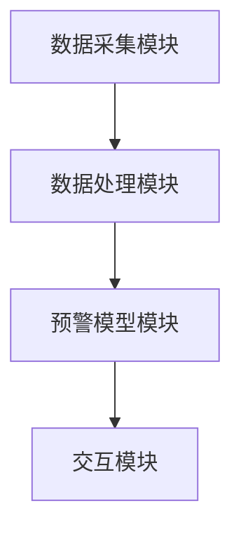

                 


# 构建AI Agent驱动的智能灾害预警系统

> 关键词：AI Agent, 智能灾害预警系统, 多源数据融合, 实时预警, 知识图谱推理, 分布式系统

> 摘要：本文章详细介绍了如何构建一个基于AI Agent的智能灾害预警系统。首先，我们讨论了AI Agent的基本概念和其在灾害预警中的应用价值。接着，我们深入分析了灾害预警系统的现状、挑战和核心目标。然后，我们详细讲解了AI Agent的核心原理、分类和系统架构设计。随后，我们探讨了灾害预警系统的技术基础，包括数据采集与处理、灾害预警模型构建以及系统的实时性与可靠性。接下来，我们详细分析了AI Agent驱动的灾害预警算法原理，包括目标检测、时间序列分析和知识图谱推理。最后，我们讨论了灾害预警系统的架构设计，包括系统模块设计、接口设计和交互流程设计。通过本篇文章，读者可以全面了解如何利用AI Agent技术构建智能、高效的灾害预警系统。

---

# 第一部分: AI Agent驱动的智能灾害预警系统概述

---

# 第1章: AI Agent与智能灾害预警系统背景介绍

## 1.1 AI Agent的基本概念

### 1.1.1 AI Agent的定义与特点

AI Agent（人工智能代理）是一种能够感知环境、自主决策并执行任务的智能实体。其特点包括：

1. **自主性**：AI Agent能够自主决策，无需外部干预。
2. **反应性**：能够实时感知环境变化并做出反应。
3. **学习能力**：通过机器学习算法不断优化自身行为。
4. **协作性**：能够与其他AI Agent或系统协同工作。

$$\text{AI Agent的定义：AI Agent是能够感知环境、自主决策并执行任务的智能实体。}$$

### 1.1.2 AI Agent的核心要素与功能

AI Agent的核心要素包括感知、推理、决策和执行。其主要功能如下：

1. **感知环境**：通过传感器或数据源获取环境信息。
2. **知识表示**：将感知到的信息转化为结构化的知识。
3. **推理与决策**：基于知识进行推理，制定决策方案。
4. **执行动作**：根据决策结果执行相应动作。

### 1.1.3 AI Agent与传统自动化的区别

AI Agent与传统自动化的区别在于其智能化和自主性。传统自动化系统通常基于固定的规则运行，而AI Agent能够通过学习和推理不断优化自身的行为。

---

## 1.2 灾害预警系统的现状与挑战

### 1.2.1 灾害预警系统的定义与分类

灾害预警系统是指通过收集和分析各种灾害相关数据，预测和预警可能发生的灾害的系统。常见的灾害类型包括地震、洪水、台风、火灾等。灾害预警系统可以分为气象灾害预警、地质灾害预警和生物灾害预警等类别。

### 1.2.2 当前灾害预警系统的主要问题

当前灾害预警系统主要面临以下问题：

1. **数据孤岛**：不同部门和机构的数据孤岛问题，导致数据无法有效融合。
2. **实时性不足**：传统系统处理数据的速度较慢，难以实现实时预警。
3. **准确性有限**：基于传统方法的预测模型准确性较低，难以应对复杂的灾害场景。
4. **缺乏智能化**：系统缺乏自主学习和决策能力，难以应对突发事件。

### 1.2.3 AI Agent在灾害预警中的潜在价值

AI Agent可以通过以下方式提升灾害预警系统的性能：

1. **多源数据融合**：整合气象、地质、社交媒体等多种数据源，提高预警的准确性。
2. **实时分析**：利用AI Agent的实时感知和决策能力，实现快速响应。
3. **智能推理**：通过知识图谱和推理算法，提升系统的智能化水平。

---

## 1.3 AI Agent驱动的智能灾害预警系统的核心目标

### 1.3.1 提高灾害预警的准确性

通过AI Agent的多源数据融合和智能推理能力，提高灾害预测的准确性。

### 1.3.2 实现多源数据的智能融合

整合多种数据源，利用AI Agent的知识表示和推理能力，实现数据的智能融合。

### 1.3.3 提供实时响应与决策支持

通过AI Agent的实时感知和决策能力，为灾害预警提供实时响应和决策支持。

---

## 1.4 本章小结

本章主要介绍了AI Agent的基本概念、灾害预警系统的现状与挑战以及AI Agent在灾害预警中的潜在价值。通过这些内容，我们明确了构建AI Agent驱动的智能灾害预警系统的核心目标和必要性。

---

# 第2章: AI Agent的核心概念与原理

## 2.1 AI Agent的基本原理

### 2.1.1 AI Agent的感知与决策机制

AI Agent的感知机制包括数据采集、特征提取和数据处理。决策机制则基于感知到的信息，通过推理和学习生成决策方案。

### 2.1.2 基于知识图谱的智能推理

知识图谱是一种结构化的知识表示方式，通过图中的节点和边表示实体及其关系。AI Agent可以通过知识图谱进行推理，获取隐含的知识。

### 2.1.3 多智能体协作与通信

在多智能体系统中，多个AI Agent协同工作，通过通信协议进行信息交换，共同完成复杂的任务。

$$\text{知识图谱的定义：知识图谱是一种结构化的知识表示方式，通过图中的节点和边表示实体及其关系。}$$

---

## 2.2 AI Agent的分类与应用场景

### 2.2.1 基于规则的AI Agent

基于规则的AI Agent通过预定义的规则进行决策，适用于规则明确的场景。

### 2.2.2 基于模型的AI Agent

基于模型的AI Agent通过机器学习模型进行决策，适用于复杂场景。

### 2.2.3 基于强化学习的AI Agent

基于强化学习的AI Agent通过与环境的互动，不断优化自身的决策策略。

---

## 2.3 AI Agent的系统架构设计

### 2.3.1 单体AI Agent架构

单体AI Agent架构适用于简单的任务，具有开发简单、部署容易的特点。

### 2.3.2 分布式AI Agent架构

分布式AI Agent架构适用于复杂的任务，通过多个AI Agent协同工作，提高系统的性能。

### 2.3.3 微服务架构下的AI Agent设计

微服务架构将系统分解为多个独立的服务，每个服务由一个或多个AI Agent负责，具有高可扩展性和灵活性。

---

## 2.4 本章小结

本章详细介绍了AI Agent的核心概念与原理，包括感知与决策机制、知识图谱推理以及多智能体协作与通信。同时，我们还探讨了AI Agent的分类与应用场景，以及系统的架构设计。

---

# 第3章: 灾害预警系统的技术基础

## 3.1 灾害数据的采集与处理

### 3.1.1 多源数据的采集方式

灾害数据的采集方式包括传感器数据、卫星遥感数据、社交媒体数据等。

### 3.1.2 数据预处理与特征提取

数据预处理包括数据清洗、标准化和降维。特征提取则是从数据中提取有助于灾害预测的特征。

### 3.1.3 数据存储与管理

灾害数据通常存储在数据库中，包括关系型数据库和NoSQL数据库。

---

## 3.2 灾害预警模型的构建

### 3.2.1 基于机器学习的灾害预测模型

常用的机器学习算法包括支持向量机（SVM）和随机森林（Random Forest）。

### 3.2.2 基于深度学习的灾害检测模型

常用的深度学习模型包括卷积神经网络（CNN）和长短期记忆网络（LSTM）。

### 3.2.3 灾害风险评估模型

灾害风险评估模型通常结合历史数据和实时数据，评估灾害的发生概率和影响范围。

---

## 3.3 灾害预警系统的实时性与可靠性

### 3.3.1 实时数据处理的技术要求

实时数据处理需要高效的算法和快速的计算能力。

### 3.3.2 系统的容错与冗余设计

通过冗余设计和容错机制，确保系统的高可用性。

### 3.3.3 系统的可扩展性与可维护性

系统的架构设计需要考虑可扩展性和可维护性，便于未来的升级和维护。

---

## 3.4 本章小结

本章主要介绍了灾害预警系统的技术基础，包括数据采集与处理、灾害预警模型的构建以及系统的实时性与可靠性。

---

# 第4章: AI Agent驱动的灾害预警算法原理

## 4.1 基于目标检测的灾害识别算法

### 4.1.1 目标检测算法的原理与实现

目标检测算法通过图像分割和分类，识别灾害相关的特征。

### 4.1.2 基于YOLO的灾害目标检测

YOLO是一种高效的实时目标检测算法，适用于灾害图像的快速检测。

### 4.1.3 算法的优化与调优

通过模型优化和参数调优，提高目标检测的准确性和速度。

$$\text{YOLO的目标检测原理：YOLO将图像划分为网格，预测每个网格中的目标类别和位置。}$$

---

## 4.2 基于时间序列分析的灾害预测算法

### 4.2.1 时间序列分析的基本原理

时间序列分析通过分析历史数据，预测未来的趋势。

### 4.2.2 基于LSTM的灾害预测模型

LSTM（长短期记忆网络）适用于时间序列数据的预测，能够捕捉长期依赖关系。

### 4.2.3 模型的训练与评估

通过训练数据训练模型，并通过验证数据评估模型的性能。

$$\text{LSTM的定义：LSTM是一种特殊的RNN，能够有效捕捉时间序列数据中的长期依赖关系。}$$

---

## 4.3 基于知识图谱的智能推理算法

### 4.3.1 知识图谱的构建与存储

知识图谱的构建包括数据抽取、实体识别和关系抽取。

### 4.3.2 基于图神经网络的推理算法

图神经网络（GNN）通过图结构数据进行推理，适用于知识图谱中的复杂推理任务。

### 4.3.3 知识图谱在灾害预警中的应用

通过知识图谱推理，可以关联不同的灾害信息，提高预警的准确性。

---

## 4.4 本章小结

本章详细介绍了AI Agent驱动的灾害预警算法原理，包括目标检测、时间序列分析和知识图谱推理。

---

# 第5章: 灾害预警系统的架构设计

## 5.1 系统模块设计

### 5.1.1 数据采集模块

数据采集模块负责从多种数据源采集灾害相关数据。

### 5.1.2 数据处理模块

数据处理模块对采集到的数据进行预处理和特征提取。

### 5.1.3 预警模型模块

预警模型模块包括目标检测、时间序列分析和知识图谱推理等算法。

### 5.1.4 交互模块

交互模块负责与用户或外部系统的交互，接收指令并反馈结果。

---

## 5.2 系统架构图



---

## 5.3 系统接口设计

### 5.3.1 数据接口

数据接口用于与数据源进行数据交换。

### 5.3.2 模型接口

模型接口用于与其他模块进行数据交互。

### 5.3.3 用户接口

用户接口负责与用户的交互，包括输入和输出。

---

## 5.4 本章小结

本章主要介绍了灾害预警系统的架构设计，包括系统模块设计、系统架构图以及系统接口设计。

---

# 第6章: 项目实战

## 6.1 环境搭建

### 6.1.1 安装Python和必要的库

安装Python和TensorFlow、PyTorch等深度学习库。

### 6.1.2 安装Jupyter Notebook

安装Jupyter Notebook用于算法开发和测试。

---

## 6.2 系统核心实现源代码

### 6.2.1 数据采集与处理代码

```python
import requests
import pandas as pd

def fetch_data(url):
    response = requests.get(url)
    data = response.json()
    return data

def preprocess_data(data):
    df = pd.DataFrame(data)
    df = df.dropna()
    return df
```

### 6.2.2 目标检测算法实现

```python
import tensorflow as tf
from tensorflow.keras import layers

model = tf.keras.Sequential([
    layers.Conv2D(32, (3,3), activation='relu', input_shape=(224, 224, 3)),
    layers.MaxPooling2D((2,2)),
    layers.Conv2D(64, (3,3), activation='relu'),
    layers.MaxPooling2D((2,2)),
    layers.Flatten(),
    layers.Dense(128, activation='relu'),
    layers.Dense(1, activation='sigmoid')
])

model.compile(optimizer='adam', loss='binary_crossentropy', metrics=['accuracy'])
model.fit(x_train, y_train, epochs=10, batch_size=32)
```

### 6.2.3 时间序列分析实现

```python
import keras
from keras.models import Sequential
from keras.layers import LSTM, Dense

model = Sequential()
model.add(LSTM(128, input_shape=(timesteps, features)))
model.add(Dense(1))
model.compile(optimizer='adam', loss='mean_squared_error')
model.fit(x_train, y_train, epochs=50, batch_size=32)
```

---

## 6.3 代码应用解读与分析

### 6.3.1 数据采集与处理

数据采集代码通过API接口获取灾害相关数据，并使用Pandas进行数据清洗和处理。

### 6.3.2 目标检测算法

目标检测算法基于TensorFlow实现，使用卷积神经网络进行图像分类。

### 6.3.3 时间序列分析

时间序列分析基于LSTM网络，用于预测灾害发生的时间和强度。

---

## 6.4 实际案例分析

### 6.4.1 案例背景

以地震预警为例，分析AI Agent在地震预警中的应用。

### 6.4.2 数据分析与模型训练

通过地震数据训练目标检测和时间序列分析模型，提高地震预测的准确性。

### 6.4.3 结果展示与优化

展示模型预测结果，并根据实际地震事件进行模型优化。

---

## 6.5 本章小结

本章通过实际案例分析，展示了AI Agent驱动的智能灾害预警系统的实现过程，包括环境搭建、核心代码实现以及结果分析。

---

# 第7章: 总结与展望

## 7.1 总结

通过本文的介绍，我们全面了解了AI Agent驱动的智能灾害预警系统的构建过程，包括系统背景、核心概念、算法原理和系统架构设计。

## 7.2 展望

未来，随着AI技术的不断发展，AI Agent在灾害预警中的应用将更加广泛。我们需要进一步优化算法，提升系统的实时性和准确性，为灾害预警提供更有力的支持。

---

# 作者：AI天才研究院 & 禅与计算机程序设计艺术

