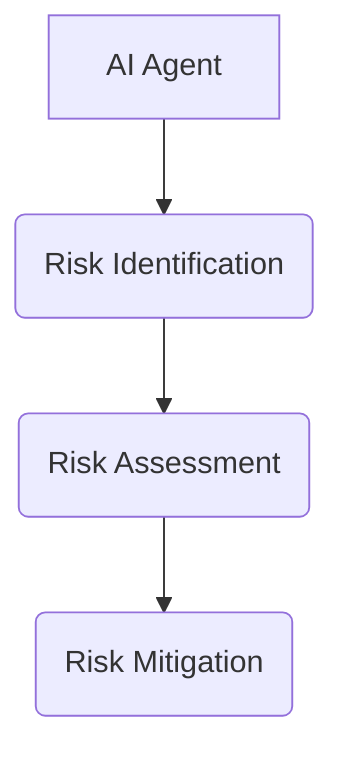

                 


# 构建AI Agent驱动的智能风险评估系统

> 关键词：AI Agent, 智能风险评估系统, 风险识别, 风险评估, AI算法, 系统架构, 项目实战

> 摘要：本文深入探讨了AI Agent驱动的智能风险评估系统的构建过程，从核心概念、算法原理到系统架构设计，再到项目实战，全面解析了如何利用AI Agent技术实现高效、动态的智能风险评估。文章结合实际案例，详细阐述了系统的数学模型、算法实现和架构设计，为读者提供了一套完整的解决方案。

---

# 第一部分: AI Agent与智能风险评估系统概述

## 第1章: AI Agent驱动的智能风险评估系统背景

### 1.1 AI Agent的基本概念
#### 1.1.1 AI Agent的定义与特点
AI Agent（人工智能代理）是指能够感知环境、自主决策并采取行动以实现目标的智能实体。其核心特点包括：
- **自主性**：无需外部干预，自主完成任务。
- **反应性**：能够实时感知环境并做出反应。
- **学习能力**：通过数据和经验不断优化自身行为。
- **协作性**：能够与其他Agent或系统协同工作。

#### 1.1.2 AI Agent的核心要素与功能
AI Agent的功能模块包括：
- **感知模块**：通过传感器或数据输入感知环境。
- **推理模块**：基于感知信息进行逻辑推理和决策。
- **行动模块**：根据推理结果执行具体操作。
- **学习模块**：通过机器学习算法不断优化自身行为。

#### 1.1.3 AI Agent与传统算法的对比
| 对比维度 | AI Agent | 传统算法 |
|----------|----------|----------|
| 决策方式 | 自主决策，动态调整 | 预先定义，固定执行 |
| 学习能力 | 具备学习能力，可自适应 | 无学习能力，固定行为 |
| 应用场景 | 复杂动态环境，需要自主决策 | 简单静态环境，规则明确 |

### 1.2 智能风险评估系统的定义与特点
#### 1.2.1 风险评估的基本概念
风险评估是对潜在风险的识别、量化和应对策略制定的过程。其核心目标是通过分析潜在风险的可能性和影响程度，制定有效的风险管理策略。

#### 1.2.2 智能风险评估的核心优势
- **动态性**：能够实时感知和评估风险，适应环境变化。
- **准确性**：通过AI技术提高风险识别和评估的准确性。
- **可扩展性**：能够处理大规模、复杂场景下的风险评估。

#### 1.2.3 智能风险评估系统的应用场景
- **金融领域**：评估投资风险、信用风险等。
- **医疗领域**：评估患者风险、疾病传播风险等。
- **工业领域**：评估设备故障风险、生产安全风险等。

### 1.3 AI Agent驱动风险评估的必要性
#### 1.3.1 风险评估中的传统方法与局限性
传统风险评估方法通常依赖于静态数据和固定规则，难以应对复杂动态环境下的风险变化。

#### 1.3.2 AI Agent在风险评估中的优势
AI Agent能够通过实时感知环境变化，动态调整风险评估策略，提高评估的准确性和及时性。

#### 1.3.3 AI Agent驱动的智能风险评估系统的价值
通过AI Agent驱动的风险评估系统，可以在复杂场景下实现高效、动态的风险管理，降低潜在损失，提高系统整体鲁棒性。

---

## 第2章: AI Agent与风险评估的结合原理

### 2.1 AI Agent的基本原理
#### 2.1.1 多智能体系统（MAS）的概念
多智能体系统是指由多个相互作用的智能体组成的系统，通过协同工作实现整体目标。

#### 2.1.2 AI Agent的分类与功能
AI Agent可以根据智能水平分为：
- **反应式Agent**：基于当前感知做出反应，无内部状态。
- **认知式Agent**：具备复杂推理和决策能力，有内部状态和目标。

#### 2.1.3 AI Agent的知识表示与推理
知识表示方法包括：
- **逻辑表示法**：通过逻辑规则表示知识。
- **知识图谱**：通过图结构表示实体及其关系。

推理方法包括：
- **逻辑推理**：基于逻辑规则进行推理。
- **概率推理**：基于概率论进行推理。

### 2.2 风险评估的基本原理
#### 2.2.1 风险识别与量化
风险识别是通过分析潜在风险源，识别可能的风险事件。风险量化是通过概率和影响程度对风险进行量化评估。

#### 2.2.2 风险分析与评估方法
常用的风险评估方法包括：
- **定量分析**：通过数学模型计算风险概率和影响。
- **定性分析**：通过专家判断进行风险评估。

#### 2.2.3 风险应对策略的制定
根据风险评估结果，制定相应的应对策略，包括风险规避、降低、转移和接受。

### 2.3 AI Agent驱动风险评估的核心机制
#### 2.3.1 动态风险识别与感知
AI Agent通过实时感知环境变化，动态识别潜在风险。

#### 2.3.2 基于AI Agent的风险评估模型
AI Agent驱动的风险评估模型包括：
- **风险识别模块**：识别潜在风险事件。
- **风险量化模块**：量化风险的概率和影响。
- **风险分析模块**：分析风险之间的相互作用。

#### 2.3.3 AI Agent的自适应与优化能力
AI Agent通过机器学习算法不断优化自身行为，提高风险评估的准确性和效率。

---

## 第3章: AI Agent驱动风险评估系统的数学模型与算法

### 3.1 风险评估的数学模型
#### 3.1.1 风险评估的基本数学公式
风险值（Risk）的计算公式为：
$$ \text{Risk} = \text{Probability} \times \text{Impact} $$
其中，Probability是风险发生的概率，Impact是风险的影响程度。

#### 3.1.2 概率论与统计学在风险评估中的应用
概率论用于计算风险发生的概率，统计学用于分析风险数据的分布和趋势。

#### 3.1.3 贝叶斯网络在风险评估中的应用
贝叶斯网络是一种有向无环图，用于表示变量之间的概率关系。在风险评估中，可以用来计算条件概率，提高风险评估的准确性。

### 3.2 AI Agent的算法原理
#### 3.2.1 多智能体系统的协同算法
多智能体系统中的协同算法包括：
- **分布式协同算法**：通过分布式计算实现多智能体协同。
- **协商算法**：通过协商机制分配任务和资源。

#### 3.2.2 基于强化学习的AI Agent算法
强化学习是一种通过试错学习优化决策的算法。在风险评估中，AI Agent可以通过强化学习优化风险应对策略。

#### 3.2.3 基于知识图谱的推理算法
知识图谱是一种结构化的知识表示方法。通过图结构可以表示实体之间的关系，用于推理和决策。

### 3.3 AI Agent驱动风险评估的算法实现
#### 3.3.1 风险评估模型的构建与训练
风险评估模型的构建包括数据预处理、特征选择、模型训练等步骤。

#### 3.3.2 AI Agent的决策树算法
决策树是一种常用的机器学习算法，用于分类和回归。在风险评估中，可以用来分类风险等级。

#### 3.3.3 基于深度学习的风险评估算法
深度学习算法如神经网络可以用于风险评估，通过训练模型实现风险预测。

---

## 第4章: AI Agent驱动风险评估系统的架构设计

### 4.1 系统架构概述
#### 4.1.1 系统整体架构图


#### 4.1.2 系统功能模块划分
- **风险识别模块**：识别潜在风险事件。
- **风险评估模块**：量化风险的概率和影响。
- **风险应对策略模块**：制定和优化应对策略。

#### 4.1.3 系统的可扩展性与灵活性
系统架构设计应具备良好的扩展性和灵活性，以适应不同的应用场景和需求变化。

### 4.2 系统功能设计
#### 4.2.1 风险识别模块设计
风险识别模块通过实时数据流分析，识别潜在风险事件。

#### 4.2.2 风险评估模块设计
风险评估模块基于数学模型和算法，量化风险的概率和影响。

#### 4.2.3 风险应对策略模块设计
风险应对策略模块根据评估结果，制定和优化应对策略。

### 4.3 系统接口设计
#### 4.3.1 系统内部接口设计
系统内部接口包括模块之间的通信接口，采用RESTful API设计。

#### 4.3.2 系统与外部系统的接口设计
系统与外部系统的接口包括数据输入接口和结果输出接口，采用标准接口设计。

#### 4.3.3 接口数据格式与通信协议
数据格式采用JSON格式，通信协议采用HTTP协议。

---

## 第5章: AI Agent驱动风险评估系统的项目实战

### 5.1 项目背景与目标
项目目标是构建一个基于AI Agent的智能风险评估系统，实现动态风险识别与评估。

### 5.2 项目环境安装
#### 5.2.1 安装Python环境
安装Python 3.8及以上版本，推荐使用Anaconda环境。

#### 5.2.2 安装依赖库
安装以下依赖库：
- `numpy`
- `pandas`
- `scikit-learn`
- `networkx`
- `matplotlib`

### 5.3 系统核心实现源代码
#### 5.3.1 风险识别模块实现
```python
import numpy as np
import pandas as pd

def risk_identification(data):
    # 数据预处理
    data_cleaned = data.dropna()
    # 风险识别
    risk_events = data_cleaned[data_cleaned['probability'] > 0.5]
    return risk_events
```

#### 5.3.2 风险评估模块实现
```python
from sklearn.tree import DecisionTreeClassifier

def risk_assessment(risk_events):
    # 特征选择
    features = risk_events[['probability', 'impact']]
    # 模型训练
    model = DecisionTreeClassifier()
    model.fit(features, risk_events['label'])
    return model
```

#### 5.3.3 风险应对策略模块实现
```python
from sklearn.ensemble import RandomForestClassifier

def risk_mitigation(model, new_data):
    # 预测风险等级
    predicted_labels = model.predict(new_data[['probability', 'impact']])
    # 制定应对策略
    strategies = []
    for label in predicted_labels:
        if label == 0:
            strategies.append('Accept risk')
        elif label == 1:
            strategies.append('Mitigate risk')
        else:
            strategies.append('Transfer risk')
    return strategies
```

### 5.4 实际案例分析
#### 5.4.1 案例背景
假设我们正在评估一个金融投资的风险，数据包括历史投资数据和市场波动数据。

#### 5.4.2 数据预处理
```python
data = pd.read_csv('investment_risk.csv')
data_cleaned = data.dropna()
```

#### 5.4.3 风险识别
```python
risk_events = risk_identification(data_cleaned)
print(risk_events)
```

#### 5.4.4 风险评估与应对
```python
model = risk_assessment(risk_events)
strategies = risk_mitigation(model, new_data)
print(strategies)
```

### 5.5 项目小结
通过实际案例分析，我们可以看到AI Agent驱动的风险评估系统在实际应用中的优势，能够高效、动态地识别和评估风险，制定有效的应对策略。

---

## 第6章: 最佳实践与总结

### 6.1 最佳实践 tips
- 在实际应用中，建议结合具体业务需求，灵活调整系统架构和算法模型。
- 数据质量对风险评估结果影响重大，需重视数据清洗和特征工程。

### 6.2 小结
本文详细讲解了AI Agent驱动的智能风险评估系统的构建过程，从核心概念到算法实现，再到系统架构设计，为读者提供了一套完整的解决方案。

### 6.3 注意事项
- 系统上线前，需进行充分的测试和验证，确保系统的稳定性和可靠性。
- 数据隐私和安全问题需高度重视，确保符合相关法律法规要求。

### 6.4 拓展阅读
- 《Machine Learning: A Probabilistic Perspective》
- 《Multi-Agent Systems: Algorithmic, Game-Theoretic, and Synthetic Approaches》

---

# 作者：AI天才研究院 & 禅与计算机程序设计艺术

---

通过本文的详细讲解，读者可以全面了解AI Agent驱动的智能风险评估系统的构建过程，并能够将其应用于实际场景中，提高风险管理的效率和准确性。

